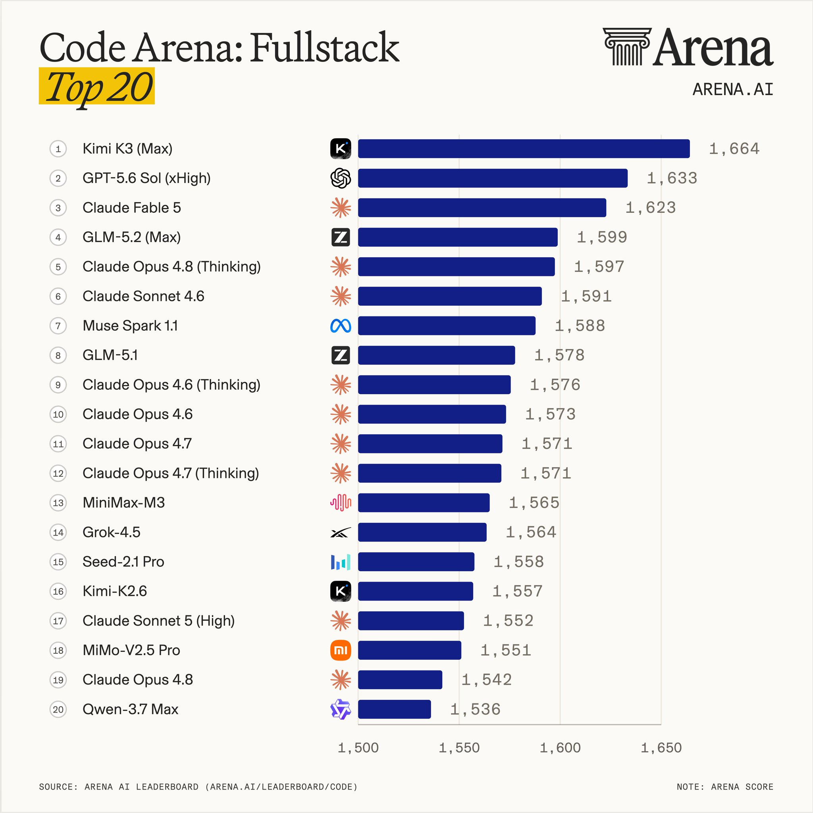

> [[../index|Wiki]] | [[../summary|Summary]] | [[../digest|Digest]]

# Why Kimi K3, and the Model-vs-Graph Finding

**In one sentence:** Kimi K3 is chosen not because it is the strongest model, but because its 1,048,576-token context window, KDA decoding economics, and Attention Residuals make large-graph queries affordable — while evidence from 26 models shows a good graph consistently beats a bigger model.

## Key points

- A graph query returns subgraphs, evidence chains, and entity paths — not one paragraph — so the 1M-token context window (1,048,576 tokens) is the architectural point: the entire relevant subgraph fits in a single session, versus most models' 128K–200K windows that force you to truncate the graph before the model sees it.
- Kimi Delta Attention (KDA) is a hybrid attention mechanism that Moonshot reports cuts long-sequence cost to up to 6.3x faster decoding in million-token contexts — the difference between "technically possible" and "affordable to run in production."
- Attention Residuals (AttnRes) selectively retrieves representations across layers instead of accumulating them uniformly, so early context is less degraded when reasoning about late context — e.g., connecting something at position 5,000 to something at position 800,000.
- Honest caveat: Moonshot's own blog states K3's overall performance still trails Claude Fable 5 and GPT-5.6 Sol; K3 is the best model for this architecture, not the strongest model overall.
- A paper comparing 26 open-source models on knowledge-graph engineering tasks found: bigger model + bad graph → worse results; smaller model + good graph → better results. The graph beats the model size, consistently.
- The article name-checks "agent graphs" (Anthropic, LangGraph) as a parallel trend showing the same "structure beats scale" principle — but that is the OTHER, agent-topology sense of graph engineering, not what this article itself is about.
- Three integration modes exist: Mode 1 (KG-enhanced LLM) and Mode 2 (LLM-augmented KG) are one-directional; Mode 3 (Synergized), where the model writes facts into the graph and the graph feeds structured context back, is the recommended one — Modes 1 and 2 are components of it, not alternatives.

---

## Why Kimi K3 Specifically (1M context, KDA, AttnRes, the honest caveat)

This is where the model choice actually matters, and the reason is architectural — not marketing.

**The 1M context window is the whole point.** A graph query doesn't return one paragraph. It returns subgraphs, evidence chains, lists of connected entities, and the paths between them. That's a lot of tokens. Most models give you 128K–200K, which forces you to truncate the graph before the model ever sees it — which defeats the purpose: you built a structure to preserve connections, then you cut the connections to fit the context. With 1,048,576 tokens, the entire relevant subgraph fits in one session, and you pass the model the full evidence chain instead of a summary of it.

*Code Arena (Arena.ai, Jul 28) fullstack ranking: Kimi K3 (Max) at #1, GPT 5.6 Sol (xHigh) at #2, Claude Fable 5 at #3 — a near-tie among the top tier. The article uses this to make the honest caveat concrete.*

**Kimi Delta Attention makes long context economically viable.** KDA is a hybrid attention mechanism that cuts the cost of processing long sequences. Moonshot reports up to 6.3x faster decoding in million-token contexts. For graph engineering — where you're routinely passing large subgraphs — that's the difference between "technically possible" and "affordable to run in production."

**Attention Residuals preserve signal across depth.** AttnRes selectively retrieves representations across layers instead of accumulating them uniformly. In practice: less degradation of early context by the time the model reasons about late context — which matters enormously when the answer depends on connecting something at position 5,000 to something at position 800,000.

**The honest caveat:** Moonshot's own blog states K3's overall performance still trails Claude Fable 5 and GPT-5.6 Sol. K3 isn't the strongest model on the market in absolute terms. It's the best available model for this specific architecture, because context window and long-sequence economics matter more here than a couple of benchmark points.

## The Finding That Should Change How You Build (graph beats model size)

There's a paper comparing 26 open-source models on knowledge graph engineering tasks. The conclusion:

- Bigger model + bad graph → worse results
- Smaller model + good graph → better results

The graph beats the model size. Consistently.

This is the same conclusion Microsoft reached with GraphRAG: the system around the model determines output quality more than the model itself. A parallel trend — agent graphs from Anthropic and LangGraph — shows the same architectural principle: structure beats scale. **Note:** "agent graphs" here is the OTHER, agent-topology sense of graph engineering — the article only name-checks it as an analogous trend; it does not otherwise cover it.

Most people respond to bad results by upgrading to a more expensive model. The evidence says you should fix your retrieval structure instead. It's cheaper and it works better.

## Three Ways to Combine LLM and Graph — Pick the Third

The research literature describes three integration modes:

- **Mode 1 — KG-enhanced LLM.** The graph feeds the model facts. The model generates better answers. One direction only.
- **Mode 2 — LLM-augmented KG.** The model builds, cleans, and expands the graph. The graph improves over time. Also one direction only.
- **Mode 3 — Synergized.** Both. K3 extracts new facts and writes them into the graph. The graph gives K3 structured context for the next question. Each pass makes both better.

Mode 3 is the one worth building. Modes 1 and 2 are components of it, not alternatives to it.

The practical consequence: your system doesn't just answer questions. It gets measurably smarter every time it answers one — because each answer adds structure that the next answer can use.

**Covers:** "Why Kimi K3 Specifically" through "Three Ways to Combine LLM and Graph."
