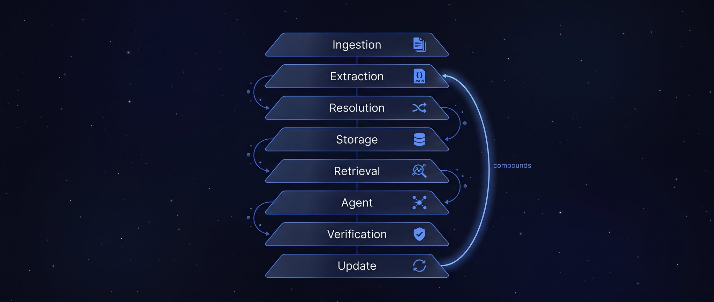

> [[../index|Wiki]] | [[../summary|Summary]] | [[../digest|Digest]]

# The 8-Layer Architecture and the 5 Pipeline Prompts

**In one sentence:** A working knowledge-graph pipeline for K3 is a closed loop of eight narrowly-scoped layers — Ingestion, Extraction, Resolution, Storage, Retrieval, Agent, Verification, Update — driven by five prompts, each with one verifiable job.

## Key points

- The architecture is eight layers in order: Ingestion → Extraction → Resolution → Storage → Retrieval → Agent → Verification → Update.
- The loop closes at Update (step 8) and restarts at Extraction (step 2) — that recirculation is what makes the graph "compound" rather than a one-pass flow.
- Ingestion is raw material only (PDFs, web pages, databases, APIs, Slack, Notion) with no processing.
- Extraction pulls entities and relationships into structured JSON with per-relation confidence scores and evidence excerpts.
- Resolution is "the layer everyone skips and everyone regrets skipping" — unresolved name variants fragment the graph into duplicates and partial query results.
- Retrieval is five cooperating methods (vector, entity, path, community, temporal), not one; the Agent layer plans, generates Cypher, reads subgraphs, and iterates on gaps.
- Verification is what separates the system from "a very sophisticated hallucination machine" — it checks conclusions against retrieved paths, flags contradictions, and verifies sources.
- Each of the 5 prompts has a narrow, verifiable job: Extraction, Entity Resolution, Query Translation, Grounded Answer, and Graph Maintenance — graph engineering does not replace prompting, it constrains each prompt.

---

## The 8 Layers

1. **Ingestion** — PDFs, web pages, databases, APIs, Slack, Notion. Whatever your sources are. Raw material only, no processing yet.
2. **Extraction** — K3 reads each source and pulls out entities and relationships as structured JSON:

```json
{
  "entity": "Kimi K3",
  "type": "AI model",
  "relations": [
    {
      "predicate": "developed_by",
      "object": "Moonshot AI",
      "confidence": 0.98,
      "evidence": "source excerpt here"
    }
  ]
}
```

3. **Resolution** — Are "Moonshot AI," "Moonshot," "Beijing Moonshot," and "月之暗面" the same entity? Skip this and the graph fragments into duplicates and every query returns partial results.
4. **Storage** — Neo4j, Memgraph, Neptune, or plain PostgreSQL with a graph extension. Neo4j is the easiest to start with and has the best tooling.
5. **Retrieval** — five methods working together: vector search for fuzzy matching, entity lookup for exact nodes, path search for connections, community search for patterns, temporal filtering for "what was true when."
6. **Agent** — K3 plans the approach, generates Cypher queries, reads the returned subgraph, runs additional searches when it hits a gap, and decides what to do next.
7. **Verification** — checks that conclusions are actually supported by retrieved paths, flags contradictions, evaluates confidence, verifies sources. Without this layer you've built a very sophisticated hallucination machine.
8. **Update** — new facts go into the graph, contradictions get flagged rather than silently overwritten, superseded facts get timestamped instead of deleted.

The loop closes at step 8 and starts again at step 2. That's what makes it compound.



## The 5 Prompts That Run the Pipeline

Graph engineering doesn't replace prompting. It gives each prompt a narrow, verifiable job.

**Prompt 1 — Extraction**

```
Extract all organizations, people, products, and events
from the text below.

For each entity return:
- canonical_name
- type
- description
- source_location

For each relationship return:
- source_entity
- relation_type
- target_entity
- evidence (exact quote from source)
- confidence_score (0-1)

Rules:
- Only extract relationships explicitly stated or
directly implied by the text
- Do not infer relationships from general knowledge
- If a relationship is uncertain, lower the confidence
score rather than omitting it
- Return valid JSON only

Text:
[paste your document]
```

**Prompt 2 — Entity Resolution**

```
Compare the following entities and determine whether
they refer to:
- the same entity
- related but distinct entities
- unrelated entities

Entities:
[list your candidates]

For each pair, return:
- verdict (same / related / unrelated)
- canonical_name if same
- reasoning
- confidence

Rules:
- Do not merge entities without clear evidence
- Similar names are not sufficient evidence
- When uncertain, mark as "related" rather than "same"
- Flag any case where merging would be destructive
```

**Prompt 3 — Query Translation**

```
Translate the user question into a Cypher query
for our graph.

Schema:
[paste your node labels, relationship types,
and properties]

User question:
[the actual question]

Rules:
- Use only labels and relationship types present
in the schema
- Do not invent properties
- Prefer path queries over single-node lookups when
the question implies causation or connection
- Return the query, then a plain-English explanation
of what it retrieves and why
```

**Prompt 4 — Grounded Answer**

```
Answer the question using only the graph paths provided
below.

Retrieved paths:
[paste subgraph]

Question:
[the question]

For every claim in your answer:
- cite the specific nodes and relationship path
that support it
- state your confidence
- flag any step where you're inferring rather than
reading directly from the graph

Rules:
- Do not use knowledge outside the provided paths
- Do not infer causation from co-occurrence
- If the graph doesn't contain enough to answer,
say exactly what's missing
```

**Prompt 5 — Graph Maintenance**

```
Compare these new facts against the existing graph.

New facts:
[extracted triples]

Existing related subgraph:
[current state]

Classify each new fact as:
- new (add it)
- duplicate (skip)
- contradiction (flag for review, do not overwrite)
- update (supersedes an existing fact — timestamp
the old one, don't delete it)
- uncertain (needs human review)

For contradictions, show both versions and the
evidence for each.
Never silently overwrite an existing fact.
```

**Covers:** "The Architecture, Layer by Layer" and "5 Prompts That Run the Pipeline."
