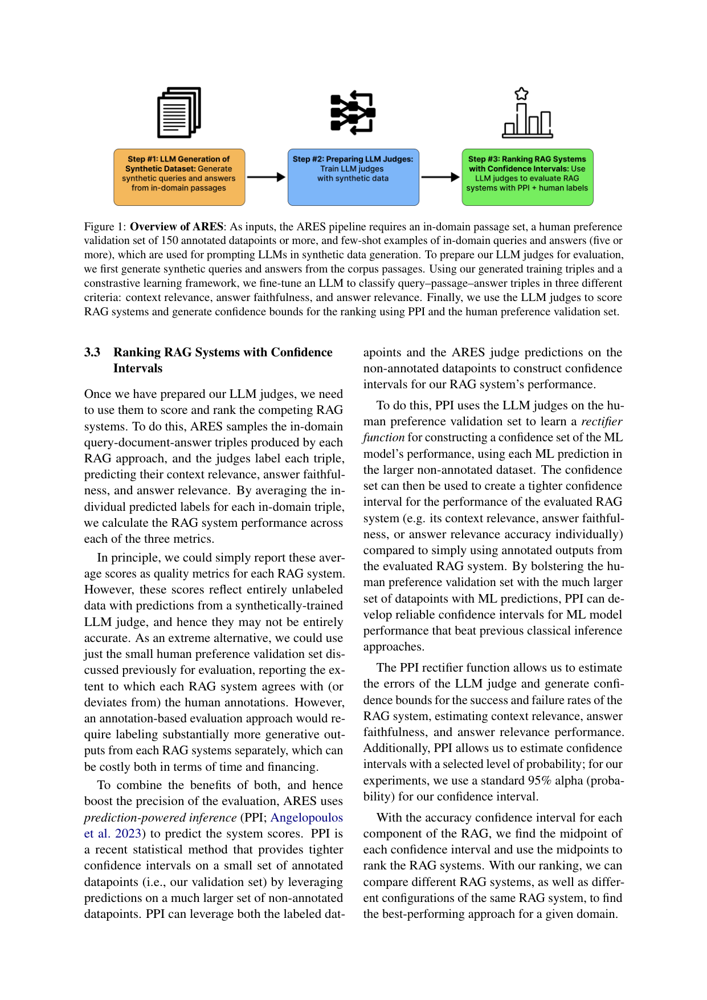

> [[../index|Wiki]] | [[../summary|Summary]] | [[../digest|Digest]]

# The ARES Method

**In one sentence:** ARES builds confidence-bounded RAG system rankings by generating a synthetic query–passage–answer dataset from an in-domain passage set and few-shot examples, fine-tuning DeBERTa-v3-Large judges on that data to score context relevance, answer faithfulness, and answer relevance, and then applying prediction-powered inference (PPI) over a small human-preference validation set to convert those judge scores into 95% confidence intervals that can be compared across systems.

## Key points

- ARES requires exactly three inputs: an in-domain passage set, a human-preference validation set of approximately 150 annotated datapoints (or more), and few-shot examples of in-domain queries and answers (five or more) used to prompt the LLMs that generate synthetic data.
- In stage 3.1, synthetic queries and answers are generated primarily with FLAN-T5 XXL (the system can substitute another high-quality model), then low-quality queries are filtered out by checking whether a query can retrieve its original passage as the top result using its own retriever.
- Negatives for judge fine-tuning are produced with two parallel strategies, generating an equal number of negatives as positives: weak negatives (unrelated in-domain passages for context relevance; answers sampled from other passages for faithfulness and relevance) and strong negatives (passages from the same document as the gold passage, or BM25 top-10 similar passages when no same-document passages exist; contradicted answers generated by prompting FLAN-T5 XXL).
- In stage 3.2, a separate DeBERTa-v3-Large judge with a binary classifier head is fine-tuned for each of three criteria: context relevance, answer faithfulness, and answer relevance.
- Judge fine-tuning is stopped after three consecutive epochs with no improvement in loss, using the human-preference validation set to measure improvement.
- In stage 3.3, raw average judge scores are not reported directly because they come entirely from unlabeled data with a synthetically trained judge and may be inaccurate; using only the small human-annotation set would require costly per-system manual labeling.
- Prediction-powered inference (PPI) resolves this by using the LLM judges on the validation set to learn a rectifier function that combines the few labeled datapoints with the much larger set of judge predictions on non-annotated datapoints, yielding tighter confidence intervals than either approach alone.
- The 95% alpha confidence level is used for all experiments, and RAG systems are ranked by the midpoint of each component's confidence interval, enabling comparison of different systems and of different configurations of the same system within a given domain.

---

## Overview

ARES organizes itself as a three-stage pipeline. The pipeline takes three inputs — an in-domain passage set, a human-preference validation set of 150 annotated datapoints or more, and five-or-more few-shot in-domain query/answer examples — and flows them through three stages that build on one another. Stage 1 generates synthetic queries and answers from the in-domain passages using those few-shot examples as prompts; stage 2 fine-tunes an LLM judge via a contrastive-learning-style scheme on the resulting query–passage–answer triples so it can classify triples on three criteria (context relevance, answer faithfulness, and answer relevance); and stage 3 applies those trained judges to any RAG system and combines their predictions with PPI and the small human-preference validation set to produce confidence-bounded rankings. The central design bet is that a much larger set of cheap synthetic judge predictions, anchored to a small set of reliable human annotations, is more statistically efficient than either of them in isolation.

Each stage addresses a different weakness. Synthetic generation gives judges enough labelled-style signal to be useful on a fresh domain; fine-tuning turns a general LLM into a targeted three-criterion classifier for exactly the quality dimensions RAG cares about; and PPI supplies the missing statistical guarantee — a confidence interval — that makes the system's ranking trustworthy rather than merely plausible.

## Synthetic Dataset Generation (3.1)

ARES first creates a synthetic training corpus of positive and negative query–passage–answer triples. The generative model — by default FLAN-T5 XXL, though ARES can use another high-quality model — reads an in-domain passage together with the provided few-shot examples (in-domain passages mapped to in-domain queries and answers) and emits a synthetic question and answer for that passage, which yields the positive examples. Low-quality synthetic queries are then dropped by a retrieval check: a candidate query is kept only if it can retrieve its original passage as the top result using the system's own retriever, a filtering approach reused from prior work (Dai et al., 2022; Saad-Falcon et al., 2023).

Negatives are produced with two complementary strategies, generating the same number of negatives with each so the total equals the number of positives for each evaluated metric (context relevance and answer relevance):

- **Weak negative generation.** For context-relevance negatives, ARES randomly samples in-domain passages unrelated to the synthetic query. For answer-faithfulness and answer-relevance negatives, it randomly samples answers that were synthetically generated for *other* passages using FLAN-T5 XXL, so the answer is plausible but mismatched to the given passage.
- **Strong negative generation.** For context-relevance negatives, it samples in-domain passages from the *same document* as the gold passage; when no multiple passages are available for that document it falls back to BM25 retrieval of the top-10 passages most similar to the gold passage and samples among them. For answer-faithfulness and answer-relevance negatives, it prompts FLAN-T5 XXL — using the few-shot prompt from subsection A.5 — to generate a *contradictory* answer, so the mismatch is deliberate rather than incidental.

This paired weak/strong scheme is what lets the judges learn to distinguish genuinely off-target passages from ones that are merely off by a degree, and to separate faithful answers from subtly hallucinated or extrapolated ones.

## Preparing LLM Judges (3.2)

ARES trains three judge models using the synthetic dataset to fine-tune DeBERTa-v3-Large. It uses a separate DeBERTa-v3-Large model with a binary classifier head for each of three capabilities, each judging the same concatenated query–document–answer triple:

1. **Context relevance** — is the returned passage relevant for answering the query?
2. **Answer faithfulness** — is the generated answer faithful to the retrieved passage, or does it contain hallucinated or extrapolated statements beyond it?
3. **Answer relevance** — given the query and the retrieved passage, is the generated answer relevant?

For each metric a single fine-tuned judge classifies the triple as either positive or negative for that metric's criterion. Training is supervised by the human-preference validation set: after each epoch, judge performance is re-evaluated against that set, and fine-tuning stops only after three consecutive epochs show no improvement in loss (per the details in subsection A.1). This gives ARES three narrowly-specialised, domain-grounded classifiers that each judge a different quality axis of a RAG output.

## Ranking RAG Systems with Confidence Intervals (3.3)

Once the judges exist, ARES scores a RAG system by sampling the in-domain query–document–answer triples that system produces, labelling each triple, and averaging the predicted labels across the sample to estimate system performance on context relevance, answer faithfulness, and answer relevance. Two naïve readings of these numbers are both unsatisfactory. Simply reporting the average judge scores is fragile: they reflect entirely unlabeled data scored by a synthetically-trained LLM judge, so they may not be accurate. On the opposite extreme, relying only on the small human-preference validation set and reporting how much each system agrees or deviates from the human annotations would demand substantially more per-system manual labelling of generative outputs, which is costly in both time and financing.

ARES therefore uses prediction-powered inference (PPI; Angelopoulos et al. 2023), a statistical method that delivers tighter confidence intervals over a small set of annotated datapoints by leveraging predictions over a much larger set of non-annotated datapoints. Concretely, PPI runs the LLM judges on the human-preference validation set to learn a *rectifier function* for constructing a confidence set for the ML model's performance using each judge prediction in the larger non-annotated dataset; this confidence set can then be turned into a tighter confidence interval for the evaluated RAG system's performance on each metric — context relevance, answer faithfulness, or answer relevance — than one obtained from human annotations alone. By bolting the much larger set of ML predictions onto the few human annotations, PPI develops reliable confidence intervals for judge performance that beat the previous classical inference approaches, and its rectifier function lets ARES estimate the errors of the LLM judge and produce confidence bounds for the RAG system's success and failure rates on each criterion.

PPI also allows ARES to pick the confidence level explicitly; the experiments use the standard 95% alpha (probability) as the confidence level for all intervals. Finally, with a confidence interval for each of the three components, ARES takes the midpoint of each interval and ranks RAG systems by those midpoints — an ordering that supports comparing different RAG systems as well as different configurations of the same system to identify the best-performing approach for a given domain.

**Covers:** Section 3 "ARES" (3.1-3.3), Figure 1 — arXiv 2311.09476, pages 3-5
