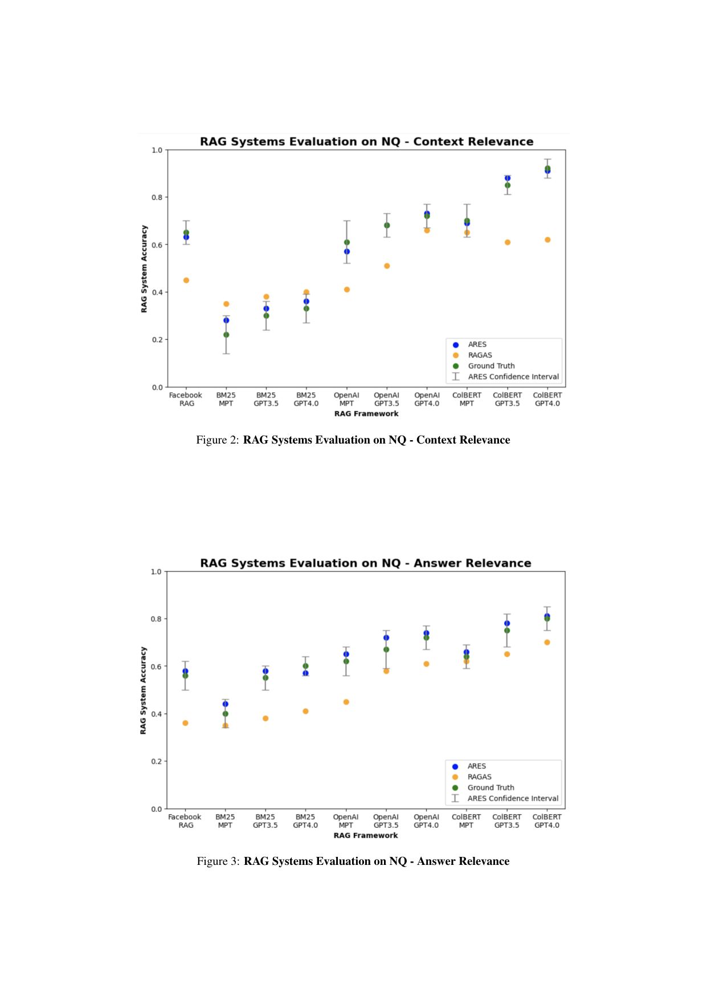

> [[../index|Wiki]] | [[../summary|Summary]] | [[../digest|Digest]]

# Appendix Details

**In one sentence:** The appendix supplies the implementation and robustness evidence supporting the ARES paper — fine-tuning hyperparameters for the LLM judges, the exact GPT scoring and synthetic-data prompts, extended NQ evaluation figures, a GPT-4-as-cheap-labeler study, real-world RAG system rankings, cross-domain judge transfer results, and concrete positive/negative evaluation examples.

## Key points

- The LLM judges are fine-tuned with cross-entropy loss, Adam optimizer, a single linear classification head on the `[CLS]` token with 0.1 dropout, linear warmup/decay schedule, learning rate 5e-6, and batch size 32.
- All judge scoring uses GPT with 8 few-shot examples; the base prompt for NQ/HotpotQA/MultiRC/ReCoRD is word-swapped ("question" → "statement" for FEVER, → "dialogue" for WoW), and every prompt forces a strict `[[Yes]]`/`[[No]]` verdict with no explanation.
- On Natural Questions, accuracy rises monotonically from BM25+MPT (~0.2–0.4) to ColBERT+GPT-4.0 (~0.8–0.9), and ARES tracks Ground Truth closely while RAGAS systematically under-scores (worst for Context Relevance on BM25 and OpenAI+MPT).
- Below roughly 100–150 human preference validation (PPI) datapoints, ARES can no longer meaningfully distinguish between pseudo RAG systems (Kendall's tau for Context Relevance drops to 0.44 at 25–50 labels).
- GPT-4-generated labels are a viable cheap substitute for human labels: they cut annotation cost from hundreds of annotations to fewer than ten few-shot prompts, at the cost of decreasing Kendall's tau by only 0.05–0.30 in most settings.
- On real-world RAG systems, ARES achieved the best Kendall's tau on all six dataset/metric cells (1.0 on NQ Context Relevance) and best point accuracy (85.6% vs RAGAS 35.9% on NQ C.R.).
- Cross-domain, a judge fine-tuned on one domain transfers well to new domains (Kendall's tau 0.78–1.0), and PPI mitigates even large out-of-domain judge accuracy drops (e.g. NQ→FEVER answer relevance at only 28.4% raw accuracy still yields 0.89 tau after PPI).
- Synthetic negative data is generated with the same few-shot structure as positives — just swapping in incorrect/contradictory example answers — using FLAN-T5 (XXL) with 4-example prefixes.

---

## Fine-tuning Configuration (A.1)

The LLM judges are trained with **cross-entropy loss** optimized with **Adam** (Kingma & Ba, 2017). The **classification head** is a single linear layer applied to the final hidden state of the `[CLS]` token, with **0.1 dropout** applied to that input. The **learning-rate schedule** is linear warmup followed by linear decay (Howard & Ruder, 2018), at a **learning rate of 5e-6** with a **training batch size of 32** across all experimental configurations.

## Judge Scoring Prompts (A.2–A.4)

Scoring is done with GPT using **8 few-shot examples** in every case, and all prompts enforce the same contract: answer strictly `[[Yes]]` or `[[No]]` with no additional explanation.

- **Context Relevance (A.2)** — for NQ, HotpotQA, MultiRC, ReCoRD: given a question and document, determine whether the document is sufficient for answering the question. For FEVER the framing changes to "expert fact-checking agent" judging a statement's factuality against the document; for WoW it becomes an "expert dialogue agent" judging document relevance to a dialogue.
- **Answer Faithfulness (A.3)** — given question, document, and answer, judge whether the answer is faithful to the document: it must introduce no new information beyond the document and must not contradict it. For FEVER "question" becomes "statement"; for WoW it becomes "dialogue".
- **Answer Relevance (A.4)** — given question, document, and answer, judge whether the answer is relevant to the question: it must address all aspects of the question and provide only correct information drawn from the document. Again, FEVER uses "statement" and WoW uses "dialogue" in place of "question".

## Extended NQ Evaluation (Figures 2–3)

Figures 2 and 3 evaluate RAG systems on the Natural Questions (NQ) benchmark — Figure 2 scores Context Relevance and Figure 3 scores Answer Relevance. For every RAG framework they compare three scoring sources: **ARES** (with confidence-interval error bars), **RAGAS**, and **Ground Truth**. The x-axis is a grid of retriever (BM25, OpenAI, ColBERT) × generator (MPT, GPT-3.5, GPT-4.0) combinations plus a Facebook RAG baseline, and the y-axis is RAG system accuracy (0.0–1.0).

Two trends stand out. First, accuracy rises monotonically from BM25+MPT (lowest, ~0.2–0.4) to ColBERT+GPT-4.0 (highest, ~0.8–0.9) — both retriever and generator quality matter, with ColBERT > OpenAI > BM25 and GPT-4.0 > GPT-3.5 > MPT. Second, **ARES tracks Ground Truth closely across all configurations**, while RAGAS systematically under-scores relative to Ground Truth, most severely for Context Relevance on the BM25 and OpenAI+MPT setups. Confidence intervals tighten as accuracy rises, so the takeaway is that ARES acts as a faithful, low-variance proxy for human relevance judgments, whereas RAGAS is a conservative under-estimator.

## Human Preference Validation Set Size (Table 3)

Kendall's tau of ARES's pseudo-RAG-system ranking against the correct ranking, as the number of PPI human-annotated examples varies:

| PPI Labeled Count | NQ C.R. | NQ A.R. | MultiRC C.R. | MultiRC A.R. | ReCoRD C.R. | ReCoRD A.R. |
|---|---|---|---|---|---|---|
| 400 | 1.0 | 1.0 | 0.89 | 0.94 | 0.89 | 0.94 |
| 300 | 0.89 | 1.0 | 0.94 | 0.89 | 0.83 | 0.89 |
| 200 | 0.83 | 1.0 | 0.83 | 0.94 | 0.83 | 0.83 |
| 150 | 0.72 | 1.0 | 0.83 | 0.89 | 0.72 | 0.83 |
| 100 | 0.44 | 1.0 | 0.67 | 0.67 | 0.67 | 0.83 |
| 50 | 0.44 | 0.94 | 0.61 | 0.44 | 0.56 | 0.67 |
| 25 | 0.44 | 0.89 | 0.56 | 0.44 | 0.44 | 0.56 |

Finding: **below about 100–150 datapoints in the human preference validation set, ARES cannot meaningfully distinguish** between the alternate RAG systems on context or answer relevance. Notably, Answer Relevance keeps ranking accurately down to 25 labels while Context Relevance degrades.

## GPT-4 Labels vs. Human Labels (Table 4)

The authors test whether **GPT-4-generated labels** can replace human annotations for the PPI validation set, generating 500 GPT-4 labels with the few-shot prompts from A.2–A.4 and using the fine-tuned DeBERTa-v3-Large judge:

| | NQ C.R. | NQ A.R. | ReCoRD C.R. | ReCoRD A.R. | MultiRC C.R. | MultiRC A.R. |
|---|---|---|---|---|---|---|
| Kendall's Tau (GPT-4 labels) | 0.78 | 1.0 | 0.78 | 0.72 | 0.89 | 0.78 |
| Kendall's Tau (human labels) | 0.94 | 1.0 | 0.83 | 0.89 | 0.94 | 0.89 |
| Average PPI Range | 9.2% | 6.8% | 8.2% | 9.0% | 7.7% | 8.3% |
| Accuracy on RAG Evaluation Sets | 79.3% | 96.7% | 88.4% | 78.3% | 85.8% | 82.5% |

GPT-4 labels **decrease Kendall's tau by 0.05 to 0.30 in most settings**, but produce them at a fraction of the cost — cutting the annotation burden **from hundreds of annotations to fewer than ten** few-shot prompts. PPI efficacy also keeps improving as more GPT-4 labels are generated. ("PPI range" = width in percentage points of the PPI confidence bounds.)

## Real-World RAG System Ranking (Table 5)

ARES is compared against a sampled-annotations benchmark (150 annotated datapoints per RAG system), RAGAS (GPT-3.5 judge with non-domain-targeted few-shot prompts), and a few-shot GPT-3.5 judge (chosen over GPT-4 for cost; 300 PPI human annotations for both ARES and the GPT-3.5 judge):

| | NQ C.R. | NQ A.R. | WoW C.R. | WoW A.R. | FEVER C.R. | FEVER A.R. |
|---|---|---|---|---|---|---|
| Kendall's Tau — Sampled Annotations | 0.73 | 0.78 | 0.73 | 0.73 | 0.73 | 0.82 |
| Kendall's Tau — RAGAS | 0.82 | 0.82 | 0.73 | 0.82 | 0.73 | 0.87 |
| Kendall's Tau — GPT-3.5 Judge | 0.82 | 0.87 | 0.82 | 0.82 | 0.64 | 0.87 |
| Kendall's Tau — ARES LLM Judge (no PPI) | 0.91 | 0.96 | 0.91 | 1.0 | 0.73 | 0.87 |
| **Kendall's Tau — ARES** | **1.0** | **0.96** | **0.91** | **1.0** | **0.82** | **1.0** |
| Accuracy — RAGAS | 35.9% | 68.2% | 44.4% | 80.1% | 21.4% | 75.9% |
| Accuracy — GPT-3.5 | 80.5% | 91.2% | 81.2% | 83.5% | 61.3% | 54.5% |
| **Accuracy — ARES** | **85.6%** | **93.3%** | **84.5%** | **88.2%** | **70.4%** | **84.0%** |

**ARES ranked real-world RAG systems more accurately than RAGAS and the GPT-3.5 judge across all datasets**, winning every Kendall's tau cell with only a small margin behind in none. And adding PPI on top of the raw ARES LLM judge **further boosts ranking accuracy across the board** (e.g. NQ C.R. 0.91 → 1.0).

## Cross-Domain Judge Transfer (Table 6)

The fine-tuned LLM judges are applied to domains they were not trained on (300 PPI labeled examples; more examples further improved performance):

| | NQ→FEVER C.R. | NQ→FEVER A.R. | FEVER→NQ C.R. | FEVER→NQ A.R. | NQ→MultiRC C.R. | NQ→MultiRC A.R. | MultiRC→NQ C.R. | MultiRC→NQ A.R. | NQ→ReCoRD C.R. | NQ→ReCoRD A.R. | ReCoRD→NQ C.R. | ReCoRD→NQ A.R. |
|---|---|---|---|---|---|---|---|---|---|---|---|---|
| Kendall's Tau (cross-domain judge + PPI) | 0.89 | 0.89 | 1.0 | 0.83 | 0.94 | 0.89 | 1.0 | 0.89 | 0.78 | 0.89 | 0.89 | 0.94 |
| Kendall's Tau (in-domain judge) | 0.89 | 0.78 | 0.94 | 1.0 | 0.94 | 0.89 | 0.94 | 1.0 | 0.83 | 0.89 | 0.94 | 1.0 |
| Average PPI Range | 8.7% | 7.2% | 6.5% | 11.5% | 10.2% | 11.3% | 11.9% | 11.5% | 10.5% | 10.1% | 9.7% | 6.2% |
| Accuracy on RAG Evaluation Sets | 92.4% | 28.4% | 85.7% | 22.6% | 81.5% | 92.1% | 87.6% | 80.2% | 29.1% | 81.2% | 80.1% | 92.1% |

The fine-tuned judges **generalize strongly across domains** — when changing query type (NQ→FEVER), document type (NQ→MultiRC), or both (NQ→ReCoRD) — holding Kendall's tau at 0.78–1.0. The most striking case: on NQ→FEVER answer relevance the transferred judge's **raw accuracy collapses to 28.4%, yet PPI still yields 0.89 Kendall's tau** — PPI mitigates out-of-domain judge degradation.

## Synthetic Data Generation Prompts and Examples (A.5–A.7, Table 7)

**Generation of synthetic queries and answers (A.5):** with FLAN-T5 and 5 few-shot examples laid out as `Question / Document / Answer` triples; for **incorrect or contradictory answers** the same prompt structure is used, **only the few-shot examples are swapped** to be incorrect/contradictory — a cheap way to synthesize negatives.

**Synthetic query/answer generation (A.6):** FLAN-T5 XXL uses a 4-example few-shot prefix where examples #1–#3 are complete `Document/Query` pairs and **example #4 supplies a new in-domain passage with an empty `Query:` slot** for completion. Answer generation mirrors this: three complete `Query/Document/Answer` examples, then a final example with the just-generated synthetic query, a new in-domain passage, and an empty `Answer:` slot.

**Positive and negative evaluation examples (Table 7):**

| Query | Passage (abridged) | Answer | Context Relevance | Answer Relevance |
|---|---|---|---|---|
| How can a ball that is not moving possess energy of position? | Mechanical energy is the energy of motion or position; a moving ball has energy from motion… | The ball holds mechanical energy | 1 | 1 |
| Who has a Jimmy Stewart-like quality of quiet trust? | "A trace of childish innocence in his face gives the lanky Bethlehem lawyer a Jimmy Stewart-like quality of quiet trust…" (Fred Rooney) | Fred Rooney | 1 | 1 |
| Before he murdered the doctor and Ralph Smith, where did the stepfather reside? | The Stepfather was institutionalized in Puget Sound, Washington… (detailed crime narrative) | Los Angeles | 1 | 0 |
| What was the 2006 film about Pushkin's death, and who portrayed Pushkin? | Passage about Einstein arriving in New York City… | Vasily Szaitsev portrayed Pushkin in the film *Pushkin Returns* | 0 | 0 |

The pattern: row 1–2 are clean positives (context supports, answer correct); row 3 the context is relevant (1) but the answer is wrong (0); row 4 the retrieved passage is irrelevant, so both scores are 0 — illustrating what the two metric axes separately detect.

**Covers:** Appendix A.1-A.7 (Tables 4-7, Figures 2-3) — arXiv 2311.09476, pages 10-17
