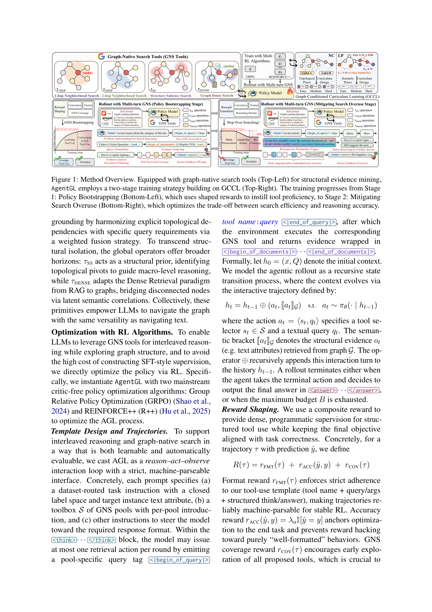

> [[../index|Wiki]] | [[../summary|Summary]] | [[../digest|Digest]]

# The AgentGL Method

**In one sentence:** AgentGL trains an LLM agent to reason over a graph by casting it as a two-stage RL problem — learn to navigate the graph with a small set of graph-native search tools, then learn to stop searching when evidence is sufficient — with graph-conditioned curriculum scheduling to stabilize and accelerate convergence.

## Key points

- **The RL objective.** The policy is trained with `J(θ) = E[ R(ŷ, y*) − β·D_KL(π_θ ∥ π_ref) ]`, where `π_θ` navigates the typed graph (TAG) via the toolset, `R` is the outcome-based reward, `β` is the KL coefficient, and `π_ref` is the reference policy.
- **Two complementary stages.** (1) *Graph-native policy bootstrapping* (§4.1) — learn to navigate the graph with search tools; (2) *search-efficiency optimization* (§4.2) — curb tool overuse during long-horizon reasoning. Both run under a graph-conditioned curriculum (GCCL, §4.3).
- **Four GNS tools** spanning local/global × structure/semantics: 1-hop neighborhood search (`τ₁HOP`), 2-hop neighborhood search (`τ₂HOP`), structure salience search (`τ_SS`, PPR-based), and graph dense search (`τ_DENSE`, semantic).
- **Composite rewards, two stages.** Stage 1: `R(τ) = r_FMT(τ) + r_ACC(ŷ, y) + r_COV(τ)` (format + accuracy + GNS coverage to explore all tools and prevent mode collapse). Stage 2: `R(τ) = r_FMT(τ) + r_ACC(ŷ, y) + r_depth(z)` (coverage dropped, depth added).
- **Critic-free RL optimizers.** AgentGL is instantiated with GRPO and REINFORCE++, explicitly avoiding the cost of building SFT-style supervision.
- **Reason–act–observe loop.** Rollout is a strict, machine-parseable interface: at most one retrieval action per round (a pool-specific query tag), evidence returned in documents tags; terminates on an `<answer>` or a budget `B`.
- **GCCL difficulty scoring.** Node classification uses an analytical score `S_NC(v)` from a Wilson lower bound on neighbor-label consistency plus degree; link prediction uses `S_LP(e)` from node-feature cosine similarity.
- **Curriculum progression.** Training progresses easy → hard: confident instances (structurally prominent hubs; high-similarity positives, low-similarity negatives) first, deferring ambiguous/heterophilous/high-similarity-negative cases.

---

## Graph-Native Search (GNS) Tools

The GNS toolset `S = {τ₁HOP, τ₂HOP, τ_SS, τ_DENSE}` mines structural evidence (the text attributes of the collected candidates) directly from the TAG. Each tool returns a ranked set of candidate nodes or pairs:

- **1-hop Neighborhood Search (`τ₁HOP`).** Given query `Q` and input `x` (treated as a node pair `(u, v)`), it prioritizes common neighbors `C = N₁(u) ∩ N₁(v)` and balances the exclusive ones `U_z = N₁(z)\C`, building `E = TopK(C, K) ∪ TopK(U_z, k_z)` with a balanced quota `k_u + k_v = max(0, K − |C|) = R` and `k_u = min(|U_u|, max(⌈R/2⌉, R − |U_v|))`. Best for precise local grounding where explicit topological dependencies matter.
- **2-hop Neighborhood Search (`τ₂HOP`).** Follows the same retrieval logic as `τ₁HOP`, substituting scope `N₁(·)` with `N₂(·)` to widen the local neighborhood.
- **Structure Salience Search (`τ_SS`).** Uses precomputed personalized PageRank (PPR) scores `s'(v)` to retrieve the Top-K globally salient candidates across the whole graph, ranking by `s'(v)` for nodes or the mean `½(s_i + s_j)` for pairs. Acts as a structural prior that identifies topological pivots for macro-level reasoning.
- **Graph Dense Search (`τ_DENSE`).** Operates like `τ_SS` but substitutes the structural score with semantic relevance measured as the cosine similarity of node or pair embeddings `ϕ(·)`. Adapts the RAG dense-retrieval paradigm to graphs, bridging disconnected nodes via latent semantic correlations.

Candidates are then ranked by a relevance score computed as cosine similarity against a fusion embedding: `s(n) = cos(h_n, λ_r h_Q + (1 − λ_r) h_x)`, where `h_x = ½(h_u + h_v)` averages the target pair and `λ_r ∈ [0,1]` balances query relevance.

The design intent is comprehensive coverage of the graph's information space across two critical dimensions — Local vs. Global and Structure vs. Semantics — so that the LLM can navigate the graph "with the same versatility as navigating text."

Figure 1 (top-left) shows these four GNS primitives operating on a node graph with an "Anchor" node; the top-right panel shows the GCCL organizing a difficulty (Easy → Medium → Hard) curriculum from topological/semantic priors (cosine-similarity labels, `P_c` ≈ 0.98 for a matched pair and ≈ 0.39 for a mismatch); the two bottom panels show the two-stage rollout with multi-turn GNS — Stage 1 Policy Bootstrapping (average tool use and accuracy both rise) and Stage 2 Mitigating Search Overuse (tool use drops, accuracy is held). The overall message: equipping the LLM with graph-native search tools and a two-stage RL strategy (GCCL-based bootstrapping → overuse mitigation) yields effective graph reasoning with a good trade-off between search efficiency and answer accuracy.

## Search-Constrained Thinking

Search-Constrained Thinking biases the agent toward reflective inference before invoking more graph queries. The motivation is that the effective neighborhood range is highly instance-dependent, so indiscriminate tool use incurs computational overhead and injects structural noise that degrades reasoning fidelity. The optimization goal is to minimize total search cost subject to retaining the bootstrapping objective:

`θ* = argmin_θ E_{τ ∼ π_θ}[ T(τ) ]   s.t.   θ ∈ argmax_ϑ J_BASE(ϑ)`

Treating accuracy as a hard constraint restricts efficiency optimization to the optimal-solution space, so the agent learns parsimony without sacrificing performance.

The approach instantiates a "Think more, Search less: Precision via Parsimony" paradigm, coupling retrospective verification with cognitive-density constraints to substitute redundant retrieval with deep reasoning, via three components:

- **Retrospective Termination Trigger.** After each tool execution, a "cognitive interrupt" — "Let me first carefully review the searched documents of {GNS tool name} and decide whether another search is necessary before proceeding" — is injected, compelling the model to evaluate the sufficiency of the current evidence state, transforming habitual sequential searching into a series of deliberate binary decisions.
- **Cognitive Density Regularization.** A penalty on sparse reasoning `r_depth(z) = α·I[N_short = 0] − λ_d·N_short`, where a post-retrieval reasoning segment `s_i` is "deficient" if its token length `ℓ(s_i) < δ` and `N_short` counts deficient segments. This penalizes fragmented thinking and incentivizes dense reasoning blocks before further actions.
- **Adaptive Reward Transition.** Discards the coverage incentive `r_COV` while retaining `r_FMT` for format constraints; the main optimization is streamlined to the synergistic maximization of accuracy `r_ACC` and reasoning density `r_depth`: `R(τ) = r_FMT(τ) + r_ACC(ŷ, y) + r_depth(z)`.

**Coverage reward `r_COV(τ)` (used in Stage 1, dropped in Stage 2).** Encourages early exploration of all proposed tools; it is crucial to prevent early mode collapse to a single default action (one tool or no tool) and to ensure sufficient exploration over the discrete tool-action space:

`r_COV(τ) = (η / |S|) · Σ_{j=1}^{|S|} I[∃t : a_t = τ_j],   r_COV(τ) ≤ |S|·η`

where each tool `τ_j ∈ S` contributes at most once, and `η` scales the coverage incentive.

## Graph-Conditioned Curriculum Learning (GCCL)

GCCL leverages intrinsic graph properties to stabilize training and accelerate convergence. Unlike reasoning tasks where difficulty estimation relies on expert annotation or expensive pilot rollouts, graphs allow learnability to be directly quantified via topological and semantic priors. An analytical difficulty-scoring function `S(·)` proxies hardness, enabling a smooth, cost-free progression from confident to ambiguous instances per task.

**Node classification with GCCL.** Node-classification difficulty is jointly governed by local homophily and degree magnitude. A metric `S_NC(v)` that approximates difficulty rectifies the homophily estimate using the Wilson Lower Bound, augmented by degree magnitude:

`S_NC(v) = [ p̂_v + z²/(2d_v) − z·sqrt( p̂_v(1−p̂_v)/d_v + z²/(4d_v²) ) ] / (1 + z²/d_v)  +  η·log(1 + d_v)`

where the bracketed term is the Wilson Lower Bound, `p̂_v` is the neighbor label consistency, `d_v` is the degree, `z` is the standard normal quantile, and `η` regulates the impact of the degree priors. This formulation prioritizes structurally prominent hubs (Easy), progresses through intermediate nodes (Medium), and defers ambiguous, heterophilous outliers (Hard).

**Link prediction with GCCL.** For a link pair `e = (u, v)` with label `y_e ∈ {0,1}`, "easiness" is aligned with the consistency between semantic similarity and label existence, scored via the cosine similarity of node features `sim(x_u, x_v)`:

`S_LP(e) = y_e · sim(x_u, x_v) + (1 − y_e) · (1 − sim(x_u, x_v))`

Consistent pairs (high-similarity positives, low-similarity negatives) are prioritized as Easy; the curriculum traverses ambiguous Medium instances and defers Hard structural-noise-conflicting cases (e.g., high-similarity negatives) to later training iterations.

**Training process.** AgentGL first undergoes graph-native policy bootstrapping (§4.1), then search-efficiency refinement (§4.2); both stages follow the easy-to-hard GCCL curriculum (§4.3) and bound each rollout to a maximum tool-call budget `B`.

**Covers:** Methodology section (source pages 3-6)
