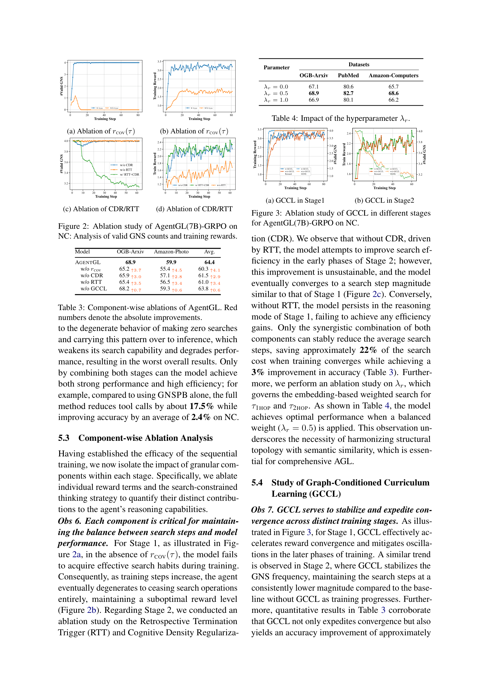

> [[../index|Wiki]] | [[../summary|Summary]] | [[../digest|Digest]]

# Experiments, Results, and Conclusion

**In one sentence:** AgentGL, an RL-trained agentic framework that interleaves graph search with LLM reasoning, beats GNN, GraphLLM, GraphRAG, and agentic-search baselines by 12.7–26.6% (node classification) and 22.4–28.4% (link prediction) across 7 datasets and two Qwen backbones, with ablations showing that every RL stage (GNSPB, MSO) and every reward component (rCOV, CDR, RTT, GCCL) is individually necessary for both accuracy and search efficiency.

## Key points

- AgentGL (Qwen2.5-7B) outperforms baselines by an average of **12.7%** in-domain and **24.4%** zero-shot on node classification, and **26.3%** in-domain and **22.4%** zero-shot on link prediction.
- With Qwen2.5-3B, gains are **14.5%** (in-domain NC), **26.3%** (in-domain LP), **26.6%** (zero-shot NC), and **22.4%** (zero-shot LP).
- On Qwen7B link prediction, AgentGL is **47.4%** higher in-domain than GraphRAG and **23.2%** higher than GraphLLM, with margins of **35.4%** and **26.9%** under zero-shot transfer.
- The paper reports best-average gains across all backbones of up to **17.5%** on node classification and **28.4%** on link prediction over strong baselines (including GraphLLMs and GraphRAG).
- RL algorithm choice is task-dependent: GRPO beats R++ on NC by an average of **0.9%** (Qwen3B/7B average), while R++ beats GRPO on LP by **3.3%** on average.
- Scaling the backbone 3B→7B improves AgentGL by **9.0%** (in-domain NC), **11.8%** (zero-shot NC), **5.6%** (in-domain LP), and **8.7%** (zero-shot LP).
- The full two-stage method (GNSPB + MSO) reduces tool calls by about **17.5%** while improving NC accuracy by an average of **2.4%** over GNSPB alone; RTT+CDR together save ~**22%** of search cost with a **3%** accuracy gain; GCCL contributes ~**0.65%** accuracy and faster, more stable convergence.
- Ablations show no single component suffices: dropping rCOV causes valid-GNS counts to collapse to near zero (agent stops searching), dropping either CDR or RTT loses the Stage-2 efficiency gain, and MSO-only training degenerates to zero searches (worst results).

---

## Experimental Setup

**Datasets.** 7 TAG datasets spanning 3 domains, evaluated on 2 tasks (node classification, link prediction):

- **Citation Networks:** OGB-Arxiv, PubMed, Arxiv-2023
- **Amazon Products:** OGB-Products, Amazon-Photo, Amazon-Computers
- **Social Networks:** Reddit

**Baselines (13, in five categories):**

1. **GNNs:** GCN, RevGAT, GraphSAGE
2. **GraphLLMs:** GraphPrompter, GraphGPT, LLaGA, GraphICL
3. **GraphRAG:** LinearRAG, HippoRAG2, GraphCoT (a special kind of agent framework)
4. **Standard Agentic Search:** Search-R1, Search-O1
5. **LLMs (SFT):** Qwen2.5-3B-Instruct / Qwen2.5-7B-Instruct

**Backbones.** Qwen2.5-3B and Qwen2.5-7B with two RL variants: AgentGL-R++ and AgentGL-GRPO.

**Fair-comparison protocol.** All baselines whose final reasoner is an LLM use the same LLM backbone as AgentGL. GraphRAG baselines build their retrieval corpus from the node texts used in the experiments. Agentic-search baselines (which lack native graph search) have their online-search space replaced with the set of graph nodes. SFT/RL training follows the original papers. All methods are trained only on OGB-Arxiv and OGB-Products, then tested on the test splits of all datasets. Metric: ACC (%).

## Main Results

In-domain and zero-shot transfer comparison (Table 1). Headline rows reproduced with exact values from the source (the red ↑ values in the original denote average gain over baselines; the full table covers all 13 baselines × 14 dataset-columns):

| Method | NC In-Domain (Arxiv, Products) | NC Zero-shot (PubMed, Photo, Computers, Arxiv-23, Reddit) | LP In-Domain (Arxiv, Products) | LP Zero-shot (PubMed, Photo, Computers, Arxiv-23, Reddit) |
|---|---|---|---|---|
| AgentGL-R++ (3B) | 65.6, 63.3 | 73.6, 42.7, 49.8, 60.2, 40.2 | 92.3, 92.6 | 72.3, 65.2, 68.7, 90.3, 86.6 |
| AgentGL-GRPO (3B) | 66.9, 61.2 | 75.4, 42.6, 54.8, 66.9, 39.2 | 90.6, 87.6 | 71.4, 66.4, 66.8, 85.4, 79.7 |
| Search-R1 (3B) | 60.2, 58.3 | 71.4, 37.8, 42.7, 55.9, 38.7 | 82.5, 84.9 | 61.8, 54.6, 62.2, 79.6, 69.0 |
| Search-O1 (3B) | 48.2, 44.7 | 53.9, 34.6, 40.1, 51.6, 38.2 | 74.4, 65.8 | 59.7, 54.9, 56.9, 73.2, 54.5 |
| AgentGL-R++ (7B) | 70.3, 76.8 | 82.6, 58.2, 67.5, 67.6, 54.8 | 95.6, 97.4 | 80.4, 77.0, 87.3, 90.5, 97.1 |
| AgentGL-GRPO (7B) | 68.9, 77.0 | 82.7, 59.9, 68.6, 67.4, 54.1 | 95.9, 96.5 | 79.1, 69.4, 75.7, 94.3, 88.5 |
| Search-R1 (7B) | 63.2, 70.4 | 81.6, 46.2, 54.6, 66.8, 50.7 | 86.6, 89.1 | 72.3, 62.1, 70.1, 80.2, 74.1 |
| Search-O1 (7B) | 60.2, 59.9 | 69.5, 41.7, 49.3, 53.8, 47.2 | 75.1, 73.9 | 65.8, 57.6, 60.6, 74.0, 59.0 |

AgentGL achieves the best values in nearly every column. The paper's four observations:

- **Obs 1 (consistency):** average gains over baselines — NC (7B): 12.7% in-domain, 24.4% zero-shot; LP (7B): 26.3% in-domain, 22.4% zero-shot. With 3B: 14.5% (in-domain NC), 26.3% (in-domain LP), 26.6% (zero-shot NC), 22.4% (zero-shot LP).
- **Obs 2 (interleaved search beats static stuffing):** GraphRAG/GraphLLM-style static-context methods can be competitive in some settings but are consistently outperformed. On Qwen7B LP, AgentGL is 47.4% higher in-domain than GraphRAG and 23.2% higher than GraphLLM; margins sustained at 35.4% and 26.9% zero-shot. Static context injection is more brittle to distribution shifts, while the interleaved search/reasoning loop adaptively acquires relevant evidence and suppresses irrelevant context.
- **Obs 3 (RL-algorithm tradeoff):** GRPO yields higher NC performance by an average of 0.9% across settings (averaged over Qwen3B/7B); R++ is stronger on LP, improving over GRPO by 3.3% on average.
- **Obs 4 (scaling):** 3B→7B backbone scaling gives +9.0% (in-domain NC), +11.8% (zero-shot NC), +5.6% (in-domain LP), +8.7% (zero-shot LP); improvement is most pronounced under zero-shot transfer.

## Ablation Studies

**Effect of the two RL training stages (Table 2, AgentGL(7B)-GRPO, budget = 4 searches):**

| Stage combo | OGB-Arxiv | OGB-Products | PubMed | Arxiv-2023 | Amazon-Photo | Amazon-Computers | Reddit |
|---|---|---|---|---|---|---|---|
| GNSPB only | 65.6 (↑3.3; #search 4.00, ↓18.8%) | 74.1 (↑2.9; 4.00, ↓14.0%) | 66.2 (↑1.2; 3.98, ↓10.5%) | 80.8 (↑1.9; 3.99, ↓26.0%) | 56.9 (↑3.0; 3.99, ↓20.5%) | 67.2 (↑1.4; 3.97, ↓19.0%) | 50.7 (↑3.4; 3.97, ↓13.5%) |
| MSO only | 62.3 (↑6.6; 0.00, ↑81.2%) | 71.9 (↑5.1; 0.00, ↑86.0%) | 61.8 (↑5.6; 0.11, ↑86.2%) | 79.1 (↑3.6; 0.02, ↑73.2%) | 54.3 (↑5.6; 0.01, ↑79.0%) | 60.7 (↑7.9; 0.01, ↑80.0%) | 48.7 (↑5.4; 0.02, ↑85.2%) |
| Both (full) | 68.9; 3.25 | 77.0; 3.44 | 67.4; 3.56 | 82.7; 2.95 | 59.9; 3.17 | 68.6; 3.21 | 54.1; 3.43 |

Obs 5: omitting any stage drops both efficiency and performance. GNSPB alone (with rCOV(τ)) keeps strong accuracy but consumes near-full search budgets. MSO alone collapses in training to zero searches at inference — worst overall results. Combined, the full method reduces tool calls by about 17.5% vs GNSPB alone while improving NC accuracy by an average of 2.4%.

**Effect of reward components (Tables 3–4):**

| Variant (NC, in-domain) | OGB-Arxiv | Amazon-Photo | Avg. |
|---|---|---|---|
| AgentGL (7B-GRPO) | 68.9 | 59.9 | 64.4 |
| w/o rCOV | 65.2 (↑3.7) | 55.4 (↑4.5) | 60.3 (↑4.1) |
| w/o CDR | 65.9 (↑3.0) | 57.1 (↑2.8) | 61.5 (↑2.9) |
| w/o RTT | 65.4 (↑3.5) | 56.5 (↑3.4) | 61.0 (↑3.4) |
| w/o GCCL | 68.2 (↑0.7) | 59.3 (↑0.6) | 63.8 (↑0.6) |

- **rCOV(τ) (Figure 2a–b):** without it, valid-GNS counts collapse to near zero after a brief spike and the reward plateaus suboptimally — the agent stops searching. With rCOV, both valid-GNS counts and training reward climb fast and stay high, i.e., rCOV is what forces the model to cover all tools and keep searching productively.
- **CDR / RTT (Figure 2c–d):** with both terms, GNS counts decrease steadily through Stage-2 training (fewer, more efficient searches) and training reward stays stable and higher. Dropping CDR: an early efficiency gain under RTT is unsustainable and search magnitude returns to Stage-1 levels (flatter curve). Dropping RTT: the model persists in Stage-1 reasoning mode with no efficiency gains. Only the RTT+CDR synergy stably cuts search steps, saving ~22% search cost at convergence with a ~3% accuracy gain.
- **λr (Table 4):** the weight governing embedding-based weighted search for τ1HOP/τ2HOP is optimal at a balanced λr = 0.5 — OGB-Arxiv 68.9, PubMed 82.7, Amazon-Computers 68.6 (vs λr=0.0: 67.1/80.6/65.7; λr=1.0: 66.9/80.1/66.2) — underscoring the need to harmonize structural topology with semantic similarity.
- **GCCL (Figure 3a–b):** in Stage 1, GCCL accelerates reward convergence and reduces late-training oscillation; in Stage 2 it stabilizes GNS frequency, holding search steps at a consistently lower magnitude than without GCCL. Quantitatively (Table 3), removing GCCL costs ~0.6% average accuracy, and Obs 7 attributes an ~0.65% accuracy improvement to GCCL, which acts as a stabilizing backbone that guides the LLM through graph exploration without local optima or early-stage volatility.

Overall takeaway from the curves: no single ablated component is sufficient — each reward term and the curriculum is needed to keep the model searching productively, cut the average number of search steps (~20%+ efficiency gain at the full method), and stabilize convergence.

## Conclusion and Limitations

**Conclusion.** The paper proposes **AgentGL**, the first RL-driven agentic framework for graph learning, which reformulates Graph Learning as an interleaved process of topology-aware exploration and LLM-based reasoning. AgentGL leverages graph-native search tools for effective navigation and uses a two-stage RL strategy to balance accuracy and efficiency. Across multiple LLM backbones and benchmark settings it consistently outperforms strong baselines, including GraphLLMs and GraphRAG methods, achieving the best average performance across all backbones with absolute gains of up to **17.5% on node classification** and **28.4% on link prediction**. The authors hope this inspires further research into agent-based approaches for complex graph reasoning.

**Limitations (as stated by the paper).**

- **Text-only graphs:** AgentGL operates on text-attributed graphs and does not yet support multimodal-attributed graphs, limiting applicability where nodes carry richer modal information.
- **Fragile stage-2 training:** stable performance in the MSO stage depends critically on a careful trade-off in data allocation between the two stages; whether MSO alters the distribution of tool usage at inference remains open to investigation.
- **MSO is intentionally simple:** designed to be simple, direct, and effective; more advanced stage designs are future work.
- **Graph density:** extending AgentGL to denser graphs remains a potential direction.

**Covers:** Experiments, Results, Conclusion, Limitations (source pages 6-9)
