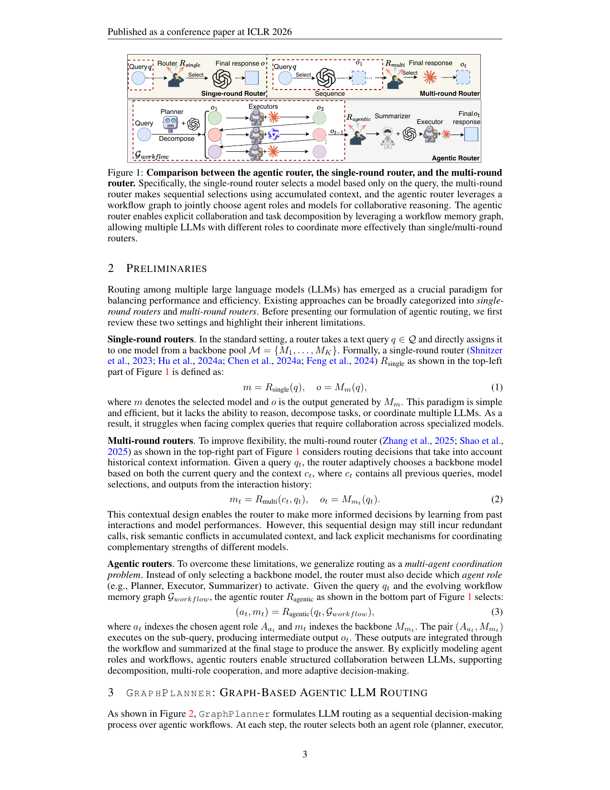

> [[../index|Wiki]] | [[../summary|Summary]] | [[../digest|Digest]]

# Problem, Motivation & Preliminaries

**In one sentence:** Routing among multi-agent LLMs should be generalized from one-shot or sequential model selection into an agentic, memory-augmented workflow-generation problem — where the router jointly picks an *agent role* and an *LLM backbone* at each step, modeled as a Markov Decision Process (MDP) whose state is enriched by a heterogeneous graph of historical and workflow memories (GARNet), and optimized end-to-end with reinforcement learning.

## Key points

- **Problem raised:** most existing LLM routers are confined to simplified/static settings; agentic LLM settings — task planning, multi-round cooperation among heterogeneous agents, and memory utilization — require a new routing paradigm. The paper's guiding question is: *"How can we extend routers to agentic LLM settings?"*
- **Two existing router families (Table 1):** single-round routers (RouterDC, GraphRouter) make one-shot assignments from query embeddings/classifiers and cannot reason, decompose, or coordinate; multi-round routers (R2-Reasoner, Router-R1) interleave reasoning and routing over multiple calls but treat each call as independent, causing redundant calls, context conflicts, and under-use of complementary strengths.
- **Three concrete challenges of agentic routing:** (1) relations among queries, responses, and LLM candidates are highly diverse and complex (queries may branch, responses interact, models contribute complementary but sometimes conflicting information); (2) **deferred rewards** — early misallocation can cascade into redundant calls or degraded downstream reasoning, creating a hard credit-assignment problem; (3) **historical memories** from past multi-agent workflows (successful collaboration patterns, error modes, efficient division of labor) are rarely exploited systematically.
- **GraphPlanner core design:** casts agentic routing-workflow generation as *graph generation within an MDP*; at each step it jointly selects the LLM backbone and the agent role — defined as **Planner, Executor, Summarizer**; a heterogeneous graph **GARNet** captures memories among LLM agents, queries, and responses to build richer state representations; **PPO** (Proximal Policy Optimization) is used to jointly optimize task-specific performance of final answers and computational cost.
- **Evaluation:** two phases across **14 tasks spanning 6 domains** — Phase 1 optimizes agentic routing within existing workflows (+3.8% average accuracy), Phase 2 generates workflows for complex agentic tasks (+9.3% average accuracy).
- **Result magnitudes:** outperforms strong single- and multi-round routers, improving accuracy by up to **9.3%** while reducing GPU cost from **186.26 GiB to 1.04 GiB**, staying on the Pareto frontier.
- **Generalization:** **78% average accuracy on unseen tasks** (20–40% higher than previous routers) and robust handling of unseen LLMs without additional fine-tuning.
- **Memory modes:** by modeling historical memories alongside current workflow memories through GARNet, GraphPlanner supports both **inductive** (greater efficiency) and **transductive** (stronger performance at higher cost) inference.

---

## Why LLM Routing Needs an Agentic View

Routing among multi-agent LLMs has become a key approach for integrating the strengths of diverse models while balancing efficiency and performance. Despite this, most existing routing methods remain confined to simplified or static settings, limiting their applicability to complex real-world tasks. The rise of agentic LLMs — where multi-agent collaboration enhances planning, strengthens reasoning, and boosts performance on complex tasks — highlights the need to revisit routing in realistic, challenging scenarios, where heterogeneous LLMs differ in capability, cost, and reliability. In those contexts, effective routing is not merely beneficial but necessary to fully unlock the potential of agentic LLM systems.

The paper frames the motivating research question as:

> **How can we extend routers to agentic LLM settings?**

## Limitations of Single-Round and Multi-Round Routers (Table 1)

Existing routing approaches fall into **single-round** and **multi-round** routers:

- **Single-round routers** (Shnitzer et al., 2023; Hu et al., 2024a; Chen et al., 2024a; Feng et al., 2024) make one-shot assignments based on query embeddings or classifiers. Simple and efficient, but they lack the ability to reason over multiple steps, decompose tasks, or coordinate across different LLMs — limiting their effectiveness on complex queries.
- **Multi-round routers** (Zhang et al., 2025; Shao et al., 2025) extend flexibility by interleaving reasoning and routing over multiple calls. However, they do **not** explicitly model collaboration between LLMs, treating each call as independent rather than part of a cooperative workflow — leading to **redundant calls, context conflicts, and limited use of complementary strengths**.

**Table 1:** Comparison of GraphPlanner with existing LLM routers across four dimensions — workflow type, historical memory usage, graph utilization, and model size.

| LLM Router | Workflow type | Historical memory usage | Graph utilization | Model size |
|---|---|---|---|---|
| RouterDC (Chen et al., 2024a) | Single-round | ✗ | ✗ | Medium |
| GraphRouter (Feng et al., 2024) | Single-round | ✓ | ✓ | Small |
| R2-Reasoner (Shao et al., 2025) | Multi-round | ✗ | ✗ | Medium |
| Router-R1 (Zhang et al., 2025) | Multi-round | ✗ | ✗ | Large |
| **GraphPlanner** | **Multi-agent** | **✓** | **✓** | **Small** |

Like existing routers, GraphPlanner is a **lightweight** router, but it is the only one based on an **agentic workflow** that leverages heterogeneous graphs to handle historical memories.

## Three Challenges of Agentic Routing

Building an effective agentic LLM router is far from trivial; the paper names three challenges:

1. **Diverse, complex relations** among queries, responses, and LLM candidates. Unlike single-step assignments, agentic workflows require reasoning over evolving contexts where queries may branch, responses interact, and different models contribute complementary but sometimes conflicting information. Capturing and leveraging these heterogeneous dependencies is non-trivial.
2. **Deferred rewards.** Early routing decisions often have long-term effects on the overall outcome, so immediate feedback is insufficient. An early misallocation may cascade into redundant calls or degraded reasoning quality downstream — a hard **credit assignment** problem, requiring the router to balance short-term efficiency with long-term performance.
3. **Under-exploited historical memories.** Rich traces of past multi-agent workflows contain valuable insights into successful collaboration patterns, error modes, and efficient division of labor, yet existing routers rarely make systematic use of this information.

## The GraphPlanner Approach (Overview)

To tackle these challenges, **GraphPlanner** is a heterogeneous graph memory-augmented agentic router for multi-agent LLMs. It:

- casts the generation of agentic routing workflows as **graph generation within a Markov Decision Process (MDP)**;
- at each step decides **both** which LLM backbone to invoke **and** which agent role to activate;
- defines agent profiles as **Planner, Executor, and Summarizer**, capturing the essential roles in agentic workflows;
- uses a heterogeneous graph, **GARNet**, to model memories among LLM agents, queries, and responses — fully exploiting abundant historical memories *and* current workflow memories to build richer state representations;
- introduces **Proximal Policy Optimization (PPO)** into the pipeline to jointly optimize task-specific performance of the final answers and the associated computational cost.

GraphPlanner generates multi-agent routing workflows for each query and supports both **inductive** and **transductive** inference.

## Evaluation Plan and Headline Results

GraphPlanner is evaluated in **two phases** across **14 tasks spanning 6 domains**: Phase 1 optimizes agentic routing *within existing workflows*; Phase 2 focuses on *generating workflows* for complex agentic tasks. Headline results:

| Metric | Value |
|---|---|
| Avg. accuracy gain, Phase 1 | +3.8% |
| Avg. accuracy gain, Phase 2 | +9.3% |
| GPU cost reduction | 186.26 GiB → 1.04 GiB |
| Avg. accuracy on unseen tasks | 78% (20–40% higher than previous routers) |
| Unseen-LLM generalization | robust, no additional fine-tuning |
| Pareto frontier | GraphPlanner remains on it |

Memory-mode trade-off: **inductive mode** offers greater efficiency, while **transductive mode** yields stronger performance at higher cost.

## Formalizing Routing: Single-Round, Multi-Round, and Agentic (Preliminaries)

Routing among multiple LLMs balances performance and efficiency. Before presenting the agentic formulation, the paper reviews the two standard settings and their limitations, as visualized in Figure 1.

**Single-round routers.** The router takes a text query $q \in Q$ and directly assigns it to one model from a backbone pool $M = \{M_1, \dots, M_K\}$:

$$m = R_{\text{single}}(q), \quad o = M_m(q). \tag{1}$$

Here $m$ is the selected model and $o$ the output of $M_m$. Simple and efficient, but it cannot reason, decompose tasks, or coordinate multiple LLMs, so it struggles with complex queries requiring collaboration across specialized models.

**Multi-round routers.** The router considers routing decisions that take into account historical context. Given a query $q_t$, it adaptively chooses a backbone based on both the current query and the context $c_t$, where $c_t$ contains all previous queries, model selections, and outputs from the interaction history:

$$m_t = R_{\text{multi}}(c_t, q_t), \quad o_t = M_{m_t}(q_t). \tag{2}$$

This contextual design learns from past interactions and model performances, but the sequential design may still incur redundant calls, risk semantic conflicts in accumulated context, and lack explicit mechanisms for coordinating complementary strengths.

**Agentic routers.** The paper generalizes routing as a **multi-agent coordination problem**: instead of only selecting a backbone model, the router must also decide which **agent role** (e.g., Planner, Executor, Summarizer) to activate. Given the query $q_t$ and the evolving workflow memory graph $G_{\text{workflow}}$, the agentic router selects:

$$(a_t, m_t) = R_{\text{agentic}}(q_t, G_{\text{workflow}}), \tag{3}$$

where $a_t$ indexes the chosen agent role $A_{a_t}$ and $m_t$ indexes the backbone $M_{m_t}$. The pair $(A_{a_t}, M_{m_t})$ executes on the sub-query, producing intermediate output $o_t$; these outputs are integrated through the workflow and summarized at the final stage to produce the answer. By explicitly modeling agent roles and workflows, agentic routers enable structured collaboration between LLMs, supporting decomposition, multi-role cooperation, and more adaptive decision-making.

Figure 1 contrasts the three routing architectures schematically. The single-round router (top-left) passes a query $q$ through $R_{\text{single}}$ to select one model from a backbone pool, which directly emits $o_t$ — query-only, with no history or collaboration. The multi-round router (top-right) processes the query in a sequence of rounds, feeding accumulated context back to $R_{\text{multi}}$ for the next selection — contextual, but still a flat, sequential chain. The agentic router (bottom, $\mathcal{F}_{\text{workflow}}$) first uses a *Planner* to decompose the query into a workflow graph of sub-tasks ($o_1, \dots, o_{t-1}$), assigns each sub-task to an *Executor* (some performing specialized or iterative work), and at step $t$ has $R_{\text{agentic}}$ jointly choose both the **agent role** and the **model**, with a *Summarizer* integrating the branch outputs into the final response — adding explicit role assignment and task decomposition on top of model selection.

**Covers:** Abstract, Section 1 (Introduction), Section 2 (Preliminaries)
