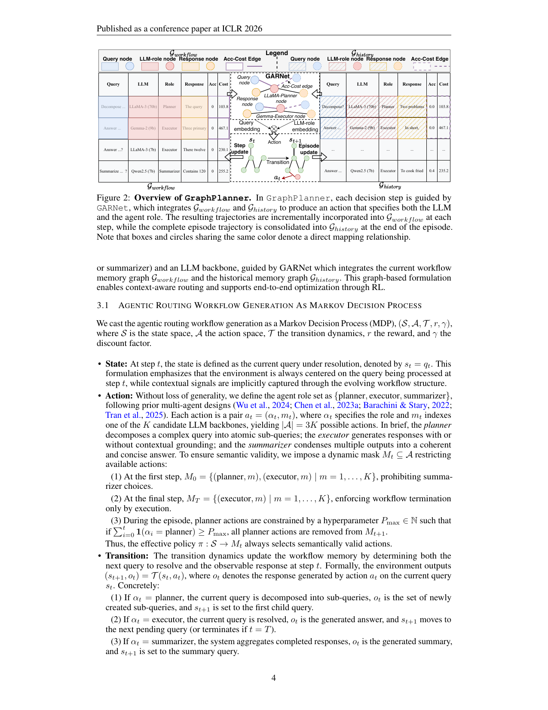

> [[../index|Wiki]] | [[../summary|Summary]] | [[../digest|Digest]]

# GraphPlanner Method

**In one sentence:** GraphPlanner casts agentic LLM routing as an MDP over a heterogeneous graph that unifies a per-step workflow memory graph and an end-of-episode historical memory graph through shared (LLM, role) hub nodes, and trains the resulting graph policy network (GARNet) end-to-end with PPO to jointly pick the agent role and LLM backbone at each step.

## Key points

- At each step the router emits an action `a_t = (α_t, m_t)` — a pair of agent role (planner / executor / summarizer) and LLM backbone `m_t ∈ {1..K}` — giving `|A| = 3K` possible actions, guided by a dynamic validity mask `M_t ⊆ A`.
- The MDP `(S, A, T, r, γ)` defines the state as the current query under resolution (`s_t = q_t`), transitions as updates of the workflow memory `(s_{t+1}, o_t) = T(s_t, a_t)`, and a reward that balances task utility against routing cost.
- Reward: `r_t = U(ŷ, y*) − αC(a_t)` at the terminal step `t = T`, and `r_t = −αC(a_t)` otherwise, where `U` is a task-specific utility (accuracy, BLEU, MRR), `C(a_t)` the computational cost, `α > 0` the cost–utility trade-off.
- The objective is `max_π E_{q∼Q} [Σ_{t=0}^{T} γ^t r(s_t, a_t)]`, `a_t ~ π(s_t)`, with episodes terminating when the root query is resolved.
- GARNet, a heterogeneous GNN, parameterizes `π(a_t | s_t)` over `G_t = G_workflow ∪ G_history`; node types are query nodes (`x_q`, Longformer embeddings), response nodes (`x_r`), and role hub nodes `x_m = [e_role; U; C]`.
- One fixed set of role hub nodes, one per (LLM, role) pair, is shared across both graphs and all rounds — a bridge for message passing and a mechanism for aggregating current workflow, historical signals, and role-specific utility–cost profiles without redundant nodes.
- A nested dual-graph encoding computes `H(his) = GARNet_θhis(G_history)` and injects it into the workflow encoder `H(loc) = GARNet_θloc(G_workflow; H(his))`; actions are scored as `score_j = z_t^⊤ h_{m,j}` with `z_t = f_trans(s_t)`, masked by `M_t` and softmax-normalized.
- Training uses PPO (actor–critic RL); the trailing Phase 1/Phase 2 tables show GraphPlanner reaching 58.60% / 60.40% average accuracy (Phase 1) and 63.6% (Phase 2, +23.2% ΔAcc) at lower cost than all router baselines.

---

## Routing as Workflow Generation (the MDP view)

GraphPlanner formulates LLM routing as a sequential decision-making process over agentic workflows: at each step the router selects both an agent role (planner, executor, or summarizer) and an LLM backbone, guided by GARNet which integrates the current workflow memory graph `G_workflow` and the historical memory graph `G_history`. This graph-based formulation enables context-aware routing and supports end-to-end optimization through RL.

The agentic routing workflow generation is cast as a Markov Decision Process `(S, A, T, r, γ)`, where `S` is the state space, `A` the action space, `T` the transition dynamics, `r` the reward, and `γ` the discount factor.

- **State:** At step `t`, the state is the current query under resolution, `s_t = q_t`. The environment is always centered on the query being processed at step `t`, while contextual signals are implicitly captured through the evolving workflow structure.
- **Action:** The agent role set is `{planner, executor, summarizer}`, following prior multi-agent designs (Wu et al., 2024; Chen et al., 2023a; Barachini & Stary, 2022; Tran et al., 2025). Each action is a pair `a_t = (α_t, m_t)`, where `α_t` specifies the role and `m_t` indexes one of `K` candidate LLM backbones, yielding `|A| = 3K` possible actions. The planner decomposes a complex query into atomic sub-queries; the executor generates responses with or without contextual grounding; the summarizer condenses multiple outputs into a coherent and concise answer. A dynamic mask `M_t ⊆ A` restricts available actions:
  1. At the first step, `M_0 = {(planner, m), (executor, m) | m = 1, ..., K}`, prohibiting summarizer choices.
  2. At the final step, `M_T = {(executor, m) | m = 1, ..., K}`, enforcing workflow termination only by execution.
  3. During the episode, planner actions are constrained by a hyperparameter `P_max ∈ N` such that if `Σ_{i=1}^{[t]} [α_i = planner] ≥ P_max`, all planner actions are removed from `M_{t+1}`.
  
  Thus the effective policy `π: S → M_t` always selects semantically valid actions.
- **Transition:** The dynamics update the workflow memory by determining both the next query and the observable response at step `t`: `(s_{t+1}, o_t) = T(s_t, a_t)`. Concretely: (1) if `α_t = planner`, the query is decomposed, `o_t` is the set of newly created sub-queries, and `s_{t+1}` is the first child query; (2) if `α_t = executor`, the query is resolved, `o_t` is the generated answer, and `s_{t+1}` moves to the next pending query (or terminates if `t = T`); (3) if `α_t = summarizer`, the system aggregates completed responses, `o_t` is the generated summary, and `s_{t+1}` is the summary query. The state always denotes the query under resolution, while `{o_t}` accumulates the observable outputs forming the final answer.
- **Reward:** Balances task utility and routing cost:

  `r_t = U(ŷ, y*) − αC(a_t)` if `t = T` (terminal), and `r_t = −αC(a_t)` if `t < T` (intermediate),

  where `ŷ` is the predicted output, `y*` the ground-truth label, `U(ŷ, y*)` a task-specific utility (e.g., accuracy, BLEU, or MRR), `C(a_t)` the computational cost of action `a_t`, and `α > 0` a cost–utility trade-off coefficient.
- **Episode and Objective:** An episode terminates once the root query is resolved, i.e., `s_T ∈ S_terminal` for some finite `T`. The router seeks a policy maximizing the expected discounted return:

  `max_π E_{q∼Q} [Σ_{t=0}^{T} γ^t r(s_t, a_t)]`, `a_t ~ π(s_t)`,

  where `Q` is the query distribution and `γ ∈ (0, 1]` the discount factor.

An architectural schematic (not a data plot) showing GraphPlanner as two tabular memory structures flanking a central decision module: `G_workflow` on the left (columns Query, LLM, Role, Response, Acc, Cost, with example rows such as a Planner/LLaMA-3-70b decomposition row and Executor rows on Gemma-2-9b and LLaMA-3-7b) and `G_history` on the right with the identical schema. Between them, the dashed GARNet box contains a small graph of Query node → LLM-role node → Response nodes joined by Acc-Cost edges, with query and LLM-role embeddings and an MDP-style update loop (`s_t → s_{t+1}`, episode update, transition, action `a_t`). The color-matching convention marks the direct cell-to-node mapping, i.e., the tables are flat projections of the underlying graph: per-step trajectories incrementally populate `G_workflow`, whole episodes fold into `G_history`, and GARNet reads both to route the next action.

## GARNet: the Heterogeneous Graph-Based Policy Network

The policy `π(a_t | s_t)` is parameterized by a heterogeneous graph neural network, **GARNet**. At each step `t`, the environment is represented as the union of a workflow memory graph and a historical memory graph: `G_t = G_workflow ∪ G_history`, `G_t = (V_t, E_t)`.

**Node initialization.** For `G_workflow`, the nodes are `x_q ∈ R^{d_q}`, `x_r ∈ R^{d_r}`, `x_m = [e_role; U; C] ∈ R^{d_m}`, where `x_q` is the Longformer embedding of the current query, `x_r` the embedding of the response, and `x_m` the role hub node constructed by concatenating the LLM-role textual embedding with task utility `U` and cost `C`. For `G_history`, the nodes are `x_hq ∈ R^{d_q}`, `x_hr ∈ R^{d_r}`, `x_m ∈ R^{d_m}`, where `x_hq` and `x_hr` are embeddings of past queries and responses, and `x_m` is the *same* role hub node shared across both graphs, providing a bridge for information exchange between them. Concretely, GraphPlanner maintains a fixed set of role hub nodes, one for each (LLM, role) pair, reused across all routing steps and across `G_workflow` and `G_history`; every query and response node, regardless of round, connects to these same hubs. This aggregates three information sources through a single interface — (i) the current workflow, (ii) accumulated historical interaction signals, and (iii) role-specific utility–cost profiles — and, by serving as the structural and semantic anchor between the two graphs, enables consistent message passing and multi-round reasoning while preventing redundant role nodes at each step.

**Graph construction.** In `G_workflow`, queries connect to roles through edges `e_q–m` enriched with task performance and cost; responses link to the roles that generate them; query–response edges preserve semantic alignment. In `G_history`, historical queries `x_hq` and responses `x_hr` connect to role hub nodes `x_m` through edges `e_hq–m` and `e_hr–m`, encoding accumulated experience about how roles performed in past interactions. The shared role hub nodes act as the anchor ensuring current-step decisions benefit from both local and historical memory. Multi-round routing introduces no additional role nodes: each newly generated sub-query or response is simply appended to the workflow graph and connected to the same shared hubs, implicitly connecting different rounds through shared neighbors rather than explicit temporal edges — letting GARNet reuse accumulated knowledge throughout multi-step routing.

**Message passing.** Each node embedding is projected into a hidden space: `h_v^(0) = W_{τ(v)} x_v`, `v ∈ V_t`, where `τ(v)` denotes the node type. Messages are aggregated from neighbors: `m_v = AGG {h_u^(0) : u ∈ N(v)}`, and node states are updated via a residual connection: `h_v = h_v^(0) + β · m_v`.

Nested dual-graph encoding: the historical graph is encoded first, `H(his) = GARNet_θhis(G_history)`, producing updated role-hub embeddings summarizing past query–response interactions, which are then injected into the workflow encoder, `H(loc) = GARNet_θloc(G_workflow; H(his))`, yielding local-contextualized representations of queries, roles, and responses. Because every query and response across all rounds attaches to the same role hubs, GARNet integrates multi-round context without an explicit temporal graph structure.

**State fusion and action scoring.** The global state is `z_t = f_trans(s_t) ∈ R^d`. Each candidate action corresponds to an LLM-role node embedding `h_{m,j} ∈ H(loc)`; compatibility scores are `score_j = z_t^⊤ h_{m,j}`, masked by `M_t` and normalized: `π(a_t = j | s_t) = exp(score_j)·1{a_j ∈ M_t} / Σ_k exp(score_k)·1{a_k ∈ M_t}`.

## Policy Training

The heterogeneous graph-based policy network is optimized with Proximal Policy Optimization (PPO) (Schulman et al., 2017), a widely used actor–critic reinforcement learning algorithm (details deferred to Appendix B of the paper).

## Results tables included in this chunk (Sections 3→4 boundary)

- **Phase 1** (optimizing routing within a fixed workflow): GraphPlanner achieves 58.60% average accuracy at cost 900.36 (+12.00 ΔAcc) under Depth=1, Width=3, and 60.40% at cost 1500.27 (+11.69) under Depth=2, Width=2 — best accuracy and among the lowest cost vs. Router-KNN/MLP/SVM/DC and GraphRouter baselines.
- **Phase 2** (joint workflow generation + backbone selection): GraphPlanner reaches **63.6%** average accuracy at cost 605.0 with 8.1 avg LLM calls, **+23.2% ΔAcc**, beating single-round routers (best: RouterDC 54.3%) and multi-round routers (R2-Reasoner 50.1%, Router-R1 51.8%).

**Covers:** Section 3 (GraphPlanner: Graph-Based Agentic LLM Routing), including the MDP formulation (3.1), the heterogeneous graph policy network GARNet (3.2), and the evaluation tables (Tables 2–3) appearing at the end of the chunk ahead of Section 4.
