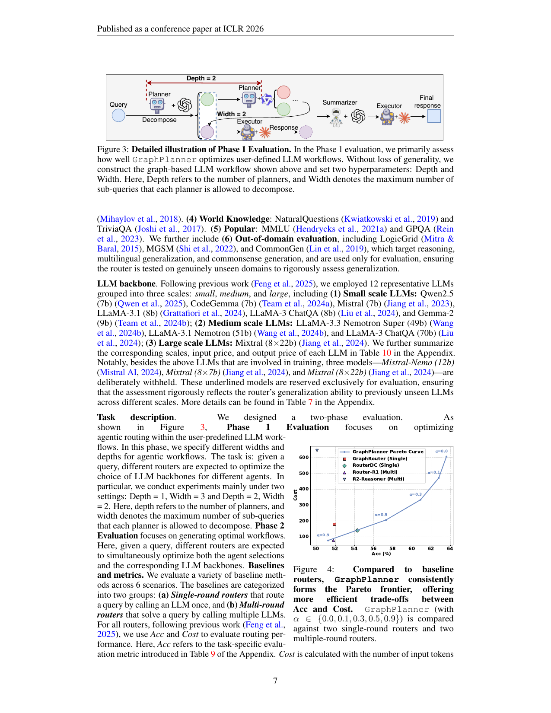
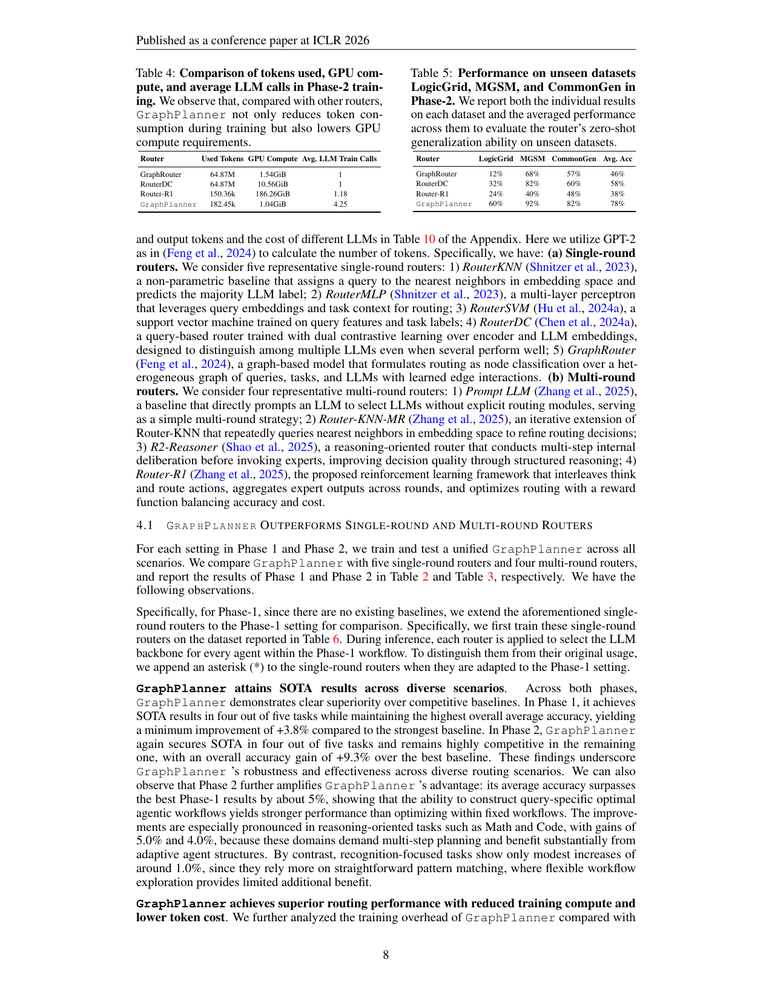
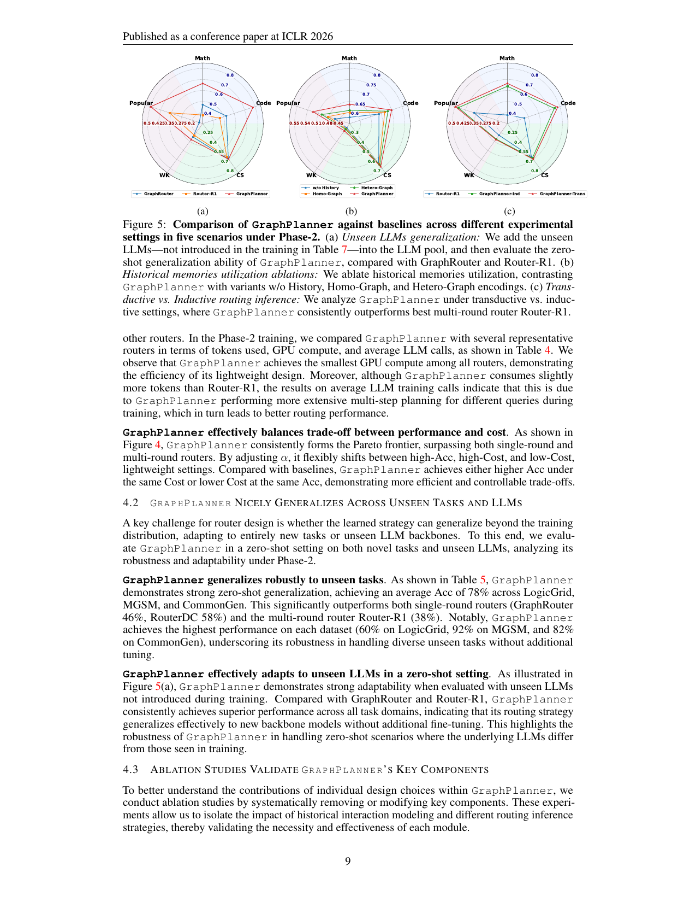

> [[../index|Wiki]] | [[../summary|Summary]] | [[../digest|Digest]]

# Experiments, Results & Conclusion

**In one sentence:** Across 14 tasks in 6 domains, GraphPlanner attains SOTA in 4 of 5 scenarios in both evaluation phases (minimum +3.8% in Phase 1, +9.3% in Phase 2 over the best baseline), generalizes zero-shot to unseen tasks (78% avg Acc vs. 38–58% for baselines) and unseen LLMs, and forms the Pareto frontier on accuracy vs. cost — all with the lowest GPU training compute (1.04 GiB).

## Key points

- Phase 1: GraphPlanner achieves SOTA in 4 of 5 tasks with the highest overall average accuracy, a minimum +3.8% improvement over the strongest baseline.
- Phase 2: SOTA in 4 of 5 tasks, +9.3% overall accuracy gain over the best baseline; its Phase-2 average beats the best Phase-1 results by ~5%, showing that generating query-specific workflows outperforms optimizing within fixed workflows.
- Gains concentrate in reasoning tasks: +5.0% on Math, +4.0% on Code, versus only ~1.0% on recognition-focused tasks.
- Lowest training GPU compute of all routers: 1.04 GiB vs. GraphRouter 1.54 GiB, RouterDC 10.56 GiB, Router-R1 186.26 GiB; token usage 182.45k (Router-R1 150.36k), with the most LLM training calls (4.25 vs. ~1).
- Zero-shot generalization on unseen datasets (Phase 2): 60% LogicGrid, 92% MGSM, 82% CommonGen, 78% average — vs. GraphRouter 12/68/57 avg 46%, RouterDC 32/82/60 avg 58%, Router-R1 24/40/48 avg 38%.
- Three LLMs (Mistral-Nemo 12b, Mixtral 8×7b, Mixtral 8×22b) were deliberately withheld from training and used only at evaluation; GraphPlanner still dominates GraphRouter and Router-R1 across all five domains, confirming zero-shot transfer to unseen backbones.
- Ablations: removing history (w/o History) causes the biggest drop; Hetero-Graph > Homo-Graph, yet both remain clearly inferior to the full GARNet, which models not only who interacts but how interactions evolve over time.
- Transductive inference (reusing stored training-time interactions) achieves slightly higher accuracy than inductive inference; the inductive setting is more resource-efficient and still consistently beats the best multi-round router, Router-R1.

---

## Experimental Setup

**Dataset.** A unified GraphPlanner is trained and tested across 14 tasks in 6 domains, including both in-domain and out-of-domain evaluation. In-domain splits (details in Appendix D): **(1) Math** — GSM8K and MATH; **(2) Code** — MBPP and HumanEval; **(3) Commonsense Reasoning** — CommonsenseQA, ARC, OpenBookQA; **(4) World Knowledge** — NaturalQuestions, TriviaQA; **(5) Popular** — MMLU, GPQA. **(6) Out-of-domain**: LogicGrid (reasoning), MGSM (multilingual generalization), CommonGen (commonsense generation) — used for evaluation only, so the router is tested on genuinely unseen domains.

**LLM backbones.** 12 representative LLMs in three scale groups: **small** — Qwen2.5 (7B), CodeGemma (7B), Mistral (7B), LLaMA-3.1 (8B), LLaMA-3 ChatQA (8B), Gemma-2 (9B); **medium** — LLaMA-3.3 Nemotron Super (49B), LLaMA-3.1 Nemotron (51B), LLaMA-3 ChatQA (70B); **large** — Mixtral (8×22B). Three models — **Mistral-Nemo (12B), Mixtral (8×7B), and Mixtral (8×22B)** — are deliberately withheld from training and reserved exclusively for evaluation, so that performance measures generalization to previously unseen LLMs across scales.

**Two-phase task design.** **Phase 1 Evaluation** optimizes agentic routing within a user-predefined LLM workflow: given a query, routers choose the LLM backbone for every agent. Main settings are Depth = 1, Width = 3 and Depth = 2, Width = 2, where *Depth* is the number of planners and *Width* the maximum number of sub-queries each planner may decompose. **Phase 2 Evaluation** goes further: given a query, the router must simultaneously optimize both the agent selection (the workflow) and the corresponding LLM backbones.

**Baselines and metrics.** Performance is measured with **Acc** (task-specific metric, Table 9) and **Cost** (input/output tokens priced per LLM, tokenized with GPT-2). Baselines fall into two groups:

- **Single-round routers** (route a query by calling an LLM once): *RouterKNN* (nearest neighbors in embedding space, majority LLM label), *RouterMLP* (MLP over query embeddings and task context), *RouterSVM* (SVM on query features and task labels), *RouterDC* (dual contrastive learning over encoder and LLM embeddings), *GraphRouter* (routing as node classification over a heterogeneous query–task–LLM graph).
- **Multi-round routers** (solve a query by calling multiple LLMs): *Prompt LLM* (direct prompting without a routing module), *Router-KNN-MR* (iterative KNN refinement), *R2-Reasoner* (multi-step internal deliberation before invoking experts), *Router-R1* (RL framework interleaving think and route actions, aggregating expert outputs, optimizing a reward balancing accuracy and cost).

Since no multi-round baselines existed for Phase 1, the single-round routers were extended to that setting, marked with an asterisk (\*).

## Phase 1 Evaluation

In the Phase 1 evaluation (Figure 3), the focus is how well GraphPlanner optimizes user-defined LLM workflows. A graph-based LLM workflow is constructed with two hyperparameters: **Depth** (the number of planners) and **Width** (the maximum number of sub-queries each planner is allowed to decompose). Routers are compared under the two main settings — Depth = 1, Width = 3 and Depth = 2, Width = 2 — where each router must select the best LLM backbone for every agent in the fixed workflow. GraphPlanner's controllable trade-off surface is what the accompanying accuracy/cost comparison shows: rather than offering a single operating point, it sweeps a continuum of accuracy–cost operating choices by tuning its cost/accuracy weight α, with higher accuracy coming at steeply rising cost toward the high-accuracy end (diminishing returns), while baseline routers sit as isolated points clustered in the lower-accuracy, mid-cost region (acc ≈ 52–54, cost ≈ 100–180).

## Main Results

Across both phases GraphPlanner demonstrates clear superiority: SOTA in four out of five tasks in Phase 1 (minimum +3.8% over the strongest baseline) and SOTA in four out of five in Phase 2 (+9.3% overall accuracy gain over the best baseline). Phase 2 amplifies the advantage — the Phase-2 average surpasses the best Phase-1 results by about 5% — and improvements are largest in reasoning-oriented tasks (Math +5.0%, Code +4.0%), while recognition-focused tasks gain only ~1.0%.

| Router | LogicGrid | MGSM | CommonGen | Avg. Acc |
|---|---|---|---|---|
| GraphRouter | 12% | 68% | 57% | 46% |
| RouterDC | 32% | 82% | 60% | 58% |
| Router-R1 | 24% | 40% | 48% | 38% |
| **GraphPlanner** | **60%** | **92%** | **82%** | **78%** |

| Router | Used Tokens | GPU Compute | Avg. LLM Train Calls |
|---|---|---|---|
| GraphRouter | 64.87M | 1.54 GiB | 1 |
| RouterDC | 64.87M | 10.56 GiB | 1 |
| Router-R1 | 150.36k | 186.26 GiB | 1.18 |
| **GraphPlanner** | 182.45k | **1.04 GiB** | 4.25 |

GraphPlanner achieves the smallest GPU compute of all routers (1.04 GiB); its slightly higher token usage than Router-R1 reflects more extensive multi-step planning per query during training, which yields better final routing performance.

Against the baseline routers (GraphRouter-Single, RouterDC-Single, Router-R1-Multi, R2-Reasoner-Multi), GraphPlanner consistently forms the **Pareto frontier** on accuracy vs. cost: its curve is monotonic and convex, sweeping accuracy from the low 50s to the high 60s as cost climbs from ~100 to ~600 (the exact per-axis values are table-based metrics in the source: per-dataset accuracies of 12–92% and token/GPU/training-call overheads of 150k–65M tokens, 1–186 GiB GPU, 1–4.25 LLM calls). Each operating point on the curve is labeled with a hyperparameter **α** (0.9 → 0.5 → 0.3 → 0.1 → 0.0) acting as a knob that trades cost for accuracy — high α gives the cheapest, least-accurate point; low α the most accurate, most expensive. The baselines sit as single points clustered in the lower-accuracy, mid-cost region. In short, GraphPlanner delivers higher Acc at the same Cost, or lower Cost at the same Acc, with more efficient and controllable trade-offs across the whole range rather than one fixed operating point.

## Generalization and Ablations

**Unseen tasks (zero-shot).** In Phase 2, GraphPlanner averages **78% Acc** across LogicGrid, MGSM, and CommonGen (60%, 92%, 82%), significantly outperforming the single-round routers (GraphRouter 46%, RouterDC 58%) and the multi-round Router-R1 (38%), and taking the top mark on every dataset — strong evidence of robustness to genuinely unseen domains without additional tuning.

**Unseen LLMs.** With the three training-withheld backbones (Mistral-Nemo 12B, Mixtral 8×7B, Mixtral 8×22B) added to the pool, GraphPlanner beats GraphRouter and Router-R1 across all five task domains in a zero-shot setting, confirming that its routing strategy generalizes to new backbone models without fine-tuning.

**Ablation of historical memory (GARNet).** Three variants isolate the role of history: *w/o History* (no historical states — current input only), *Homo-Graph* (GARNet replaced by a homogeneous GNN that captures structural relations but discards role-specificity), and *Hetero-Graph* (a heterogeneous GNN that distinguishes agent roles but does not model workflow dynamics). In the five-domain comparison, removing history yields the smallest polygon and a substantial drop; Homo-Graph partially mitigates this, and Hetero-Graph consistently outperforms Homo-Graph by distinguishing roles — but both remain clearly inferior to full GraphPlanner. Beyond heterogeneous modeling, GARNet provides an efficient, lightweight mechanism that captures how interactions evolve over time, giving GraphPlanner stronger contextual awareness than generic GNN encoders.

**Inductive vs. transductive inference.** *Inductive* inference generates routing decisions without holding out or reusing any training-time interactions (lightweight, no storage/retrieval overhead); *transductive* inference leverages preserved historical interactions collected during training (richer context at higher compute/memory cost). The transductive strategy achieves slightly better overall performance and the best scores in all five domains; the inductive variant is more resource-efficient and still consistently outperforms the best multi-round router, Router-R1. The two settings trade off maximum effectiveness against efficient deployment.

The three radar charts over the five scenarios (Math, Code, CS, WK, Popular) make the pattern explicit: in every panel — (a) zero-shot to unseen LLMs vs. GraphRouter and Router-R1, (b) history-encoding ablation (w/o History, Homo-Graph, Hetero-Graph), and (c) transductive vs. inductive inference vs. Router-R1 — GraphPlanner's polygon is the outermost, attaining the highest value on essentially all five domains and enclosing the competitors, with advantages most visible on the harder domains (Code, CS, Math). The consistent area dominance, rather than wins on isolated axes, is the central message.

## Conclusion

The paper concludes that GraphPlanner — a heterogeneous graph-based multi-agent router that casts routing as workflow generation within an MDP, using the heterogeneous graph GARNet to integrate historical and workflow memories with a policy trained via reinforcement learning — delivers state-of-the-art performance, robust generalization to unseen tasks and LLMs, and favorable accuracy–cost trade-offs across 14 tasks and 6 domains. These results underscore the potential of extending LLM routing into agentic settings and point toward scalable, cooperative multi-agent LLM systems. Future work plans richer agent profiles beyond Planner, Executor, and Summarizer.

**Ethics Statement.** All authors adhered to the ICLR Code of Ethics. The work does not involve human subjects, personal data, or sensitive attributes; the authors followed best practices for data usage, ensured compliance with licensing terms, and considered potential risks of bias or misuse. (A Reproducibility Statement adds that all datasets are public and training/evaluation code will be released upon publication.)

**Covers:** Section 4 (Experiments), Section 5 (Conclusion), Ethics Statement
