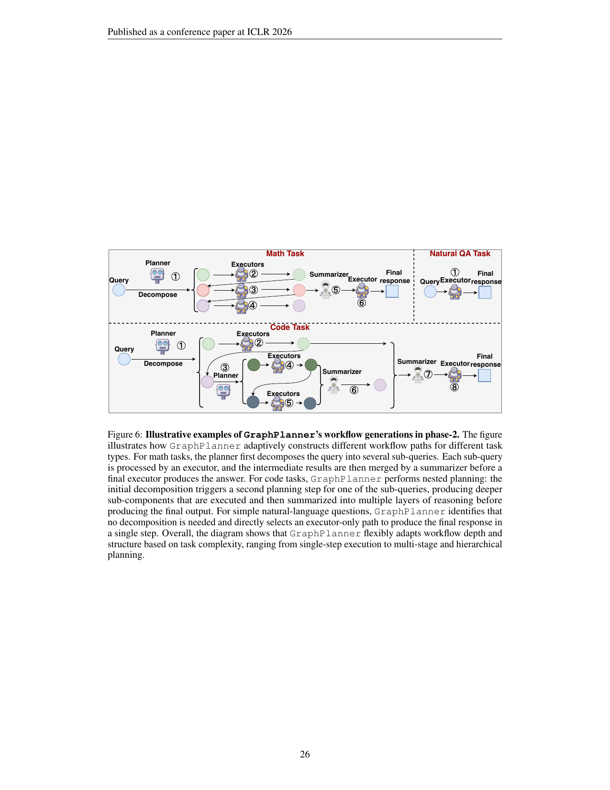

> [[../index|Wiki]] | [[../summary|Summary]] | [[../digest|Digest]]

# Additional Ablations & Generalization

**In one sentence:** A battery of extra experiments (new roles, alternative encoders, LLM-based history processing, an unseen dataset, and cost analysis) consistently shows GraphPlanner improving or matching baselines everywhere while training in 120 minutes (vs. 300–406 min) and inferring at 1.2 s/query (the fastest of all methods).

## Key points

- Adding Thinker and Verifier roles always helps: New-role-train reaches 70.5% / 78.5% / 79.0% / 39.5% / 52.5% (Math/Code/CS/WK/Popular), above the 3-role baseline (67.0/76.0/78.0/38.0/52.0) and also above zero-shot (68.5/77.0/78.3/38.5/52.2) and few-shot (69.6/77.8/78.8/39.0/52.4) settings with the new roles.
- On the unseen AIME dataset (Phase-2, 2016–2025), GraphPlanner scores 14.7% accuracy — almost twice the best baseline (RouterDC at 7.56%), with all other single-round and multi-round routers below ~8%.
- GARNet beats both alternative encoders across all five scenarios: GAT (0.643/0.739/0.756/0.358/0.493) and GraphTransformer (0.647/0.743/0.759/0.353/0.491) are 2.8%–6.1% and 2.3%–7.6% behind GraphPlanner (0.670/0.760/0.780/0.380/0.520) respectively.
- LLM-based history processing barely helps: History-summary (Router-R1 + summaries, 32,768-token limit) gets 0.51/0.62/0.75/0.14/0.36 and History-retrieval (top K=5 retrieved histories) gets 0.46/0.62/0.73/0.12/0.39, while GraphPlanner (0.67/0.76/0.78/0.38/0.52) outperforms the best history-based method by 31.4% (Math), 22.6% (Code), 4.0% (CS), 171.4% (WK), and 33.3% (Popular).
- GraphPlanner has the lowest total training time of any Phase-2 method: 120 min (RL-based data collection, no up-front data sweep) vs. R2-Reasoner 360 min, Router-R1 300 min, and supervised routers at 400.4–406 min (dominated by 395 min of data collecting).
- GraphPlanner also has the lowest inference latency: 1.2 s/query, versus 2.1–2.4 s for single-round routers and 3.6–10.5 s for multi-round routers.
- GraphPlanner's zero-shot generalization to new roles works without role-specific training (New-role-zero-shot beats the original on all five domains at 68.5/77.0/78.3/38.5/52.2), and few-shot with just 50 historical interactions (1% of training queries) lifts performance further to 69.6/77.8/78.8/39.0/52.4.
- Appendix J's illustrative examples (Figure 6, Tables 16–18) show GraphPlanner adapting its workflow topology to task type: a direct executor-only path for natural QA, parallel decompose-execute-summarize for math, and recursively nested (two-level) planning for code.

---

## New Agentic Roles

Appendix E tests whether GraphPlanner generalizes to roles beyond the original Planner/Executor/Summarizer, by adding two widely used roles — **Thinker** (systematic reasoning to produce detailed draft analyses) and **Verifier** (evaluates accuracy and quality of generated content before final output) — on top of the three original roles. Three variants are compared (Table 11):

- **New-role-train**: GraphPlanner is extended with the Thinker and Verifier roles and trained and tested via RL on the Phase-2 tasks and LLMs.
- **New-role-zero-shot**: training is identical to the original GraphPlanner (3 roles), but during testing the policy may choose among all five roles.
- **New-role-few-shot**: same 3-role training, but during testing the history graph $G_{history}$ is augmented with 50 historical interactions (randomly selecting 1% of training queries, paired with all five roles), and the policy again chooses among five roles.

| Setting | Math | Code | CS | WK | Popular |
|---|---|---|---|---|---|
| GraphPlanner | 67.0% | 76.0% | 78.0% | 38.0% | 52.0% |
| New-role-zero-shot | 68.5% | 77.0% | 78.3% | 38.5% | 52.2% |
| New-role-few-shot | 69.6% | 77.8% | 78.8% | 39.0% | 52.4% |
| New-role-train | 70.5% | 78.5% | 79.0% | 39.5% | 52.5% |

Incorporating additional roles with RL training (New-role-train) yields consistent improvements over the original 3-role GraphPlanner on all five domains, indicating strong adaptability to different role configurations. Notably, even without any role-specific training, New-role-zero-shot already beats the original on every domain, and New-role-few-shot improves it further — demonstrating effective zero-shot and few-shot generalization to previously unseen agentic roles.

## Alternative Graph Encoders

Appendix F ablates the graph encoder by replacing GARNet with two alternatives (Table 12):

- **GAT**: a graph attention network (PyTorch Geometric `GAT`).
- **GraphTransformer**: a Graph Transformer (PyTorch Geometric `graph_transformer`).

| Setting | Math | Code | CS | WK | Popular |
|---|---|---|---|---|---|
| GAT | 0.643 | 0.739 | 0.756 | 0.358 | 0.493 |
| GraphTransformer | 0.647 | 0.743 | 0.759 | 0.353 | 0.491 |
| GraphPlanner (GARNet) | **0.670** | **0.760** | **0.780** | **0.380** | **0.520** |

GraphPlanner is strongest across all five scenarios. Relative to GAT it gains a consistent 2.8%–6.1% across domains (largest in WK and Popular); relative to the heavier GraphTransformer it still provides 2.3%–7.6% relative improvements while maintaining substantially lower architectural and computational overhead. GARNet therefore delivers both the best accuracy and a lightweight alternative to transformer-based graph encoders.

## Historical Information Processing

Appendix G compares GraphPlanner against LLM-based methods of processing historical interactions, using two Router-R1-based baselines (Table 13):

- **History-summary**: stores all past interaction histories; at training and test time the Router-R1 base model summarizes the histories most relevant to the query (constrained to the 32,768-token max context) and injects the summary into the routing prompt.
- **History-retrieval**: in addition to summarization, retrieves the top K=5 most similar interaction histories to the current query and inserts the retrieved contexts directly into the routing prompt, so the router uses both global summaries and fine-grained retrieved evidence.

| Setting | Math | Code | CS | WK | Popular |
|---|---|---|---|---|---|
| Router-R1 | 0.45 | 0.52 | 0.81 | 0.29 | 0.37 |
| History-retrieval | 0.46 | 0.62 | 0.73 | 0.12 | 0.39 |
| History-summary | 0.51 | 0.62 | 0.75 | 0.14 | 0.36 |
| GraphPlanner | **0.67** | **0.76** | **0.78** | **0.38** | **0.52** |

LLM-based historical processing gives only limited improvements over Router-R1: summarization and retrieval both operate over highly heterogeneous, unstructured histories with mixed-quality reasoning traces and contextually entangled signals that LLMs struggle to exploit when injected directly. GraphPlanner instead achieves substantial, consistent gains in every scenario, outperforming the best history-based method by **31.4%** (Math), **22.6%** (Code), **4.0%** (CS), **171.4%** (WK), and **33.3%** (Popular). The graph-based encoder GARNet provides a more principled mechanism for modeling complex historical interactions — capturing cross-interaction structure, suppressing noise, and propagating relational information for routing.

## New Dataset

Appendix H tests zero-shot generalization on the unseen **AIME** dataset under Phase-2: all methods are trained as usual and evaluated zero-shot on AIME from 2016 to 2025 (Table 14).

| Method category | Methods | Accuracy (%) |
|---|---|---|
| Single-round routers | Router-KNN / Router-MLP / Router-SVM / RouterDC / GraphRouter | 3.95 / 7.14 / 4.43 / 2.90 / 7.56 |
| Multi-round routers | Prompt LLM / Router-KNN-MR / R2-Reasoner / Router-R1 | 3.40 / 3.71 / 7.30 / 5.21 |
| **GraphPlanner** | | **14.7** |

GraphPlanner achieves the strongest zero-shot accuracy on unseen AIME at **14.7%**, almost twice the best baseline (RouterDC, 7.56%); most other single-round and multi-round routers remain below 8%, indicating limited transfer to competition-level math. Graph-structured workflow planning provides substantially better generalization to complex reasoning tasks.

## Time Cost Comparison

Appendix I compares training and inference time costs under Phase-2 (Table 15). Supervised routers (e.g., GraphRouter) must first collect interactions between each training query and every LLM (a full sweep); RL-based methods (GraphPlanner, Router-R1) collect data dynamically during training. To compare fairly, a unified **Total Time for Training** = Data Collecting Time + NN Training Time is reported.

| Metric | Router-KNN | Router-MLP | Router-SVM | RouterDC | GraphRouter | Prompt LLM | Router-KNN-MR | R2-Reasoner | Router-R1 | GraphPlanner |
|---|---|---|---|---|---|---|---|---|---|---|
| Data Collecting Time (min) | 395 | 395 | 395 | 395 | 395 | — | — | 0 | 0 | 0 |
| NN Training Time (min) | 5.4 | 8.2 | 7.7 | 11 | 6.2 | — | — | 360 | 300 | 120 |
| **Total Training Time (min)** | 400.4 | 403.2 | 402.7 | 406 | 401.2 | — | — | 360 | 300 | **120** |
| Inference Time (s/query) | 2.2 | 2.4 | 2.2 | 2.3 | 2.1 | 10.5 | 9.3 | 8.3 | 3.6 | **1.2** |

GraphPlanner has the lowest overall time cost in both training and inference. The efficiency comes from its multi-threaded rollout design (processing multiple queries in parallel and generating routing interactions simultaneously, as in Section C): total training time is only 120 minutes, well below RL baselines R2-Reasoner (360 min) and Router-R1 (300 min), and far below supervised routers that pay 395 min of up-front data collection. At inference, GraphPlanner is the fastest at 1.2 s/query, beating single-round (2.1–2.4 s/query) and multi-round (3.6–10.5 s/query) routers. Because it collects and uses interaction data on-the-fly in an RL fashion, it avoids the expensive full-sweep data generation of supervised methods — it is both computationally and data-efficient across the whole pipeline.

## Illustrative Examples (overview)

Appendix J opens with three worked examples (Figure 6, tables 16–18) of how GraphPlanner adaptively generates Phase-2 workflows. The figure schematically shows three side-by-side pipelines of typed nodes (Query, Planner, Executors, Summarizer, Final response) with numbered sequential steps: the **Math Task** fans a Planner out into ~3 parallel sub-queries executed by parallel Executors, merged by a Summarizer and a final Executor (one-level fan-out/fan-in, steps 1–6); the **Natural QA Task** takes a direct single hop (Query → Executor → Final response); the **Code Task** uses two-level hierarchical planning, where one branch is a single Executor and the other triggers a nested Planner that fans out to its own Executors and Summarizer, with a top-level Summarizer and final Executor merging the branches (steps 1–8). The structural trend is depth and topology growing with task complexity — simple questions get an executor-only path, math gets parallel decompose-execute-summarize, code gets recursively nested planning. Table 16 (multi-stage math: decomposition into sub-queries, executor assignment, summarizer integration), Table 17 (complex code generation with nested planning and hierarchical decomposition), and Table 18 (direct executor-only path for simple natural-language questions) elaborate each case; together they show GraphPlanner flexibly choosing among single-step execution, multi-step reasoning, and hierarchical planning.

(The detailed worked examples continue in wiki page 06.)

**Covers:** Appendix E (New Agentic Roles), F (Other Graph Encoders), G (Historical Information Processing), H (New Dataset), I (Time Cost Comparison), J (Illustrative Examples intro)
