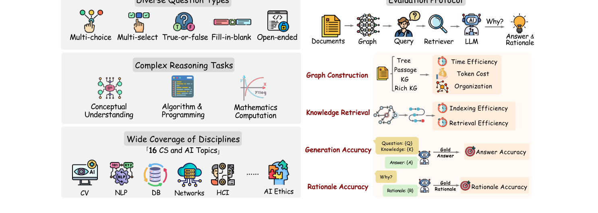

> [[../index|Wiki]] | [[../summary|Summary]] | [[../digest|Digest]]

# Introduction & Motivation

**In one sentence:** GraphRAG-Bench is the first domain-specific, benchmarking GraphRAG methods on the full construct → retrieve → generate → justify pipeline with 1,018 college-level, multi-hop questions over a 7-million-word corpus of 20 CS textbooks, to test whether graph augmentation truly improves LLM reasoning beyond simple retrieval.

## Key points

- The central research question is: **"Does graph augmentation truly enhance reasoning capabilities beyond simple retrieval?"** — graph-structured GraphRAG is framed as the answer to flat retrieval's inability to model multi-hop relationships and global comprehension.
- GraphRAG-Bench is the first challenging domain-specific benchmark built **for** GraphRAG, containing **1,018 college-level questions** in **5 question types**, spanning **16 disciplines** and a **7-million-word corpus from 20 CS textbooks**.
- Its **three stated superiorities** are (i) challenging question design (multi-hop, some needing mathematical reasoning or programming so that simple retrieval is insufficient), (ii) diverse task coverage (5 task types across 16 disciplines in 20 core textbooks), and (iii) a holistic evaluation framework across the entire pipeline — graph construction, knowledge retrieval, and answer generation — that also judges the logical coherence of the reasoning, not just final-answer correctness.
- The **five question types** are multiple-choice (MC), multi-select (MS), true-or-false (TF), fill-in-blank (FB), and open-ended (OE).
- The **three critical limitations of prior GraphRAG benchmarks** are (i) only commonsense questions that are probably already covered by the LLM's training corpus, (ii) single-hop or shallow multi-hop reasoning over explicit connections, which under-tests the unique advantage of graph-structured knowledge, and (iii) narrow answer formats (short names/dates or multiple-choice) that cannot reflect reasoning ability over graphs.
- Related Work classifies GraphRAG into **three main directions**: (1) hierarchical graph construction (RAPTOR, Microsoft's GraphRAG), (2) neural graph retrieval (GFM-RAG, G-Retriever), and (3) dynamic knowledge integration tightly coupled to LLMs (DALK, ToG); it also names HippoRAG (Personalized PageRank, hippocampal-memory inspired), LightRAG, and KGP.
- Applying **nine state-of-the-art GraphRAG methods** to the benchmark shows GraphRAG substantially enhances reasoning, with impact that **varies by question type** — large gains on some types but limited benefit on others.

---

## Abstract

Graph Retrieval-Augmented Generation (GraphRAG) has been increasingly recognized for its potential to enhance large language models (LLMs) by structurally organizing domain-specific corpora and facilitating complex reasoning. However, the authors note that current evaluations of GraphRAG models predominantly rely on traditional question-answering datasets whose limited question scope and evaluation metrics fail to comprehensively assess the reasoning-capacity improvements that GraphRAG enables. To close this gap they introduce **GraphRAG-Bench**, a large-scale, domain-specific benchmark, and claim three key superiorities:

- **(i) Challenging question design.** College-level, domain-specific questions that demand multi-hop reasoning, so simple content retrieval is insufficient; some questions require mathematical reasoning or programming.
- **(ii) Diverse task coverage.** A broad spectrum of reasoning tasks — multiple-choice, true/false, multi-select, open-ended, and fill-in-the-blank — spanning **16 disciplines in 20 core textbooks**.
- **(iii) Holistic evaluation framework.** Comprehensive assessment across the entire GraphRAG pipeline — graph construction, knowledge retrieval, and answer generation — and, beyond final-answer correctness, an evaluation of the logical coherence of the reasoning process.

By applying **nine contemporary GraphRAG methods** to GraphRAG-Bench, they demonstrate its utility in quantifying how graph-based structuring improves model reasoning, and report insights about graph architectures, retrieval efficacy, and reasoning capabilities. The GitHub repository is `https://github.com/jeremycp3/GraphRAG-Bench`.

## Section 1 — Introduction

Retrieval-Augmented Generation (RAG) has emerged as a key solution to ground LLMs in external knowledge, mitigating both hallucination and a lack of domain knowledge by retrieving relevant text passages and injecting factual knowledge into generation. However, conventional RAG remains unsatisfactory for complex reasoning: its **flat retrieval directly returns fragmentized chunks based on similarity matching**, which limits its ability to model the complex relationships between concepts needed for (a) **multi-hop reasoning** — e.g., *"What was the impact of the 2008 Lehman Brothers bankruptcy on Elon Musk's Tesla?"* — or (b) **global comprehension** — e.g., *"What is the main idea of the Trade Policy Change?"*

To address these limitations, **GraphRAG** organizes the structured knowledge among concepts as a **graph**, where nodes represent concepts and edges represent the relations among them. The introduction categorizes recent GraphRAG advances into **three main directions**:

1. **Hierarchical graph construction** — methods like RAPTOR and Microsoft's GraphRAG organize knowledge through tree structures and community detection.
2. **Neural graph retrieval** — approaches including GFM-RAG and G-Retriever employ graph neural encoders with specialized objectives for multi-hop reasoning.
3. **Dynamic knowledge integration** — systems such as DALK and ToG develop adaptive graph construction and traversal mechanisms that are tightly coupled with LLMs.

By structuring knowledge as graphs, GraphRAG lets LLMs both traverse and reason over explicit relational paths and perform deeper reasoning by inferring implicit relations from the graph structure.

Figure 1 is a schematic architecture/benchmark diagram (not a data plot) that defines the benchmark's scope and evaluation protocol in two panels: the left panel lists the coverage — diverse question types (multi-choice, multi-select, true-or-false, fill-in-blank, open-ended), complex reasoning tasks (conceptual understanding, algorithm & programming, mathematical computation), and wide discipline coverage (~16 CS and AI topics such as CV, NLP, DB, Networks, HCI, AI Ethics); the right panel shows the evaluation protocol — the full inference chain (Documents → Graph → Query → Retriever → LLM → Answer & Rationale) decomposed into scored components: Graph Construction (time efficiency, token cost, organization), Knowledge Retrieval (indexing efficiency, retrieval efficiency), Generation Accuracy (answer accuracy), and Rationale Accuracy.

Yet the authors argue that existing benchmarks for GraphRAG methods fail to reflect performance of reasoning on graphs, because they predominantly leverage traditional QA datasets — **HotpotQA, 2WikiMultiHopQA, and MuSiQue** — that feature only explicit factoid questions of limited complexity and short answers (e.g., *"Who is the grandchild of Dambar Shah?"*). These datasets suffer from **three critical limitations**:

1. **(i) Only commonsense questions** that could probably already be covered in the LLMs' training corpus.
2. **(ii) Single-hop or shallow multi-hop reasoning** based on explicit connections, which inadequately probes the unique advantages of graph-structured knowledge.
3. **(iii) Narrow answer formats** — most answers are short (names, dates) or multiple-choice, which can hardly reflect reasoning ability over graphs.

From this they pose the research question — **_"Does graph augmentation truly enhance reasoning capabilities beyond simple retrieval?"_** — and answer it by proposing **GraphRAG-Bench**, the first challenging domain-specific benchmark particularly designed for GraphRAG, with three elements:

- **(i) A dataset** of **1,018 college-level questions** spanning **16 disciplines** (e.g., computer vision, computer networks, human-computer interaction, AI ethics), featuring conceptual understanding (e.g., *"Given [theorem] A and B, prove [conclusion] C"*), complex algorithmic programming (e.g., coding with interlinked function calls), and mathematical computation (e.g., *"Given [Input], [Conv1], [MaxPool], [FC], calculate the output volume dimensions."*).
- **(ii) Five types of diverse questions** to thoroughly evaluate different aspects of reasoning: multiple-choice (MC), multi-select (MS), true-or-false (TF), fill-in-blank (FB), and open-ended (OE).
- **(iii) A comprehensive multi-dimensional evaluation** on each component of GraphRAG — graph construction, knowledge retrieval, answer generation, and rationale generation — to give insight into how graph-structured knowledge enhances LLMs' reasoning compared to traditional RAG.

**Contributions summarized:**

- The first challenging domain-specific benchmark concentrated on GraphRAG: **1,018 questions in 5 question types spanning 16 topics**, over a **corpus of 7 million words from 20 computer science textbooks**.
- A comprehensive evaluation protocol designed to stress-test GraphRAG methods on graph construction, retrieval, and multi-hop answer generation and rationale generation.
- Extensive experiments with **nine state-of-the-art GraphRAG models**, yielding the insights that (1) GraphRAG substantially enhances LLM reasoning — and, to the authors' knowledge, they are the **first to quantify this improvement with concrete evaluation metrics** — and (2) GraphRAG's impact varies by question type, giving significant gains on some types but limited benefit for others.

## Section 2 — Related Work

### GraphRAG

Recent GraphRAG work has focused on integrating structured knowledge and advanced retrieval strategies to overcome the limitations of vanilla RAG in handling large, noisy corpora and complex reasoning:

- **Hierarchical / clustering methods.** RAPTOR and Microsoft's GraphRAG both employ hierarchical clustering — RAPTOR via recursive tree construction with multi-level summarization, and GraphRAG via community detection with LLM-generated synopses — to support coarse-to-fine retrieval and diverse, high-coverage responses.
- **Graph neural encoders with specialized retrieval objectives.** GFM-RAG, G-Retriever, and LightRAG each combine a GNN encoder with a specialized objective: GFM-RAG trains a query-dependent GNN in two stages for multi-hop generalizability; G-Retriever uses a Prize Collecting Steiner Tree formulation to reduce hallucination and improve scalability; LightRAG builds a dual-level graph-augmented index for efficient, incrementally updatable lookup.
- **HippoRAG.** Inspired by hippocampal memory processes, it leverages Personalized PageRank to achieve single-step multi-hop retrieval, delivering state-of-the-art efficiency and performance on both path-following and path-finding QA tasks.
- **Dynamic KG construction and traversal.** DALK and KGP introduce dynamic KG construction and traversal agents that use LLMs to build domain-specific graphs and self-aware retrieval policies, injecting structural context while reducing noise.
- **Tightly coupled LLM–KG reasoning.** ToG tightly couples LLMs with KGs via beam-search exploration, enabling iterative graph reasoning and on-the-fly correction without additional training.

The authors note that collectively these methods exemplify the GraphRAG paradigm by uniting graph structures, generative language models, and novel retrieval formulations to enhance knowledge integration, scalability, and deep reasoning across diverse domains.

### Prior benchmarks for GraphRAG

The authors state that, to date, **no dataset has been specifically designed for GraphRAG tasks**. Widely used datasets such as **Quality, PopQA, and HotpotQA** are tailored for general question answering, where answers can often be directly extracted from corpora, failing to effectively measure the core capabilities of GraphRAG methods. Multi-hop QA datasets like **MuSiQueQA and 2WikiMultiHopQA** contain questions artificially constructed via rules and logic rather than natural real-world queries, and their corpora are short and often derived from converting entities and descriptions of existing KGs, which deviates from practical application contexts.

**DIGIMON** benchmarks some methods but neither introduces new datasets nor evaluates the reasoning capability of GraphRAG. Critically, all the aforementioned datasets neglect question-type distinctions, focusing primarily on simple questions and thus unable to reflect GraphRAG's performance variations across different question categories. In summary, existing datasets lack long contexts and raw documents, mismatch real-world scenarios, and omit gold rationale, making it impossible to systematically evaluate GraphRAG's reasoning ability.

**Covers:** Abstract, Section 1 (Introduction), Section 2 (Related Work) of GraphRAG-Bench (arXiv:2506.02404)
