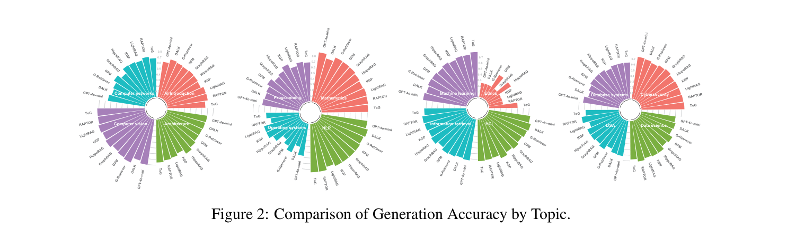
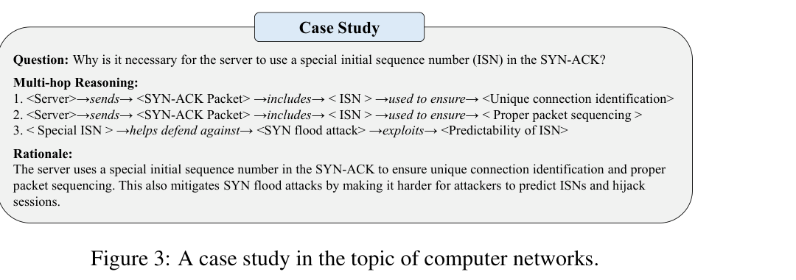

> [[../index|Wiki]] | [[../summary|Summary]] | [[../digest|Digest]]

# Topic-Specific Analysis, Observations, Case Study & Conclusion

**In one sentence:** GraphRAG's benefit from retrieval-augmented reasoning is not uniform — it degrades accuracy in symbolic (Mathematics) and judgment-based (Ethics) domains, helps some question types (TF, OE) while hurting others (MC), consistently lifts reasoning/rationale quality everywhere, and its value is best demonstrated on problems requiring multi-hop synthesis rather than lookup.

## Key points

- In the Mathematics domain, **every** GraphRAG method *degrades* the LLM's generation accuracy, because mathematical problems demand the model to internally "compute" each deductive step rather than rely on keyword matching from retrieved text — and the explanatory/conceptual documents GraphRAG retrieves usually have symbolic notation and formula layout misaligned with the problem, causing ambiguities or loss of key steps.
- In the Ethics domain both GraphRAG and the raw LLM perform only **mediocrely**, because ethical questions hinge on subjective value judgments over dynamic moral-tradeoff contexts that harden into ambiguous symbolic constructs that statistical learning struggles to represent.
- Strong GraphRAG systems such as **RAPTOR** still substantially boost accuracy across most of the 16 topics, demonstrating cross-domain robustness that validates their general effectiveness.
- Per question type, GraphRAG's effect splits: **MC accuracy drops** (retrieval noise interferes with the LLM's already-strong internalized option-selection), while **TF improves** (retrieved factual evidence helps the model verify statements before answering) and **OE improves** (external context grounds answers, enriches detail, and cuts hallucination).
- **FB and MS** are retrieval-precision-dependent: fill-in-blank needs exact contextual matches and multi-select needs the right options retrieved, so GraphRAG offers limited benefit to these unless its retrieval is highly accurate.
- Independently of raw accuracy, GraphRAG **substantially improves reasoning (R/AR) scores across question types**, raising the probability of producing a correct rationale alongside the answer — a capability most prior benchmarks do not evaluate but which is critical in real-world (education/medical) stakes.
- The Computer-Networks case study (server ISN in SYN-ACK) shows the benchmark's core lesson: the correct answer cannot be pulled by simple lookup; it requires synthesizing several reasoning hops into a coherent rationale before the final answer can be produced.
- Taken together, the paper concludes that structured knowledge integration materially improves *both* reasoning and generation, which is the contribution GraphRAG-Bench — the first domain-specific GraphRAG benchmark — is built to measure.

---

## Topic-specific generation accuracy (Section 4.5)

Because the dataset spans 16 distinct topical domains, the paper runs a fine-grained analysis of how GraphRAG affects LLM generation accuracy *by topic*. The headline is that GraphRAG yields consistent improvements in most areas, but three findings carve out the exceptions and the confirmations:

1. **Mathematics — universal degradation.** *All* GraphRAG methods lower the LLM's accuracy on mathematics. The paper attributes this to the fact that mathematical problems lean on rigorous symbolic manipulation and precise deductive chains: the model must internally "compute" each step instead of doing keyword matching against external text. The documents GraphRAG retrieves are usually explanatory or conceptual, so their symbolic notation, formula layout, and contextual structure often misalign with what the problem actually requires. The result is ambiguities and loss of key steps when the model extracts and transforms the information it was handed.
2. **Ethics — mediocre on both sides.** Both GraphRAG and the LLM alone score only so-so in ethics. The argument is that ethical problems are fundamentally subjective value judgments whose meaning depends on the dynamic context of moral trade-offs and social norms. The symbolic representations an LLM builds via statistical learning struggle to accurately model these ambiguous ethical constructs, so there is an intrinsic ceiling on reasoning performance whether or not retrieval is added.
3. **Robustness — RAPTOR holds up.** Good GraphRAG approaches such as RAPTOR substantially improve generation accuracy across *most* topics, which is the counterweight to the Math/Ethics dips: it shows that when the method is strong, the cross-domain benefit is real and consistent.

Figure 2 renders this as four side-by-side polar (radial-bar) charts — one per four-topic group, 16 topics in total (AI Introduction, Architecture, Computer vision, Computer networks; Mathematics, NLP, Operating systems, Programming; Ethics, HCI, Information retrieval, Machine learning; Cybersecurity, Data science, DBMS systems, DSA) — with systems as angular spokes and bar length encoding generation accuracy. Read qualitatively (the chart has no numeric scale), no single model dominates: the per-topic leader shifts across domains, several systems in the red quadrants (e.g. AI Introduction, Mathematics, Cybersecurity) reach close to the outer rim while Ethics, Operating systems, and DSA sit with clearly shorter spokes — a visual confirmation that generation accuracy is jointly topic- and model-dependent, i.e. the best-performing pipeline varies with the subject.

## Observations: does GraphRAG help every question type? (Section 4.6)

The section opens with the question *"Can GraphRAG improve performance across all question types?"* and answers it: **no, the effect is question-type-specific.**

- **MC (multiple-choice) — accuracy drops.** LLMs have internalized so much knowledge through training on large corpora that they can often pick the correct option from internal knowledge alone. GraphRAG's retrieval-based augmentation can introduce redundant or only loosely related information that does not precisely match the question context; this retrieval *noise* interferes with the model's already-competent option selection and pushes MC accuracy down.
- **TF (true/false) — accuracy improves.** TF questions demand a binary judgment about a factual or logical statement, and LLMs may hold blind spots or incomplete knowledge about particular facts. Retrieving the relevant factual evidence lets the model *verify the statement before answering*, so these supplements raise TF accuracy.
- **OE (open-ended) — accuracy improves.** OE questions invite expansive, detailed responses, which is hard for an LLM relying only on internal knowledge. GraphRAG supplies additional context and facts from the external corpus that enrich the response, add subject-matter detail and expressiveness, and *reduce hallucination* by grounding answers in explicit evidence.
- **FB (fill-in-blank) & MS (multi-select) — mixed, precision-gated.** FB requires precise contextual understanding to predict the exact missing word, and GraphRAG's retrieved corpora often fail to match that exact context, adding noise that hurts the model. MS requires choosing multiple correct options from a set and reasoning over complex option combinations; if retrieval omits the right options or includes irrelevant details it confuses the model. Both types therefore place a high demand on *retrieval precision*, and GraphRAG offers limited benefit to them unless its retrieval is highly accurate.

A second question closes the section: *"Can GraphRAG effectively enhance LLMs' reasoning ability?"* — and the answer is strongly yes. Experiments show GraphRAG effectively enhances reasoning across diverse question types, **increasing the probability of generating a correct rationale alongside the answer**. The paper credits this to the retrieval mechanisms both identifying the most relevant corpora *and* supplying robust evidential support for the reasoning process. The paper flags this as an under-evaluated dimension: existing benchmarks lack a systematic measurement of GraphRAG's reasoning capability, yet it is of real-world importance. In the college-level educational context the benchmark targets, a user seeking professional knowledge wants explicit rationales (to understand and acquire the knowledge), not just the answer; in medical scenarios, a patient needs a clear rationale for a medication alongside the treatment recommendation for decision transparency. Hence an effective GraphRAG system should optimize *not only* answer accuracy *but also* reasoning and explainability — which is why the reasoning-ability results in Table 5 matter even where raw accuracy does not uniformly rise.

## Case study (Section 4.7)

Figure 3 presents a sample from the **Computer Networks** slice of the dataset, chosen to expose two properties of the benchmark: (i) the questions demand specialized, college-level knowledge, and (ii) the correct answer **cannot be retrieved by simple lookup**. Instead, solving the problem requires synthesizing multiple reasoning steps into a coherent rationale *before* the final answer is produced. The highlighted example is the ISN question — why the server must use a special (randomized) initial sequence number in its SYN-ACK — which decomposes into a three-hop directed reasoning chain:

1. **Server → SYN-ACK Packet → ISN**: the server *sends* a SYN-ACK packet that *includes* an ISN, establishing the connection-identification and packet-sequencing function (the ISN is used to ensure unique connection identification and correct sequencing).
2. **ISN → Security**: a randomized ISN *helps defend against a SYN flood attack* by making the ISN hard to predict, so the third hop ties the functional requirement to a security property.
3. **SYN flood attack — ISN predictability**: the attack *exploits predictability of the ISN*; by randomizing it the server removes the exploitable structure that would let an attacker pre-seed or hijack a session.

**Rationale (unifying the hops):** a server's use of a special/randomized ISN in the SYN-ACK simultaneously (a) guarantees unique connection identification, (b) ensures correct packet sequencing, and (c) mitigates SYN-flood attacks by making ISNs hard to predict, thereby blocking session hijacking — i.e. the "why" of the ISN is the product of connecting three otherwise separate facts, which no single retrieved snippet supplies.

This is the meta-lesson of the figure: the panel exists to show that these benchmark questions are *multi-hop-synthesis* tasks, not factual lookups, and that a compact, readable form — a small set of directed entity-relation hops converging on a justifying rationale — can express the kind of complex domain reasoning the benchmark measures.

## Conclusion (Section 5)

The paper closes by restating its contribution. It presents **GraphRAG-Bench, the first domain-specific benchmark designed for GraphRAG**, comprising a 16-discipline dataset that challenges methods with multi-hop reasoning, complex algorithmic/programming tasks, mathematical computing, and varied question types. Its comprehensive, multi-dimensional evaluation spans **graph construction, knowledge retrieval, generation, and reasoning**, and is built to quantify the enhancement of LLM reasoning when it is augmented with structured knowledge. Extensive experiments on **nine state-of-the-art GraphRAG methods** reveal that graph integration plays a significant role in improving both reasoning and generation performance — precisely the differential (topic-, question-type-, and reasoning-level) effects analyzed in Sections 4.5–4.7.

**Covers:** Sections 4.5-4.7 and Section 5 (Conclusion) of GraphRAG-Bench (arXiv:2506.02404)
