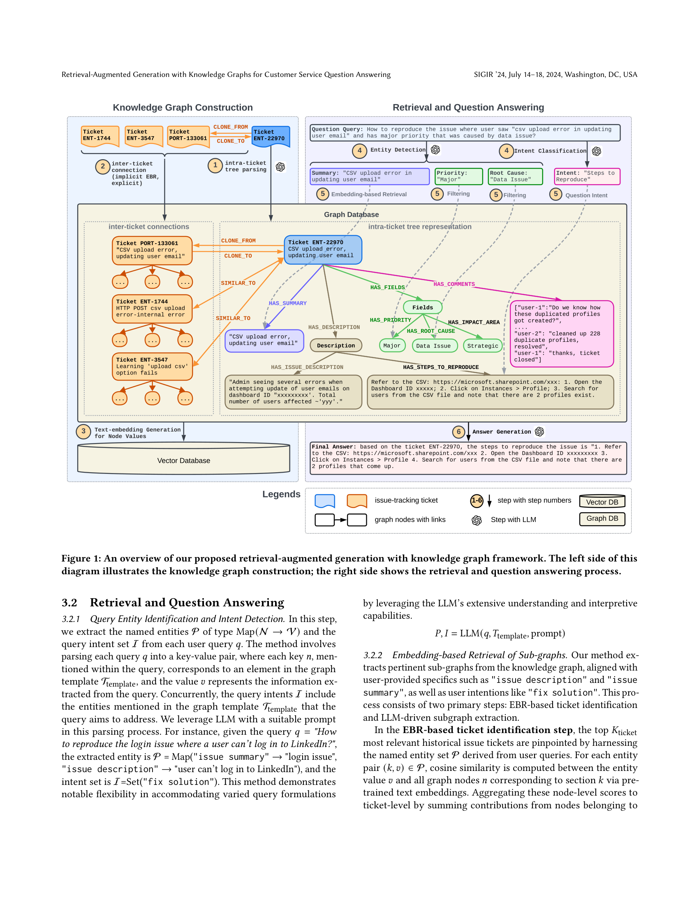

> [[../index|Wiki]] | [[../summary|Summary]] | [[../digest|Digest]]

# Knowledge Graph Method

**In one sentence:** The system models each support ticket as a typed two-level knowledge graph — an intra-ticket tree of fields (summary, description, comments, steps-to-reproduce) plus inter-ticket edges (explicit clone links and implicit similarity links) — and at query time parses the question into entities and intents, ranks candidate tickets by summed node-level cosine similarity, translates the augmented query into a Cypher query to fetch the relevant sub-graph, and has an LLM decode the final answer over that sub-graph.

## Key points

- **Two-level graph structure:** each ticket `ENT-*` expands into an **intra-issue tree `T_i`** (typed child nodes connected by `HAS_SUMMARY`, `HAS_DESCRIPTION`, `HAS_FIELDS`/`HAS_PRIORITY`/`HAS_ROOT_CAUSE`/`HAS_IMPACT_AREA`, `HAS_COMMENTS`, `HAS_STEPS_TO_REPRODUCE`), and tickets are linked into an **inter-issue graph `G`** (e.g., `ENT-22970` connected to `ENT-1744`, `ENT-3547`, `PORT-133061`).
- **Two edge types between tickets:** **explicit edges `E_exp`** (`CLONE_FROM`/`CLONE_TO`) derived from verbatim cloning references in ticket text, and **implicit edges `E_imp`** (`SIMILAR_TO`) derived from embedding similarity between tickets — so the inter-ticket layer = `E_exp ∪ E_imp`.
- **Construction is a two-phase hybrid:** a rule-based parser handles structured fields (summary, priority, root cause, impact area, steps) while an LLM is used to extract less structured content such as comments, summaries and clone/similarity links; the result is written to a graph database (Neo4j) for structure and a vector database for the node embeddings.
- **Embedding generation:** BERT/E5-class text embeddings are computed for node *values* (the free-text inside each node, not the node type), with text chunking applied within a section, so retrieval operates at node level and is aggregated to ticket level.
- **Query parsing:** given query `q`, an LLM extracts a key–value entity map `P = Map(N → V)` whose keys match fields in the graph template `T_template` plus an intent set `I` (e.g., `I = Set("fix solution")`), i.e. `P, I = LLM(q, T_template, prompt)`; for the login-issue example: `P = Map("issue summary" → "login issue", "issue description" → "user can't log in to LinkedIn")`.
- **Sub-graph retrieval scoring:** for each ticket `i`, the score is `S_Ti = Σ_{(k,v)∈P} Σ_{n∈Ti} I{n.sec = k} · cos(embed(v), embed(n.text))` — cosine similarity between each entity value and all nodes of the ticket in the matching section, summed over entity pairs; the top-`K` tickets by `S_Ti` are selected, so multiple matching entities reinforce a ticket.
- **Cypher translation:** the original query is rephrased to embed the retrieved ticket ID and then translated by an LLM into a Cypher query, e.g. `MATCH (j:Ticket {ticket_ID: 'ENT-22970'})-[:HAS_DESCRIPTION]->(description:Description)-[:HAS_STEPS_TO_REPRODUCE]->(steps_to_reproduce:StepsToReproduce) RETURN steps_to_reproduce.value` — versatile enough to span nodes in one tree or across different trees.
- **Answer generation with fallback:** the LLM acts as a decoder producing the answer from the retrieved sub-graph plus the original query; if graph query execution fails under online serving, a fallback reverts to a baseline text-based (flat vector) retrieval.

---

## Knowledge Graph Construction

### 3.1.1 Graph Structure Definition

The knowledge graph is defined at two levels:

1. **Intra-issue tree `T_i`.** Each ticket `i` becomes the root of a typed tree whose children are the ticket's structured sections, connected by `HAS_*` edges:
   - `HAS_SUMMARY` → Summary node (e.g., "CSV upload error, updating user email");
   - `HAS_DESCRIPTION` → Description node (the free-text issue description);
   - `HAS_FIELDS` (with `HAS_PRIORITY`, `HAS_ROOT_CAUSE`, `HAS_IMPACT_AREA`) → structured attribute values such as `Major`, `Data Issue`, `Strategic`;
   - `HAS_COMMENTS` → the thread of user comments (e.g., *"Do we know how these duplicated profiles got created?"* … *"cleaned up 228 duplicate profiles, resolved"*);
   - `HAS_STEPS_TO_REPRODUCE` → the reproduction steps.

   **Worked example (ENT-22970 ticket family):** the tree rooted at ticket `ENT-22970` ("CSV upload error, updating user email") carries a description of admins seeing errors when updating user emails on a dashboard, a `Major` priority, a `Data Issue` root cause, a multi-message comment thread about 228 duplicated profiles, and concrete steps-to-reproduce (open Dashboard ID xxxxxxxxx → Instances > Profile → search users from the CSV and observe two profiles).

2. **Inter-issue graph `G`.** All ticket trees are linked into one graph with two edge types:
   - **Explicit edges `E_exp`:** `CLONE_FROM` / `CLONE_TO` — ticket `ENT-22970` is a clone and relates to `ENT-1744` ("HTTP POST csv upload error - internal error"), `ENT-3547` ("Learning 'upload csv' option fails"), and `PORT-133061` ("CSV upload error, updating user email").
   - **Implicit edges `E_imp`:** `SIMILAR_TO` — derived from embedding similarity of ticket content ("implicit EBR"), connecting tickets with related issues even when they were never explicitly cloned.

### 3.1.2 Knowledge Graph Construction

Construction is a **two-phase hybrid algorithm** combining rule-based and LLM-based parsing:

- **Phase 1 — intra-ticket tree parsing:** a rule-based parser extracts the well-structured fields of each ticket (summary, description, priority/root-cause/impact-area fields, steps-to-reproduce) into the `HAS_*` tree; where text is unstructured or ambiguous (e.g., pulling a coherent summary or comment thread), an LLM step completes the extraction. The tree for ticket `i` is captured as `T_i = (V_i, E_i)` with typed nodes `V_i` and `HAS_*` edges `E_i`.
- **Phase 2 — inter-ticket connection extraction:** the system scans ticket text for explicit clone references, emitting `CLONE_FROM`/`CLONE_TO` edges (`E_exp`), and additionally computes ticket-level embedding similarities to add implicit `SIMILAR_TO` edges (`E_imp`). The full inter-ticket edge set is `E = E_exp ∪ E_imp`, giving the global graph `G = (∪ V_i, ∪ E_i ∪ E)`.
- The parsed graph is stored in a **graph database** (Neo4j), which later supports Cypher queries, while node text is also vectorized (next subsection).

### 3.1.3 Embedding Generation

- Node **values** (the free text stored in each node) are encoded with pre-trained text-embedding models (BERT/E5-class) so that semantic similarity — not exact string matching — drives retrieval.
- The resulting vectors are written to a **vector database** alongside the graph database, providing the "Vector DB" of Figure 1 that backs embedding-based retrieval at query time.
- Long text inside a node (e.g., a long description or comment thread) is **chunked within the section** before embedding, so a single node may contribute several vectors while preserving its section label `n.sec` for the retrieval scoring function.



**Figure 1** is a two-panel schematic of the whole pipeline. On the **left (Knowledge Graph Construction)**, steps 1–3 show raw issue-tracking tickets being parsed: step 1 expands each ticket (e.g., `ENT-22970`) into its intra-ticket tree of Summary, Description, Fields (Priority, Root Cause, Impact Area), Comments and Steps-to-reproduce; step 2 adds inter-ticket connections — explicit `CLONE_FROM`/`CLONE_TO` edges to `ENT-1744`, `ENT-3547`, `PORT-133061` plus implicit `SIMILAR_TO` edges ("implicit EBR") — and the result lands in a Graph DB; step 3 writes text embeddings of node values to a Vector DB. On the **right (Retrieval and Question Answering)**, steps 4–6 show a query such as *"How to reproduce the issue where user saw 'csv upload error in updating user email' and has major priority that was caused by data issue?"* being decomposed by an LLM into entities and intent (step 4: Summary="CSV upload error in updating user email", Priority="Major", Root Cause="Data Issue", Intent="Steps to Reproduce"), followed by embedding-based retrieval with intent/field filtering to select the ticket sub-graph (step 5), and finally LLM answer generation (step 6) producing the concrete reproduction steps taken from ticket `ENT-22970`.

## Retrieval and Question Answering

### 3.2.1 Query Entity Identification and Intent Detection

Each user query `q` is parsed (by an LLM with a suitable prompt) into:

- an **entity map** `P = Map(N → V)`: each key `n` is a field name present in the graph template `T_template` (e.g., "issue summary", "issue description"), and each value `v` is the information extracted from the query;
- an **intent set** `I`: which template fields the query is asking about — e.g., `"fix solution"` or `"Steps to Reproduce"`.

Formally: `P, I = LLM(q, T_template, prompt)`.

**Worked example:** for `q = "How to reproduce the login issue where a user can't log in to LinkedIn?"`, the parser yields `P = Map("issue summary" → "login issue", "issue description" → "user can't log in to LinkedIn")` and `I = Set("fix solution")`. The LLM-based parsing is what gives the step its flexibility across many phrasings of the same question.

### 3.2.2 Embedding-based Retrieval of Sub-graphs

This step has two sub-steps:

1. **EBR-based ticket identification (top-K ranking).** For each entity pair `(k, v) ∈ P`, a cosine similarity is computed between the entity value `v` and every graph node `n` that lives in section `k` of some ticket's tree, using the pre-trained node embeddings. Node scores are aggregated to ticket level and the top-`K` tickets are kept:

   `[S_Ti = Σ_{(k,v)∈P} [ Σ_{n∈Ti} I{n.sec = k} · cos(embed(v), embed(n.text)) ]`

   The indicator `I{n.sec = k}` restricts each entity value to nodes of its matching section, and summing over entity pairs means that a ticket matching many query entities wins — multiple concurrent hits are treated as a strong signal of relevance.

2. **LLM-driven subgraph extraction (Cypher generation).** The original query is rephrased to name the retrieved ticket ID (e.g., `q′ = "how to reproduce 'ENT-22970'"`), and that modified query is translated by the LLM into a Cypher query against the graph database. For the ENT-22970 example the generated query is:

   ```cypher
   MATCH (j:Ticket {ticket_ID: 'ENT-22970'})
   -[:HAS_DESCRIPTION]-> (description:Description)
   -[:HAS_STEPS_TO_REPRODUCE]-> (steps_to_reproduce:StepsToReproduce)
   RETURN steps_to_reproduce.value
   ```

   Because the LLM formulates the query over the full graph structure, one Cypher traversal can retrieve across a single intra-ticket tree or hop between distinct trees — the generated answer then cites the concrete reproduction steps (refer to CSV → open Dashboard ID → Instances > Profile → confirm two profiles) from the ENT-22970 sub-graph.

### 3.2.3 Answer Generation

- The LLM serves as the **decoder**: it correlates the sub-graph data retrieved in 3.2.2 with the original user query `q` and composes the final answer (e.g., the step-by-step reproduction procedure quoted above).
- For **robust online serving**, a fallback mechanism is built in: if the graph/Cypher query execution encounters issues, the system reverts to a baseline text-based (flat vector) retrieval so the QA service degrades gracefully rather than failing.

**Covers:** pages 3-4 (Section 3 Methods, through Section 3.2.3; Figure 1)
