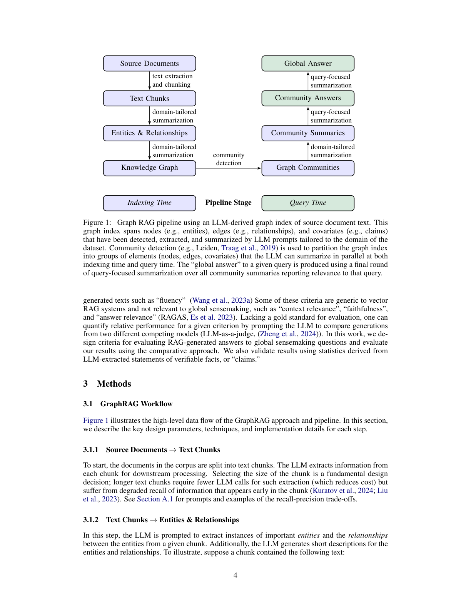

> [[../index|Wiki]] | [[../summary|Summary]] | [[../digest|Digest]]

# Introduction and Background

**In one sentence:** Vector RAG answers only local fact-retrieval queries because it fetches a small set of semantically similar records, so it cannot handle global sensemaking questions (e.g. "What are the main themes in the dataset?") — GraphRAG solves this by using an LLM to build an entity knowledge graph, partitioning it into a hierarchy of communities, and summarizing those communities in a map-reduce fashion to produce a global answer.

## Key points

- RAG (Lewis et al., 2020) exists because data is too large for the LLM's context window (the maximum number of tokens processed at once); in canonical ("vector") RAG, records semantically similar to the query are retrieved, and an answer is generated from the query plus those records alone.
- Vector RAG fails on sensemaking queries — queries requiring global understanding of the entire dataset, e.g. "What are the key trends in how scientific discoveries are influenced by interdisciplinary research over the past decade?" — because sensemaking (Klein et al., 2006) requires reasoning over connections among people, places, and events, and the corpus is too large to put in one prompt.
- GraphRAG's pipeline: (1) an LLM derives an entity knowledge graph (nodes = key entities, edges = relationships); (2) the graph is partitioned into a hierarchy of communities of closely related entities; (3) LLM-generated community summaries are produced bottom-up, higher levels recursively incorporating lower-level summaries; (4) queries are answered by map-reduce — each community summary yields a partial answer in parallel (map), then partial answers are combined into a final global answer (reduce).
- Results: for global sensemaking questions over datasets in the 1 million token range, GraphRAG substantially outperforms a conventional vector RAG baseline in both comprehensiveness and diversity of answers, when using GPT-4 as the LLM.
- Evaluation novelty: an LLM-as-a-judge technique (Zheng et al., 2024) adapted for broad-issue questions with no ground-truth answer — one LLM generates diverse sensemaking questions from corpus-specific use cases, a second LLM judges the two systems' answers against predefined criteria (Section 3.3).
- Background 2.1: RAG = any system where a user query retrieves external information that is incorporated into generation; it's ideal when the data source exceeds the LLM's context window. Embedding-based vector similarity retrieval (Gao et al., 2023) defines the "vector RAG" family GraphRAG contrasts with.
- Background 2.2: GraphRAG belongs to recent LLM-based knowledge-graph extraction work and adds to RAG approaches that use a knowledge graph as an index (Gao et al., 2023); its novel ingredient is the graph's inherent modularity (Newman, 2006) — partitioning into nested modular communities (e.g. Louvain, Blondel et al. 2008; Leiden, Traag et al. 2019) and building globally recursive summaries over that hierarchy.
- Background 2.3/2.4 (RAG evaluation): existing QA benchmarks (HotPotQA, MultiHop-RAG, MT-Bench) target explicit fact retrieval, not global sensemaking; GraphRAG instead uses adaptive benchmarking — LLM-generated persona-based, corpus-specific sensemaking queries (building on persona generation work) — and LLM-as-a-judge comparative evaluation with criteria like "fluency", avoiding corpus-specific vector RAG criteria ("context relevance", "faithfulness", "answer relevance", RAGAS) that don't apply to global sensemaking.

---

## The Sensemaking Problem

RAG (Lewis et al., 2020) is an established approach to using LLMs to answer queries over data too large to fit in a language model's context window — the maximum number of tokens (units of text) the LLM can process at once (Kuratov et al., 2024; Liu et al., 2023). In the canonical RAG setup, the system retrieves a subset of records from a large external corpus that are individually relevant to the query and collectively small enough to fit the context window; the LLM then generates a response from both the query and the retrieved records (Baumel et al., 2018; Dang, 2006; Laskar et al., 2020; Yao et al., 2017). The authors collectively call this conventional approach **vector RAG**, and note it works well for queries answerable with information localized in a small set of records.

However, vector RAG does not support **sensemaking queries** — queries requiring global understanding of the entire dataset, such as "What are the key trends in how scientific discoveries are influenced by interdisciplinary research over the past decade?" Sensemaking tasks require reasoning over "connections (which can be among people, places, and events) in order to anticipate their trajectories and act effectively" (Klein et al., 2006). LLMs such as GPT (Achiam et al., 2023; Brown et al., 2020), Llama (Touvron et al., 2023), and Gemini (Anil et al., 2023) excel at sensemaking in complex domains like scientific discovery (Microsoft, 2023) and intelligence analysis (Ranade and Joshi, 2023) — given a sensemaking query and a text with an implicit, interconnected set of concepts, an LLM can generate a summary answering the query. The challenge arises precisely when the data volume is large enough to require RAG: vector RAG cannot support sensemaking over an entire corpus, and prior query-focused summarization (QFS) methods don't scale to the quantities of text RAG systems index. GraphRAG is positioned to combine the strengths of both.

## GraphRAG's Approach

GraphRAG is a graph-based RAG approach that enables sensemaking over the entirety of a large text corpus (per the abstract, a graph-based approach to question answering over private text corpora that scales with both the generality of user questions and the quantity of source text). It proceeds in stages:

1. **Knowledge graph construction** — an LLM builds the graph, with nodes corresponding to key entities in the corpus and edges representing relationships between those entities.
2. **Community hierarchy** — the graph is partitioned into a hierarchy of communities of closely related entities.
3. **Community summaries** — an LLM generates community-level summaries bottom-up following the hierarchy, with summaries at higher levels recursively incorporating lower-level summaries. Together these provide global descriptions and insights over the corpus.
4. **Map-reduce query answering** — in the *map* step, community summaries are used to provide partial answers to the query independently and in parallel; in the *reduce* step, the partial answers are combined and used to generate a final global answer.

The authors frame the method and its demonstrated ability to perform global sensemaking over an entire corpus as the main contribution. To demonstrate it, they developed a novel application of the LLM-as-a-judge technique (Zheng et al., 2024) suitable for questions targeting broad issues and themes where there is no ground-truth answer: one LLM generates a diverse set of global sensemaking questions based on corpus-specific use cases, then a second LLM judges the answers of two RAG systems using predefined criteria (defined in Section 3.3). Comparing GraphRAG to vector RAG on two representative real-world text datasets, results show GraphRAG strongly outperforms vector RAG when using GPT-4 as the LLM. GraphRAG is available as open-source software at https://github.com/microsoft/graphrag, with versions also available as extensions to LangChain (LangChain, 2024), LlamaIndex (LlamaIndex, 2024), NebulaGraph (NebulaGraph, 2024), and Neo4J (Neo4J, 2024).

## The GraphRAG Pipeline (Figure 1)

The pipeline described above is depicted in Figure 1:

The figure is a process diagram (no quantitative axes) split into two stages — a left **Indexing Time** column and a right **Query Time** column, with a "Pipeline Stage" label marking the transition (purple boxes = indexing, green = query). At indexing time (left column, top→bottom), the flow is: Source Documents → text extraction and chunking → Text Chunks → domain-tailored summarization → Entities & Relationships → domain-tailored summarization → Knowledge Graph. An off-axis "community detection" step then carries the knowledge graph into the query-time side. At query time (right column), the flow runs: Graph Communities → domain-tailored summarization → Community Summaries → query-focused summarization → Community Answers → query-focused summarization → Global Answer.

Per the caption, the graph index spans **nodes** (e.g., entities), **edges** (e.g., relationships), and **covariates** (e.g., claims) that are detected, extracted, and summarized by LLM prompts tailored to the domain of the dataset. Community detection (e.g., Leiden, Traag et al., 2019) partitions the graph index into groups of elements (nodes, edges, covariates) that the LLM can summarize in parallel at both indexing time and query time. The "global answer" to a given query is produced by a final round of query-focused summarization over all community summaries reporting relevance to that query. In plain terms, GraphRAG augments chunk-based retrieval with an LLM-built entity–relation graph plus community-level summaries, compressing the corpus into summarizable communities so that global sensemaking questions can be answered by synthesizing a query-focused global answer — rather than only doing local fact lookup.

## Vector RAG and Its Limits (Background 2.1)

RAG generally refers to any system where a user query is used to retrieve relevant information from external data sources, which is then incorporated into the generation of a response by an LLM (or other generative model, such as a multi-media model); the query and retrieved records populate a prompt template passed to the LLM (Ram et al., 2023). RAG is ideal when the total number of records is too large to include in a single prompt, i.e. the data source exceeds the LLM's context window.

In canonical RAG, retrieval returns a set number of records semantically similar to the query, and the answer uses only the information in those retrieved records. A common approach is text embeddings — retrieving records closest to the query in vector space, where closeness corresponds to semantic similarity (Gao et al., 2023). Although some RAG uses alternative retrieval mechanisms, the family of conventional approaches is collectively called **vector RAG**. GraphRAG contrasts with vector RAG in its ability to answer queries requiring global sensemaking over the entire corpus.

GraphRAG also builds on prior work in advanced RAG strategies: it leverages summaries over large sections of the data source as a form of "self-memory" (Cheng et al. 2024), later used to answer queries as in Mao et al. 2020. Summaries are generated in parallel and iteratively aggregated into global summaries, similar to prior techniques (Feng et al., 2023; Gao et al., 2023; Khattab et al., 2022; Shao et al., 2023; Su et al., 2020; Trivedi et al., 2022; Wang et al., 2024), including hierarchical-indexing summary approaches (Kim et al. 2023; Sarthi et al. 2024). GraphRAG's distinction is generating a graph index from the source data and then applying graph-based community detection to create a thematic partitioning of the data.

## Related Work: Knowledge Graphs with LLMs and RAG (Background 2.2)

Earlier approaches to knowledge graph extraction from natural language text corpora include rule-matching, statistical pattern recognition, clustering, and embeddings (Etzioni et al., 2004; Kim et al., 2016; Mooney and Bunescu, 2005; Yates et al., 2007). GraphRAG falls into a more recent body of research using LLMs for knowledge graph extraction (Ban et al., 2023; Melnyk et al., 2022; OpenAI, 2023; Tan et al., 2017; Trajanoska et al., 2023; Yao et al., 2023; Yates et al., 2007; Zhang et al., 2024a), and adds to a growing set of RAG approaches that use a knowledge graph as an index (Gao et al., 2023).

Adjacent techniques in that family: some use subgraphs, elements of the graph, or properties of the graph structure directly in the prompt (Baek et al., 2023; He et al., 2024; Zhang, 2023) or as factual grounding for generated outputs (Kang et al., 2023; Ranade and Joshi, 2023); others (Wang et al., 2023b) use the knowledge graph to enhance retrieval, where an LLM-based agent dynamically traverses a graph with nodes representing document elements (e.g., passages, tables) and edges encoding lexical/semantic similarity or structural relationships. GraphRAG contrasts by focusing on a previously unexplored quality of graphs in this context: their inherent **modularity** (Newman, 2006) — the ability to partition graphs into nested modular communities of closely related nodes (e.g., Louvain, Blondel et al. 2008; Leiden, Traag et al. 2019). Specifically, GraphRAG recursively creates increasingly global summaries by using the LLM to create summaries spanning this community hierarchy.

## RAG Evaluation (Background 2.3–2.4)

Many benchmark datasets for open-domain QA exist — HotPotQA (Yang et al., 2018), MultiHop-RAG (Tang and Yang, 2024), and MT-Bench (Zheng et al., 2024) — but these are oriented toward vector RAG performance, i.e., explicit fact retrieval. This work instead proposes generating a set of questions that evaluates **global sensemaking over the entirety of the corpus**. The approach is related to LLM methods that use a corpus to generate questions whose answers would be summaries of the corpus, such as in Xu and Lapata (2021) — but for a fair evaluation, it avoids generating the questions directly from the corpus itself (an alternative is a corpus subset held out from subsequent graph extraction and answer evaluation).

**Adaptive benchmarking** is the dynamic generation of evaluation benchmarks tailored to specific domains or use cases; recent work has used LLMs for this to ensure relevance, diversity, and alignment with the target application (Yuan et al., 2024; Zhang et al., 2024b). This work's adaptive benchmarking builds on LLM-based **persona generation** (Kosinski, 2024; Salminen et al., 2024; Shin et al., 2024): the LLM infers potential users of a RAG system and their use cases, which guide the generation of corpus-specific sensemaking queries representative of real-world RAG usage.

On **evaluation criteria**, the LLM evaluates how well a RAG system answers the generated questions — with prior work showing LLMs to be competitive with human evaluators of natural language generation (Wang et al., 2023a; Zheng et al., 2024) and proposing criteria such as "fluency" (Wang et al., 2023a). Some criteria are generic to vector RAG and not relevant to global sensemaking, e.g. "context relevance", "faithfulness", and "answer relevance" (RAGAS, Es et al. 2023). Lacking a gold standard, relative performance for a given criterion can be quantified by prompting the LLM to compare generations from two competing models (LLM-as-a-judge, Zheng et al., 2024). The authors design criteria for evaluating RAG-generated answers to global sensemaking questions, evaluate using this comparative approach, and additionally validate results using statistics derived from LLM-extracted statements of verifiable facts, or "claims."

---

**Covers:** Title/Abstract, Section 1 (Introduction), Section 2 (Background: 2.1 RAG Approaches and Systems, 2.2 Using Knowledge Graphs with LLMs and RAG, 2.3 Adaptive benchmarking for RAG Evaluation, 2.4 RAG evaluation criteria), Figure 1.
