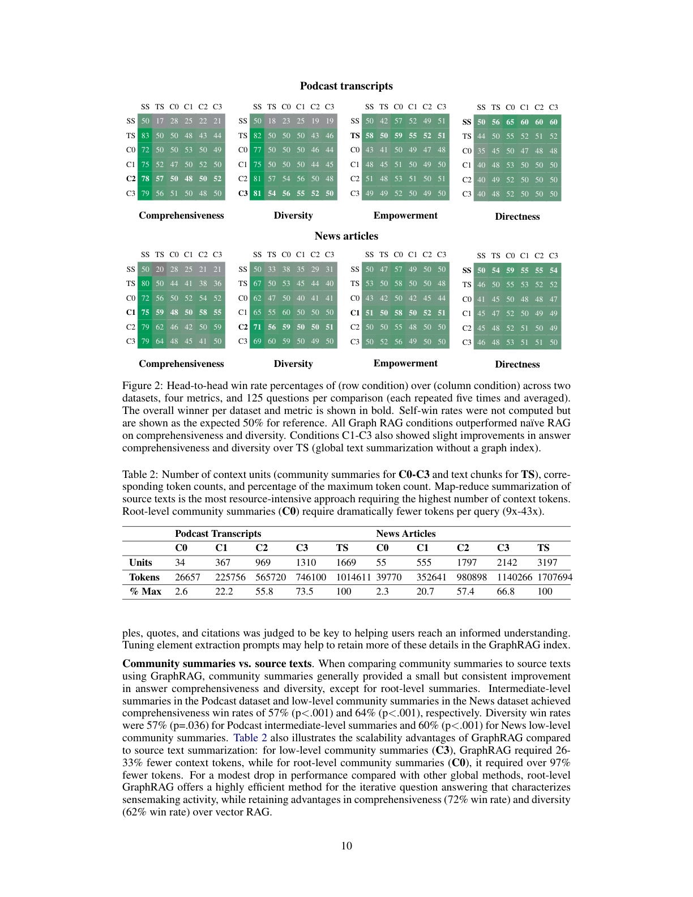

> [[../index|Wiki]] | [[../summary|Summary]] | [[../digest|Digest]]

# Experimental Setup and Results

**In one sentence:** GraphRAG's global approaches (C0–C3) win over vector RAG on comprehensiveness and diversity, validated two ways — LLM pairwise win rates and claim-based measures.

## Key points

- Podcast transcript dataset: 1669 × 600-token chunks with 100-token overlap (∼1M tokens); news articles dataset: 3197 × 600-token chunks with 100-token overlap (∼1.7M tokens).
- Six conditions compared: C0–C3 (GraphRAG community summaries at four hierarchy levels), TS (map-reduce text summarization without a graph), and SS (vector RAG semantic search).
- Global approaches beat vector RAG (SS) on comprehensiveness with 72–83% win rates (p<.001) on Podcast and 72–80% (p<.001) on News; diversity win rates were 75–82% (p<.001) and 62–71% (p<.01) respectively.
- Directness (validity check): SS produced the most direct responses across all comparisons; the C-conditions are weaker on directness.
- Empowerment: mixed results — no consistent advantage for global approaches over SS or for GraphRAG over TS.
- Graph sizes: Podcast 8,564 nodes / 20,691 edges; News 15,754 nodes / 19,520 edges.
- Experiment 2: 47,075 unique claims extracted (avg 31 per answer); C0–C3 and TS all significantly outperformed SS on claim-based comprehensiveness (p<.05) in both datasets; diversity advantage held only for C0 across all distance thresholds in News.
- Indexing took 281 minutes for the Podcast dataset (600-token window) on a VM (16GB RAM, Intel Xeon Platinum 8171M, 2.60GHz) using a public OpenAI endpoint (gpt-4-turbo, 2M TPM, 10k RPM).

---

## Experiment 1: Setup (Section 4.1)

### Datasets

Two datasets in the one-million-token range, each representative of corpora users may encounter in real-world activities:

- **Podcast transcripts** — public transcripts of *Behind the Tech with Kevin Scott* (Microsoft CTO Kevin Scott in conversation with thought leaders in science and technology; Scott, 2024), divided into 1669 × 600-token chunks with 100-token overlaps between chunks (∼1 million tokens).
- **News articles** — a benchmark dataset of news articles published September 2013 to December 2023 across categories including entertainment, business, sports, technology, health, and science (Tang and Yang, 2024), divided into 3197 × 600-token chunks with 100-token overlaps (∼1.7 million tokens).

### Conditions

Six conditions, differing only in how the contents of the context window are created (context window size and answer-generation prompts were the same across all six, except minor reference-style modifications):

- **C0** — root-level community summaries (fewest in number) used to answer user queries.
- **C1** — high-level community summaries; sub-communities of C0 if present, otherwise C0 communities projected downwards.
- **C2** — intermediate-level community summaries; sub-communities of C1 if present, otherwise projected downwards.
- **C3** — low-level community summaries (greatest in number); sub-communities of C2 if present, otherwise projected downwards.
- **TS** — the map-reduce approach of Section 3.1.6 applied directly to source texts (rather than community summaries), shuffled and chunked for the map-reduce summarization stages.
- **SS** — vector RAG "semantic search": text chunks retrieved and added to the context window until the specified token limit is reached.

The graph index for C0–C3 used generic entity/relationship extraction prompts, with entity types and few-shot examples tailored to each data domain.

### Configuration

Fixed 8k-token context window for generating community summaries, community answers, and global answers (Appendix C). Graph indexing with a 600-token window (Section A.2) took **281 minutes** for the Podcast dataset, running on a virtual machine (16GB RAM, Intel(R) Xeon(R) Platinum 8171M CPU @ 2.60GHz) and a public OpenAI endpoint for **gpt-4-turbo** (2M TPM, 10k RPM). Leiden community detection was implemented via the **graspologic** library (Chung et al., 2019). Graph-index and global-answer prompts are in Appendix E, evaluation prompts in Appendix F; full statistical analysis in Appendix G.

## Experiment 2: Claim-Based Validation (Section 4.2)

Claim-based measures of comprehensiveness and diversity, defined using the factual-claim definition from Ni et al. (2024): "a statement that explicitly presents some verifiable facts" (e.g., a sentence citing California and New York renewable-energy incentives counts as two separate factual claims). Claims were extracted with **Claimify** (Metropolitansky and Larson, 2025), an LLM-based method that identifies sentences containing at least one factual claim and decomposes them into simple, self-contained claims. Applied to Experiment 1's answers, after removing duplicates it yielded **47,075 unique claims**, averaging **31 claims per answer**.

Two metrics (higher = better):

1. **Comprehensiveness** — average number of claims extracted from answers per condition.
2. **Diversity** — clustering the claims for each answer and calculating the average number of clusters, following Padmakumar and He (2024) with Scikit-learn **agglomerative clustering** ("complete" linkage: clusters merged only if the maximum distance between their farthest points ≤ threshold); distance metric **1 − ROUGE-L**. Since the threshold drives cluster count, results are reported across a range of thresholds.

## Results: Experiment 1 (Section 5.1)

The indexing process produced a graph of **8,564 nodes and 20,691 edges** for the Podcast dataset and a larger graph of **15,754 nodes and 19,520 edges** for the News dataset. Table 2 reports community-summary counts per hierarchy level (Podcast: C0 34, C1 367, C2 969, C3 1310, TS 1669 units; News: C0 55, C1 555, C2 1797, C3 2142, TS 3197 units) and the corresponding token counts (e.g., Podcast C0 26,657 tokens = 2.6% of max vs TS 1,014,611 = 100%; News C0 39,770 = 2.3% vs TS 1,707,694 = 100%) — root-level summaries require dramatically fewer context tokens per query (9x–43x).

**Global approaches vs. vector RAG.** Global approaches significantly outperformed vector RAG (SS) in both comprehensiveness and diversity across datasets. Comprehensiveness win rates: **72–83% (p<.001)** for Podcast transcripts and **72–80% (p<.001)** for News articles; diversity win rates: **75–82% (p<.001)** for Podcast and **62–71% (p<.01)** for News. Directness, used as a validity test, confirmed that vector RAG produces the most direct responses across all comparisons.

**Empowerment.** Mixed results both for global approaches vs SS and GraphRAG vs TS. LLM analysis of the reasoning indicated the ability to provide specific examples, quotes, and citations was key to helping users reach an informed understanding; tuning entity-extraction prompts may help retain more of these details in the GraphRAG index.

**Community summaries vs. source texts.** GraphRAG community summaries generally gave a small but consistent improvement over TS in comprehensiveness and diversity, except at the root level. Comprehensiveness win rates: 57% (p<.001) for Podcast intermediate-level summaries and 64% (p<.001) for News low-level summaries; diversity win rates: 57% (p=.036) for Podcast intermediate-level and 60% (p<.001) for News low-level. Table 2 also shows the scalability advantage: at C3 GraphRAG required 26–33% fewer context tokens, and at C0 over 97% fewer, than TS. Root-level GraphRAG (72% comprehensiveness, 62% diversity wins over SS) is thus a highly efficient option for the iterative question answering of sensemaking, for a modest drop versus other global methods.

Read as a 6×6 tournament grid — each cell the head-to-head win rate (%) of the row condition over the column condition, 125 questions per comparison (each repeated five times and averaged), so >50% means the row condition won that matchup. Across both datasets, SS is the consistent loser on comprehensiveness and diversity (its rows stay at or below about 50%, with the C-conditions reaching 72–83% and 75–82% against it in Podcast, and 72–80% / 62–71% in News), while TS and all four C-conditions beat SS and the C-conditions edge out TS slightly — C1–C3 in fact show slight comprehensiveness and diversity improvements over the no-graph TS baseline. The panels where the pattern inverts or flattens are empirically telling: on empowerment the whole board hovers near the 50% line, with TS competitive (often a row-winner) and no clear C-condition win over either TS or SS. On directness the direction reverses — SS is frequently competitive or best (rows ≈50–65%) while the C-conditions are weaker, the small cost that matches the directness validity test above. In short, the graph-indexed summaries win mainly on the "coverage and variety" dimensions of answers rather than on every quality metric.

## Results: Experiment 2 (Section 5.2)

**Comprehensiveness (avg claims, Table 3).** News: C0 34.18, C1 32.50, C2 31.62, C3 33.14, TS 32.89, SS 25.23. Podcast: C0 32.21, C1 32.20, C2 32.46, C3 32.28, TS 31.39, SS 26.50. For both datasets, all global conditions (C0–C3) and TS had greater comprehensiveness than SS, statistically significant (p<.05) in all cases — aligning with Experiment 1's LLM-based win rates.

**Diversity (avg clusters, Table 4).** On Podcast, all global conditions had significantly greater diversity than SS across all distance thresholds (p<.05), consistent with Experiment 1. On News, only **C0** significantly outperformed SS across all thresholds (p<.05); C1–C3 achieved higher average cluster counts than SS but the differences were statistically significant only at certain thresholds. This slightly complicates Experiment 1, where *all* global conditions significantly beat SS on News — though the mean diversity gaps between SS and global conditions were smaller on News than on Podcast, aligning directionally with the claim-based results. Across both datasets, no statistically significant differences were found among the global conditions themselves, or between global search and TS, for either metric.

**LLM vs. claim-based agreement.** Since Experiment 1's pairwise comparisons ran five times while claim metrics give one outcome per comparison, Experiment 1 was aggregated to a single label per comparison via majority voting (a 2-2-1 split with SS/C0 is a tie). Exact ties were rare for claim-based metrics; a threshold-based tie definition proved too sensitive to the threshold, so analysis focused on non-tie LLM labels — 33% and 39% of pairwise comparisons for comprehensiveness and diversity respectively. In those cases the LLM label matched the claim-based winner in **78%** of comprehensiveness comparisons and **69–70%** of diversity comparisons (across all distance thresholds) — moderately strong alignment between the two validation methods.

---

**Covers:** Section 4 (Analysis: 4.1 Experiment 1, 4.2 Experiment 2), Section 5 (Results: 5.1, 5.2), Figure 2.
