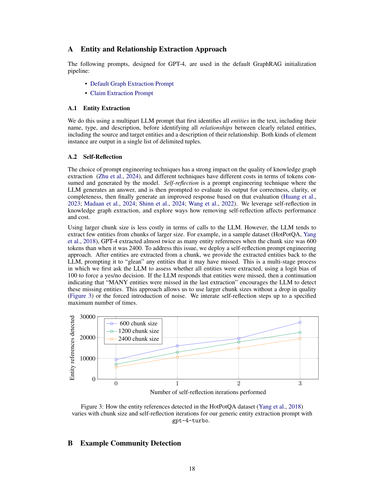
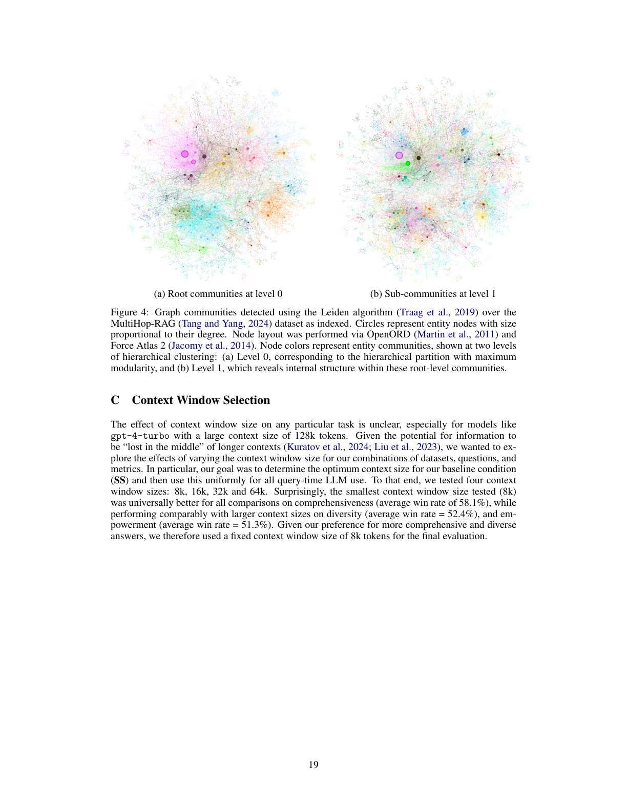

> [[../index|Wiki]] | [[../summary|Summary]] | [[../digest|Digest]]

# Appendix: Prompts and Additional Experiments

**In one sentence:** These appendices supply the implementation details — exact prompt templates for graph construction and global search, the four evaluation criteria and their wording, and the full statistical methodology — plus supplementary experiments (chunk-size/self-reflection trade-offs, a community-detection example, context-window sizing, and a worked assessment example) that back up the main paper's claims.

## Key points

- **Chunk size vs. recall (Figure 3):** With a generic entity-extraction prompt and gpt-4-turbo on HotPotQA, smaller chunks (600 tokens) initially detect more entity references than larger ones (2400 tokens), but self-reflection iterations close the gap — by iteration 3, all chunk sizes converge to ≈20k–28k detected references, with 600 tokens still slightly ahead. A few reflection passes compensate for the recall deficit of large (cheaper) chunks.
- **Hierarchical communities (Figure 4):** Leiden clustering (Traag et al., 2019) over the MultiHop-RAG entity graph yields a clean two-level hierarchy — level 0 gives the maximum-modularity root communities, level 1 splits them into sub-communities revealing internal structure. Node size encodes degree (hub-and-spoke organization).
- **Context window (Appendix C):** The authors tested 8k, 16k, 32k, and 64k-token context windows for query-time LLM use and found the **smallest (8k) universally best for comprehensiveness** (average win rate **58.1%**), while performing comparably on diversity (52.4%) and empowerment (51.3%) — likely due to "lost in the middle" effects in long contexts. They fixed 8k tokens for the final evaluation.
- **Grounding discipline in prompts:** Generation prompts enforce strict grounding — data references in `[Data: Reports (1, 3, ...)]` format, max 5 record ids per reference with "+more" appended, and an explicit "do not include information where the supporting evidence is not provided."
- **Helpfulness scoring (Appendix E.4):** The global answer generation prompt requires the model to prepend an integer 0–100 self-assessed helpfulness score in `<ANSWER HELPFULNESS>...</ANSWER HELPFULNESS>` tags before the answer.
- **Evaluation rubric (Appendix F):** Pairwise assessments judge answers on four criteria — comprehensiveness, diversity, directness, empowerment — each with a detailed textual definition and example, returning a JSON `{"winner": 1|2|0, "reasoning": "..."}`.
- **Statistics (Appendix G):** Win/lose scoring (winner=100, loser=0, tie=50 per question and metric), averaged over five evaluation runs; Shapiro-Wilk rejected normality, so **Wilcoxon signed-rank tests with Holm-Bonferroni correction** were used for pairwise significance (125 questions × 2 datasets × 4 metrics).
- **Condition naming in the stats:** C0–C3 are the graph-RAG (local-to-global) conditions, TS = text summarization, SS = semantic search baselines; SS dominated on comprehensiveness and diversity in several comparisons but lost ground on directness.

---

## Appendix A: Entity and Claim Extraction — Chunk Size Trade-offs

This appendix quantifies the recall–precision trade-off between text chunk size and self-reflection during entity extraction. The paper's entity/claim extraction prompt (used with gpt-4-turbo) was run over the HotPotQA dataset at three chunk sizes — 600, 1200, and 2400 tokens — while varying the number of self-reflection iterations (0 to 3):

At zero iterations, smaller chunks win: the 600-token line starts highest (~10k detected references), followed by 1200 (~7–8k) and 2400 (~6k) — reflecting the LLM's tendency to extract fewer entities from larger chunks. As iterations increase, all three lines rise monotonically and the gap narrows, with the 2400-token line climbing steeply to partially catch up. By iteration 3 the lines have largely converged (≈20k–28k references), with 600 tokens still slightly ahead. The takeaway: self-reflection is an effective remedy for the entity-extraction deficit of large chunks, letting practitioners trade more reflection iterations for larger (cheaper, fewer-call) chunks without losing much extraction completeness.

## Appendix B: Example Community Detection

The paper demonstrates the hierarchical Leiden community detection (Traag et al., 2019) on the MultiHop-RAG dataset as indexed:

Level 0 (a) shows the root communities — the hierarchical partition with maximum modularity — as a handful of broad, spatially coherent color regions, each anchored by a hub node and surrounded by a dense cloud of low-degree nodes. Level 1 (b) refines those regions into finer sub-communities, splitting each root block into multiple smaller colored patches and exposing internal structure. Node size is proportional to node degree, and colors encode community membership; layout was done via OpenORD + Force Atlas 2. The graph is thus a well-organized hub-and-spoke hierarchy of dominant topical communities with internally coherent sub-communities — the modular structure that downstream community-based retrieval/indexing exploits.

## Appendix C: Context Window Selection

The authors note the effect of context window size on a given task is unclear for large-context models like gpt-4-turbo (128k tokens), especially given the known "lost in the middle" phenomenon (Kuratov et al., 2024; Liu et al., 2023). To determine the optimal context size for their baseline (SS) and then apply it uniformly across all query-time LLM use, they tested four window sizes: **8k, 16k, 32k, and 64k tokens**. Surprisingly, the smallest (8k) was universally best for comprehensiveness (average win rate **58.1%**), while performing comparably to larger windows on diversity (**52.4%**) and empowerment (**51.3%**). Given their stated preference for more comprehensive and diverse answers, they fixed a context window size of **8k tokens** for the final evaluation.

## Appendix D: LLM Assessment Example

Table 5 walks through one worked example on the News article dataset: the question *"Which public figures are repeatedly mentioned across various entertainment articles?"*, with the Graph RAG and Naïve RAG answers side by side and the LLM's per-criterion decisions:

- **Comprehensiveness — Winner: Graph RAG.** It lists a broader range of figures across film, television, music, sports, gaming, and digital media, with contributions and controversies, whereas the Naïve RAG answer names only four people (Taylor Swift, Travis Kelce, Britney Spears, Justin Timberlake) and focuses on personal lives.
- **Diversity — Winner: Graph RAG.** Wider sector coverage and per-figure data-source citations, versus a smaller group of figures relying heavily on a single source.
- **Empowerment — Winner: Graph RAG.** Structured overview with specific examples and references enabling informed judgments, versus a narrower answer.
- **Directness — Winner: Naïve RAG.** It directly lists the named figures with concise explanations, while the Graph RAG answer is more comprehensive but less concise and specific to the question.

This illustrates a key nuance of the evaluation: Graph RAG wins on breadth-style criteria (comprehensiveness, diversity, empowerment) even though a simpler answer can win on directness — which matters because the overall headline results weight comprehensiveness most heavily.

## Appendices E–G: Generation Prompts, Evaluation Prompts, Statistical Analysis

### Appendix E — System Prompts (Graph RAG pipeline)

Four prompts implement the pipeline, each with a shared structure (Goal / Steps / Output format placeholders / few-shot examples):

**E.1 Element Instance Generation** (entity/relationship extraction). Given a text chunk and a list of entity types, the prompt instructs the LLM to (1) extract all entities of the listed types as tuples `("entity" <name> <type> <description>)` with the name capitalized and a comprehensive description; (2) extract all *clearly related* (source, target) entity pairs as `("relationship" <source> <target> <description> <strength>)` with a numeric relationship-strength score; (3) emit everything as a list delimited by a record delimiter, finishing with a completion delimiter. A worked example (Fed / Jerome Powell / FOMC news snippet) shows capitalized entity names, tuple delimiters, and a relationship strength of 9.

**E.2 Community Summary Generation** (local search report writing). Framed as "AI assistant helping a human analyst perform information discovery," it asks for a JSON report over a community's entities, relationships, and claims with fields `title` (short, includes named entities), `summary` (executive summary), `rating` (float 0–10 impact-severity), `rating explanation`, and `findings` (5–10 insights, each with summary + explanation). Grounding rules require data references in the form `[Data: <dataset> (record ids); ...]`, max **5 record ids** per reference with `+more` appended, and forbidding unsupported claims. The embedded example (Verdant Oasis Plaza / Unity March / Harmony Assembly community, rated 5.0) shows the expected JSON shape and `[Data: Entities (5), Relationships (37, 38, 39, 40, 41, +more)]` style citations.

**E.3 Community Answer Generation** (local-to-global merge). Given the analysts' community reports — explicitly **ranked in descending order of helpfulness** — it generates the final answer at the target length/format, stripping irrelevant content, merging to a comprehensive markdown response, preserving modal verbs and all data references, and *not* mentioning the multi-analyst process. Same grounding rules as E.2 (max 5 ids per reference, `+more`, no unsupported info).

**E.4 Global Answer Generation** (SS/TS baselines and global synthesis). Summarizes the relevant input data tables (in SS/TS conditions "Sources" replaces "Reports" in the reference format) to answer the question, with the same anti-hallucination and reference rules, and additionally requires an **integer 0–100 helpfulness score** at the start of the response, in `<ANSWER HELPFULNESS>score</ANSWER HELPFULNESS>` tags.

### Appendix F — Evaluation Prompts

**F.1 Relative Assessment Prompt.** A pairwise grader: given a question, Answer 1, and Answer 2, and a criteria string, return a JSON object `{"winner": <1, 2, or 0>, "reasoning": "Answer 1 is better because ...".` — 0 when the answers are fundamentally similar and differences are immaterial.

**F.2 Relative Assessment Metrics.** The four criteria, with their full wording:

- **Comprehensiveness** — "How much detail does the answer provide to cover all the aspects and details of the question?" Thorough and complete without redundancy; e.g., for a nuclear-energy question it must cover both benefits and drawbacks (efficiency, environmental impact, safety, cost).
- **Diversity** — "How varied and rich is the answer in providing different perspectives and insights?" Multi-faceted, different viewpoints, angles, and supporting sources/evidence; penalizes single-source or one-perspective answers.
- **Directness** — "How specifically and clearly does the answer address the question?" Clear and concise; penalizes irrelevant or unnecessary information (e.g., "The capital of France is located on the river Seine" is indirect).
- **Empowerment** — "How well does the answer help the reader understand and make informed judgements about the topic without being misled or making fallacious assumptions?" Judges explanation quality, reasoning, and provision of sources behind claims.

### Appendix G — Statistical Analysis

Table 6 reports pairwise comparisons of the six conditions (C0–C3 graph-RAG variants, TS text summarization, SS semantic search) on the four metrics across **125 questions and two datasets** (Podcast Transcripts, News Articles). Scoring: for each question and metric, the **winner gets 100, the loser 0, a tie gives 50/50**, and scores are averaged over **five evaluation runs** per condition. Because Shapiro-Wilk tests rejected normality, the authors used **non-parametric Wilcoxon signed-rank tests** for pairwise differences, with **Holm-Bonferroni correction** for multiple comparisons; corrected p-values < 0.05 are bolded as significant.

Representative results: on **comprehensiveness**, TS beats SS decisively (83.12 vs 16.88, p<0.001), and C0–C3 beat SS by an even larger margin (e.g., Podcast: C0 vs SS 71.92 vs 28.08, p<0.001, rising to C3 vs SS 78.96 vs 21.04, p<0.001), while C2/C3 also edge out TS on both datasets (e.g., News: C2 vs TS 62.08 vs 37.92, Z=−5.07, p<0.001). On **diversity**, the graph/global conditions dominate SS in nearly every comparison (e.g., Podcast: C0 vs SS 76.56 vs 23.44, p<0.001; News: C2 vs SS 70.56 vs 29.44, p<0.001; TS vs SS 82.08 vs 17.92, p<0.001). On **empowerment**, TS is the strongest condition overall (e.g., Podcast: C2 vs SS 50.72 vs 49.28, n.s., but TS vs SS 57.52 vs 42.48, p<0.001). On **directness** the pattern reverses — SS leads most pairings (e.g., Podcast: C0 vs SS 35.12 vs 64.88, p<0.001) though C0–C3 differences among themselves are mostly non-significant. Notably, on News C0 vs C2 diversity is significant (40.96 vs 59.04, p=0.012) but C0 vs C1 differs only at p=0.003; Podcast C1 vs C2 diversity also reaches significance (44.08 vs 55.92, p=0.011).

---

**Covers:** Appendices A, B, C, D, E, F, G (as present in this chunk), Figures 3 and 4.
