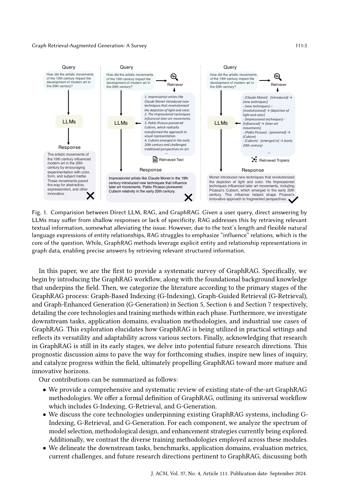

> [[../index|Wiki]] | [[../summary|Summary]] | [[../digest|Digest]]

# Introduction, Motivation & Related Surveys

**In one sentence:** This introduction and related-work chunk establishes that retrieval-augmented generation (RAG) fixes LLM hallucination and knowledge gaps by grounding answers in external text, but it ignores relational/structural structure among entities (neglects relationships, stuffs redundant text that triggers "lost in the middle", and lacks global context for summarization), so the paper proposes GraphRAG—retrieving nodes/triples/paths/subgraphs from a pre-constructed graph instead of raw text—and positions itself as the first systematic, three-stage (G-Indexing, G-Retrieval, G-Generation) survey of the area.

## Key points

- **RAG fixes LLM knowledge gaps via retrieval, not retraining:** LLMs like GPT-4 [127], Qwen2 [184], LLaMA [31] still lack domain-specific, real-time, and proprietary knowledge outside their pre-training corpus, causing "hallucination" [61]; RAG [34, 45, 59, 62, 178, 195, 202] addresses this by dynamically querying a large text corpus to inject relevant factual knowledge into generated responses, improving contextual depth, factual accuracy, and specificity.
- **RAG has three concrete real-world limitations that GraphRAG targets:** (1) *Neglecting Relationships*—it cannot capture structured relational knowledge that semantic similarity alone can't represent (e.g., in a citation network it finds relevant papers but overlooks the citation edges between them); (2) *Redundant Information*—concatenating text snippets as prompts makes context excessively long, causing the "lost in the middle" dilemma [104]; (3) *Lacking Global Information*—it retrieves only a subset of documents, so it fails at Query-Focused Summarization (QFS).
- **GraphRAG retrieves structured graph elements rather than text:** unlike traditional RAG, it retrieves nodes, triples, paths, or subgraphs from a pre-constructed graph database (as depicted in Figure 1) and uses them to generate responses, capturing interconnections between texts while graph abstraction/summarization shortens input length; retrieving subgraphs or graph communities gives global context that solves the QFS problem.
- **Figure 1 contrasts the three pipelines empirically:** for the query about 19th-century artistic movements impacting 20th-century modern art, direct LLM gives a shallow summary (✗), RAG grounds the answer in retrieved text but under-emphasizes the "influence" relations that are the core of the question (✗), and GraphRAG retrieves explicit subject–predicate–object triplets (e.g., Monet→introduced→new techniques; Impressionist techniques→influenced→later art movements; Picasso→pioneered→Cubism) for a relation-faithful answer (✓).
- **The survey formalizes a universal three-stage GraphRAG workflow:** Graph-Based Indexing (G-Indexing, Section 5), Graph-Guided Retrieval (G-Retrieval, Section 6), and Graph-Enhanced Generation (G-Generation, Section 7), with each stage detailing core technologies and training methods.
- **Contributions include a formal definition, a taxonomy of methods/training, and an industry inventory:** the paper offers the first systematic definition of GraphRAG, analyzes the model-selection/methodology/enhancement spectrum plus distinct training methodologies for each stage, and compiles a catalog of existing industry GraphRAG systems.
- **Section 2 differentiates GraphRAG from three adjacent areas:** it is a branch of RAG (but emphasizes structured graph data rather than purely textual integration, unlike prior RAG surveys); it differs from "LLMs on Graphs" research (which fuses LLMs with GNNs for graph tasks like node classification/edge prediction, e.g., ENGINE [204]) because GraphRAG retrieves graph elements for QA from an external graph DB; and IR-based KBQA is a subset of GraphRAG's downstream applications, which this survey extends beyond.
- **Publication metadata:** the survey is J. ACM, Vol. 37, No. 4, Article 111 (September 2024), 41 pages, by Boci Peng, Yun Zhu, Yongchao Liu, Xiaohe Bo, Haizhou Shi, Chuntao Hong, Yan Zhang, Siliang Tang, with code at https://github.com/pengboci/GraphRAG-Survey.

---

## Abstract

The paper "Graph Retrieval-Augmented Generation: A Survey" (J. ACM, Vol. 37, No. 4, Article 111, September 2024, 41 pages) is authored by Boci Peng, Yun Zhu, Yongchao Liu, Xiaohe Bo, Haizhou Shi, Chuntao Hong, Yan Zhang, and Siliang Tang.

Retrieval-Augmented Generation (RAG) has recently achieved notable success in mitigating challenges of Large Language Models (LLMs) without retraining. By referencing an external knowledge base, RAG refines LLM outputs, effectively reducing "hallucination", lack of domain-specific knowledge, and outdated information. However, the complex structure of relationships among different entities in databases remains a challenge for RAG systems. To address this, GraphRAG leverages structural information across entities for more precise and comprehensive retrieval, capturing relational knowledge and enabling more accurate, context-aware responses.

Given the novelty and potential of GraphRAG, the authors argue that a systematic review of current technologies is imperative. They state this is the **first comprehensive overview of GraphRAG methodologies**, and they formalize a GraphRAG workflow of three stages: **Graph-Based Indexing, Graph-Guided Retrieval, and Graph-Enhanced Generation**. For each stage they outline core technologies and training methods, and they further examine downstream tasks, application domains, evaluation methodologies, and industrial use cases. Finally they explore future research directions.

- **CCS Concepts:** Computing methodologies → Knowledge representation and reasoning; Information systems → Information retrieval; Data mining.
- **Keywords:** Large Language Models, Graph Retrieval-Augmented Generation, Knowledge Graphs, Graph Neural Networks.
- **Author affiliations:** Peking University (Peng), Zhejiang University (Zhu), Ant Group (Liu, Hong), Renmin University of China (Bo), Rutgers University (Shi), and corresponding authors Yan Zhang (Peking University) and Siliang Tang (Zhejiang University).
- **Repository:** https://github.com/pengboci/GraphRAG-Survey (tracked to follow recent progress).
- **References/copyright:** © 2024, ACM (ACM 1557-735X/2024/9-ART111); both Peng and Zhu contributed equally.

## 1 Introduction

### LLMs and the motivation for external knowledge

The development of Large Language Models like **GPT-4 [127], Qwen2 [184], and LLaMA [31]** has sparked a revolution in AI and fundamentally altered natural-language processing. Built on Transformer [161] architectures and trained on diverse, extensive datasets, these models demonstrate unprecedented ability to understand, interpret, and generate human language, with impact across healthcare [103, 166, 203], finance [93, 125], and education [46, 169].

Despite this, LLMs exhibit limitations due to a lack of domain-specific knowledge, real-time updated information, and proprietary knowledge outside their pre-training corpus. These gaps produce "hallucination" [61], where the model generates inaccurate or fabricated information. Consequently, supplementing LLMs with external knowledge is imperative.

Retrieval-Augmented Generation (RAG) [34, 45, 59, 62, 178, 195, 202] emerged as a significant evolution, enhancing the quality and relevance of generated content by integrating a retrieval component within the generation process. Its essence is the ability to dynamically query a large text corpus and incorporate relevant factual knowledge into the responses of the underlying model. This integration enriches contextual depth and ensures a higher degree of factual accuracy and specificity, which is why RAG has become a key focus in the field.

### Three real-world limitations of RAG

Although RAG has achieved impressive results across domains, the authors identify three limitations in real-world scenarios:

- **(1) Neglecting Relationships:** In practice, textual content is interconnected, not isolated. Traditional RAG fails to capture significant structured relational knowledge that cannot be represented through semantic similarity alone. In a citation network where papers are linked by citation relationships, traditional RAG finds relevant papers for a query but overlooks the important citation relationships between those papers.
- **(2) Redundant Information:** RAG often recounts content as textual snippets when concatenated as prompts. This makes the context excessively lengthy, leading to the **"lost in the middle" dilemma [104]**.
- **(3) Lacking Global Information:** RAG can retrieve only a subset of documents and cannot grasp global information comprehensively, so it struggles with tasks such as **Query-Focused Summarization (QFS)**.

### GraphRAG as the solution

Graph Retrieval-Augmented Generation (GraphRAG) [32, 58, 119] emerges as an innovative solution to these challenges. Unlike traditional RAG, GraphRAG retrieves **graph elements containing relational knowledge** pertinent to a query from a **pre-constructed graph database**, as depicted in Figure 1. These elements may include **nodes, triples, paths, or subgraphs**, which are used to generate responses. GraphRAG considers the interconnections between texts, enabling more accurate and comprehensive retrieval of relational information. Graph data such as knowledge graphs offer abstraction and summarization of textual data, significantly shortening input length and mitigating verbosity. By retrieving subgraphs or graph communities, GraphRAG can access comprehensive information to effectively address the QFS challenge by capturing broader context and interconnections within the graph structure.

**Figure 1** side-by-side compares three answer-generation pipelines for the same user query ("How did the artistic movements of the 19th century impact the development of modern art in the 20th century?"). Direct LLM answering yields a shallow, generic response (✗). RAG grounds the answer in retrieved relevant textual information and somewhat alleviates the issue, but because of the text's length and the flexible natural-language expression of entity relationships, it struggles to emphasize the "influence" relations that are the core of the question (✗). GraphRAG, by contrast, leverages the explicit entity and relationship representations in graph data, retrieving relevant structured information (e.g., explicit subject–predicate–object triples) to produce a precise, relation-faithful answer (✓).

**Figure 2** gives the overview of the GraphRAG framework for a question-answering task. The survey divides GraphRAG into three stages—**G-Indexing, G-Retrieval, and G-Generation**—and categorizes retrieval sources into **open-source knowledge graphs** and **self-constructed graph data**. Various enhancing techniques such as **query enhancement** and **knowledge enhancement** may be adopted to boost result relevance. Unlike RAG, which uses retrieved text directly for generation, GraphRAG requires converting the retrieved graph information into patterns acceptable to generators to enhance task performance.

### Scope and organization of the paper

The paper is described as the **first systematic survey of GraphRAG**. Specifically, it first introduces the GraphRAG workflow and the foundational background knowledge that underpins the field. It then categorizes the literature according to the primary stages of the GraphRAG process:

- **Section 5 — Graph-Based Indexing (G-Indexing)**
- **Section 6 — Graph-Guided Retrieval (G-Retrieval)**
- **Section 7 — Graph-Enhanced Generation (G-Generation)**

For each phase it details the core technologies and training methods. It further investigates downstream tasks, application domains, evaluation methodologies, and industrial use cases, and it closes with a discussion of future research directions to inspire forthcoming studies.

**Contributions, summarized by the authors:**

1. A comprehensive, systematic review of state-of-the-art GraphRAG methodologies, including a **formal definition of GraphRAG** outlining its universal workflow (G-Indexing, G-Retrieval, G-Generation).
2. A discussion of the core technologies underpinning existing GraphRAG systems; for each component an analysis of the **spectrum of model selection, methodological design, and enhancement strategies**, plus a contrast of the diverse **training methodologies** across modules.
3. A delineation of downstream tasks, benchmarks, application domains, evaluation metrics, current challenges, and future research directions, plus an **inventory of existing industry GraphRAG systems** reflecting how academic research translates into real-world industry solutions.

**Organization of the rest of the survey:** Section 2 compares related techniques; Section 3 outlines the general GraphRAG process; Sections 5–7 categorize the techniques of the three stages (G-Indexing, G-Retrieval, G-Generation); Section 8 introduces training strategies of retrievers and generators; Section 9 summarizes downstream tasks, benchmarks, application domains, evaluation metrics, and industrial GraphRAG systems; Section 10 provides an outlook on future directions; and Section 11 concludes the survey.

## 2 Comparison with Related Techniques and Surveys

This section compares GraphRAG with related techniques and corresponding surveys: **RAG, LLMs on graphs, and Knowledge Base Question Answering (KBQA).**

### 2.1 RAG

RAG combines external knowledge with LLMs for improved task performance, integrating domain-specific information to ensure factuality and credibility. Over the past two years researchers have written many comprehensive RAG surveys [34, 45, 59, 62, 178, 195, 202]. For example:

| Survey | Categorization / focus |
|---|---|
| Fan et al. [34] | Categorizes RAG by retrieval, generation, and augmentation |
| Gao et al. [45] | Categorizes RAG by retrieval, generation, and augmentation |
| Zhao et al. [202] | Reviews RAG methods for databases with different modalities |
| Yu et al. [195] | Systematically summarizes the evaluation of RAG methods |

From a broad perspective, **GraphRAG can be seen as a branch of RAG** that retrieves relevant relational knowledge from graph databases instead of a text corpus. However, compared to text-based RAG, GraphRAG takes into account the relationships between texts and incorporates structural information as additional knowledge beyond text. Moreover, during the construction of graph data, raw text may undergo filtering and summarization processes, enhancing the refinement of information within the graph data. Although prior RAG surveys have touched on GraphRAG, they predominantly center on textual data integration. This paper diverges by placing primary emphasis on the **indexing, retrieval, and utilization of structured graph data**, which is a substantial departure from handling purely textual information and spurs the emergence of many new techniques.

### 2.2 LLMs on Graphs

LLMs are revolutionizing NLP due to their excellent text understanding, reasoning, and generation capabilities, along with their generalization and zero-shot transfer abilities. Although LLMs are primarily designed for pure text and struggle with non-Euclidean data containing complex structural information such as graphs [49, 165], numerous studies [17, 35, 74, 92, 102, 116, 130, 131, 173, 204] have been conducted in this area. These papers primarily **integrate LLMs with GNNs** to enhance modeling capabilities for graph data, improving downstream tasks such as **node classification, edge prediction, and graph classification**. For example, **Zhu et al. [204] propose an efficient fine-tuning method named ENGINE**, which combines LLMs and GNNs through a side structure to enhance graph representation.

This differs from those methods: **GraphRAG focuses on retrieving relevant graph elements using queries from an external graph-structured database.** The paper provides a detailed introduction to the relevant technologies and applications of GraphRAG that are not covered in previous surveys of LLMs on graphs.

### 2.3 KBQA

KBQA is a significant NLP task that responds to user queries based on external knowledge bases [41, 85, 86, 188], achieving goals such as fact verification, passage retrieval enhancement, and text understanding. Previous surveys typically categorize KBQA approaches into two main types:

- **Information Retrieval (IR)-based methods** [69, 70, 112, 113, 154, 167, 182, 196] — retrieve information related to the query from the knowledge graph (KG) and use it to enhance the generation process.
- **Semantic Parsing (SP)-based methods** [16, 19, 36, 48, 153, 191] — generate a logical form (LF) for each query and execute it against knowledge bases to obtain the answer.

GraphRAG and KBQA are closely related, with **IR-based KBQA methods representing a subset of GraphRAG approaches focused on downstream applications.** This work extends the discussion beyond KBQA to include GraphRAG's applications across various downstream tasks, offering a thorough and detailed exploration of GraphRAG technology and potential improvements.

**Covers:** Abstract; Sec 1 Introduction; Sec 2 Comparison with Related Techniques and Surveys
