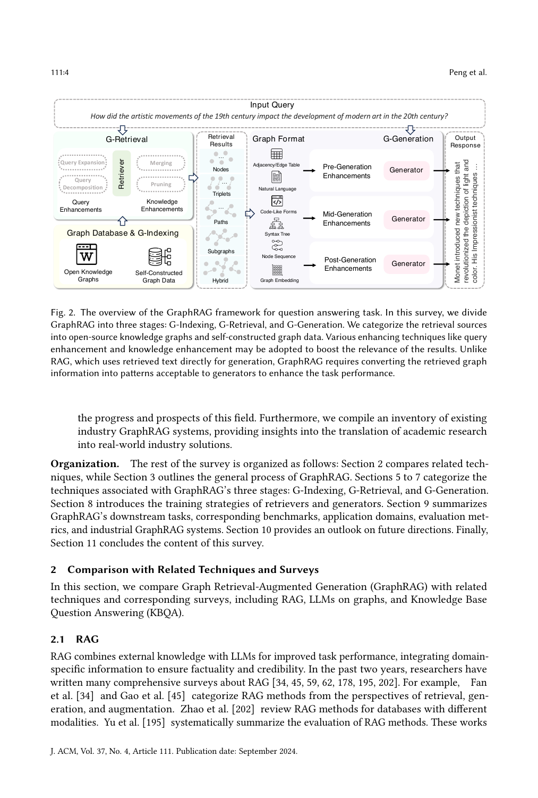

> [[../index|Wiki]] | [[../summary|Summary]] | [[../digest|Digest]]

# Preliminaries & the GraphRAG Framework

**In one sentence:** This section establishes the shared vocabulary and formal foundations of the survey — Text-Attributed Graphs, Graph Neural Networks, and Language Models — and then gives the formal definition of GraphRAG itself, decomposing it into three stages: Graph-Based Indexing, Graph-Guided Retrieval, and Graph-Enhanced Generation.

## Key points

- Graph data in GraphRAG is represented uniformly as **Text-Attributed Graphs (TAGs)**: G = (V, E, A, {x_v}, {e_ij}), where A ∈ {0,1}^{|V|×|V|} is the adjacency matrix and nodes/edges carry **textual** attributes; Knowledge Graphs (KGs) are the canonical special case where nodes are entities, edges are relations, and text attributes are entity/relation names.
- Classical GNNs (GCN [83], GAT [162], GraphSAGE [52]) obtain node representations via **message passing**: h_i^(l) = UPD(h_i^(l-1), AGG_{j∈N(i)} MSG(h_i^(l-1), h_j^(l-1), e_ij)), with AGG being permutation-invariant (mean/sum/max), followed by a **readout** function (e.g., mean/sum/max pooling) for global-level representations (Eq. 1–2); GNNs serve in GraphRAG to obtain representations for retrieval and to model retrieved graph structure.
- Language models split into **discriminative** (BERT [28], RoBERTa [107], SentenceBERT [140] — modeling P(y|x), strong at classification/sentiment) and **generative** (GPT-3 [14], GPT-4 [127] — modeling P(x,y) for translation/generation); the rise of LLMs (ChatGPT [128], LLaMA [31], Qwen2 [184]) shifted RAG/GraphRAG research from improving pre-training of discriminative LMs to enhancing information retrieval, tackling complex tasks, and mitigating hallucinations.
- GraphRAG is formally defined as a* = argmax_{a∈A} p(a | q, G) (Eq. 3): the optimal answer to query q given TAG G over candidate responses A.
- The target distribution p(a | q, G) is jointly modeled with a **graph retriever** p_θ(G | q, G) and an **answer generator** p_φ(a | q, G̃), and decomposed via the total probability formula (Eq. 4): p(a|q,G) = Σ_{G⊆G} p_φ(a|q,G)p_θ(G|q,G), approximated by keeping only the **optimal subgraph** G* — necessary because candidate subgraphs grow **exponentially** with graph size.
- **G-Retrieval** is formulated as G* = argmax_{G⊆R(G)} p_θ(G | q, G) = argmax Sim(q, G), where Sim(·,−) measures semantic similarity between the natural-language query and graph data and R(·) is an efficiency-driven function that narrows the subgraph search space; it targets entities, triplets, paths, and subgraphs.
- **G-Generation** is a* = argmax_{a∈A} p_φ(a | F(q, G*)), where **F(·,−)** converts retrieved graph data into a form the generator can process; the generator takes the query, retrieved graph elements, and an optional prompt to answer queries or generate reports.
- **G-Indexing** identifies or constructs the graph database G from public knowledge graphs [4, 10, 100, 142, 150, 163], graph data [123], or proprietary textual [32, 51, 89, 172] / other data [183]; the indexing process (mapping node/edge properties, establishing inter-node pointers, organizing data for fast traversal) **determines the granularity of retrieval** and thus query efficiency.

---

## 3.1 Text-Attributed Graphs (TAGs)

Graph data used in Graph RAG can be represented uniformly as **Text-Attributed Graphs (TAGs)**, where both nodes and edges possess textual attributes. Formally, a TAG is denoted as:

> G = (V, E, A, {x_v}_{v∈V}, {e_ij}_{i,j∈E})

where:
- **V** is the set of nodes,
- **E ⊆ V × V** is the set of edges,
- **A ∈ {0,1}^{|V|×|V|}** is the adjacency matrix,
- **{x_v}** and **{e_ij}** are the textual attributes of nodes and edges, respectively.

One typical kind of TAG is the **Knowledge Graph (KG)**, where nodes are entities, edges are relations among entities, and the text attributes are the names of entities and relations.

## 3.2 Graph Neural Networks (GNNs)

GNNs are a deep learning framework for modeling graph data. **Classical GNNs — GCN [83], GAT [162], GraphSAGE [52]** — adopt a message-passing manner to obtain node representations. Each node representation h_i^(l) in the l-th layer is updated by aggregating information from neighboring nodes and edges (Eq. 1):

> h_i^(l) = UPD( h_i^(l−1), AGG_{j∈N(i)} MSG( h_i^(l−1), h_j^(l−1), e_ij^(l−1) ) )

where:
- **N(i)** is the neighbor set of node i,
- **MSG** is the message function, computing a message from the node, its neighbor, and the edge between them,
- **AGG** is the aggregation function, combining received messages with a **permutation-invariant** operation (mean, sum, or max),
- **UPD** is the update function, updating each node's attributes with the aggregated messages.

Subsequently, a **readout function** (e.g., mean, sum, or max pooling) obtains the global-level representation (Eq. 2):

> h_G = READOUT_{i∈V_G}( h_i^(L) )

In GraphRAG, GNNs are used (a) to obtain representations of graph data for the **retrieval phase**, and (b) to **model the retrieved graph structures**.

## 3.3 Language Models (LMs)

Language models excel in language understanding and split into two types:

| Family | Models | Objective | Typical tasks |
|---|---|---|---|
| **Discriminative** | BERT [28], RoBERTa [107], SentenceBERT [140] | Estimate conditional probability **P(y \| x)** | Text classification, sentiment analysis |
| **Generative** | GPT-3 [14], GPT-4 [127] | Model joint probability **P(x, y)** | Machine translation, text generation |

Generative pre-trained models have significantly advanced NLP by leveraging massive datasets and billions of parameters, contributing to the rise of **Large Language Models (LLMs)** with outstanding performance across tasks.

This history shaped GraphRAG's research trajectory in two phases:
1. **Early stage** — RAG and GraphRAG focused on improving pre-training techniques for **discriminative** language models [28, 107, 140].
2. **Recently** — LLMs such as **ChatGPT [128], LLaMA [31], and Qwen2 [184]** showed strong language understanding with powerful **in-context learning** capabilities; research then shifted to **enhancing information retrieval** for LMs, addressing increasingly complex tasks and **mitigating hallucinations**, driving rapid advancement of the field.

## 4. Overview of GraphRAG

GraphRAG is a framework that leverages external structured knowledge graphs to improve the contextual understanding of LMs and generate more informed responses. Its goal is to retrieve the most relevant knowledge from databases, thereby enhancing the answers of downstream tasks.

*Figure 2 — Technical summary of the GraphRAG framework: three stages — G-Indexing, G-Retrieval, and G-Generation. G-Retrieval applies query enhancements (expansion, decomposition) and knowledge enhancements (merging, pruning) around a central retriever using indexed open-source KGs and self-constructed graph data, returning nodes, triplets, paths, subgraphs, or hybrid results rendered in adjacency/edge, natural-language, or code-like formats; G-Generation pairs pre-/mid-/post-generation enhancement slots with the generator to produce a natural-language response.*

### Formal definition (Eqs. 3–4)

The process is defined as (Eq. 3), where a* is the optimal answer to query q given TAG G, and A is the set of possible responses:

> a* = argmax_{a∈A} p(a | q, G)

The target distribution p(a | q, G) is then **jointly modeled** with a **graph retriever** p_θ(G | q, G) and an **answer generator** p_φ(a | q, G) (θ, φ are learnable parameters), and decomposed via the **total probability formula** (Eq. 4):

> p(a | q, G) = Σ_{G⊆G} p_φ(a | q, G) · p_θ(G | q, G)
> ≈ p_φ(a | q, G*) · p_θ(G* | q, G)

where **G*** is the optimal subgraph. Because the number of candidate subgraphs can grow **exponentially** with graph size, efficient approximation is necessary — the first line is thus approximated by keeping only G*. Concretely, a graph retriever extracts the optimal subgraph G*, after which the generator produces the answer based on the retrieved subgraph.

This yields the survey's **three-stage decomposition**: **Graph-Based Indexing (G-Indexing)**, **Graph-Guided Retrieval (G-Retrieval)**, and **Graph-Enhanced Generation (G-Generation)**.

### Graph-Based Indexing (G-Indexing)

The initial phase of GraphRAG, aimed at **identifying or constructing** a graph database G that aligns with downstream tasks, and **establishing indices** on it. Sources of the graph database:
- Public knowledge graphs [4, 10, 100, 142, 150, 163],
- Graph data [123],
- Proprietary data — textual [32, 51, 89, 172] or other forms [183].

The indexing process typically includes:
- mapping node and edge properties,
- establishing pointers between connected nodes,
- organizing data to support fast traversal and retrieval.

Indexing **determines the granularity of the subsequent retrieval stage**, playing a crucial role in enhancing query efficiency.

### Graph-Guided Retrieval (G-Retrieval)

Following indexing, this phase extracts pertinent information from the graph database in response to user queries or input. Given a natural-language query q, the aim is to extract the most relevant elements — **entities, triplets, paths, subgraphs** — from knowledge graphs, formulated as (Eq. 5):

> G* = G-Retriever(q, G)
> = argmax_{G⊆R(G)} p_θ(G | q, G)
> = argmax_{G⊆R(G)} Sim(q, G)

where:
- **G\*** is the optimal set of retrieved graph elements,
- **Sim(·,−)** measures the **semantic similarity** between user queries and graph data,
- **R(·)** is a function to **narrow the subgraph search range**, driven by efficiency considerations.

### Graph-Enhanced Generation (G-Generation)

This phase synthesizes meaningful outputs or responses (answering queries, generating reports, etc.) based on the retrieved graph data. A generator takes the **query, retrieved graph elements, and an optional prompt** as input, denoted as (Eq. 6):

> a* = G-Generator(q, G*)
> = argmax_{a∈A} p_φ(a | q, G*)
> = argmax_{a∈A} p_φ(a | F(q, G*))

where **F(·,−)** is a function that converts graph data into a form the generator can process.

**Covers:** Sec 3 (Preliminaries — Text-Attributed Graphs, Graph Neural Networks, Language Models); Sec 4 (Overview of GraphRAG)
