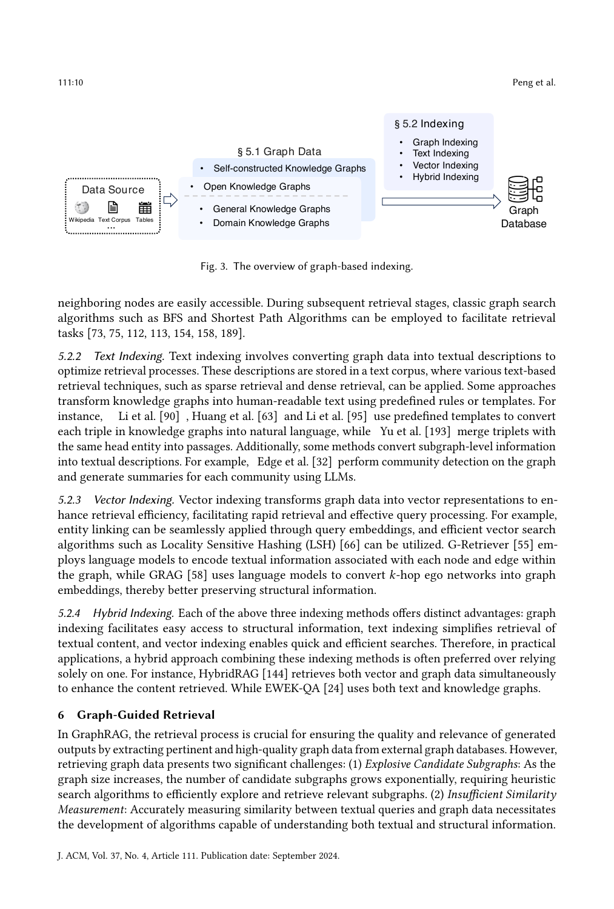

> [[../index|Wiki]] | [[../summary|Summary]] | [[../digest|Digest]]

# Graph-Based Indexing

**In one sentence:** The construction and indexing of graph databases form the foundation of GraphRAG — this section catalogs how graph data is obtained (open vs. self-constructed knowledge graphs) and the four complementary indexing schemes (graph, text, vector, hybrid) that make that data retrievable.

## Key points

- Graph-based indexing covers exactly two stages: **graph data** (what knowledge is stored) and **indexing** (how it is made retrievable); the graph database's quality directly determines GraphRAG performance, since downstream retrieval and generation both depend on it.
- Open Knowledge Graphs come from public repositories and are split into **General** (Wikidata, Freebase, DBpedia, YAGO, ConceptNet, ATOMIC) and **Domain** (CMeKG, CPubMed-KG, Wiki-Movies, GR-Bench, GraphQA) knowledge graphs — using open KGs dramatically reduces development and maintenance cost.
- Self-Constructed Graph Data exists for tasks that don't natively have graph structure: e.g., Munikoti et al. [124] build a heterogeneous document graph (co-citation, co-topic, co-venue), while Peng and Yang [133] map a patent database into a patent-phrase graph and Xu et al. [183] model service tickets as issue trees.
- **Graph indexing** is the most common scheme: it preserves the full graph structure so any node's edges and neighbors are directly accessible, letting retrieval use classic algorithms such as BFS and Shortest Path.
- **Text indexing** converts the KG into a text corpus so sparse/dense retrieval can apply: triple-level templating (Li et al. [90], Huang et al. [63], Yu et al. [193]) or subgraph-level, LLM-generated community summaries (Edge et al. [32]).
- **Vector indexing** embeds graph elements for fast approximate search: G-Retriever [55] encodes node/edge text, while GRAG [58] embeds *k*-hop ego networks; LSH [66] is cited as the efficient-search primitive.
- **Hybrid indexing** explicitly combines schemes for coverage — HybridRAG [144] retrieves vector and graph data simultaneously, EWEK-QA [24] pairs text with the knowledge graph.
- Domain-specialized graphs (biomedical CMeKG/CPubMed-KG, movie Wiki-Movies, multi-domain GR-Bench, universal GraphQA) matter because they give LLMs the deep, field-specific relational understanding that open-domain data cannot, per the framing in Section 1.

---

## 5 Graph-Based Indexing

The construction and indexing of graph databases form the foundation of GraphRAG; the quality of the graph database directly impacts performance. This section categorizes graph-data sources and the indexing methods used.

Figure 3 sketches graph-based indexing as a staged pipeline: heterogeneous raw inputs (Wikipedia, text corpora, tables) are consolidated into a knowledge-graph layer — split into self-constructed and open (general + domain) graphs — persisted in a graph database, and exposed to retrieval through four complementary indexing schemes (graph, text, vector, hybrid). It maps the paper's §5.1/§5.2 structure rather than reporting measured results.

### 5.1 Graph Data

Graph data is split into two source-based categories: **Open Knowledge Graphs** and **Self-Constructed Graph Data**.

#### 5.1.1 Open Knowledge Graphs

Graph data sourced from public repositories or databases [4, 10, 150, 163]; using open KGs dramatically reduces the time and resources needed to develop and maintain a system. Classified by scope into **General** and **Domain** knowledge graphs.

**(1) General Knowledge Graphs** — store general structured knowledge, typically maintained by collective input from a global community.

| Type | Examples | What it stores / how built |
|---|---|---|
| Encyclopedic KGs | Wikidata [1, 163], Freebase [2, 10], DBpedia [3, 4], YAGO [4, 150] | Large-scale real-world knowledge from human experts/encyclopedias. Wikidata: structured data of Wikimedia sister projects (Wikipedia, Wikivoyage, Wiktionary). Freebase: collaboratively edited, compiles individual contributions + structured sources like Wikipedia. DBpedia: millions of entities (people, places, things) from Wikipedia infoboxes and categories. YAGO: collects from Wikipedia, WordNet, GeoNames. |
| Commonsense KGs | ConceptNet [5, 100], ATOMIC [64, 142] | Abstract commonsense: semantic associations between concepts and causal relationships between events. ConceptNet: a semantic network of word/phrase nodes connected by semantically-labeled edges. ATOMIC: models causal relations between events. |

**(2) Domain Knowledge Graphs** — specialized to a field; crucial (as discussed in Section 1) for helping LLMs answer domain-specific questions by providing deeper insight into complex professional relationships.

| Domain | KG | Content / construction |
|---|---|---|
| Biomedical | CMeKG [6] | Diseases, symptoms, treatments, medications, and relations between medical concepts. |
| Biomedical (Chinese) | CPubMed-KG [7] | Medical knowledge database in Chinese built on PubMed biomedical literature. |
| Movies | Wiki-Movies [121] | Structured data on movies, actors, directors, genres, extracted from Wikipedia film articles. |
| Multi-domain | GR-Bench (Jin et al. [75]) | Five domain KGs spanning academic, e-commerce, literature, healthcare, legal fields. |
| Universal | GraphQA (He et al. [55]) | Converts triplet-format and JSON files from ExplaGraphs and SceneGraphs into a standard graph format; selects 2-hop-reasoning questions from WebQSP to form a universal evaluation dataset. |

#### 5.1.2 Self-Constructed Graph Data

Enables customization and integration of proprietary or domain-specific knowledge for downstream tasks that don't natively have graph data; graphs are built from multiple sources (documents, tables, databases) and are tightly tied to the method's design (unlike open-domain data).

- **Document structure.** Munikoti et al. [124] build a heterogeneous document graph capturing document-level relations — co-citation, co-topic, co-venue, etc. — to model structural relationships between documents. Li et al. [96] and Wang et al. [172] link passages by shared keywords.
- **Entity/relation extraction.** Delile et al. [26], Edge et al. [32], Gutiérrez et al. [51], and Li et al. [89] use NER tools to extract entities from documents and language models to extract relations, then assemble the retrieved entities and relations into the KG.
- **Task-specific mappings.** Peng and Yang [133] convert a patent database into a patent-phrase graph for patent-phrase similarity inference: patent–phrase edges exist when a phrase appears in a patent, patent–patent edges follow citation relations. Xu et al. [183] model customer-service history as a KG, transforming issues into tree representations to preserve intra-issue relations and using semantic similarities + a threshold to preserve inter-issue relations.

### 5.2 Indexing

Indexing determines efficiency and speed of graph queries and directly shapes the retrieval method and granularity. Four common schemes are identified: **graph indexing**, **text indexing**, **vector indexing**, and **hybrid indexing** (the last combining the first three).

#### 5.2.1 Graph Indexing

The most commonly used approach: it preserves the entire graph structure, so for any node all its edges and neighboring nodes are easily accessible. Retrieval can then use classic graph-search algorithms such as **BFS** and **Shortest Path** [73, 75, 112, 113, 154, 158, 189].

#### 5.2.2 Text Indexing

Converts graph data into textual descriptions to optimize retrieval; the descriptions are stored in a text corpus, to which sparse and dense retrieval techniques can be applied. Two granularities of conversion:

- **Triple-level (templated).** Predefined rules/templates turn each triple into natural language: Li et al. [90], Huang et al. [63], Li et al. [95]. Yu et al. [193] further merge triples with the same head entity into passages.
- **Subgraph-level (LLM-generated).** Edge et al. [32] run community detection on the graph and generate LLM summaries per community.

#### 5.2.3 Vector Indexing

Transforms graph data into vector representations to improve retrieval efficiency, enabling rapid search and effective query processing. Entity linking can be applied via query embeddings, and efficient vector-search algorithms such as **Locality Sensitive Hashing (LSH)** [66] can be used.

- **G-Retriever [55]** — language models encode the textual information of each node and edge in the graph.
- **GRAG [58]** — language models convert *k*-hop ego networks into graph embeddings, better preserving structural information.

#### 5.2.4 Hybrid Indexing

Each scheme has a distinct strength — graph indexing makes structural information easy to access, text indexing simplifies textual retrieval, vector indexing enables quick, efficient search. In practical systems, hybrids are preferred over single-scheme reliance:

- **HybridRAG [144]** — retrieves both vector and graph data simultaneously, improving the content retrieved.
- **EWEK-QA [24]** — uses both text and knowledge graphs.

---

**Covers:** Sec 5 Graph-Based Indexing (5.1 Graph Data: 5.1.1 Open Knowledge Graphs, 5.1.2 Self-Constructed Graph Data; 5.2 Indexing: 5.2.1 Graph, 5.2.2 Text, 5.2.3 Vector, 5.2.4 Hybrid).
