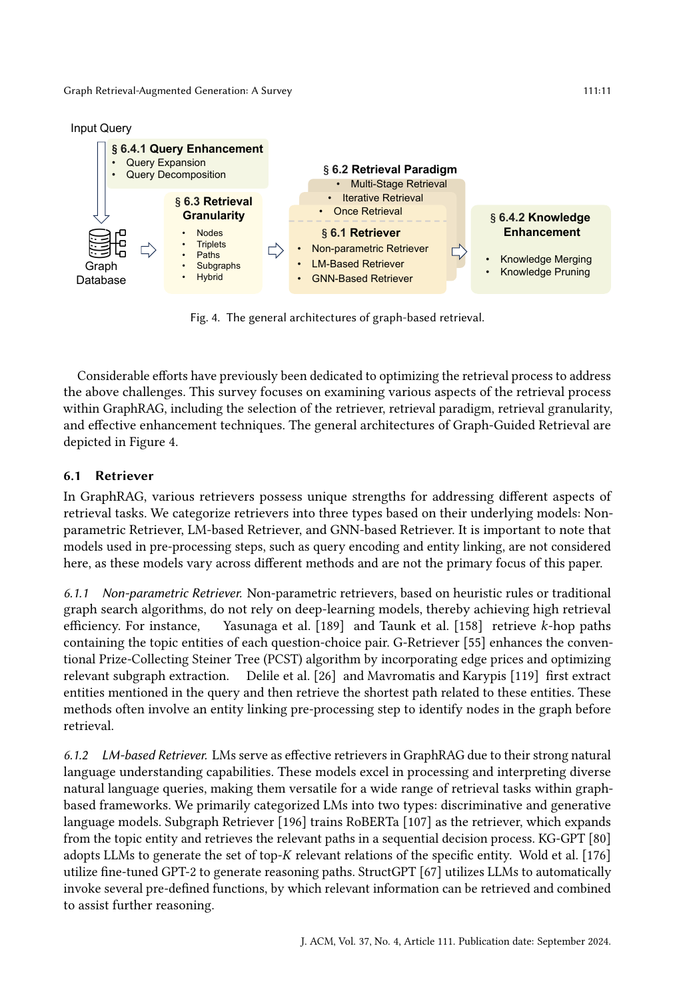

> [[../index|Wiki]] | [[../summary|Summary]] | [[../digest|Digest]]

# Graph-Guided Retrieval

**In one sentence:** Section 6 organizes GraphRAG retrieval into four design dimensions — retriever type (non-parametric, LM-based, GNN-based), retrieval paradigm (once, iterative, multi-stage), retrieval granularity (nodes, triplets, paths, subgraphs, hybrid), and enhancement (query expansion/decomposition and knowledge merging/pruning) — to address two core challenges: exponentially many candidate subgraphs and the difficulty of measuring similarity between textual queries and structural graph data.

## Key points

- Graph retrieval faces two fundamental difficulties: **Explosive Candidate Subgraphs** (candidate subgraphs grow exponentially with graph size, requiring heuristic search) and **Insufficient Similarity Measurement** (measuring similarity between textual queries and graph data requires understanding both text and structure).
- Retriever types form a trade-off triangle: non-parametric retrievers give high efficiency via heuristic rules but can be inaccurate (no downstream training); LM- and GNN-based retrievers give higher accuracy at significant computational cost — hence hybrids like RoG [112] (LLM-planned paths → KG path extraction) and GenTKGQA [44] (LLM-inferred relations/constraints → triplet extraction).
- G-Retriever [55] stands out as a non-parametric design point: it enhances the classic Prize-Collecting Steiner Tree (PCST) algorithm with edge prices for relevant subgraph extraction.
- Iterative retrieval splits into **non-adaptive** (fixed sequence, stopping by max iterations/threshold, e.g. PullNet [151] runs T iterations; KGP [172] selects seed nodes by context similarity and LLM-summarizes neighbors) and **adaptive** (the model itself decides when to stop — [50, 182] hop prediction, [196] a learned "[END]" virtual relation, or LLM agents invoking retrieval tools and stopping on demand [67, 69, 75, 155, 170]).
- Granularity is a spectrum: nodes for targeted extraction, triplets (subject-predicate-object) for structured relations but lacking indirect-reasoning depth, paths for relationship sequences but exponentially many, subgraphs for full relational context — with hybrid granularity via LLM agents (Jin et al. [75], Jiang et al. [67, 69], Wang et al. [170], Sun et al. [155]) adaptively mixing nodes, triplets, paths, and subgraphs.
- Query enhancement = query expansion (e.g., Cheng et al. [20] pulling entity aliases from Wikidata via SPARQL; Golden-Retriever [2] resolving jargon) plus query decomposition ([22, 80] splitting the question into per-relation sub-sentences); knowledge enhancement = merging (KnowledgeNavigator [50] triple aggregation; [196] merging identical entities from merged paths) plus pruning — via (re)-ranking (cross-encoder [90], FlagEmbedding "bge_reranker_large" [73], Personalized PageRank [171, 70, 51, 110], KGE confidence [97]), new metrics (impact+recency [124]), or LLM-based relevance checks [171, 80].

---

## 6. Graph-Guided Retrieval — Overview

Retrieval is the quality bottleneck of GraphRAG: it must extract pertinent, high-quality graph data from external graph databases. The two named challenges are:

1. **Explosive Candidate Subgraphs** — as the graph grows, the number of candidate subgraphs grows exponentially, forcing heuristic search algorithms to explore and retrieve relevant subgraphs efficiently.
2. **Insufficient Similarity Measurement** — accurately measuring similarity between textual queries and graph data requires algorithms that understand both textual and structural information.

The survey examines the retrieval process along four axes — retriever, retrieval paradigm, retrieval granularity, and enhancement techniques.

The figure frames graph-based retrieval as a four-stage pipeline rather than a set of isolated choices: the input query is first enhanced (§6.4.1 — expansion and decomposition), then a retrieval granularity is chosen — node, triplet, path, subgraph, or hybrid (§6.3) — and the retriever (non-parametric, LM-based, or GNN-based) is coupled with a retrieval paradigm (once, iterative, or multi-stage) (§6.1/§6.2); finally, retrieved knowledge is enhanced by merging and pruning (§6.4.2). Each dimension maps to one survey subsection, so the architecture doubles as the section-6 roadmap.

## 6.1 Retriever

Retrievers are categorized into three types by underlying model: Non-parametric, LM-based, and GNN-based. Models used only in pre-processing (query encoding, entity linking) are excluded because they vary by method and are not the survey's focus.

### 6.1.1 Non-parametric Retriever

Built on heuristic rules or traditional graph search algorithms without deep-learning models, so they achieve high retrieval efficiency:

- Yasunaga et al. [189] and Taunk et al. [158] retrieve _k_-hop paths containing the topic entities of each question-choice pair.
- **G-Retriever [55]** enhances the conventional **Prize-Collecting Steiner Tree (PCST)** algorithm by incorporating edge prices and optimizing relevant subgraph extraction.
- Delile et al. [26] and Mavromatis and Karypis [119] first extract entities mentioned in the query, then retrieve the shortest path related to those entities.

These methods typically include an entity-linking pre-processing step to identify the graph nodes before retrieval.

### 6.1.2 LM-based Retriever

LMs serve as retrievers because of strong natural-language understanding; they are split into discriminative and generative models:

- **Subgraph Retriever [196]** trains **RoBERTa [107]** as the retriever, expanding from the topic entity and retrieving relevant paths in a sequential decision process.
- **KG-GPT [80]** adopts LLMs to generate the top-_K_ relevant relations of a specific entity.
- Wold et al. [176] utilize fine-tuned **GPT-2** to generate reasoning paths.
- **StructGPT [67]** uses LLMs to automatically invoke pre-defined functions, combining retrieved information to assist further reasoning.

### 6.1.3 GNN-based Retriever

GNNs are adept at leveraging complex graph structure; GNN-based retrievers typically encode the graph and then score retrieval granularities by similarity to the query:

- **GNN-RAG [119]** first encodes the graph, assigns a score to each entity, and retrieves query-relevant entities above a threshold.
- **EtD [99]** iterates multiple times: each round uses **LLaMA2 [160]** to select edges from the current node, then GNNs embed the next node layer for the next LLM selection round.

### 6.1.4 Discussion

Non-parametric retrievers are efficient but can retrieve inaccurately since they lack downstream-task training; LM- and GNN-based retrievers are more accurate but computationally heavy. Many methods exploit this complementarity with **hybrid, multi-stage retrieval** — different models at each stage:

- **RoG [112]** first uses LLMs to generate planning paths, then extracts paths in the KG satisfying those plans.
- **GenTKGQA [44]** infers crucial relations and constraints from the query with LLMs and extracts triplets according to them.

## 6.2 Retrieval Paradigm

Three paradigms improve relevance and depth: **once retrieval** (gather everything in one operation), **iterative retrieval** (further searches conditioned on prior results, split into adaptive and non-adaptive by whether the model decides when to stop), and **multi-stage retrieval** (linearly divided stages, potentially with different retrievers per stage).

### 6.2.1 Once Retrieval

- Embedding-similarity approaches [51, 58, 90] retrieve the most relevant information.
- Rule/pattern-based extraction of triplets, paths, or subgraphs: **G-Retriever [55]** uses an extended PCST to get the most relevant subgraph; **KagNet [97]** extracts all-pairs paths between topic entities of length ≤ _k_; Yasunaga et al. [189] and Taunk et al. [158] extract the subgraph of all topic entities with their 2-hop neighbors.
- "Decoupled" multiple retrievals that are independent, parallelizable, and run only once are also included here: Luo et al. [112] and Cheng et al. [20] instruct LLMs to generate multiple reasoning paths, then use a **BFS retriever** to sequentially find matching subgraphs; **KG-GPT [80]** decomposes the query into sub-queries, retrieving for each in a single retrieval process.

### 6.2.2 Iterative Retrieval

Multiple retrieval steps where later searches depend on earlier results, deepening understanding or completeness over iterations.

#### (1) Non-Adaptive Retrieval

Fixed retrieval sequence; termination set by a maximum time or threshold.

- **PullNet [151]** retrieves problem-relevant subgraphs through _T_ iterations: each iteration applies a retrieval rule selecting a subset of retrieved entities, then expands them via relevant KG edges.
- **KGP [172]** each iteration selects seed nodes by context–node similarity, then uses LLMs to summarize and update the context of seed-neighbor nodes for the next iteration.

#### (2) Adaptive Retrieval

The model autonomously decides when retrieval is complete.

- [50, 182] leverage an LM for **hop prediction** as the stopping indicator.
- **ToG [113, 154]** prompts an LLM agent to explore multiple possible reasoning paths until it decides the question is answerable.
- [196] trains RoBERTa to expand a path from each topic entity, introducing a virtual relation "**[END]**" to terminate retrieval.
- LLM-agent approaches [67, 69, 75, 155, 170] let LLM-based agents reason on graphs: autonomously choose what to retrieve, invoke pre-defined retrieval tools, and cease retrieval based on what has been retrieved.

### 6.2.3 Multi-Stage Retrieval

Retrieval is linearly divided into stages, with enhancement or even generation steps in between; different retriever types per stage tailor search to different aspects of the query.

- **Wang et al. [171]**: non-parametric retriever extracts _n_-hop paths of the reasoning chain, then after a pruning stage retrieves 1-hop neighbors of entities in the pruned subgraph.
- **OpenCSR [53]**: stage 1 retrieves all 1-hop neighbors of the topic entity; stage 2 compares neighbor-vs-other-node similarity and selects the top-_k_ most similar nodes.
- **GNN-RAG [119]**: GNNs retrieve the top-_k_ most-likely-answer nodes; then all shortest paths between query entities and answer entities are retrieved pairwise.

### 6.2.4 Discussion

Once retrieval has lower complexity and shorter response time — suited to real-time scenarios. Iterative retrieval (especially with LLMs as retrievers) has higher time complexity and longer processing, but higher accuracy via iterative refinement. The paradigm choice should balance accuracy against time complexity per use case.

## 6.3 Retrieval Granularity

The form of knowledge retrieved from graph data: **nodes, triplets, paths, subgraphs**, plus hybrid combinations.

### 6.3.1 Nodes

Precise retrieval of individual elements — ideal for targeted queries. In knowledge graphs, nodes are entities; in text-attribute graphs they may carry descriptive attribute text.

- Munikoti et al. [124], Li et al. [96], Wang et al. [172] construct **document graphs** and retrieve relevant passage nodes.
- Liu et al. [99], Sun et al. [151], Gutiérrez et al. [51] retrieve entities from constructed knowledge graphs.

### 6.3.2 Triplets

Subject–predicate–object tuples: structured, clearly organized relational retrieval, best when entity relationships and contextual relevance are critical.

- Yang et al. [185] retrieve triplets containing topic entities.
- Huang et al. [63], Li et al. [90, 95] convert each triplet into a textual sentence via predefined templates, then extract relevant triplets with a text retriever.
- Since direct triplet retrieval may lack contextual breadth and miss indirect relations/reasoning chains, Wang et al. [164] generate **logical chains** from the original question and retrieve the triplets of each chain.

### 6.3.3 Paths

Capturing sequences of relationships improves contextual understanding and reasoning, but possible paths grow exponentially with graph size, escalating computation.

- Pre-defined rules: Wang et al. [171] and Lo and Lim [108] select entity pairs in the query and traverse all paths between them within _n_ hops. **HyKGE [73]** defines three path types — *path*, *co-ancestor chain*, *co-occurrence chain* — with corresponding retrieval rules for each.
- Model-based search: **ToG [113, 154]** prompts an LLM agent to **beam-search** the KG for multiple possible reasoning paths. Luo et al. [112], Wu et al. [182], Guo et al. [50] generate faithful reasoning plans first, then retrieve paths per plan. **GNN-RAG [119]** identifies question entities, then extracts all paths between them satisfying a length relationship.

### 6.3.4 Subgraphs

Captures comprehensive relational context — complex patterns, sequences, and dependencies for deeper semantic insight.

- Rule-based candidate subgraph construction: **Peng and Yang [133]** retrieve the ego graph of a patent phrase from a self-constructed patent-phrase graph. Yasunaga et al. [189], Feng et al. [40], Taunk et al. [158] take topic entities plus 2-hop neighbors as the node set and keep edges whose head and tail are both in that set.
- Embedding-based: Hu et al. [58] encode all _k_-hop ego networks, then retrieve subgraphs by embedding similarity to the query.
- Wen et al. [175] and Li et al. [89] extract two rule-defined graph types — **Path evidence subgraphs** and **Neighbor evidence subgraphs**.
- **OpenCSR [53]** starts from seed nodes and gradually expands to new nodes to form a subgraph.
- Path-first, merge-second: Zhang et al. [196] train RoBERTa to identify multiple reasoning paths via sequential decisions, then merge identical entities across paths to induce the final subgraph.

### 6.3.5 Hybrid Granularities

Combining multiple granularities captures both detailed relationships and broader context, reducing noise while improving relevance. LLM-agent methods adaptively select among nodes, triplets, paths, and subgraphs: Jin et al. [75], Jiang et al. [67, 69], Wang et al. [170], Sun et al. [155].

### 6.3.6 Discussion

(1) Boundaries between granularities are not crisp — subgraphs compose multiple paths, paths compose several triplets. (2) Balancing retrieval content vs. efficiency is the key: fine granularities (entities/triplets) for straightforward queries or when speed matters; hybrid combinations for complex scenarios to get comprehensive structural understanding. This flexibility lets GraphRAG adapt across domains.

## 6.4 Retrieval Enhancement

Two sides: **query enhancement** (query expansion, query decomposition) and **knowledge enhancement** (merging, pruning). Query rewriting [114, 117, 132, 137] is common in RAG but less frequent in GraphRAG and is not covered here.

### 6.4.1 Query Enhancement

Pre-processing that enriches the query for better retrieval.

#### (1) Query Expansion

Supplements or refines short, information-limited queries with relevant terms/concepts:

- Luo et al. [112] generate relation paths grounded in KGs with LLMs to enhance the retrieval query.
- **Cheng et al. [20]** use **SPARQL** to fetch all aliases of query entities from **Wikidata**, capturing lexical variants of the same entity.
- Huang et al. [63] propose **consensus-view knowledge retrieval**: discover semantically relevant queries, then re-weight original query terms.
- **HyKGE [73]** uses a large model to generate a hypothesis output for the question and concatenates it with the query as retriever input.
- **Golden-Retriever [2]** recognizes jargon in the query and retrieves jargon explanations as a supplement.

#### (2) Query Decomposition

Splits the query into smaller sub-queries, each targeting one aspect, alleviating complexity and ambiguity. [22, 80] decompose the primary question into sub-sentences, each representing a distinct relation, and sequentially retrieve the pertinent triplets for each sub-sentence.

### 6.4.2 Knowledge Enhancement

Post-retrieval refinement so the final result set is comprehensive yet highly relevant — via knowledge merging and knowledge pruning.

#### (1) Knowledge Merging

Compression/aggregation across sources; improves completeness and coherence and mitigates model input-length constraints:

- **KnowledgeNavigator [50]** merges nodes and condenses the retrieved sub-graph through **triple aggregation** to improve reasoning efficiency.
- **Subgraph Retrieval [196]**: after retrieving top-_k_ paths per topic entity, merges identical entities across subgraphs into the final subgraph.
- Wen et al. [175] and Li et al. [89] merge retrieved subgraphs by relation — combining head and tail entities sharing the same relation into two entity sets, forming relation paths.

#### (2) Knowledge Pruning

Filters out less-relevant or redundant results. Three categories:

1. **(Re)-ranking-based** — stronger models rerank: Li et al. [90] concatenate each retrieved triplet with the question-choice pair and rerank with a pre-trained **cross-encoder [140]**; Jiang et al. [73] use **FlagEmbedding** to re-rank top-_k_ documents from the **"bge_reranker_large"** embedding model. Query–result similarity ranking: Cheng et al. [20] rerank candidate subgraphs by relation + fine-grained-concept similarity to the query; Taunk et al. [158] cluster 2-hop neighbors and drop the lowest-similarity cluster; Yasunaga et al. [189] prune by relevance scores between the question context and KG entity nodes from a pre-trained LM; Wang et al. [171], Jiang et al. [70], Gutiérrez et al. [51], Luo et al. [110] adopt **Personalized PageRank** to rank and filter; Liu et al. [101] train a PLM to score query–result similarity and rerank retrieved paths; **G-G-E [43]** splits the retrieved subgraph into smaller subgraphs, removes those with low query similarity, and merges the rest.
2. **New metrics** — Munikoti et al. [124] propose a metric measuring both impact and recency of retrieved text chunks; **KagNet [97]** decomposes retrieved paths into triplets and reranks by confidence scores from knowledge-graph-embedding (KGE) techniques.
3. **LLM-based** — excels at complex linguistic patterns and semantic nuances; to avoid noisy information, Wang et al. [171] and Kim et al. [80] call LLMs to check and prune irrelevant graph data.

**Covers:** Sec 6 Graph-Guided Retrieval — 6.1 Retriever (non-parametric, LM-based, GNN-based, discussion), 6.2 Retrieval Paradigm (once, iterative [non-adaptive/adaptive], multi-stage, discussion), 6.3 Retrieval Granularity (nodes, triplets, paths, subgraphs, hybrid, discussion), 6.4 Retrieval Enhancement (query expansion/decomposition, knowledge merging/pruning).
