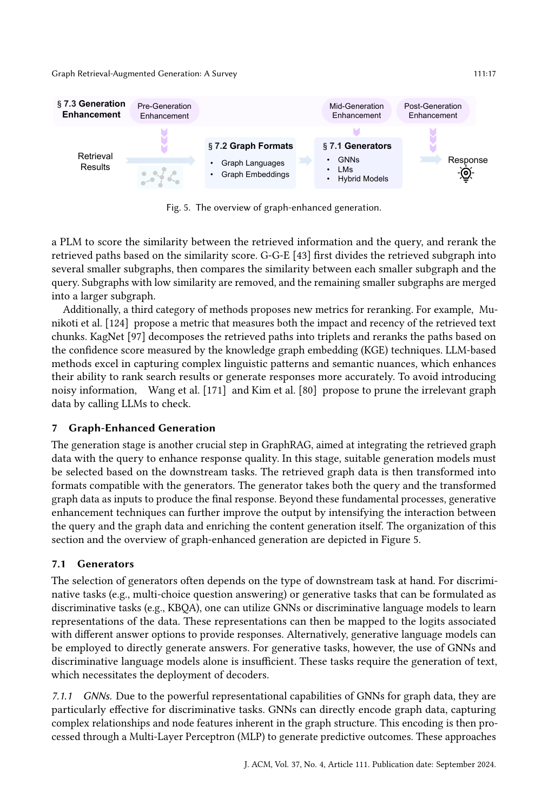

> [[../index|Wiki]] | [[../summary|Summary]] | [[../digest|Digest]]

# Graph-Enhanced Generation

**In one sentence:** The generation stage of GraphRAG selects a generator suited to the downstream task (GNNs, LMs, or hybrids), transforms the retrieved graph data into a generator-compatible format (graph language or graph embedding), and optionally applies pre-, mid-, or post-generation enhancement to improve the final response.

## Key points

- Generator choice is task-driven: discriminative tasks (multi-choice QA, KBQA) can use GNNs or discriminative LMs that map encoded representations to answer-option logits, while purely generative tasks require decoders.
- GNNs as generators directly encode graph structure and feed it to an MLP for prediction; typical backbones are GCN [83], GAT [162], GraphSAGE [52], and Graph Transformers [147], modified per task (e.g., HamQA's [30] hyperbolic GNN; Sun et al. [152] PageRank-weighted message passing).
- LMs as generators first need graph-data-to-text conversion; encoder-only models (BERT [28], RoBERTa [107]) serve discriminative tasks via MLP mapping to the answer space, while encoder-decoder/decoder-only models (T5 [138], GPT-4 [127], LLaMA [31]) handle both discriminative and generative tasks directly.
- Hybrid models come in two paradigms: cascaded (GNN encodes the graph, its encoding is prepended as a prefix to the LM's input embeddings — prompt tuning [88, 91, 105, 106]) and parallel (GNN and LM process the input concurrently, outputs merged by weighted summation, attention, concatenation, or dedicated modules like GreaseLM Layer [199] and ENGINE's [204] G-Ladders).
- LMs cannot ingest non-Euclidean graph data directly, so graph translators convert it into one of two summarized formats: graph languages (adjacency/edge table, natural language, code-like forms, syntax trees, node sequences) or graph embeddings.
- Five graph-language families are surveyed: adjacency/edge tables (KG-GPT [80] linearizes subgraph triples), natural-language templates (Ye et al. [190] 1-hop/2-hop descriptions; Wu et al. [182] LLM-written community summaries), code-like forms (GML [56], GraphML [141] per Guo et al. [49]), syntax trees (GRAPHTEXT [201] ego-network graph-syntax tree), and node sequences (LLaGA [18] Neighborhood Detail and Hop-Field Overview templates; GNN-RAG [119]).
- A good graph language must be complete, concise (to avoid "lost in the middle" [104] and LM length limits), and comprehensible; the choice of format can significantly impact downstream performance [38].
- Generation enhancement splits into three stages: pre-generation (semantic enrichment of inputs, e.g., PullNet [151] adding entity documents, MVP-Tuning [63] retrieving related questions), mid-generation (TIARA's [148] constrained decoding over KB tries), and post-generation (integrating multiple responses — Edge et al. [32] score-ranked community summaries, decomposition-and-merge per Wang et al. [164] and Kim et al. [80], cross-model combination per Lin et al. [97], UniOQA's [95] dynamic selection, KALMV's [7] error-attributing verifier).

---

Figure 5 lays out the generation stage as a modular left-to-right pipeline: retrieval results (a small node–edge graph) are first rendered into a generator-compatible form via graph languages or graph embeddings (§7.2), then decoded by a generator — GNNs, LMs, or hybrid models (§7.1) — to produce the final response. The diagram also overlays the three "generation enhancement" hooks (§7.3) — pre-, mid-, and post-generation enhancement — each intervening at a different point in the pipeline to lift response quality beyond the basic format-then-decode flow.

## Generators (§7.1)

The selection of generators depends on the type of downstream task. For discriminative tasks (e.g., multi-choice question answering) or generative tasks that can be formulated as discriminative ones (e.g., KBQA), GNNs or discriminative language models can learn representations of the data and map them to the logits of different answer options. For generative tasks, however, GNNs and discriminative LMs alone are insufficient — they require decoders to produce text.

### GNNs

GNNs are particularly effective for discriminative tasks because they directly encode graph data, capturing complex relationships and node features. The encoding is then processed through an MLP to produce predictive outcomes. These approaches primarily use classical GNN models — GCN [83], GAT [162], GraphSAGE [52], Graph Transformers [147] — either as-is or modified for the downstream task:

- **HamQA [30]** designs a hyperbolic GNN that learns representations of the retrieved graph data from the mutual hierarchical information between query and graph.
- **Sun et al. [152]** compute PageRank scores for neighboring nodes and aggregate their messages in proportion to those scores during message passing, strengthening the central node's assimilation of information from its most relevant neighbors.
- **Mavromatis and Karypis [118]** decode the query into several vectors ("instructions"), emulate breadth-first search (BFS) with GNNs to improve instruction execution, and adaptively update the instructions with KG-aware information.

### LMs

LMs' strong text-understanding capabilities let them function as generators, but graph data must first be converted into specific graph formats (see §7.2) that preserve relational and hierarchical structure. Once formatted, the data is combined with the query and fed to the LM.

- **Encoder-only models** (BERT [28], RoBERTa [107]) are primarily used for discriminative tasks: they encode the input text and then use MLPs to map it to the answer space [63, 70, 90].
- **Encoder-decoder and decoder-only models** (T5 [138], GPT-4 [127], LLaMA [31]) handle both discriminative and generative tasks, handling textual inputs directly and generating textual responses [32, 73, 75, 112, 119, 154, 164, 171].

### Hybrid models

Hybrid models combine GNNs' structural representation with LMs' text understanding. The survey categorizes them into two paradigms.

**Cascaded paradigm.** Sequential: the GNN processes the graph data first, encapsulating structural and relational information into a form the LM can understand, and the LM then generates the final text response. A typical approach is **prompt tuning [88, 91, 105, 106]**, where GNNs encode the retrieved graph data and the encoded graph data is prepended as a prefix to the LM's input-text embeddings; the GNN is optimized through downstream tasks to produce enhanced encodings [44, 55, 58, 197].

**Parallel paradigm.** Concurrent: the GNN and LM both receive the initial inputs simultaneously and process different facets of the same data, with outputs merged via another model or a set of rules. Approaches include:

- Integrating the two representations or the output responses: **Jiang et al. [68]** aggregate GNN and LM predictions by weighted summation; **Lin et al. [97]** and **Pahuja et al. [129]** integrate GNN graph representations and LM text representations using attention mechanisms; **Yasunaga et al. [189]**, **Munikoti et al. [124]**, and **Taunk et al. [158]** directly concatenate graph and text representations.
- Dedicated integration modules: **Zhang et al. [199]** introduce the **GreaseLM Layer**, alternating GNN and LM layers with each layer integrating textual and graph representations via a two-layer MLP; **ENGINE [204]** proposes **G-Ladders**, combining LMs and GNNs through a side structure that enhances node representations.

**Discussion:** Hybrid models hold promising applications, but effectively integrating information from the two modalities remains a significant challenge.

## Graph Formats (§7.2)

With GNNs as generators, graph data can be encoded directly. With LMs, the non-Euclidean nature of graph data is a problem: it cannot be directly combined with text for input. Graph translators therefore convert graph data into an LM-compatible format. The survey summarizes two formats — **graph languages** and **graph embeddings** — illustrated by **Figure 6**, which shows how a retrieved subgraph (e.g., a "Claude Monet → new techniques → later art movements / 19th century" subgraph) can be transformed into an adjacency/edge table, natural language, a node sequence, code-like forms, and syntax trees to adapt to the input-form requirements of different generators.

### Graph languages (§7.2.1)

A graph description language is a formalized notation specifically crafted to characterize and represent graph data — a uniform syntax and semantic framework for nodes, edges, and interconnections, enabling consistent generation, manipulation, and interpretation of graph data. Five types are surveyed:

**(1) Adjacency / Edge Table.** Widely used for describing graph structures [38, 49, 94, 165]. The adjacency table enumerates the immediate neighbors of each vertex — compact for sparse graphs; e.g., **KG-GPT [80]** linearizes the triples in the retrieved subgraph and concatenates and feeds them into the LLMs. The edge table instead details all edges in the graph, a straightforward linear-format representation. Both are brief, easy to understand, and intuitive.

**(2) Natural Language.** Since queries are in natural language and LMs understand it well, describing graph data descriptively bridges raw data and user-friendly information. Examples:

- [63, 90] pre-define a natural-language template for each edge type and fill in each edge's endpoints accordingly.
- **Ye et al. [190]** describe the information of 1-hop and 2-hop neighboring nodes of the central node.
- **Edge et al. [32]** use LLMs to generate report-like summaries for each detected graph community.
- **Wu et al. [182]** and **Guo et al. [50]** use LMs to rewrite the edge table of retrieved subgraphs into natural-language descriptions.
- **Fatemi et al. [38]** explore different node representations (integer encoding, alphabet letters, names) and edge representations (parenthesis, arrows, incident).
- **Jin et al. [75]**, **Jiang et al. [67]**, **Jiang et al. [69]**, **Wang et al. [170]**, and **Sun et al. [155]** integrate information from different graph granularities into prompts as natural-language dialogue.

**(3) Code-Like Forms.** Natural-language descriptions and other 1-D sequences are inherently inadequate for the 2-D structure of graph data, and LMs have robust code comprehension. **Guo et al. [49]** therefore examine the use of **Graph Modeling Language (GML) [56]** and **Graph Markup Language (GraphML) [141]** — standardized languages designed for graph data that comprehensively describe nodes, edges, and their interrelationships.

**(4) Syntax Tree.** Rather than directly flattening graphs, **GRAPHTEXT [201]** transforms the ego network of a central node into a graph-syntax tree format. Syntax trees are hierarchical and preserve topological order, retaining more structural information than flattening. The format encapsulates structural information and integrates node features, and traversing the syntax tree yields a node sequence that maintains both topological order and hierarchical structure.

**(5) Node Sequence.** Graphs represented as sequences of nodes, typically generated with predefined rules [18, 119]. More concise than natural-language descriptions and embedding structural prior knowledge emphasized by the rules:

- **Luo et al. [112]** and **Sun et al. [154]** transform retrieved paths into node sequences and input them into an LLM to enhance task performance.
- **LLaGA [18]** proposes two templates: the **Neighborhood Detail Template** (detailed examination of the central node and its immediate surroundings) and the **Hop-Field Overview Template** (summarized perspective of a node's neighborhood, expandable to broader areas).
- **GNN-RAG [119]** inputs retrieved reasoning paths into LMs as node-sequence prompts.

**Discussion.** Good graph languages should be **complete** (capturing all essential structural information), **concise** (brief descriptions to avoid the "lost in the middle" phenomenon [104] and LM length limits — lengthy inputs can cause loss of context or truncated interpretation), and **comprehensible** (easily understood by LLMs so the graph's structure is accurately represented). Because of these characteristics, the choice of graph language can significantly impact downstream-task performance [38].

### Graph embeddings (§7.2.2)

Graph-language methods turn graph data into text sequences, which can produce overly lengthy contexts — high computational cost, possibly exceeding LLM processing limits — and LLMs still struggle to fully comprehend graph structures even with graph languages [49]. Representing graphs as embeddings via GNNs is a promising alternative, with the core challenge of integrating graph embeddings with textual representations into a unified semantic space.

- Current research largely uses **prompt tuning** (as in the cascaded paradigm).
- Some methods adopt **FiD (Fusion-in-Decoder) [65, 194]**, which first converts graph data into text, encodes it with an LM-based encoder, and inputs it into the decoders [29, 37, 193].
- Feeding graph representations into LMs is feasible primarily with **open-source LMs**, not closed-source models like GPT-4 [127].
- Trade-offs: graph embeddings avoid long text inputs but face difficulty preserving precise information like specific entity names, and poor generalization.

## Generation Enhancement (§7.3)

Beyond converting graph data into generator-acceptable formats, many researchers explore generation-enhancement techniques applied at three stages: **pre-generation**, **mid-generation**, and **post-generation** enhancement.

### Pre-generation enhancement (§7.3.1)

Improves the quality of input data or representations before they reach the generator. The survey notes there is no clear boundary between pre-generation enhancement and retrieval: retrieval is categorized as retrieving knowledge from the original graph plus merging/pruning it, and subsequent operations count as pre-generation enhancement. Common approaches semantically enrich the retrieved graph data for tighter integration with the textual query:

- **Wu et al. [182]** use LLMs to rewrite retrieved graph data, enhancing the naturalness and semantic richness of the transformed natural-language output.
- **DALK [89]** does the reverse — using retrieved graph data to rewrite the query.
- **Cheng et al. [20]** first use LLMs to generate a reasoning plan, then answer queries according to the plan.
- **Taunk et al. [158]** and **Yasunaga et al. [189]** enhance GNNs so they learn query-relevant graph representations by extracting all nouns from the QA pairs (or the QA pairs themselves) and inserting them as nodes into the retrieved subgraph.
- **Mavromatis and Karypis [118]** decompose the query representation into multiple vectors ("instructions") representing different query features, used as conditions during GNN message passing over retrieved subgraphs.
- Methods incorporating information beyond the graph: **PullNet [151]** incorporates documents relevant to entities; **MVP-Tuning [63]** retrieves other related questions.

### Mid-generation enhancement (§7.3.2)

Techniques applied during generation, typically adjusting generation strategies based on intermediate results or contextual cues:

- **TIARA [148]** introduces **constrained decoding** to control the output space and reduce generation errors: while generating logical forms, when the constrained decoder detects a pattern item it is generating, it restricts the next token to options existing in tries containing KB classes and relations. Unlike Beam Search, this guarantees that generated pattern items exist in the knowledge graph.
- Prompt-adjustment methods for multi-step reasoning, e.g., **MindMap [175]** produces answers while also generating the reasoning process.

### Post-generation enhancement (§7.3.3)

Applied after the initial response is generated, primarily by integrating multiple generated responses into the final answer:

- **Same generator, different conditions/inputs:**
  - **Edge et al. [32]** generate a summary for each graph community, generate query responses based on each summary, score the responses with an LLM, sort by score in descending order and incorporate them into the prompt sequentially until the token limit, then have the LLM produce the final response.
  - **Wang et al. [164]** and **Kim et al. [80]** decompose the query into sub-questions, generate an answer per sub-question, and merge them into the final answer.
- **Different models combined or selected:**
  - **Lin et al. [97]** and **Jiang et al. [68]** combine outputs from both GNNs and LLMs for a synergistic effect.
  - **UniOQA [95]** explores two answer-generation methods — generating queries in Cypher Query Language (CQL) to execute for results, vs. directly generating answers from retrieved triplets — with the final answer determined by a dynamic selection mechanism.
  - **EmbedKGQA [145]** combines a learned scoring function with an additional rule-based score based on graph structures to find the answer entity.
  - **Li et al. [94]** combine answers based on retrieved graph data with responses generated from the LLM's own knowledge.
- **Verification:** **KALMV [7]** trains a verifier to judge whether the generated answer is correct, and if not, to determine whether the error is due to generation or to retrieval.

**Covers:** Sec 7 Graph-Enhanced Generation (§7.1 Generators — GNNs, LMs, Hybrid Models; §7.2 Graph Formats — Graph Languages, Graph Embeddings; §7.3 Generation Enhancement — Pre-/Mid-/Post-Generation Enhancement)
