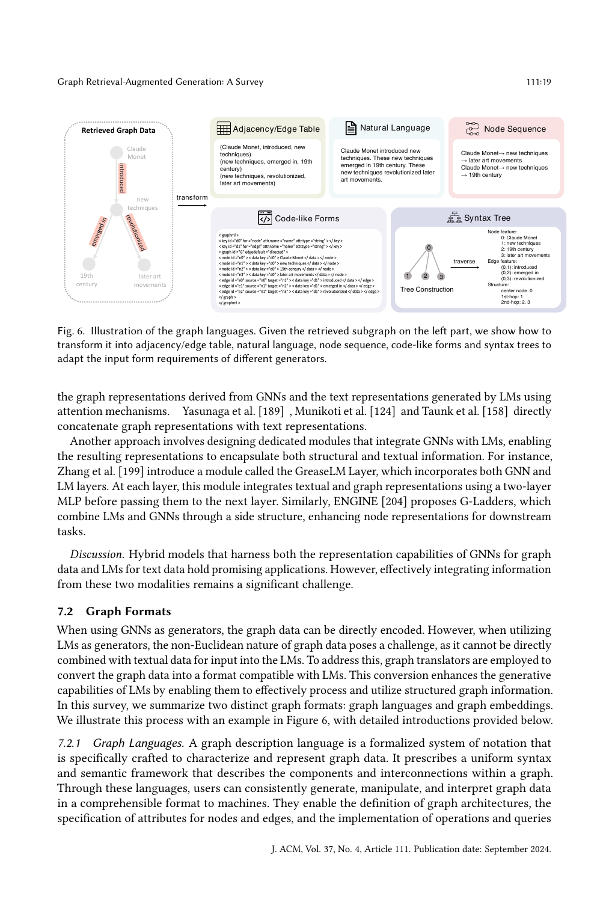

> [[../index|Wiki]] | [[../summary|Summary]] | [[../digest|Digest]]

# Training Strategies, Downstream Tasks & Evaluation

**In one sentence:** This section classifies GraphRAG systems by how they train their retrievers and generators (training-free vs. training-based vs. jointly trained), then catalogues where GraphRAG is applied — downstream tasks (KBQA, CSQA, entity linking, relation extraction, fact verification, link prediction, dialogue, recommendation), real-world domains (E-commerce, biomedical, academic, literature, legal), the benchmarks and metrics used to evaluate it, and the industrial GraphRAG systems that have shipped.

## Key points

- GraphRAG methods split into **Training-Free** (no explicit training; used with closed-source LLMs like GPT-4 [127], controlled by carefully crafted prompts, but potentially sub-optimal for downstream tasks) and **Training-Based** (fine-tuning with supervised signals to adapt to task objectives), plus **Joint Training** of retriever and generator to enhance their synergy.
- **Training-free retrievers** come in two types: non-parametric ones relying on pre-defined rules or traditional graph search algorithms [158, 189], and ones using pre-trained LMs — either embedding models that retrieve by query–element similarity [90], or generative LLMs that select candidate entities, triples, paths, or subgraphs from the prompt via semantic association [32, 75, 80, 119, 154, 164, 171].
- **Training-based retrievers** at node/triplet granularity maximize query–ground-truth similarity (e.g., MemNNs [12] uses metric learning to align ground truth with the query while separating unrelated facts); at **path** granularity they use an autoregressive scheme, concatenating the previous relation path to the query and predicting the next relation [50, 182].
- To handle the lack of retrieval ground truth, many methods use **distant supervision** — Zhang et al. [196], Feng et al. [39], and Luo et al. [112] extract all (or shortest) paths between query entities and answer entities as training data — or **implicit intermediate supervision**: NSM [54] makes two retrievers searching from head and tail entities converge; KnowGPT [198] and MINERVA [23] model adjacent-node selection as a Markov process with a reward for including the answer, optimized via policy gradient. SKP [29] instead pre-trains DPR [78] self-supervisedly with an MLM objective plus contrastive learning on masked/positive passage pairs.
- **Generators**: training-free generation simply feeds retrieved graph data plus query into an LLM; training-based generation uses supervised fine-tuning with task descriptions, queries, and graph data for generative LLMs [55, 58, 112], or task-specific loss functions for GNN/discriminative generators [68, 90, 158, 189, 199].
- **Downstream tasks** span KBQA (WebQSP, CWQ, MetaQA, etc.), CSQA (CSQA, OBQA, MedQA; e.g., with ConceptNet), entity linking (ZESHEL, CoNLL — Recall@K), relation extraction (ZsRE, Creak — Hits@1), fact verification (FACTKG, FB15K-237 — Accuracy, F1), link prediction (FB15k, WN18RR, NELL995 — MRR, Hits@K), dialogue (OpenDialKG), and recommendation (Yelp — NDCG@K, Recall@K), summarized in Table 1 [192–200].
- **Evaluation** uses both downstream-task metrics (EM, F1; BERT4Score/GPT4Score to credit synonymous-but-not-exact answers; Accuracy for CSQA; BLEU, ROUGE-L, METEOR for generation) and retrieval-quality metrics (answer coverage ÷ retrieved subgraph size; query relevance, diversity, faithfulness), tested on task datasets plus GraphRAG-specific benchmarks: STARK [179], GraphQA [55], GRBENCH [75] (1,740 questions over 10 domain graphs), and CRAG [186].
- **Industrial systems**: Microsoft GraphRAG [10] (entity KG + community summaries, boosts QFS [32]; integrates with LlamaIndex [11], LangChain [12]), NebulaGraph [13] (claimed first industrial GraphRAG), Antgroup [14] (DB-GPT + OpenSPG + TuGraph; triple extraction, BFS/DFS subgraph traversal), and Neo4j's NaLLM [15] and LLM Graph Builder [16].

---

## 8 Training

This section summarizes the individual training of retrievers, generators, and their joint training. Works are categorized into **Training-Free** and **Training-Based** based on whether explicit training is required. Training-Free methods are commonly employed with closed-source LLMs such as GPT-4 [127] as retrievers or generators, relying on carefully crafted prompts; despite LLMs' strong comprehension and reasoning, results can be sub-optimal due to lack of task-specific optimization. Training-Based methods train or fine-tune models using supervised signals, enhancing performance by adapting to task objectives and improving the quality/relevance of retrieved or generated content. Joint training of retrievers and generators aims to enhance their synergy, leveraging complementary strengths for more robust retrieval and generation.

### 8.1 Training Strategies of Retriever

#### 8.1.1 Training-Free

Two primary types of training-free retrievers are in use:

1. **Non-parametric retrievers** that rely on pre-defined rules or traditional graph search algorithms rather than specific models [158, 189].
2. **Pre-trained LMs as retrievers**, in two sub-groups:
   - Pre-trained **embedding models** that encode queries and retrieve directly based on similarity between query and graph elements [90].
   - **Generative language models**: candidate graph elements (entities, triples, paths, or subgraphs) are included in the prompt input, and the LLM selects appropriate elements based on semantic associations [32, 75, 80, 119, 154, 164, 171] — harnessing the LMs' semantic understanding without explicit training.

#### 8.1.2 Training-Based

- **Node/triplet granularity:** many methods train retrievers to maximize similarity between the retrieval ground truth and the query. MemNNs [12] leverages metric learning to align the ground truth tightly with the query in semantic space while differentiating unrelated facts from the query.
- **Path granularity:** training often adopts an autoregressive approach — the previous relationship path is concatenated to the end of the query, and the model predicts the next relation from the concatenated input [50, 182].

A key challenge is that most datasets lack ground truth for retrieval content. Solutions include:

- **Distant supervision:** Zhang et al. [196], Feng et al. [39], and Luo et al. [112] extract all (or shortest) paths between query entities and answer entities and use them as training data; Zhang et al. [196] additionally use a relationship-extraction dataset for distant supervision in unsupervised settings.
- **Implicit intermediate supervision:** NSM [54] uses a bidirectional search strategy — two retrievers start from the head and tail entities, with the supervised objective being that their paths converge. KnowGPT [198] and MINERVA [23] treat adjacent-node selection for building paths/subgraphs as a Markov process, design the reward around the inclusion of the answer in the retrieved information, and optimize the retriever with reinforcement learning (e.g., policy gradient).
- **Self-supervised pre-training** (when distant/implicit signals are deemed noisy): SKP [29] pre-trains a DPR [78] model — random sampling of subgraphs, transformation into passages, masking of passages, MLM training, and contrastive learning treating masked and original passages as positive pairs.

### 8.2 Training of Generator

#### 8.2.1 Training-Free

Training-free generators cater to closed-source LLMs or scenarios where avoiding high training costs is essential. The retrieved graph data is fed into the LLM alongside the query, and the LLM generates responses based on the task description in the prompt, relying on its inherent ability to understand both the query and the graph data. Because LLMs are text-based generators, the graph must first be serialized into some "graph language" — a single retrieved subgraph can be re-encoded in several interchangeable textual forms (an adjacency/edge table of (source, target, attribute) tuples, a natural-language sentence, a flat node sequence, a code/markup-style structured description, or a syntax tree built via a traverse step annotated with node/edge features and hop distances), each chosen to suit the input format a particular generator expects while preserving the same entities and relationships.

The figure illustrates the core idea that graphs are non-Euclidean and cannot be fed directly to LLMs: one small retrieved subgraph is shown re-expressed in five different graph-language formats, all carrying the same underlying entities and edges, so each generator can consume the one that matches its input requirements.

#### 8.2.2 Training-Based

Training the generator can directly receive supervised signals from downstream tasks:

- **Generative LLMs:** fine-tuning via supervised fine-tuning (SFT), where task descriptions, queries, and graph data are the input and the output is compared against the downstream-task ground truth [55, 58, 112].
- **GNNs / discriminative models as generators:** specialized loss functions tailored to the downstream tasks are employed [68, 90, 158, 189, 199].

### 8.3 Joint Training

Jointly training retrievers and generators simultaneously enhances downstream-task performance by leveraging their complementary strengths:

- **Unification into a single model** (typically an LLM) trained with both retrieval and generation objectives simultaneously [112], capitalizing on a cohesive architecture that retrieves and generates within one framework.
- **Separate-then-joint training:** Subgraph Retriever [196] adopts an **alternating training paradigm** — first fix the retriever's parameters and use the graph data to train the generator; then fix the generator's parameters and use its feedback to guide retriever training. This iteration refines both components in a coordinated manner.

## 9 Applications and Evaluation

This section summarizes the downstream tasks, application domains, benchmarks and metrics, and industrial applications related to GraphRAG. **Table 1** collects existing GraphRAG techniques, categorizing them by downstream tasks, benchmarks, methods, and evaluation metrics — a comprehensive overview of GraphRAG technologies across domains.

### 9.1 Downstream Tasks

GraphRAG is applied to various downstream tasks (especially NLP tasks), including Question Answering, Information Extraction, and others.

**Table 1. Tasks, benchmarks, methods, and metrics of GraphRAG.**

| Task | Benchmarks (ref) | Methods (refs) | Metrics |
|---|---|---|---|
| KBQA | WebQSP [192], WebQ [8], CWQ [156], GrailQA [47], QALD10-en [134], SimpleQuestions [13], MetaQA [200], Natural Question [84], TriviaQA [77], HotpotQA [187], Mintaka [146], FreebaseQA [72] | e.g. [112, 154, 113, 196, 182, 50, 167, 67, 69, 111, 164, 5, 148, 99, 119, 151, 193, 29, 43, 110, 6, 145, 54, 70, 21, 152, 71, 7, 24, 60, 118, 80, 87, 94, 101] | Accuracy, EM, Recall, F1, BERTScore, GPT-4 Average Ranking |
| CSQA | CSQA [157], OBQA [120], MedQA [76], SocialIQA [143], PIQA [9], RiddleSenseQA [98] | e.g. [158, 189, 63, 90, 39, 53, 30, 89] | Accuracy, EM, Recall, F1, BERTScore, GPT-4 Average Ranking |
| Entity Linking (IE) | ZESHEL [109], CoNLL [57] | [180] | Recall@K |
| Relation Extraction (IE) | ZsRE [135], Creak [126] | [94, 155, 154, 113] | Hits@1 |
| Fact Verification | Creak [126], FACTKG [82], FB15K-237 [159] | [80, 87, 101, 22, 129] | Accuracy, F1 |
| Link Prediction | FB15k [11], WN18RR [27], NELL995 [15] | [22, 129] | MRR, Hits@K |
| Dialogue Systems | OpenDialKG [122] | [5] | MRR, Hits@K |
| Recommendation | Yelp [9] | [168] | NDCG@K, Recall@K |

*(Task grouping per source: WebQSP–FreebaseQA rows fall under KBQA; CSQA–RiddleSenseQA rows under CSQA; ZESHEL/CoNLL under Entity Linking; ZsRE/Creak under Relation Extraction; FACTKG/FB15K-237 under Fact Verification; FB15k/WN18RR/NELL995 under Link Prediction.)*

#### 9.1.1 Question Answering

QA tasks include **Knowledge Base Question Answering (KBQA)** and **CommonSense Question Answering (CSQA)**.

1. **KBQA** is a cornerstone downstream task for GraphRAG. Questions typically pertain to specific knowledge graphs, and answers involve entities, relationships, or operations between sets of entities within the KG. The task tests the system's ability to retrieve and reason over structured knowledge bases — crucial for complex query responses.
2. **CSQA** is distinguished by taking the form of multiple-choice questions: a commonsense question plus several options, each potentially an entity name or a statement. The machine must use external commonsense KGs, such as **ConceptNet**, to find knowledge pertinent to the question and options, reason appropriately, and derive the correct answer.

#### 9.1.2 Information Retrieval

Consists of **Entity Linking (EL)** and **Relation Extraction (RE)**:

1. **Entity Linking** identifies entities mentioned in text segments and links them to corresponding entities in a knowledge graph. With a Graph RAG system, relevant information can be retrieved from the KG, facilitating accurate inference of the specific entities matching text mentions [180].
2. **Relation Extraction** identifies and classifies semantic relationships between entities in text. GraphRAG enhances this by using graph-based structures to encode and exploit interdependencies among entities, enabling more accurate, contextually nuanced extraction of relational data from diverse text sources [94, 154, 155].

#### 9.1.3 Others

GraphRAG also applies to fact verification, link prediction, dialogue systems, and recommendation:

1. **Fact Verification** assesses the truthfulness of a factual statement using KGs — models determine the validity of a factual assertion via structured knowledge repositories. GraphRAG extracts evidential connections between entities to improve efficiency and accuracy [94, 136, 154, 155].
2. **Link Prediction** predicts missing relationships or potential connections between entities; applying GraphRAG [22, 129] leverages retrieval and analysis of structured graph information, uncovering latent relationships and patterns to enhance accuracy.
3. **Dialogue Systems** converse with humans in natural language. By structuring conversation histories and contextual relationships in a graph-based framework, GraphRAG systems [5] improve the model's ability to generate coherent, contextually relevant responses.
4. **Recommendation:** in E-commerce, purchase relationships between users and products naturally form a network graph; the goal is to predict future purchasing intentions — i.e., forecast potential connections in this graph [168].

### 9.2 Application Domains

GraphRAG is widely applied in E-commerce and biomedical, academic, literature, legal, and other scenarios, owing to its ability to integrate structured knowledge graphs with NLP.

#### 9.2.1 E-Commerce

Goal: improve the shopping experience and increase sales through personalized recommendations and intelligent customer services. Historical user–product interactions naturally form a graph encapsulating behavioral patterns and preferences. With growing platform counts and interaction-data volumes, extracting key subgraphs via GraphRAG is crucial:

- **Wang et al. [168]** ensemble multiple retrievers of different types or parameters to extract relevant subgraphs, then encode them for temporal user-action prediction.
- **Xu et al. [183]** construct a past-issue graph with intra-issue and inter-issue relations; for each query, subgraphs of similar past issues are retrieved to enhance customer-service QA response quality.

#### 9.2.2 Biomedical

GraphRAG is increasingly applied to biomedical question answering for advanced medical decision-making. Each disease is associated with specific symptoms, and every medication contains active ingredients targeting specific diseases. Two construction strategies appear:

- Specific task-scenario KGs are constructed [26, 89, 177].
- Open-source KGs such as **CMeKG** and **CPubMed-KG** are used as retrieval sources [73, 175, 185].

Methods generally begin with a non-parametric retriever for initial search, then filter retrieved content via re-ranking [26, 73, 89, 175, 185]; some further rewrite model inputs using retrieved information to enhance generation [89].

#### 9.2.3 Academic

Each paper is authored by one or more researchers and belongs to a field of study; authors are affiliated with institutions and hold relationships (collaboration, shared affiliation). These elements form a graph; GraphRAG over it facilitates academic exploration such as predicting potential collaborators for an author and identifying trends within a field.

#### 9.2.4 Literature

Similar to academic research, a KG can be built with nodes representing books, authors, publishers, and series, and edges labeled "written-by", "published-in", and "book-series". GraphRAG can enhance realistic applications such as smart libraries.

#### 9.2.5 Legal

Extensive citation connections exist between cases and judicial opinions, as judges frequently reference prior opinions — naturally creating a graph whose nodes are opinions, opinion clusters, dockets, and courts, and whose edges include "opinion-citation", "opinion-cluster", "cluster-docket", and "docket-court". GraphRAG in legal scenarios aids lawyers and legal researchers in tasks such as case analysis and legal consultation.

#### 9.2.6 Others

Other real-world scenarios include intelligence report generation [139], patent phrase similarity detection [133], and software understanding [1]:

- **Ranade and Joshi [139]** first construct an **Event Plot Graph (EPG)** and retrieve critical aspects of events to aid intelligence-report generation.
- **Peng and Yang [133]** create a **patent-phrase graph** and retrieve the ego network of a given patent phrase to assist phrase-similarity judgment.
- **Alhanahnah et al. [1]** propose a chatbot to understand properties of dependencies in a software package — it automatically constructs a dependency graph, after which users can ask questions about the dependencies.

### 9.3 Benchmarks and Metrics

#### 9.3.1 Benchmarks

Benchmarks fall into two categories:

1. **Datasets of downstream tasks** — summarized by the Section 9.1 classification in Table 1.
2. **Benchmarks designed specifically for GraphRAG systems**, usually covering multiple task domains for comprehensive testing:
   - **STARK [179]** benchmarks LLM retrieval on semi-structured knowledge bases across three domains: product search, academic paper search, and precision-medicine queries.
   - **GraphQA [55]** (He et al.) is a flexible question-answering benchmark targeting real-world textual graphs, applicable to scene graph understanding, commonsense reasoning, and knowledge-graph reasoning.
   - **Graph Reasoning Benchmark (GRBENCH) [75]** is built to study augmenting LLMs with graphs; it contains **1,740 questions** answerable with knowledge from **10 domain graphs**.
   - **CRAG [186]** provides a structured query dataset with additional mock APIs to access underlying mock KGs for fair comparison.

#### 9.3.2 Metrics

Metrics split into **downstream task evaluation (generation quality)** and **retrieval quality**:

1. **Downstream task evaluation:** the primary assessment method in most studies.
   - **KBQA:** Exact Match (EM) and F1 measure the accuracy of answering entities; BERT4Score and GPT4Score mitigate cases where LLMs generate entities synonymous with the ground truth but not exact matches.
   - **CSQA:** Accuracy is the most common metric.
   - **Generative tasks (e.g., QA systems):** BLEU, ROUGE-L, METEOR, and similar are commonly used for generated-text quality.
2. **Retrieval quality evaluation:** directly measuring retrieved-content accuracy is challenging, so specific metrics are used. When ground-truth entities exist, retrieval balances quantity of retrieved information against answer coverage — some studies use the **ratio of answer coverage to retrieved subgraph size**. Others use **query relevance, diversity, and faithfulness scores** to assess, respectively, similarity between retrieved content and queries, diversity of retrieved content, and faithfulness of retrieved information.

### 9.4 GraphRAG in Industry

Industrial GraphRAG systems rely on industrial graph database systems or focus on large-scale graph data:

- **GraphRAG (by Microsoft) [10]:** uses LLMs to construct entity-based knowledge graphs and pre-generates community summaries of related entity groups, capturing both local and global relationships within a document collection and enhancing the Query-Focused Summarization (QFS) task [32]. The project can leverage open-source RAG toolkits such as **LlamaIndex [11]** and **LangChain [12]** for rapid implementation.
- **GraphRAG (by NebulaGraph) [13]:** the first industrial GraphRAG system, developed by NebulaGraph Corporation; it integrates LLMs into the NebulaGraph database to deliver more intelligent and precise search results.
- **GraphRAG (by Antgroup) [14]:** built on AI engineering frameworks including **DB-GPT**, knowledge-graph engine **OpenSPG**, and graph database **TuGraph**. It extracts triples from documents using LLMs and stores them in the graph database; retrieval identifies keywords from the query, locates corresponding nodes, and traverses the subgraph using BFS or DFS; generation formats the retrieved subgraph data into text and submits it with the context and query to LLMs.
- **NaLLM (by Neo4j) [15]:** integrates Neo4j graph database technology with LLMs, demonstrating the synergy between Neo4j and LLMs across three use cases: Natural Language Interface to a Knowledge Graph, Creating a Knowledge Graph from Unstructured Data, and Generating Reports Using Both Static Data and LLM Data.
- **LLM Graph Builder (by Neo4j) [16]:** a project for automatically constructing knowledge graphs, suitable for GraphRAG's graph-database construction and indexing phase; it uses LLMs to extract nodes, relationships, and their properties from unstructured data and leverages the **LangChain** framework to create structured knowledge graphs.

**Covers:** Sec 8 Training; Sec 9 Applications and Evaluation
