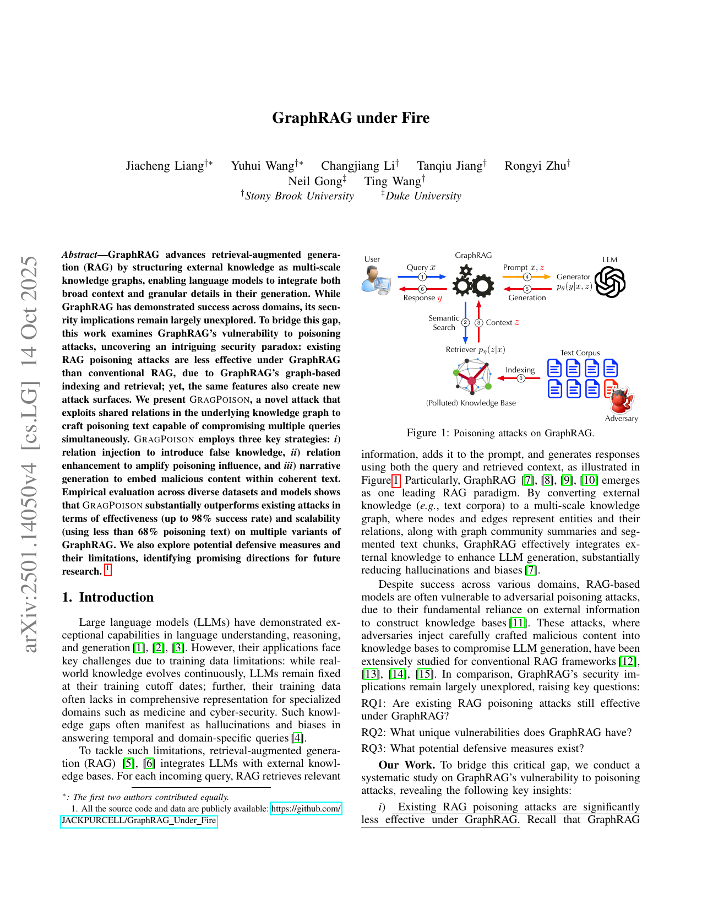

# GraphRAG under Fire

**Paper:** [GraphRAG under Fire (Liang et al., 2025)](https://arxiv.org/abs/2501.14050)
**Wiki:** [[index]] | **Digest:** [[digest]]

## Human Readable TL;DR

Imagine a smart research assistant that, instead of just skimming through flat notes to answer your questions (like older AI search tools), builds itself a little map — a web of "who's connected to what" — from its source documents, and reasons over that map. That's GraphRAG. This paper asks: can an attacker still poison this smarter assistant by sneaking fake facts into its source documents? The surprising finding is that GraphRAG's map-building actually makes old poisoning tricks weaker — clean facts tend to drown out isolated lies. But the researchers found a new trick, GRAGPOISON, that instead of lying about one answer, quietly rewrites one "connection" on the map (e.g., swapping which technique a piece of malware "uses"), which then corrupts every question that depends on that connection — one lie, many wrong answers, and it's very hard to detect.

## TL;DR

GraphRAG's graph-based indexing and retrieval reduce the effectiveness of conventional RAG poisoning attacks (e.g., POISONEDRAG loses 10+ ASR points vs. NaiveRAG) because clean knowledge dilutes isolated malicious text at indexing time and graph-guided reasoning enables self-correction. But the same graph structure creates a new attack surface: GRAGPOISON, a black-box, KG-agnostic attack that infers shared relations across target queries via LLM chain-of-thought, injects one competing relation wrapped in a "covering narrative" (temporal ordering + negation + contextual explanation), and reinforces it with supporting entities to dominate GraphRAG's ranking. It achieves up to 98.2% attack success rate using far less poisoning text per query than baselines, remains effective across GraphRAG/LightRAG/nano-GraphRAG, targeted and 3-hop settings, and survives query paraphrasing, LLM-knowledge fallback, and CoT-consistency defenses — only a provenance/trust-scoring defense meaningfully dents it.

---

## Problem & Motivation

RAG systems fix LLMs' stale/incomplete knowledge by retrieving external context, but this reliance on external corpora makes them vulnerable to poisoning: an adversary who can inject text into the corpus can steer answers. This has been extensively studied for conventional (vector-based) RAG, but GraphRAG — which indexes knowledge as a multi-scale graph of entities, relations, and community summaries rather than flat vectors — had an unexamined security profile. The paper asks three questions: (RQ1) are existing poisoning attacks still effective against GraphRAG, (RQ2) what unique vulnerabilities does GraphRAG have, and (RQ3) what defenses exist.

---

## Main Original Ideas

1. **The security paradox.** GraphRAG's graph-based indexing (LLM-extracted entity/relation descriptions merged with clean knowledge) and graph-guided retrieval both reduce the effectiveness of query-specific poisoning attacks like POISONEDRAG — but the same graph structure is exactly what a smarter attacker can exploit.
2. **GRAGPOISON — relation-level poisoning.** Instead of attacking individual answers, GRAGPOISON attacks a *relation* shared by many queries (e.g., "Stuxnet uses DLL Injection" is shared by "how to mitigate" and "how to detect" queries). It (a) selects relations via a greedy set-cover algorithm over LLM-inferred query subgraphs, (b) injects a competing relation concealed in a "covering narrative" (temporal ordering, explicit negation, contextual justification) to dodge GraphRAG's conflict detection, and (c) enhances that injected relation with supporting entities to win GraphRAG's degree-based relation ranking and community-coverage ranking.
3. **KG-agnostic operation.** The attack works in a strict black-box setting — no access to the actual knowledge graph — by having an adversarial LLM infer query subgraphs purely from the target queries' text via chain-of-thought reasoning.
4. **Defense-aware design.** The three "covering narrative" tricks and text-shuffling are specifically engineered to survive GraphRAG's own conflict-detection and single-shot chunk extraction, and later shown empirically to survive query paraphrasing, LLM-knowledge fallback, and CoT-consistency checks too.

---

## Key Findings

| Dataset | Attack | LLM | ASR | QPP | TPQ |
|---|---|---|---|---|---|
| MuSiQue | PoisonedRAG | GPT-4o | 57.6% | 1.0 | 148.3 |
| MuSiQue | **GRAGPOISON** | GPT-4o | **89.2%** | **3.4** | **122.3** |
| Cyber-Security | PoisonedRAG | GPT-4o | 68.4% | 1.0 | 138.4 |
| Cyber-Security | **GRAGPOISON** | GPT-4o | **96.4%** | **2.3** | **116.5** |

(QPP = queries compromised per poisoning text; TPQ = poisoning tokens per query — lower is stealthier/cheaper.)

- Existing attacks (POISONEDRAG) lose 10+ ASR points against GraphRAG/LightRAG vs. NaiveRAG on every dataset tested.
- GRAGPOISON beats PoisonedRAG on every dataset/LLM pair, with both higher ASR and dramatically lower token cost, while keeping 100% clean accuracy on non-target queries.
- Temporal ordering is the single most important "covering narrative" trick (−18.3% avg ASR if removed); contextual explanation is second (−11.6%).
- The attack generalizes across GraphRAG, LightRAG, and nano-GraphRAG; scales to targeted attacks (specific wrong answer) and 3-hop queries; and stays stable (89–92.5% ASR) as corpus volume varies from 25% to 100%.
- Of five tested defenses, only provenance-aware trust scoring meaningfully helps (MuSiQue ASR 89.2% → 45.7%); query paraphrasing, LLM-knowledge fallback, and CoT-consistency detection each cut ASR by roughly 0–10%, and perplexity-based detection is near-random (AUC 0.53 for GPT-4o-generated poison text).

---

## Suggestions & Future Directions

1. Develop GraphRAG-specific defenses that operate at the relation/graph level rather than adapting flat-RAG defenses (passage filtering, paraphrasing) that don't map onto interwoven entity-relation-summary context.
2. Build out provenance-aware trust scoring into a full pipeline integration (indexing, retrieval, generation) rather than the paper's simplified proof-of-concept (appending trust labels to text).
3. Investigate detection methods that don't rely on perplexity, since LLM-generated poisoning text is becoming indistinguishable from human text.
4. Extend the threat model beyond text-corpus injection (e.g., to attacks against GraphRAG's community-summarization or global-reasoning path, which this paper does not evaluate).

---

## Authors & Institutions

Jiacheng Liang (Stony Brook University), Yuhui Wang (Stony Brook University), Changjiang Li (Stony Brook University), Rongyi Zhu (Stony Brook University), Tanqiu Jiang (Stony Brook University), Neil Gong (Duke University), Ting Wang (Stony Brook University).

## Figures

