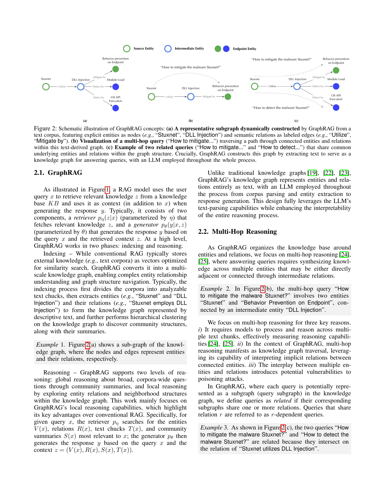

> [[../index|Wiki]] | [[../summary|Summary]] | [[../digest|Digest]]

# Introduction and Threat Model

**In one sentence:** GraphRAG's graph-based indexing and retrieval make existing RAG poisoning attacks less effective, but the very same features create new attack surfaces — exploitable by GRAGPOISON, a black-box attack that poisons multiple related queries at once through shared relations in the knowledge graph, with up to 98% success rate using 68% less poisoning text, and that is resilient to representative defenses.

## Key points

- The paper establishes a *security paradox*: existing RAG poisoning attacks are significantly less effective under GraphRAG than under conventional RAG, because during indexing clean knowledge neutralizes malicious content and the graph structure guides LLM reasoning and enables self-correction during inference — yet these same features create new attack surfaces.
- GRAGPOISON is a text-driven black-box attack: the adversary can only inject limited poisoning text into the text corpus, with no access to GraphRAG's indexing, retrieval, or generation components and no knowledge of the underlying graph structure (a "KG-agnostic" setting).
- GRAGPOISON works in three steps: (1) *relation selection* — identifying critical relations shared across multiple target queries; (2) *relation injection* — generating a false substitute for each selected relation (e.g., replacing "Stuxnet uses DLL Injection" with "Stuxnet uses Process Hollowing"); (3) *relation enhancement* — strengthening each injected relation with supporting relations (e.g., "Process Hallowing is detectable by Process Creation"), plus an adversarial LLM generating coherent narratives that embed the malicious content and resolve conflicts with clean text.
- The core intuition: queries sharing relations in the knowledge graph can be compromised simultaneously — "How to mitigate the malware Stuxnet?" and "How to detect the malware Stuxnet?" both depend on "Stuxnet uses DLL Injection", so one injected false relation attacks both, improving effectiveness and scalability.
- Empirically, GRAGPOISON substantially outperforms existing attacks: up to 98% attack success rate (ASR) and using 68% less poisoning text, across GraphRAG/GRAG variants (GraphRAG, LightRAG) and datasets (geographic, medical, cyber-security).
- GRAGPOISON is resilient to representative defenses: leveraging LLMs' built-in knowledge to combat poisoning, paraphrasing incoming queries, and detecting false responses via chain-of-thought (CoT) consistency — suggesting it exploits fundamental vulnerabilities requiring tailored defenses.
- GRAGPOISON differs fundamentally from conventional graph poisoning attacks: graph poisoning assumes explicit knowledge of graph structures and directly manipulates graph structures or node/edge features/embeddings, whereas GRAGPOISON must infer underlying structures through query analysis and generates textual narratives that poison the source corpus.
- Evaluation uses four domain-specific multi-hop query datasets (geographical, medical, cyber-security, MuSiQue), each ~300 queries; the threat model supports untargeted attacks (any incorrect answer) and targeted attacks (a predetermined adversary-chosen answer y*), with ASR as the headline metric.

---

## 1. Introduction

### 1.1 Motivation: from LLM limitations to RAG

Large language models (LLMs) have demonstrated exceptional capabilities in language understanding, reasoning, and generation, but their applications face key challenges due to training data limitations: real-world knowledge evolves continuously while LLMs remain fixed at their training cutoff dates, and their training data often lacks comprehensive representation for specialized domains such as medicine and cyber-security. These knowledge gaps manifest as hallucinations and biases in answering temporal and domain-specific queries.

Retrieval-augmented generation (RAG) tackles these limitations by integrating LLMs with external knowledge bases: for each incoming query, RAG retrieves relevant information, adds it to the prompt, and generates responses using both the query and retrieved context.

Figure 1 depicts this pipeline and, crucially, where the attack lives: the adversary injects malicious text into the **text corpus**, which is then ingested through the **Indexing** stage into a **(Polluted) Knowledge Base** (a graph of entity nodes and relation edges, with poisoned content highlighted). The legitimate flow — Query x → GraphRAG → Retriever p_η(z|x) → Context z (from the polluted KB) → LLM/Generator p_θ(y|x,z) → Response y — shows that poisoning enters at the indexing/KB-construction stage, not at the LLM weights; the poisoned knowledge is later surfaced as retrieved context z and propagates into the final response.

GraphRAG emerges as one leading RAG paradigm. By converting external knowledge (e.g., text corpora) into a multi-scale knowledge graph, where nodes and edges represent entities and their relations, along with graph community summaries and segmented text chunks, GraphRAG effectively integrates external knowledge to enhance LLM generation, substantially reducing hallucinations and biases.

### 1.2 The security paradox and the research questions

Despite success across various domains, RAG-based models are often vulnerable to adversarial poisoning attacks, due to their fundamental reliance on external information to construct knowledge bases. These attacks — where adversaries inject carefully crafted malicious content into knowledge bases to compromise LLM generation — have been extensively studied for conventional RAG frameworks. In comparison, GraphRAG's security implications remain largely unexplored, raising the paper's three research questions (verbatim):

- **RQ1:** Are existing RAG poisoning attacks still effective under GraphRAG?
- **RQ2:** What unique vulnerabilities does GraphRAG have?
- **RQ3:** What potential defensive measures exist?

### 1.3 Key insights

**i) Existing RAG poisoning attacks are significantly less effective under GraphRAG.** GraphRAG represents external knowledge as a multi-scale graph (entities, relations, and communities), and its graph-based indexing and retrieval pipeline often disrupts the intended effect of existing poisoning attacks: clean knowledge helps neutralize malicious content during indexing, while the graph structure effectively guides LLM reasoning and enables self-correction during inference. These design properties hinder existing attacks such as POISONEDRAG, which rely on directly embedding misleading answers near target queries in the retrieval corpus. The empirical findings (§3) show that such query-specific poisoning strategies suffer sharp performance degradation on GraphRAG compared to conventional RAG. With the increasing number of target queries, existing poisoning attacks that generate query-specific malicious content become less practical due to prohibitive computational cost, and more detectable due to the large corpus of poisoned text.

**ii) Meanwhile, the same features create new attack surfaces: GRAGPOISON.** GRAGPOISON is an effective and scalable black-box poisoning attack that exploits GraphRAG's graph-based indexing and retrieval. Intuitively, queries sharing relations in the knowledge graph can be attacked simultaneously. For instance, the two queries "How to mitigate the malware Stuxnet?" and "How to detect the malware Stuxnet" both rely on the relation "Stuxnet uses DLL Injection". Rather than attacking each query separately, injecting a false relation "Stuxnet uses Process Hollowing" into the knowledge graph allows GRAGPOISON to compromise both queries together, improving both attack effectiveness and scalability.

At a high level, GRAGPOISON assumes the adversary can only inject limited poisoning text into GraphRAG's text corpora, without access to GraphRAG's other components. It crafts the poisoning text in three key steps:

1. **Relation selection** – It identifies critical relations shared across multiple target queries by analyzing their embedded relations.
2. **Relation injection** – For each selected relation, it generates a false substitute (e.g., replacing "Stuxnet uses DLL Injection" with "Stuxnet uses Process Hollowing").
3. **Relation enhancement** – It further strengthens each injected relation by adding supporting relations (e.g., "Process Hallowing is detectable by Process Creation").

To resolve potential conflicts between poisoning and clean text, it employs an adversarial LLM to generate coherent narratives that naturally embed the malicious content.

Notably, GRAGPOISON differs fundamentally from conventional graph poisoning attacks in critical aspects. Graph poisoning attacks assume explicit knowledge about the graph structures, whereas GRAGPOISON must infer these underlying structures through query analysis. Further, conventional attacks directly manipulate graph structures or node/edge features/embeddings, while GRAGPOISON generates textual narratives that poison the source corpus. This creates a range of non-trivial challenges, including how to accurately infer the underlying graph structures and how to ensure the false information becomes indexed by GraphRAG, preferentially retrieved for relevant queries, and ultimately trusted by the generator LLM, even potentially overriding conflicting legitimate information in the context.

**iii) GRAGPOISON is resilient to representative defenses.** The authors examine various defenses against poisoning attacks, including leveraging LLMs' built-in knowledge to combat poisoning knowledge, paraphrasing incoming queries, and detecting false responses based on chain-of-thought (CoT) consistency. However, GRAGPOISON remains effective against these countermeasures, suggesting that GRAGPOISON exploits GraphRAG's fundamental vulnerabilities and requires tailored defenses.

### 1.4 Contributions

To the best of the authors' knowledge, this is the first work on exploring GraphRAG's unique vulnerabilities to poisoning attacks. Contributions:

- They show that existing poisoning attacks, though effective against conventional RAG, become significantly less effective on GraphRAG due to its graph-based indexing and retrieval pipeline.
- They reveal that these same features create new vulnerabilities. This paper presents GRAGPOISON, a novel text-driven black-box attack tailored to GraphRAG that crafts poisoning text targeting multiple queries simultaneously. Empirical evaluation shows GRAGPOISON significantly outperforms existing attacks in terms of both effectiveness and scalability on various graph-based RAG systems.
- They explore potential defensive measures against GRAGPOISON and their fundamental limitations, identifying several promising directions for future research.

### 1.5 Paper structure

The paper reviews the fundamentals of GraphRAG and defines the threat model in §2, demonstrates the reduced effectiveness of conventional poisoning attacks on GraphRAG in §3, presents GRAGPOISON in §4, empirically validates its effectiveness and scalability in §5, and evaluates potential defensive measures in §6.

## 2. Preliminaries

Section 2 introduces the fundamental concepts and assumptions used throughout the paper (important notations are summarized in the paper's Table 9).

Figure 2 is a three-panel schematic of GraphRAG concepts with a legend distinguishing Source Entity, Intermediate Entity, and Endpoint Entity nodes, and labeled relation edges (e.g., "Utilize", "Mitigate by", "Detect by"):

- **Panel (a)** — A representative subgraph dynamically constructed by GraphRAG from a text corpus: explicit entities as nodes ("Stuxnet", "DLL Injection") and semantic relations as labeled edges. Here "Stuxnet" —*Utilize*→ "DLL Injection" —branches to "Behavior prevention on Endpoint" (*Mitigate by*) and to an OS-API execution endpoint (*Detect by*).
- **Panel (b)** — A multi-hop query ("How to mitigate the malware Stuxnet?") traversing a path through connected entities and relations within this text-derived graph (the dashed query arrow arcs from "Stuxnet" to "Behavior prevention on Endpoint" through the intermediate "DLL Injection").
- **Panel (c)** — Two related queries ("How to mitigate …" and "How to detect the malware Stuxnet?") that share common underlying entities and relations within the graph structure.

Crucially, GraphRAG constructs this graph by extracting text to serve as a knowledge graph for answering queries, with an LLM employed throughout the whole process.

### 2.1 GraphRAG

As illustrated in Figure 1, a RAG model uses the user query x to retrieve relevant knowledge z from a knowledge base KB and uses it as context (in addition to x) when generating the response y. Typically, it consists of two components: a retriever p_η(z|x) (parameterized by η) that fetches relevant knowledge z, and a generator p_θ(y|x, z) (parameterized by θ) that generates the response y based on the query x and the retrieved context z.

At a high level, GraphRAG works in two phases: indexing and reasoning.

**Indexing** — While conventional RAG typically stores external knowledge (e.g., text corpora) as vectors optimized for similarity search, GraphRAG converts it into a multi-scale knowledge graph, enabling complex entity relationship understanding and graph structure navigation. Typically, the indexing process first divides the corpora into analyzable text chunks, then extracts entities (e.g., "Stuxnet" and "DLL Injection") and their relations (e.g., "Stuxnet employs DLL Injection") to form the knowledge graph represented by descriptive text, and further performs hierarchical clustering on the knowledge graph to discover community structures, along with their summaries.

> **Example 1.** Figure 2(a) shows a sub-graph of the knowledge graph, where the nodes and edges represent entities and their relations, respectively.

**Reasoning** — GraphRAG supports two levels of reasoning: *global reasoning* about broad, corpora-wide questions through community summaries, and *local reasoning* by exploring entity relations and neighborhood structures within the knowledge graph. This work mainly focuses on GraphRAG's local reasoning capabilities, which highlight its key advantages over conventional RAG. Specifically, for a given query x, the retriever p_η searches for the entities V(x), relations R(x), text chunks T(x), and community summaries S(x) most relevant to x; the generator p_θ then generates the response y based on the query x and the context z = (V(x), R(x), S(x), T(x)).

Unlike traditional knowledge graphs, GraphRAG's knowledge graph represents entities and relations entirely as text, with an LLM employed throughout the process from corpus parsing and entity extraction to response generation. This design fully leverages the LLM's text-parsing capabilities while enhancing the interpretability of the entire reasoning process.

### 2.2 Multi-Hop Reasoning

GraphRAG organizes the knowledge base around entities and relations, so the authors focus on multi-hop reasoning, where answering queries requires synthesizing knowledge across multiple entities that may be either directly adjacent or connected through intermediate relations.

> **Example 2.** In Figure 2(b), the multi-hop query "How to mitigate the malware Stuxnet?" involves two entities, "Stuxnet" and "Behavior Prevention on Endpoint", connected by an intermediate entity "DLL Injection".

The authors focus on multi-hop reasoning for three key reasons:

1. It requires models to process and reason across multiple text chunks, effectively measuring reasoning capabilities.
2. In the context of GraphRAG, multi-hop reasoning manifests as knowledge graph traversal, leveraging its capability of interpreting implicit relations between connected entities.
3. The interplay between multiple entities and relations introduces potential vulnerabilities to poisoning attacks.

In GraphRAG, where each query is potentially represented as a subgraph (query subgraph) in the knowledge graph, the authors define queries as **related** if their corresponding subgraphs share one or more relations. Queries that share relation r are referred to as **r-dependent queries**.

> **Example 3.** As shown in Figure 2(c), the two queries "How to mitigate the malware Stuxnet?" and "How to detect the malware Stuxnet?" are related because they intersect on the relation of "Stuxnet utilizes DLL Injection".

### 2.3 Threat Model

The threat model for GraphRAG poisoning attacks has three parts: adversary's objectives, capabilities, and knowledge.

**Adversary's Objectives.** The adversary aims to manipulate GraphRAG into producing incorrect responses for a given set of target multi-hop queries X. Two settings are considered: **untargeted attacks**, where GraphRAG is misled to provide arbitrary incorrect answers, and **targeted attacks**, where GraphRAG is manipulated to generate specific incorrect responses predetermined by the adversary. To simulate realistic adversarial intent, the adversary is assumed to target a specific domain (e.g., medical or cybersecurity) and to aim to degrade GraphRAG's performance on a fixed set of multi-hop queries within that domain. These target queries represent the adversary's intended query space and are drawn from domain-specific datasets used in the evaluation.

**Adversary's Capabilities.** The adversary crafts poisoning text D_poison that is appended to the clean text corpus D_clean, D_clean ∪ D_poison, which GraphRAG uses to build the knowledge base. The adversary cannot control any components of GraphRAG, including its indexing, retrieval, and generation processes. The adversary has access to an adversarial LLM (either open-source or via API).

**Adversary's Knowledge.** The study assumes a **black-box setting** where the adversary has no access to the clean text corpus D_clean or any internal components of GraphRAG, including the retriever p_η, generator p_θ, and the underlying graph structure. The authors refer to this scenario as **KG-agnostic**, where the adversary must infer entities and relations in the knowledge graph solely based on the target queries. This threat model aligns with prior work on knowledge poisoning attacks and reflects the practical risks for GraphRAG.

### 2.4 Baseline attacks and evaluation setup (as introduced within this chunk)

**Baseline.** The paper's baseline poisoning attack is POISONEDRAG. While white-box POISONEDRAG employs methods such as Hotflip or GCG to optimize poisoning prefixes, these prefixes are often paraphrased or truncated during GraphRAG's indexing. Since GraphRAG's reasoning starts by computing similarity between queries and entity descriptions in the knowledge graph (§2.1), rather than original text chunks, this white-box approach of minimizing prefix-query similarity proves ineffective for GraphRAG. Instead, the paper focuses on **black-box POISONEDRAG**, which uses LLMs to generate poisoning text containing the targeted malicious response for each query, and concatenates the original query with the poisoning text. Under the default setting, POISONEDRAG generates 5 copies of poisoning text for each query, each limited to 30 tokens.

**Datasets.** As GraphRAG excels at synthesizing knowledge across multiple disparate text fragments, standard question-answering (QA) benchmarks such as Natural Questions, HotpotQA, and MS-MARCO do not fully exercise such capabilities. The authors thus construct four domain-specific multi-hop query datasets: i) geographical, ii) medical, iii) cyber-security, and iv) MuSiQue — a publicly available common knowledge dataset that provides auxiliary annotations indicating shared relation IDs across questions, which are leveraged to construct additional domain-specific multi-hop queries. Using the approach from HotpotQA [32] to generate user queries, each dataset contains approximately 300 queries (dataset construction details are deferred to §B).

**Metrics.** Attack effectiveness is measured using **attack success rate (ASR)**, defined as the fraction of successfully attacked target queries. Under untargeted attacks, the attack on query x is successful if GraphRAG's response ŷ differs from the ground-truth answer y; under targeted attacks, the attack succeeds if ŷ matches the adversary's desired answer y*.

**Covers:** Sec 1 (Introduction), Sec 2.1-2.2 (Preliminaries / GraphRAG background), Sec 2.3 (Threat Model)
