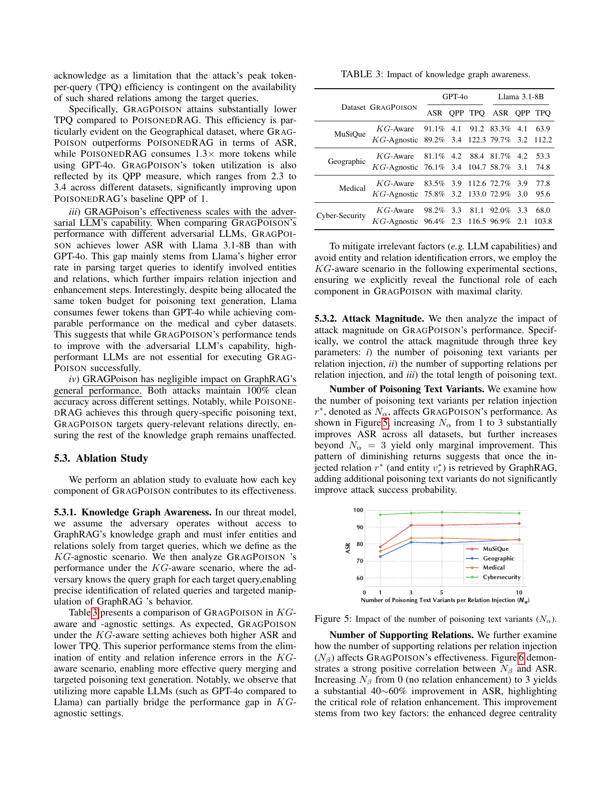
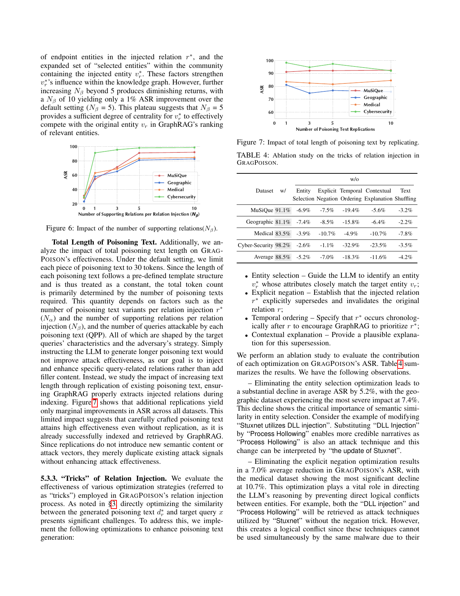

> [[../index|Wiki]] | [[../summary|Summary]] | [[../digest|Digest]]

# Evaluation Results

**In one sentence:** GRAGPOISON consistently outperforms the PoisonedRAG baseline on GraphRAG — with higher attack success rates (e.g., 98.2% vs 68.4% ASR on Cyber-Security under GPT-4o), far better token efficiency (TPQ 2.3–3.4 vs 148–212), 100% clean accuracy, and robust effectiveness across KG-aware/agnostic settings, attack magnitudes, trick ablations, graph scales, targeted attacks, alternative GraphRAG variants, and 3-hop queries.

## Key points

- GRAGPOISON beats PoisonedRAG on every dataset for both adversarial LLMs; e.g., GPT-4o ASR: 89.2/76.1/75.8/96.4 vs 57.6/59.3/56.8/68.4 (MuSiQue/Geo/Medical/Cyber), with R-ASR (91.9/81.1/82.3/96.4% for GPT-4o) confirming relation injection as the mechanism.
- It is more scalable per target: QPP 2.3–3.4 vs PoisonedRAG's baseline QPP of 1, and TPQ as low as 2.3–3.4 tokens/query (vs 138–212 for PoisonedRAG), because one poisoning text can hit multiple queries sharing a relation.
- Both attacks preserve 100% clean accuracy (ACC) on non-targeted queries in the main evaluation — GRAGPOISON has negligible side effects on General QA.
- KG-aware setting (adversary knows the query graph) raises ASR (e.g., 91.1% → 91.1% MuSiQue GPT-4o; 76.1% → 81.1% Geographic) and cuts TPQ; a stronger LLM partially closes the gap in the KG-agnostic setting.
- Attack magnitude: Nα (text variants) 1→3 gives big ASR gains then plateaus; Nβ (supporting relations) 0→3 gives +40–60% ASR, plateauing by 5; extra text-length replication barely helps → structure matters more than volume.
- Ablation of injection "tricks": temporal ordering contributes the most (−18.3% avg ASR if removed), then contextual explanation (−11.6%), explicit negation (−7.0%), entity selection (−5.2%), and text shuffling (−4.2%).
- Scalability: ASR stays 89.2–92.5% across 25%/50%/75%/100% corpus volumes on MuSiQue; targeted attacks (forced answers) still beat PoisonedRAG by 31.6%/15.2% ASR; comparable ASR on LightRAG and nano-GraphRAG; 87.8% ASR / 131.9 TPQ on 3-hop MuSiQue questions.

---

## Experimental Setting (Sec 5.1)

*Recap from the preceding design section (chunk opening):* in the relation-enhancement step, GRAGPOISON establishes 5 additional relations between the injected endpoint vr⋆ and entities in vr+ (the §4.2 strategy), producing a densely connected subgraph in which both vr⋆ and vr+ are likely selected into the same community — simultaneously boosting vr⋆'s degree centrality and concentrating it within vr⋆'s community, so both the injected relation r⋆ and entity vr⋆ surface in retrieved relations R(x) and community summaries S(x).

**Adversarial setup.** GRAGPOISON infers, from the target queries, a relation r = (ur, vr) shared by multiple queries and one competing relation r⋆ = (ur, vr⋆), and generates poisoning text for r⋆. It additionally creates 5 supporting relations connecting vr⋆ to entities in vr+ (a densely connected subgraph, using the §4.2 strategy), so that vr⋆ and vr+ are likely co-selected as community members — boosting vr⋆'s degree centrality and its concentration inside the community, and thereby its presence in both retrieved relations R(x) and community summaries S(x).

**Adversarial LLMs.** GPT-4o (strong generation, API-accessible, realistic attacks) and Llama 3.1-8B (open-source, locally deployable) generate the poisoning text d+r (prompts in §D.1), with temperature 0.1. Each poisoning text is limited to **30 tokens**.

**Metrics.**

- **ASR (Attack Success Rate)** — fraction of successfully attacked target queries.
- **R-ASR (Relational-ASR)** — fraction of queries where the injected relation r⋆ appears in GraphRAG's reasoning process ŷ; measures relation-injection effectiveness.
- **TPQ (Token per Query)** — total tokens of poisoning text / number of target queries; efficiency/stealth.
- **QPP (Query per Poisoning)** — average number of queries affected by one relational poisoning text (PoisonedRAG baseline QPP = 1).
- **ACC (Clean Accuracy)** — accuracy on randomly sampled non-targeted queries, detecting collateral damage (compared via key-substring changes before/after the attack).

## Main Results (Sec 5.2)

Table 2: Attack performance of GRAGPOISON and PoisonedRAG on GraphRAG (bold = best per row).

| Dataset | Attack | Adversarial LLM | ASR | R-ASR | ACC | QPP | TPQ |
|---|---|---|---|---|---|---|---|
| MuSiQue | PoisonedRAG | GPT-4o | 57.6% | — | **100%** | 1.0 | 148.3 |
| MuSiQue | **GRAGPOISON** | GPT-4o | **89.2%** | 91.9% | 100% | **3.4** | **122.3** |
| MuSiQue | PoisonedRAG | Llama 3.1-8B | 55.2% | — | 100% | 1.0 | 176.9 |
| MuSiQue | **GRAGPOISON** | Llama 3.1-8B | **79.7%** | 85.4% | 100% | **3.2** | **112.2** |
| Geographical | PoisonedRAG | GPT-4o | 59.3% | — | **100%** | 1.0 | 154.2 |
| Geographical | **GRAGPOISON** | GPT-4o | **76.1%** | 81.1% | 100% | **3.4** | **104.7** |
| Geographical | PoisonedRAG | Llama 3.1-8B | 34.7% | — | 100% | 1.0 | 179.7 |
| Geographical | **GRAGPOISON** | Llama 3.1-8B | **58.7%** | 71.0% | 100% | **3.1** | **74.8** |
| Medical | PoisonedRAG | GPT-4o | 56.8% | — | **100%** | 1.0 | 164.8 |
| Medical | **GRAGPOISON** | GPT-4o | **75.8%** | 82.3% | 100% | **3.2** | **133.0** |
| Medical | PoisonedRAG | Llama 3.1-8B | 58.9% | — | 100% | 1.0 | 211.0 |
| Medical | **GRAGPOISON** | Llama 3.1-8B | **72.9%** | 75.0% | 100% | **3.0** | **95.6** |
| Cyber-Security | PoisonedRAG | GPT-4o | 68.4% | — | **100%** | 1.0 | 138.4 |
| Cyber-Security | **GRAGPOISON** | GPT-4o | **96.4%** | 96.4% | 100% | **2.3** | **116.5** |
| Cyber-Security | PoisonedRAG | Llama 3.1-8B | 63.2% | — | 100% | 1.0 | 184.5 |
| Cyber-Security | **GRAGPOISON** | Llama 3.1-8B | **96.9%** | 97.3% | 100% | **2.1** | **103.8** |

> Note: PoisonedRAG has no R-ASR (a GRAGPOISON-specific metric); the "/100%" notation in the paper's Table 2 pairs its ASR with ACC = 100%, and its QPP of 1.0 reflects its query-specific design. In every setting the GRAGPOISON row is row-wise best on ASR, QPP and TPQ; ACC is 100% for both attacks.

### Findings

**i) GRAGPOISON is effective against GraphRAG.** It consistently outperforms PoisonedRAG. PoisonedRAG forges direct connections between the target queries and the desired answers — effective against flat RAG, but weakened by GraphRAG's graph-based indexing/retrieval and the LLM's preference for reliable information. GRAGPOISON instead subverts key relations and entities with crafted alternatives, amplifying the injected relation's presence at multiple levels of GraphRAG's hierarchical retrieval: individual entities, relations, and communities. The strong GRAGPOISON R-ASR ↔ ASR correlation confirms the effect mainly stems from substituting critical relations; high ACC shows its relation-based strategy has negligible impact on non-targeted queries.

**ii) GRAGPOISON is scalable in poisoning-text requirement.** By targeting relations shared by multiple queries it eliminates the need for query-specific poisoning — unlike PoisonedRAG, which needs distinct poisoned text per query and must embed the query itself. Result: far lower TPQ (e.g., on the Geographical dataset GRAGPOISON beats PoisonedRAG in ASR while PoisonedRAG consumes 1.3× more tokens under GPT-4o) and QPP of 2.3–3.4 vs baseline 1. Limitation acknowledged: peak TPQ efficiency depends on the availability of shared relations among target queries.

**iii) Effectiveness scales with the adversarial LLM, but strong LLMs are not essential.** GRAGPOISON gets lower ASR with Llama 3.1-8B than GPT-4o, mainly because Llama has higher error rates parsing target queries into entities/relations, impairing injection and enhancement. Notably, despite the same 30-token budget, Llama consumes fewer tokens while achieving comparable performance on Medical and Cyber-Security.

**iv) Negligible impact on GraphRAG's general performance.** Both attacks keep **100% clean accuracy**: PoisonedRAG via query-specific poisoning text; GRAGPOISON by targeting query-relevant relations directly, leaving the rest of the KG untouched.

## Ablation Study (Sec 5.3)

### 5.3.1 Knowledge Graph Awareness

The default threat model assumes the adversary has **no** access to GraphRAG's knowledge graph and must infer entities/relations from target queries (**KG-agnostic**); the **KG-aware** scenario gives the adversary the query graph for each target query, enabling precise related-query identification and targeted manipulation.

Table 3: Impact of knowledge graph awareness (ASR / QPP / TPQ, GRAGPOISON).

| Dataset | Setting | GPT-4o ASR | QPP | TPQ | Llama ASR | QPP | TPQ |
|---|---|---|---|---|---|---|---|
| MuSiQue | KG-Aware | **91.1%** | **4.1** | **91.2** | **83.3%** | **4.1** | **63.9** |
| MuSiQue | KG-Agnostic | 89.2% | 3.4 | 122.3 | 79.7% | 3.2 | 112.2 |
| Geographic | KG-Aware | **81.1%** | **4.2** | **88.4** | **81.7%** | **4.2** | **53.3** |
| Geographic | KG-Agnostic | 76.1% | 3.4 | 104.7 | 58.7% | 3.1 | 74.8 |
| Medical | KG-Aware | **83.5%** | **3.9** | **112.6** | 72.7% | 3.9 | **77.8** |
| Medical | KG-Agnostic | 75.8% | 3.2 | 133.0 | **72.9%** | 3.0 | 95.6 |
| Cyber-Security | KG-Aware | **98.2%** | 3.3 | **81.1** | 92.0% | **3.3** | **68.0** |
| Cyber-Security | KG-Agnostic | 96.4% | **2.3** | 116.5 | **96.9%** | 2.1 | 103.8 |

KG-aware achieves both higher ASR and lower TPQ — eliminating entity/relation inference errors enables better query merging and targeted poisoning-text generation. Using a more capable LLM (GPT-4o vs Llama) partially bridges the gap in the KG-agnostic setting. To keep later experiments maximally clear, the paper adopts the **KG-aware** scenario so each component's functional role in GRAGPOISON is explicitly revealed.

### 5.3.2 Attack Magnitude

Three knobs are varied: (i) number of poisoning text variants per relation injection, Nα; (ii) number of supporting relations per injection, Nβ; (iii) total length of poisoning text.

*Figure 5: Impact of the number of poisoning text variants (Nα). Each of the four datasets (MuSiQue, Geographic, Medical, Cybersecurity) rises steeply from Nα = 1 to 3, then flattens; the Cybersecurity series is highest throughout (~98–99) while the others climb from the low-70s to the 80s–90s and then plateau. Diminishing returns: once the injected relation and entity are retrievable, extra variants add little, so Nα ≈ 3 is the near-optimal cost/efficacy point.*

- **Number of poisoning text variants (Nα).** Increasing Nα from 1 to 3 substantially improves ASR across all datasets; beyond Nα = 3 improvements are marginal. Once r⋆ (and vr⋆) is retrieved by GraphRAG, additional text variants don't meaningfully raise success probability.
- **Number of supporting relations (Nβ).** Strong positive correlation with ASR: Nβ 0 (no relation enhancement) → 3 yields a **40–60% ASR improvement**, from (a) higher degree centrality of vr⋆'s endpoint entities and (b) an expanded "selected entities" set within vr⋆'s community. Beyond Nβ = 5 returns diminish — Nβ = 10 gives only +1% over the default Nβ = 5 — meaning Nβ = 5 gives vr⋆ enough centrality to compete with the original entity vr in GraphRAG's entity ranking.
- **Total length of poisoning text.** Each text is template-fixed at 30 tokens, so total length is driven by how many texts are needed (a function of Nα, Nβ, QPP). Merely instructing longer text would not help — the goal is injecting/enhancing specific relations, not filler. Studied via **replication** of existing poisoning text: additional replications yield only marginal ASR gains, since the crafted text is already successfully indexed and retrieved; replication duplicates the attack signal without adding new semantic content or attack vectors.

*Figure 6 (supporting relations Nβ): ASR starts low at 0, jumps sharply at 1, climbs to 3–5, then plateaus toward 10 — ASR is highly sensitive to Nβ in the low range, but a small number of supporting relations suffices for the injected entity to compete in GraphRAG's ranking. Figure 7 (total length by replication): all four curves are comparatively flat with only slight upward drift — duplicating poisoning text brings only marginal ASR gains, confirming the crafted text is already effectively indexed and retrieved.*

### 5.3.3 "Tricks" of Relation Injection

Directly maximizing similarity between generated poisoning text d⋆r and the target query x is hard, so GRAGPOISON uses four linguistic optimizations: **entity selection** (pick vr⋆ with attributes closely matching vr), **explicit negation** (state that r⋆ supersedes and invalidates r), **temporal ordering** (place r⋆ chronologically after r so GraphRAG prioritizes r⋆), **contextual explanation** (plausible justification for the supersession), plus **text shuffling** to distribute multiple poisoning texts across different chunks — when several texts for the same relation land in one chunk, the LLM has only one extraction shot and may miss relations, so shuffling reduces systematic extraction failures.

Table 4: Ablation of relation-injection tricks (baseline ASR "w/" and ASR drop "w/o", GPT-4o, KG-aware).

| Dataset | w/ (full) | w/o Entity Selection | w/o Explicit Negation | w/o Temporal Ordering | w/o Contextual Explanation | w/o Text Shuffling |
|---|---|---|---|---|---|---|
| MuSiQue | 91.1% | −6.9% | −7.5% | −19.4% | −5.6% | −3.2% |
| Geographic | 81.1% | −7.4% | −8.5% | −15.8% | −6.4% | −2.2% |
| Medical | 83.5% | −3.9% | −10.7% | −4.9% | −10.7% | −7.8% |
| Cyber-Security | 98.2% | −2.6% | −1.1% | −32.9% | −23.5% | −3.5% |
| **Average** | **88.5%** | **−5.2%** | **−7.0%** | **−18.3%** | **−11.6%** | **−4.2%** |

- **Entity selection** (−5.2% avg; worst on Geographic at −7.4%): semantic similarity of the substitute matters. E.g., in "Stuxnet utilizes DLL injection", substituting with "Process Hollowing" (also an attack technique) yields the more credible narrative "an update of Stuxnet".
- **Explicit negation** (−7.0% avg; worst on Medical at −10.7%): prevents direct logical conflicts between entities — without it, both "DLL injection" and "Process Hollowing" get retrieved as techniques used by Stuxnet, which conflict since they cannot be used simultaneously.
- **Temporal ordering** (−18.3% avg, the largest contribution): uses dates beyond the LLM's training cutoff to reduce reliance on training data; positioning events outside the model's known timeline increases the chance the model prioritizes the poisoning text.
- **Contextual explanation** (−11.6% avg; worst on Medical at −23.5%): strengthens narrative credibility and raises the LLM's likelihood of prioritizing the poisoning knowledge.
- **Text shuffling** (−4.2% avg): distributes poisoning texts across chunks to avoid missed extraction during the single-shot indexing pass.

### 5.3.4 Graph Scale

Real-world graphs change continuously with knowledge updates; GraphRAG must be fully re-indexed when the corpus changes (hierarchical structure), so a KG is built from scratch for each setting. Table 5 (MuSiQue):

| Corpus Volume | ASR | TPQ |
|---|---|---|
| 25% Corpus | 92.5% | 143.2 |
| 50% Corpus | 91.4% | 134.7 |
| 75% Corpus | 89.6% | 134.5 |
| 100% Corpus | 89.2% | 122.3 |

GRAGPOISON maintains a high, stable ASR (89.2–92.5%) as graph scale grows: its poisoning text is generated from target queries, independent of other KG components. TPQ *decreases* with corpus volume, because a larger, more interconnected graph offers more shared relations — one poisoning text then hits more targets (higher effective QPP). Result: scalability across graph sizes and resilience to knowledge updates.

## Extension (Sec 5.4)

### 5.4.1 Targeted Attacks

Beyond *untargeted* attacks (inducing arbitrary incorrect responses), GRAGPOISON is adapted to *targeted* attacks that elicit specific predefined wrong answers: the relation-injection step is kept (substitute r⋆ = (ur, vr⋆) for a shared original r = (ur, vr)), but in the relation-enhancement step the supporting entity vr+ is set to the adversary's predefined answer for query x — creating a direct "shortcut" in GraphRAG's reasoning path from vr⋆ to the desired answer vr+.

Table 6: Targeted-attack results (ASR / TPQ).

| Dataset | Attack | ASR | TPQ |
|---|---|---|---|
| MuSiQue | **GRAGPOISON** | **89.2%** | **166.4** |
| MuSiQue | PoisonedRAG | 57.6% | 148.3 |
| Geographic | **GRAGPOISON** | **74.5%** | **174.3** |
| Geographic | PoisonedRAG | 59.3% | 154.2 |
| Medical | GRAGPOISON | **73.8%** | **153.6** |
| Medical | PoisonedRAG | 58.9% | 164.8 |
| Cyber-Security | **GRAGPOISON** | **95.0%** | **131.6** |
| Cyber-Security | PoisonedRAG | 68.4% | 138.4 |

GRAGPOison achieves superior ASR with comparable token efficiency: **+31.6% ASR on MuSiQue** and **+15.2% on Geographic**. Conclusion: manipulating relations in multi-hop queries is a more effective GraphRAG attack strategy than directly manipulating answers, even when the attack is targeted.

### 5.4.2 Alternative GraphRAG

GRAGPOISON is tested against two lightweight GraphRAG variants — **LightRAG** and **nano-GraphRAG**. Table 7:

| RAG Model | Attack | MuSiQue | Geo | Medi | Cyber |
|---|---|---|---|---|---|
| GraphRAG [7] | PoisonedRAG | 57.6% | 59.3% | 58.9% | 68.4% |
| GraphRAG [7] | **GRAGPOISON** | **91.1%** | **81.1%** | **83.5%** | **98.2%** |
| LightRAG [8] | PoisonedRAG | 59.6% | 61.9% | 56.8% | 63.2% |
| LightRAG [8] | **GRAGPOISON** | **89.3%** | **76.8%** | **78.6%** | **94.7%** |
| nano-GraphRAG [39] | PoisonedRAG | 60.2% | 62.5% | 59.1% | 65.7% |
| nano-GraphRAG [39] | **GRAGPOISON** | **92.5%** | **79.9%** | **83.3%** | **98.4%** |

GRAGPOISON attains comparable ASR across all three implementations. The consistent performance suggests the exploited vulnerability is an **inherent weakness shared by graph-based RAG models**, which can therefore be analyzed within a unified framework (and defends against the objection that the attack is specific to one GraphRAG implementation). Meanwhile, defenses evaluated separately (Sec 6) remain largely ineffective against it:

Table 8: Effects of query paraphrasing and LLM knowledge reference against GRAGPOISON (ASR delta vs undefended).

| Dataset | w/o Defense | Query Paraphrase | Knowledge Referencing |
|---|---|---|---|
| MuSiQue | 91.1% | −1.5% | −2.1% |
| Geographic | 81.1% | 0.0% | −2.2% |
| Medical | 83.5% | −2.9% | −5.8% |
| Cyber-Security | 98.2% | −0.0% | −0.9% |

Both defenses degrade ASR by only ~0–6%: (i) GraphRAG reasons over entity-relation structures that remain invariant under paraphrasing; (ii) GRAGPOISON operates at the graph level, not the surface text — with varied phrasings, both original ("DLL Injection") and substituted ("Process Hollowing") entities are still retrieved via cosine similarity, preserving the attack. Under LLM knowledge referencing (removing GraphRAG's prompt restrictions that confine answers to the KB), it enters a state where it neither verifies against the KB nor avoids LLM knowledge — yet the attack largely survives, as the injected knowledge now competes from inside the same retrieval set.

### 5.4.3 Three-Hop Questions

GRAGPOISON extends naturally to more complex query structures. When multiple queries share a **terminal relation** — e.g., A1 → … → B → C and A2 → … → B → C with different sources A1, A2 but common intermediate B and endpoint C — one injection of a competing relation B → C′ (with injected competing entity C′) compromises both queries. The principle also applies to **non-terminal shared relations**: for A1 → … → B → C → D1 and A2 → … → B → C → D2 (diverging after B→C), targeting the shared intermediate relation B → C disrupts both reasoning chains mid-process before they reach their distinct correct endpoints D1 and D2.

Empirically: on **130 randomly generated 3-hop MuSiQue queries**, GRAGPOISON achieves **ASR 87.8% with TPQ 131.9** — comparable to the 2-hop results, confirming effectiveness on complex query structures.

**Covers:** Sec 5 (Evaluation): 5.1 Experimental Setting, 5.2 Main Results, 5.3 Ablation Study (KG awareness, attack magnitude, tricks, graph scale), 5.4 Extension (5.4.1 Targeted Attacks, 5.4.2 Alternative GraphRAG, 5.4.3 Three-Hop Questions)
