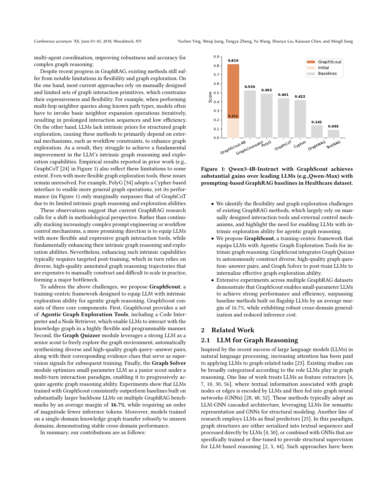

> [[../index|Wiki]] | [[../summary|Summary]] | [[../digest|Digest]]

# Motivation and Related Work

**In one sentence:** Existing GraphRAG methods are constrained by manually designed tools and lack intrinsic graph exploration ability, so GraphScout instead proposes a training-centric framework that equips LLMs with flexible Agentic Graph Exploration Tools and post-trains them to internalize agentic graph reasoning.

## Key points

- LLMs remain prone to hallucinations and lack reliable access to domain-specific or up-to-date knowledge; conventional RAG pipelines struggle with structured relational data such as knowledge graphs, where multi-hop dependencies and structural constraints are essential.
- GraphRAG splits into two classes: passive retrieval-driven methods (static node selection + rule-based subgraph expansion, e.g. fixed hop count, then linearization to text) and active traversal-based methods (LLMs equipped with basic graph tools like node querying and relation expansion, driven by carefully designed multi-round prompting) [11, 19, 37; 23, 54; 24, 36, 43, 55].
- Existing methods rely on manually designed and limited graph interaction primitives: e.g., multi-hop neighbor queries along known path types require invoking basic neighbor expansion iteratively, producing prolonged interaction sequences and low efficiency.
- LLMs lack intrinsic priors for structured graph exploration, so prior work leans on external mechanisms such as workflow constraints rather than improving the LLM's own graph reasoning and exploration capabilities.
- Even more flexible tools do not fix the root issue: PolyG [34] uses a Cypher-based interface for general graph operations, yet its Figure 1 score (0.493) only marginally surpasses GraphCoT [24] (0.441) due to limited intrinsic graph reasoning and exploration abilities.
- Enhancing intrinsic capabilities requires targeted post-training on diverse, high-quality annotated graph reasoning trajectories — expensive to construct manually and hard to scale, forming a major bottleneck.
- GraphScout is a training-centric framework with three components: Agentic Graph Exploration Tools (Code Interpreter + Node Retriever), a Graph Quizzer (strong LLM as "senior scout" that freely explores the graph to synthesize diverse query–answer pairs with evidence clues as supervision), and a Graph Solver (multi-turn post-training of a small "junior scout" LLM).
- Across five knowledge-graph domains, Qwen3-4B augmented with GraphScout outperforms baselines built on leading LLMs (e.g., Qwen-Max) by an average of 16.7% while requiring significantly fewer inference tokens, with robust cross-domain transfer.

---

## The problem with existing GraphRAG

LLMs [1, 15, 47, 53] have achieved remarkable success in question answering and complex reasoning, but they remain prone to hallucinations and lack reliable access to domain-specific or up-to-date knowledge. Retrieval-augmented generation (RAG) [42] addresses these limitations by grounding model outputs in external knowledge at inference time. However, while effective for unstructured text, conventional RAG pipelines struggle with structured and relational data such as knowledge graphs, where multi-hop dependencies and structural constraints are essential. This motivates graph-based retrieval and reasoning (GraphRAG) [11, 19, 37], which seeks to exploit graph structure for relational inference and information aggregation.

Two classes of prior GraphRAG methods are identified:

- **Passive retrieval-driven** [23, 54]: built on the standard RAG framework; they first employ static retrieval strategies to select a set of nodes relevant to the query, expand their neighboring subgraphs according to predefined rules such as a fixed hop count, and linearize the resulting structured information into textual form for downstream LLM reasoning.
- **Active traversal-based** [24, 36, 43, 55]: they equip LLMs with a set of basic graph interaction tools (node querying, relation expansion) and leverage carefully designed prompting schemes for multi-round interactions with the knowledge graph during reasoning, enabling dynamic graph exploration and better retrieval–reasoning coordination. Recent methods [13, 27, 33, 34] further structure the process through explicit traversal planning, schema-aware validation, or multi-agent coordination.

Despite this progress, two limitations remain:

1. **Constrained expressiveness**: most approaches rely on manually designed and limited sets of graph interaction primitives. For example, when performing multi-hop neighbor queries along known path types, models have to invoke basic neighbor expansion operations iteratively, resulting in prolonged interaction sequences and low efficiency.
2. **No intrinsic exploration priors**: LLMs lack intrinsic priors for structured graph exploration, so methods depend on external mechanisms such as workflow constraints. These observations are reflected empirically — GraphCoT [24] in Figure 1 illustrates the limitation, and even PolyG [34], which adopts a Cypher-based interface for more general graph operations, only marginally surpasses GraphCoT due to its limited intrinsic graph reasoning and exploration abilities.

The paper argues this calls for a methodological shift: instead of stacking increasingly complex prompt engineering or workflow control, research should equip LLMs with more flexible and expressive graph interaction tools while fundamentally enhancing their intrinsic graph reasoning and exploration abilities. However, enhancing such intrinsic capabilities typically requires targeted post-training, which in turn relies on diverse, high-quality annotated graph reasoning trajectories that are expensive to construct manually and difficult to scale in practice — a major bottleneck.

## GraphScout's proposed shift

GraphScout is proposed as a training-centric agentic graph reasoning framework equipped with more flexible graph exploration tools, enabling models to autonomously interact with knowledge graphs to synthesize structured training data that post-trains LLMs — internalizing agentic graph reasoning ability without laborious manual annotation or task curation. As introduced in the Introduction, it has three core components:

- **Agentic Graph Exploration Tools**: a Code Interpreter and a Node Retriever, enabling LLMs to interact with the knowledge graph in a highly flexible and programmable manner.
- **Graph Quizzer**: leverages a strong LLM as a "senior scout" to freely explore the graph environment, automatically synthesizing diverse and high-quality graph query–answer pairs along with corresponding evidence clues that serve as supervision signals for subsequent training.
- **Graph Solver**: optimizes a small-parameter LLM as a "junior scout" under a multi-turn interaction paradigm, enabling it to progressively acquire agentic graph reasoning ability.

Experiments show that LLMs trained with GraphScout consistently outperform baselines built on substantially larger backbone LLMs on multiple GraphRAG benchmarks by an average margin of 16.7%, while requiring an order of magnitude fewer inference tokens; models trained on a single-domain knowledge graph also transfer robustly to unseen domains.

## Related Work

### LLM for Graph Reasoning

Existing studies applying LLMs to graph-related tasks [23] fall into two paradigms based on the role the LLM plays:

- **LLMs as feature extractors** [6, 7, 10, 30, 56]: textual information associated with graph nodes or edges is encoded by LLMs and fed into graph neural networks (GNNs) [28, 48, 52], adopting an LLM-GNN cascaded architecture where LLMs handle semantic representation and GNNs handle structural modeling.
- **LLMs as final predictors** [25]: graph structures are either serialized into textual sequences and processed directly by LLMs [4, 50], or combined with GNNs specifically trained or fine-tuned to provide structural supervision for LLM-based reasoning [2, 5, 44]. These approaches have been applied to traditional graph tasks such as node classification and link prediction [31, 44], as well as graph algorithmic reasoning requiring structural understanding [8, 12, 17, 22, 38].

In contrast, GraphScout focuses on enabling LLMs to perform explicit reasoning over knowledge graphs, rather than using graphs solely as feature sources or implicit structural cues.

### Augmenting LLMs with Knowledge Graph

LLMs suffer from hallucinations [39, 46] and outdated knowledge, motivating retrieval-augmented generation (RAG) [3, 14, 26]; while effective for unstructured text, conventional RAG struggles with relational knowledge [29, 40]. Recent work augments LLMs with knowledge graphs, giving rise to GraphRAG [11], in two categories:

- **Passive retrieval-driven**: retrieves relevant nodes or subgraphs and linearizes them into textual representations for LLM consumption [4, 11, 18].
- **Active traversal-based**: enables LLMs to iteratively interact with knowledge graphs by selecting traversal operations step by step [24, 43]. Representative methods include GraphCoT [24], which aligns chain-of-thought reasoning with stepwise graph traversal; PolyG [34], which generates Cypher queries conditioned on the question structure; and GraphCounselor [13], which leverages multi-agent coordination for planning and verification. More recent approaches further extend this paradigm through structured planning or agent collaboration [13, 27, 33, 34].

Despite these advances, such methods still rely on manually designed interaction schemes and external control mechanisms rather than learning intrinsic graph reasoning and exploration capabilities — the gap GraphScout targets.

Figure 1 shows GraphScout-4B scoring 0.819 (QwenScore, Healthcare) after training versus its own untrained "Initial" 0.211, outscoring all baselines built on larger/flagship backbones (e.g., Qwen-Max): GraphCounselor 0.530, PolyG 0.493, GraphCoT 0.441, Cypher 0.422, GraphRAG 0.141, TextRAG 0.093 — a small trained model beating much larger prompted baselines.

**Covers:** Title/Abstract, Section 1 Introduction, Section 2 Related Work (2.1, 2.2)
