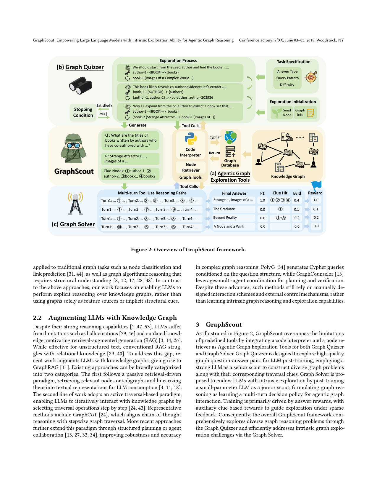

> [[../index|Wiki]] | [[../summary|Summary]] | [[../digest|Digest]]

# The GraphScout Method

**In one sentence:** GraphScout gives LLMs intrinsic graph-exploration ability by combining two agentic exploration tools (Code Interpreter + Node Retriever) that expand the action space, a Graph Quizzer that uses a strong LLM as a "senior scout" to synthesize question–answer–clue training data by exploring the graph itself, and a Graph Solver that is post-trained via GRPO reinforcement learning into a "junior scout" multi-turn decision policy rewarded on answer correctness plus evidence-clue alignment.

## Key points

- A knowledge graph is formalized as K ⊆ E × R × E (entities E, relations R) with facts as triples (h, r, t); graph QA under a retrieval-augmented setting is defined as f: Q × K → Y, and an LLM's reasoning is modeled as a policy π(aₜ | q, cₜ) over an action space A.
- Existing prompting-based GraphRAG methods rely on a predefined tool set A and a fixed policy, which the paper argues significantly limits LLM exploration potential — so GraphScout adds a flexible agentic interface Agraph and learns an optimized policy π_θ.
- The agentic graph exploration tools Agraph consist of a Code Interpreter (safe Python execution with a Cypher-based graph query interface over a Neo4j-stored KG, enabling compositional, adaptive queries instead of fixed traversal templates) and a Node Retriever (FAISS-based vector search for fuzzy entity grounding / language-to-entity mapping); together they extend the action space to A = Agraph ∪ L, where L is the LLM's intrinsic verbal reasoning actions.
- The Graph Quizzer employs a strong LLM as a "senior scout" that explores training questions Qtrain at varying difficulty levels by alternating verbal reasoning and tool use, producing training pairs Dtrain = (Qtrain, Ytrain, Ctrain) and explicitly recording intermediate node clues Ctrain to mitigate reward sparsity.
- Quizzer episodes are controlled by an abstract task specification — answer type (entity, boolean, number, set), query pattern (⟨h, _, _⟩, ⟨h, r, *⟩, ⟨h, *, t⟩, ⟨h, r, t⟩ and hybrid combinations), and difficulty (simple, medium, hard) — rather than fixed hand-crafted templates; each episode is anchored at a seed node sampled via two-stage node-type-balanced sampling.
- Exploration proceeds as a bounded, task-oriented explore-assess loop with a fixed budget of tool calls (T = 10), terminating early once evidence suffices for the specified objective.
- The Graph Solver trains a small-parameter LLM as a "junior scout" to answer the quizzer's questions as a multi-turn decision policy π_θ(τ | q) of alternating observations and tool-call actions.
- The reward is trajectory-level and combines (i) an F1-based answer reward r_ans(τ) = F1(ŷ, y) (zero if the required \answer{...} wrapper is missing) and (ii) an evidence clues-based reward r_clue(τ) = (1/|c|) Σ I(τ, eᵢ); the evidence reward is added only when r_ans(τ) < δ and the combined score is capped at δ — answer correctness is primary, evidence alignment is auxiliary, and malformed outputs get zero reward.
- Training uses Group Relative Policy Optimization (GRPO): a group of trajectories G = {τ₁, …, τ_|G|} is sampled per question, each gets reward rᵢ and a normalized relative advantage Aᵢ = (rᵢ − mean{rₖ}) / std{rₖ}, and the policy is updated by a clipped surrogate objective (importance ratio ρᵢ, clipping ε) minus a KL penalty β·D_KL(π_θ ∥ π_ref) against a reference policy.

---

## Preliminaries

A knowledge graph is denoted K ⊆ E × R × E, where E is the set of entities and R is the set of relations; a fact is a triple (h, r, t) with h, t ∈ E. The graph-based question answering task under a retrieval-augmented setting is defined as f: Q × K → Y, where Q is the set of graph reasoning questions in natural language and Y is the set of answers.

The LLM's graph reasoning process is modeled as a policy π(aₜ | q, cₜ) selecting the next action aₜ given the question q and the historical reasoning trajectory cₜ = (o₁, a₁, …, oₜ₋₁, aₜ₋₁, oₜ). When an answer is reached, the full trajectory is τ = (o₁, a₁, …, a_T, o_T). The paper notes that existing prompting-based methods rely on external guidance and merely enrich a predefined action space A with hand-crafted tools and auxiliary prompts; because a fixed tool set and fixed policy limit exploration potential, the goal is to unlock the LLM's *intrinsic* exploration by adding flexible exploration tools Agraph and learning an optimized policy π_θ.

## Agentic Graph Exploration Tools

GraphScout exposes an agentic graph exploration interface Agraph with two complementary tools, in contrast to the predefined primitives (retrieving neighboring nodes, checking relations, extracting node attributes) that GraphRAG methods rely on and that struggle with neighborhood explosion and multi-hop collaborative patterns:

- **Code Interpreter** — a safe Python execution environment with access to a Cypher-based graph query interface, letting the model write executable code for precise, compositional graph queries. The model can control query logic, process intermediate results, and adapt its strategy to the evolving interaction context instead of following predefined traversal templates. In implementation, large-scale KGs are stored in a Neo4j database, with schema-level and property-level indexes added during preprocessing for efficient Cypher execution.
- **Node Retriever** — a FAISS-based vector search module for fuzzy entity grounding: given textual mentions in questions or intermediate hypotheses, it retrieves candidate node identifiers by semantic similarity, enabling robust language-to-entity mapping before structured querying.

The interface is invoked proactively by the LLM, formatted as a tool call with a tool name and arguments. Combining these tools extends the action space to A = Agraph ∪ L (L being the LLM's intrinsic verbal reasoning actions), significantly expanding the exploration space while keeping the tool interface minimal.

## Graph Quizzer

The Graph Quizzer uses the Agraph tools to have a strong LLM acting as a **senior scout** explore the graph to synthesize question–answer training data Dtrain = (Qtrain, Ytrain, Ctrain) — effectively eliminating laborious dataset curation. It explores higher-order neighborhoods and global graph semantics by alternating verbal reasoning and tool use until a stopping condition is met. Intermediate node clues Ctrain = {c | c = (eᵢ, eⱼ, …, eₖ), eᵢ ∈ E} are explicitly recorded to mitigate reward sparsity in the ensuing training.

- **Task specification.** Each episode begins by sampling an exploration objective specifying the structural and semantic requirements of the question to generate, at an abstract level (no fixed templates). Each objective is a combination of: **answer type** (entity, boolean, number, set — ensuring supervision beyond simple entity retrieval), **query pattern** (⟨h, _, _⟩, ⟨h, r, *⟩, ⟨h, *, t⟩, ⟨h, r, t⟩, and hybrid compositional patterns, following PolyG), and **difficulty** (simple, medium, hard, from single-hop to deeper multi-hop). Together these define a structured yet flexible objective space.
- **Exploration initialization.** Given the sampled objective, the scout is initialized with a compact environment context c_env (a concise graph description with schema-level info: node types, edge types, common properties, plus the exploration tools Agraph) and a seed node eᵢ ∈ E. To mitigate imbalance in node-type distributions, the seed is chosen via two-stage sampling: uniformly sample a node type, then randomly pick a node within it — ensuring balanced coverage across graph structures.
- **Exploration process.** From the seed node, the scout runs a bounded, multi-step explore-assess loop conditioned on the objective: at each step it formulates a concrete retrieval action (inspecting neighboring relations, expanding along selected paths, aggregating graph statistics), executes it through the graph interface, and assesses whether the accumulated evidence is sufficient for the specified answer type, pattern, and difficulty. Rather than exhaustively traversing K, the scout prioritizes the partial trajectory most relevant to the objective and terminates early once sufficient information is collected. The exploration length is capped by a fixed budget of tool calls (T = 10) to prevent unbounded interaction.
- **Question reporting.** Once the objective is satisfied, the scout switches from the exploration stage to the reporting stage: using the collected trajectory c_T it constructs a natural-language question q together with a graph-verifiable answer y. It also records evidence clues c = (eᵢ, eⱼ, …, eₖ) — node identifiers explicitly used during question/answer formation — anchoring the supervision to explicit graph-level facts. Each episode thus yields a structured supervision tuple (question, answer, clue_nodes), enabling downstream models to align their reasoning with evidence, not just produce correct answers.

## Graph Solver

The Graph Solver further trains a **small-parameter LLM as a junior scout** to answer the graph-reasoning questions Qtrain proposed by the Graph Quizzer, using reward signals for answer correctness and alignment with evidence clues. The junior scout iteratively reasons over possible solution paths via the Agraph exploration tools in a multi-turn paradigm until it outputs a final answer — a generalizable solver strategy π_θ(τ | q) coordinating entity grounding, graph traversal, and answer synthesis under a fixed interaction budget, going beyond the limited tools and static prompts of existing GraphRAG methods.

- **Problem formulation.** Graph QA is formulated as learning a multi-turn decision policy for task-oriented KG interaction: given question q, the model decides how to sequentially invoke Agraph tools to retrieve evidence, aggregate information, and produce an answer. Each episode is a trajectory τ = (o₁, a₁, o₂, a₂, …, o_T, a_T) of alternating observations and tool-call actions, with o₁ = q.
- **Reward design.** A trajectory-level reward combines (i) answer correctness and (ii) evidence clues alignment, with strict format gating. First the predicted answer ŷ is extracted from a required `\answer{...}` wrapper — if the wrapper is missing, ŷ = ∅ ⇒ r(τ) = 0. For valid outputs, the **answer reward** is F1-based: r_ans(τ) = F1(ŷ, y) ∈ [0, 1] (token-level overlap), the primary training signal. Since answer-only rewards are sparse for multi-turn graph reasoning, an auxiliary **evidence clues-based reward** is defined as r_clue(τ) = (1/|c|) Σᵢ I(τ, eᵢ), where I(τ, eᵢ) indicates whether the trajectory references or interacts with evidence node eᵢ from the quizzer's clue set.
- **Final reward rule.** A case-based rule applies the evidence bonus only when outcome quality is low and caps the combined score: r(τ) = 0 if ŷ = ∅; r_ans(τ) if r_ans(τ) ≥ δ; min(r_ans(τ) + r_clue(τ), δ) if r_ans(τ) < δ. Thus (i) malformed outputs get no reward, (ii) answer correctness remains the primary signal, and (iii) evidence alignment guides intermediate steps without letting low-accuracy trajectories earn high rewards.

## Training objective (GRPO)

Graph Solver is trained with multi-turn reinforcement learning via **Group Relative Policy Optimization (GRPO)**. For each question q, a group of tool-mediated interaction trajectories G = {τ₁, …, τ_|G|} is sampled from the current policy π_θ; each trajectory τᵢ receives the scalar reward rᵢ defined above (intermediate tool execution results do not directly enter the loss). A normalized relative advantage is computed per trajectory as Aᵢ = (rᵢ − mean{rₖ}) / std{rₖ}.

The policy parameters θ are updated by maximizing a clipped surrogate objective with a KL penalty:

L(θ) = (1/|G|) Σᵢ [ min(ρᵢ Aᵢ, clip(ρᵢ, 1−ε, 1+ε) Aᵢ) − β D_KL(π_θ ∥ π_ref) ]

where ρᵢ = π_θ(τᵢ | q) / π_θ_old(τᵢ | q) is the importance ratio computed from model-generated tokens, ε controls the clipping range, and β weights the KL regularization that constrains deviation from the reference policy π_ref.

Figure 2 shows the GraphScout framework in three stacked panels: (a) the Agentic Graph Exploration Tools — a Code Interpreter and a Node Retriever sitting between the LLM and the Knowledge Graph / Graph Database, communicating via Cypher queries and returned results; (b) the Graph Quizzer (senior scout, top panel), which takes a task specification (answer type, query pattern, difficulty) and exploration initialization (seed node, graph info), runs an iterative thought → tool call → observation loop until a stopping condition is met, and synthesizes a question, answer, and clue nodes (the traversal evidence path); (c) the Graph Solver (junior scout, bottom panel), which consumes the generated question and produces multi-turn tool-use reasoning paths, with each trajectory scored on final-answer correctness, F1, and clue hit / evidence reward into a scalar reward used for RL training.

**Covers:** Section 3.1 Preliminary, Section 3 GraphScout (method design and training objective)
