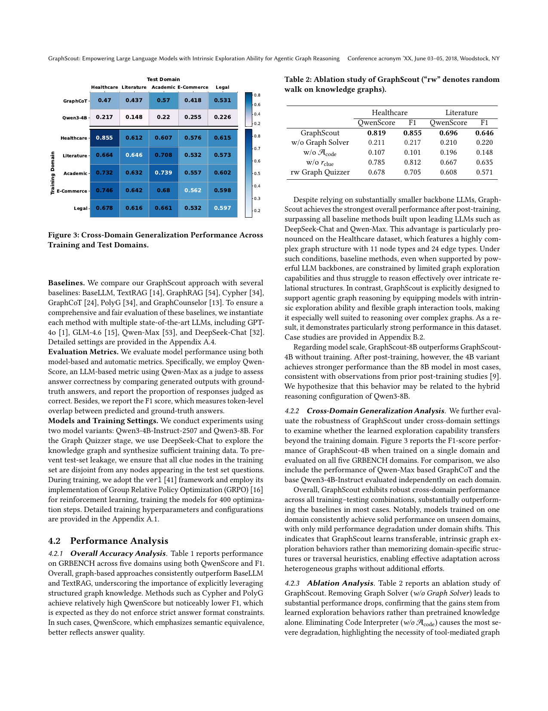
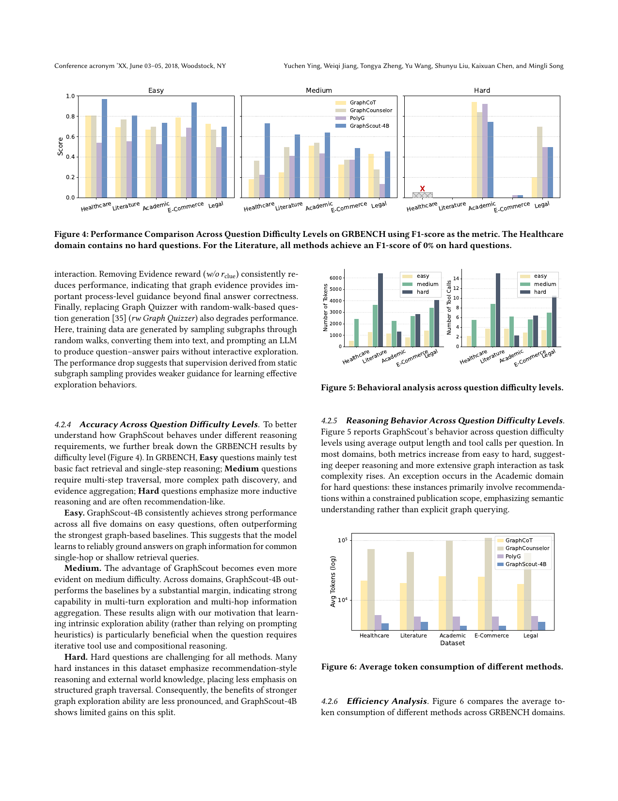

> [[../index|Wiki]] | [[../summary|Summary]] | [[../digest|Digest]]

# Experiments and Results

**In one sentence:** GraphScout, trained with GRPO on the GRBENCH benchmark across five domains and evaluated against seven baselines built on much larger frontier LLMs, achieves the strongest overall results (outperforming substantially larger LLMs by an average of 16.7%) while consuming far fewer tokens, and the small degradation when trained on one domain and tested on others shows the learned exploration behavior is transferable.

## Key points

- Despite using much smaller backbones (Qwen3-4B-Instruct-2507, Qwen3-8B), post-trained GraphScout surpasses all baselines built on GPT-4o, GLM-4.6, Qwen-Max, and DeepSeek-Chat; the paper concludes small-parameter LLMs equipped with GraphScout outperform substantially larger LLMs by an average of **16.7%**.
- The advantage is most pronounced on Healthcare, whose highly complex graph structure has **11 node types and 24 edge types**; even LLM-backed baselines struggle there due to limited graph exploration capabilities.
- Before training, GraphScout-8B outperforms GraphScout-4B; after post-training the **4B variant is stronger in most cases** (possibly related to the hybrid reasoning configuration of Qwen3-8B).
- Cross-domain: GraphScout-4B trained on a single domain keeps high F1 on unseen domains — e.g., Healthcare-trained scores **0.855** on Healthcare and **0.612–0.615** on the four other domains — versus GraphCoT's per-domain F1 of 0.418–0.570 and base Qwen3-4B's 0.148–0.255; degradation off-diagonal is only mild.
- Ablation (Healthcare): removing the Graph Solver collapses performance to **0.211 QwenScore / 0.217 F1** (from 0.819 / 0.855); removing the Code Interpreter tool (**w/o 𝒜code**) drops further to **0.107 / 0.101**, the largest single drop; removing the clue-based reward (**w/o r_clue**) gives **0.785 / 0.812** (a small drop); replacing Graph Quizzer with random-walk question generation (**rw Graph Quizzer**) gives **0.678 / 0.705**.
- By difficulty (F1): GraphScout-4B clearly leads on Easy and Medium; gains are limited on Hard because hard instances are recommendation-style reasoning relying more on external world knowledge than structured graph traversal; Literature's hard split is **0% F1 for every method** and Healthcare contains no hard questions.
- Efficiency: average output length grows with difficulty (up to ~6000+ tokens and up to ~14 tool calls on hard Literature); on log-scale average token consumption, GraphCoT and GraphCounselor use ~10⁴–10⁵ tokens while PolyG and GraphScout-4B use roughly an order of magnitude less — and GraphScout-4B still delivers superior accuracy.

---

## Experimental setup

**Dataset.** Experiments use the GRBENCH dataset, containing graphs from five domains — Healthcare, Literature, Academic, E-Commerce, and Legal — with a total of **1,740 questions** categorized into three difficulty levels (easy, medium, hard); all questions are in English.

**Baselines.** GraphScout is compared against **BaseLLM, TextRAG, GraphRAG, Cypher, GraphCoT, PolyG, and GraphCounselor**. Each baseline is instantiated with multiple state-of-the-art LLMs for a fair evaluation: **GPT-4o, GLM-4.6, Qwen-Max, and DeepSeek-Chat**.

**Metrics.** Two metrics are reported: **QwenScore**, an LLM-based metric using Qwen-Max as a judge that compares generated outputs with ground-truth answers and reports the proportion judged correct, and **F1**, token-level overlap between predicted and ground-truth answers.

**Models and training.** Two GraphScout variants are trained: **Qwen3-4B-Instruct-2507** and **Qwen3-8B**. The Graph Quizzer stage uses **DeepSeek-Chat** to explore the knowledge graph and synthesize training data. To prevent test-set leakage, all clue nodes in the training set are kept disjoint from nodes appearing in test-set questions. Training uses the **verl** framework with its implementation of **GRPO** (Group Relative Policy Optimization) for reinforcement learning, for **400 optimization steps**.

## Overall accuracy

Table 1 reports performance on GRBENCH across the five domains using both QwenScore and F1. The chunk text draws these findings: graph-based approaches consistently outperform BaseLLM and TextRAG, underscoring the importance of explicitly leveraging structured graph knowledge. Cypher and PolyG achieve relatively high QwenScore but noticeably lower F1, as expected since they do not enforce strict answer-format constraints; in such cases QwenScore (which emphasizes semantic equivalence) is the better quality signal. Despite relying on substantially smaller backbone LLMs, GraphScout achieves the **strongest overall performance after post-training**, surpassing all baseline methods built upon leading LLMs such as DeepSeek-Chat and Qwen-Max. The gap is largest on Healthcare (11 node types, 24 edge types), where powerfully backed baselines are constrained by limited graph exploration ability. (Per-domain F1 for GraphCoT and base Qwen3-4B, and the full GraphScout numbers on Healthcare/Literature, appear in the cross-domain and ablation sections below.)

## Cross-domain generalization

Figure 3 reports the F1-score of GraphScout-4B trained on a single domain and evaluated on all five GRBENCH domains, with reference rows for Qwen-Max–based GraphCoT and base Qwen3-4B-Instruct evaluated independently per domain. GraphScout exhibits robust cross-domain performance across all training–test combinations, substantially outperforming the baselines in most cases. Concretely, GraphScout-4B's F1 ranges from ~0.532 to 0.855 across the 5×5 matrix; e.g., Healthcare-training yields 0.855 on Healthcare and 0.612–0.615 on the other four domains. Models trained on one domain consistently achieve solid performance on unseen domains with only mild degradation under domain shift. This indicates GraphScout learns **transferable, intrinsic graph exploration behaviors** rather than memorizing domain-specific structures or traversal heuristics, enabling adaptation across heterogeneous graphs without additional effort.

## Ablation analysis

Table 2 ablates GraphScout on Healthcare and Literature (QwenScore / F1). Full GraphScout scores **0.819 / 0.855** (Healthcare) and **0.696 / 0.646** (Literature):

- **w/o Graph Solver:** 0.211 / 0.217 (Healthcare), 0.210 / 0.220 (Literature) — a substantial drop, confirming the gains stem from learned exploration behaviors rather than pretrained knowledge alone.
- **w/o 𝒜code (Code Interpreter tool):** 0.107 / 0.101 (Healthcare), 0.196 / 0.148 (Literature) — the most severe degradation, highlighting the necessity of tool-mediated graph interaction.
- **w/o r_clue (evidence/clue reward):** 0.785 / 0.812 (Healthcare), 0.667 / 0.635 (Literature) — consistent but milder reduction, showing graph evidence provides important process-level guidance beyond final-answer correctness.
- **rw Graph Quizzer (random-walk question generation):** 0.678 / 0.705 (Healthcare), 0.608 / 0.571 (Literature) — also degrades performance; here training data are made by sampling subgraphs through random walks, converting them to text, and prompting an LLM to produce QA pairs without interactive exploration, which proves a weaker supervision signal for learning exploration behaviors.

## Performance by difficulty level

Figure 4 breaks down GRBENCH results by difficulty using F1 (Easy: basic fact retrieval and single-step reasoning; Medium: multi-step traversal, path discovery, evidence aggregation; Hard: more inductive, often recommendation-like reasoning).

- **Easy:** GraphScout-4B consistently achieves strong performance across all five domains, often outperforming the strongest graph-based baselines — it reliably grounds answers on graph information for shallow retrieval queries.
- **Medium:** the advantage becomes even more evident; GraphScout-4B outperforms baselines by a substantial margin across domains, indicating strong multi-turn exploration and multi-hop information aggregation — the setting where intrinsic exploration (vs. prompting heuristics) is specifically beneficial.
- **Hard:** hard questions challenge all methods; many emphasize recommendation-style reasoning and external world knowledge with less emphasis on structured graph traversal, so the benefit of stronger exploration is less pronounced and GraphScout-4B shows limited gains. On the chart, GraphScout-4B leads clearly on Easy and Medium, while on Hard all methods struggle and the gap narrows or reverses in places (e.g., Legal). Healthcare contains no hard questions, and for Literature **all methods achieve 0% F1** on hard questions.

## Efficiency analysis

Figure 5 analyzes GraphScout's behavior by difficulty using average output length (tokens) and average tool calls per question. In most domains both metrics increase from easy to hard, suggesting deeper reasoning and more extensive graph interaction as complexity rises; values reach the highest on hard questions (up to ~6000+ tokens and up to ~14 tool calls on hard Literature). The exception is Academic's hard questions, which mainly involve recommendations within a constrained publication scope, emphasizing semantic understanding rather than explicit graph querying.

Figure 6 compares average token consumption across GRBENCH domains on a log scale. GraphScout-4B consistently uses **substantially fewer tokens** than the other active traversal-based baselines — GraphCoT and GraphCounselor operate in the ~10⁴–10⁵ token range, while PolyG and GraphScout-4B are roughly an order of magnitude lower — and this reduction does not come at the cost of performance: GraphScout achieves superior accuracy while maintaining significantly lower computational overhead.

## Discussion: Document-Centric vs. Native-KG Reasoning

The paper positions GraphScout against two representative GraphRAG settings:

- **Document-Centric** — constructs graphs on-the-fly from unstructured text corpora (e.g., HippoRAG, HyperGraphRAG, Graph-R1). Bottlenecked by graph construction quality, information loss during text-to-graph conversion, and effective multi-hop retrieval over noisy induced structures; its goal is improving retrieval and evidence connectivity across textual silos.
- **Native-KG Reasoning** — reasons over pre-existing curated knowledge graphs (e.g., GraphCoT, GraphCounselor, and GraphScout). It must jointly satisfy topological constraints and semantic grounding constraints; its goal is accurate multi-hop reasoning over explicit relational structure.

The settings differ in graph source (induced from text vs. persistent curated graphs), bottlenecks, and technical goals. Because they involve different inputs, failure modes, and evaluation priorities, the paper's empirical comparisons focus on baselines under the **Native-KG reasoning setting**, which is the setting directly addressed by GraphScout.

## Conclusion

The paper concludes by restating GraphScout as a framework that enhances LLMs' agentic graph reasoning with intrinsic exploration ability, built from three core components: **Agentic Graph Exploration Tools** (more flexible, programmable graph interaction for LLMs), **Graph Quizzer** (explores diverse, high-quality problem sets on graphs while recording traversal clues), and **Graph Solver** (post-trains LLMs to acquire intrinsic graph exploration ability). Extensive experiments against state-of-the-art GraphRAG methods show that small-parameter LLMs equipped with GraphScout significantly outperform substantially larger LLMs by an average of 16.7%, and that GraphScout exhibits promising cross-domain generalization — LLMs can develop generalized graph reasoning ability even when trained on a single graph. Future work will investigate bootstrapping via iterative self-questioning and self-answering in an iterative enhancement loop, while addressing challenges such as training instability and self-bias amplification.

**Covers:** Section 4 Experiment (4.1, 4.2 incl. sub-analyses), Section 5 Discussion, Section 6 Conclusion
