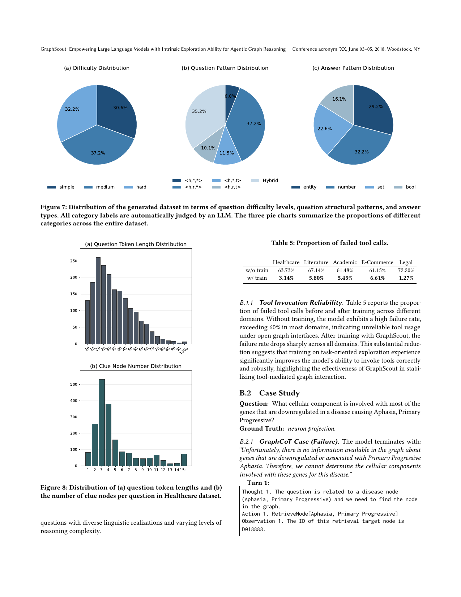

> [[../index|Wiki]] | [[../summary|Summary]] | [[../digest|Digest]]

# Implementation Details and Appendix

**In one sentence:** The concrete training/hardware setup (GRPO on 8x A800 with Qwen3 backbones), the full GRPO derivation, and the supporting evidence — de-conditioned diversity analysis of Graph Quizzer outputs, failed-tool-call rates collapsing from 60–72% to 1.3–6.6% after training, and a worked Healthcare case where GraphCoT fails via schema misuse while GraphScout recovers — that the framework's synthetic data and RL training genuinely work as intended.

## Key points

- Hardware: 8 NVIDIA A800-SXM4 GPUs (80 GB each) on a Linux/Ubuntu 20.04.5 LTS server with dual Intel Xeon Platinum 8358 CPUs, 1 TB system memory; CUDA 12.4; all post-training runs on the verl framework.
- RL is GRPO (not PPO): n_resp_per_prompt = 8, temperature 1.0, entropy threshold δ = 0.4, 400 optimization steps, 2000 training samples per dataset, backbones Qwen3-4B-Instruct-2507 and Qwen3-8B; actor learning rate 1e-6, clip_ratio [0.20, 0.28], initial KL coefficient 1e-4, prompt max length 4096 / generate max length 8192.
- GRBENCH: 10 real-world graphs over 5 domains (academic, e-commerce, literature, healthcare, legal) with 1,740 manually designed English QA pairs; graphs range from ∼84K nodes (Healthcare/Hetionet) to ∼84M nodes (Legal/Freelaw).
- Baselines (BaseLLM, TextRAG, GraphRAG, Cypher, GraphCoT, PolyG, GraphCounselor) are run on GPT-4o, GLM-4.6, Qwen-Max, and DeepSeek-Chat, with Qwen3-text-embedding-v4 for all vector-retrieval methods.
- Graph Quizzer diversity (de-conditioned LLM judge): difficulty is balanced (simple 30.6% / medium 37.2% / hard 32.2%); answer types balanced (entity 29.2%, number 32.2%, set 22.6%, bool 16.1%); pattern distribution is uneven with Hybrid 35.2% — attributed to medium+ questions needing multiple structural elements.
- Failed tool-call rate (Table 5) drops dramatically after GraphScout training: Healthcare 63.73% → 3.14%, Literature 67.14% → 5.80%, Academic 61.48% → 5.45%, E-Commerce 61.15% → 6.61%, Legal 72.20% → 1.27%.
- Case study: "What cellular component is involved with most of the genes downregulated in a disease causing Aphasia, Primary Progressive?" — GraphCoT misread the Symptom node D018888 as a Disease, retried non-existent neighbor types 6 turns and gave up INCORRECT; GraphScout diagnosed the entity-type mismatch, traced DISEASE_PRESENTS_SYMPTOM to Alzheimer's disease (250 downregulated genes), and answered "neuron projection" (35 genes, top of the ranking).

---

## RL hyperparameters and training setup

Appendix A.1 (Table 3) gives the GRPO training settings for GraphScout:

- **RL Algorithm:** GRPO, `n_resp_per_prompt = 8`, `Temperature = 1.0`, threshold **δ = 0.4**, **Optimization Steps = 400**, **Training samples per dataset = 2000**.
- **Backbone:** Qwen3-4B-Instruct-2507, Qwen3-8B.
- **GRPO Trainer:** Actor learning rate = 1 × 10⁻⁶, `clip_ratio = [0.20, 0.28]`, Initial KL Coefficient = 1 × 10⁻⁴.
- **Batch Sizes:** `train_batch_size = 16`, `rollout_batch_size = 16`, `micro_train_batch_size = 8`, `micro_rollout_batch_size = 16`.
- **Lengths:** Prompt Max Length = 4096, Generate Max Length = 8192.
- **Optimizations:** bf16, gradient_checkpointing, remove_padding, packing_samples, dynamic_batch_size, flash_attn.

## Hardware and software configuration

All experiments ran on a Linux server running **Ubuntu 20.04.5 LTS**, equipped with **8 NVIDIA A800-SXM4 GPUs (80 GB memory per GPU)** and **dual Intel Xeon Platinum 8358 CPUs with 1 TB system memory**. The system runs **CUDA 12.4**, and all post-training experiments used the **verl framework**.

## GRBENCH dataset details

GRBENCH is a graph-reasoning benchmark of LLM interaction with large-scale, text-attributed graphs: **ten real-world graphs over five domains** — academic, e-commerce, literature, healthcare, legal — with **1,740 manually designed English QA pairs** across easy/medium/hard difficulty; every question is answerable by explicit reasoning over the domain graph rather than parametric knowledge (Table 4):

- **Academic (6 graphs)** — CS ∼8M nodes/∼52M edges/150 Q, Biology ∼4M/∼39M/140, Chemistry ∼4M/∼30M/140, Material Science ∼3M/∼22M/140, Medicine ∼6M/∼30M/140, Physics ∼2M/∼33M/140. Built from DBLP and Microsoft Academic Graph; nodes are papers/authors/venues, edges are citation, authorship, venue relations; supports multi-hop citation/co-authorship reasoning.
- **E-commerce (Amazon)** — ∼9M nodes, **∼313M edges**, 200 Q. Items and brands; edges are also-viewed / also-bought / buy-after-viewing / bought-together; large, dense, aggregation-based tasks.
- **Literature (Goodreads)** — ∼3M/∼22M, 240 Q. Books/authors/publishers/series; authorship, publication, series, similarity edges.
- **Healthcare (Hetionet)** — ∼47K/∼4M, 270 Q (temp=27). Eleven heterogeneous node types (diseases, compounds, genes, symptoms, side effects); complex biomedical evidence aggregation.
- **Legal (Freelaw/CourtListener)** — ∼84M/∼114M, 180 Q. Opinions, opinion clusters, dockets, courts; citation and hierarchical judicial structures.

## Baseline configurations

Baselines are implemented per their original papers and run under the same evaluation protocol as GraphScout:

- **BaseLLM** — no graph; direct prompting, parametric knowledge only.
- **TextRAG** — KG linearized to text; dense retrieval of relevant chunks appended to the prompt.
- **GraphRAG** — retrieves subgraphs around core entities (typically 2-hop expansion), linearized into text context.
- **Cypher** — LLM writes a Cypher query; a node-retrieval module identifies candidate nodes before query execution.
- **GraphCoT** — multi-step LLM–graph interaction via predefined traversal tools in chain-of-thought fashion.
- **PolyG** — adaptive graph traversal choosing operators conditioned on query/observations; also augmented with a node-retrieval module.
- **GraphCounselor** — multi-agent planning/execution/reflection with self-correction.

All baselines are instantiated with **GPT-4o, GLM-4.6, Qwen-Max, and DeepSeek-Chat** (default/recommended decoding params), and every vector-retrieval method uses **Qwen3-text-embedding-v4** for embeddings.

## Group Relative Policy Optimization (GRPO) — derivation

GraphScout uses **GRPO**, a PPO variant that **eliminates the learned value function**: advantages are estimated from relative rewards within a sampled group, simplifying training and reducing compute.

For each question q, a group of |G| trajectories is sampled, τᵢ ∼ π_θold(·|q), each a full multi-step interaction (reasoning steps + tool invocations) ending in a final answer. A scalar reward rᵢ is assigned solely on the correctness/quality of the final outcome — intermediate steps are not explicitly supervised.

**Group-relative advantage:** normalize rewards within the group (Eq. 8):

- Aᵢ = (rᵢ − μ_G) / σ_G, where μ_G = (1/|G|) Σ rₖ and σ_G = sqrt((1/|G|) Σ (rₖ − μ_G)²).

This pushes the policy toward trajectories that outperform other candidates for the same question, with no critic network.

**Objective** (Eq. 10), with the importance-sampling ratio ρᵢ(θ) = π_θ(τᵢ|q) / π_θold(τᵢ|q) (Eq. 9):

L_GRPO(θ) = (1/|G|) Σᵢ min( ρᵢ(θ)·Aᵢ, clip(ρᵢ(θ), 1−ε, 1+ε)·Aᵢ ) − β·D_KL(π_θ ‖ π_ref)

where **ε** is the clipping hyperparameter, **β** controls the strength of the **KL regularization** against the frozen reference policy π_ref, keeping the updated policy close to the reference for stability during long-horizon reasoning.

## Graph Quizzer diversity analysis

To test whether the synthetic data is genuinely diverse, the authors run a **de-conditioned automatic annotation**: **DeepSeek-Chat judges each generated question without seeing the original generation parameters** (the per-question difficulty/pattern/answer-type combinations are deliberately withheld); only category definitions plus the question are given, so the judge independently assigns each question's task-category combination. This post-hoc semantic check guards against the generator not fully honoring its instructions (Figures 7, 8):

- **Difficulty (Fig 7a):** balanced — simple 30.6%, medium 37.2%, hard 32.2%.
- **Answer type (Fig 7c):** balanced — entity 29.2%, number 32.2%, set 22.6%, bool 16.1%.
- **Question pattern (Fig 7b):** more uneven — <h,\*,\*> 37.2%, Hybrid 35.2%, <h,r,\*> 11.5%, <h,r,t> 10.1%, <h,\*,t> 6.0%. The authors hypothesize the hybrid excess arises because medium+ questions cannot be met by simple single-structure patterns.
- **Structural (Fig 8, Healthcare):** question token length shows substantial variation with a long right tail (peak around 20–30, tail past 100 tokens); clue-node count spans single-clue questions to multiple cues (peak 3–4, tail to 15+).

Conclusion: the generated set covers diverse linguistic realizations and reasoning-complexity levels.

## Tool invocation reliability

Table 5 reports the **proportion of failed tool calls** per domain, before ("w/o train") vs after ("w/ train") GraphScout training:

| Domain | w/o train | w/ train |
|---|---|---|
| Healthcare | 63.73% | 3.14% |
| Literature | 67.14% | 5.80% |
| Academic | 61.48% | 5.45% |
| E-Commerce | 61.15% | 6.61% |
| Legal | 72.20% | 1.27% |

Untrained, the model exceeds a 60% tool-call failure rate in most domains (unreliable tool use under open graph interfaces); after training the failure rate drops sharply across all domains — evidence that training on task-oriented exploration experience stabilizes tool-mediated graph interaction.

## Case study

**Question (Healthcare):** "What cellular component is involved with most of the genes that are downregulated in a disease causing Aphasia, Primary Progressive?" **Ground truth:** *neuron projection*.

**GraphCoT (failure)** — 6 turns, ends INCORRECT. Turn 1: `RetrieveNode[Aphasia, Primary Progressive]` → node D018888. Turn 2: `NeighbourCheck[D018888, Disease-downregulates-Gene]` → "node or neighbor type does not exist". Turns 3–5: re-retrieval (same ID D018888) and retries of `Disease-downregulates-Gene` and `Disease-associates-Gene`, all failing with the same "does not exist" observation. Turn 6: `Finish[...no information available in the graph...]` → answer marked INCORRECT.

**GraphScout (success)** — 9 turns, answers `neuron projection`:
1. Decomposes the question into 4 steps; calls `node_id_retriever` (topk 2) → D018888 (**Symptom**, not Disease) plus a distractor D057178.
2. Flags the entity-type mismatch; Cypher query of outgoing relations from D018888 → only `DISEASE_PRESENTS_SYMPTOM` (2).
3. Traverses `DISEASE_PRESENTS_SYMPTOM` to diseases: DOID:11949 (Creutzfeldt-Jakob) and DOID:10652 (Alzheimer's).
4. Checks `DISEASE_DOWNREGULATES_GENE` for CJD → 0 genes.
5. Same check for Alzheimer's → **250 genes**.
6. Aggregates `GENE_PARTICIPATES_CELLULAR_COMPONENT` → top: `GO:0043005 neuron projection` with 35 genes.
7–8. Re-runs the full ranking to confirm: neuron projection 35 > synapse 30 > membrane protein complex 27.
9. Final `\answer{neuron projection}`.

**Analysis (B.2.3):** GraphCoT fails from a **tool-to-schema mismatch** — it assumes D018888 is a Disease and keeps querying non-existent neighbor types, then declares the graph empty. GraphScout has a two-level advantage: at the **reasoning level** it diagnoses that the retrieved node is a Symptom and builds a corrective plan (find presenting diseases → find downregulated genes → aggregate components); at the **tool level** it uses executable Cypher to validate available relation types, traverse to candidate diseases, verify which disease has `DISEASE_DOWNREGULATES_GENE` edges, and aggregate with `count(DISTINCT g)`. This schema-aware reasoning + executable graph operations lets it recover from the initial ambiguity and produce a verifiable answer.

**Covers:** Appendix A (Implementation Details, A.1-A.5), Appendix B (Additional Analysis and Experiments, B.1-B.2)
