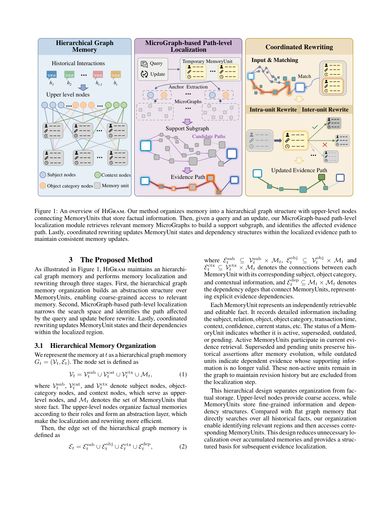

[[../index|Wiki]] | [[../summary|Summary]]

# Hierarchical Memory and the HiGram Method

**In one sentence:** HiGram organizes agent memory into a two-tier hierarchical graph (upper-level abstraction nodes over fine-grained MemoryUnits) and, given a query and an update, localizes the affected evidence path via MicroGraphs before performing coordinated intra-unit and inter-unit rewrites strictly within that bounded region.

## Key points

- Existing graph-based agent memories are flat and unit-independent: retrieval over an ever-growing flat graph pulls in irrelevant context, and independent unit-wise rewrites require repeated global searches to cover all changes an update propagates, causing high token cost.
- HiGram's core diagnosis: there is a granularity mismatch between how memory is organized/updated (over the whole graph, per unit) and how evidence is actually used (small, localized, interconnected evidence paths).
- The hierarchical memory separates coarse organization (subject / object-category / context upper-level nodes) from fine factual storage (MemoryUnits with explicit inter-unit dependency edges and lifecycle statuses: active, superseded, outdated, pending).
- MicroGraphs are not new memory layers but localized views of the global graph keyed by a (subject, object-category) node pair — chosen because both are stable across temporal updates — used to cheaply retrieve the relevant memory region before detailed evidence selection.
- Path-level localization: temporary MemoryUnits for the query/update → anchor extraction → candidate MicroGraph selection (relevance-ranked, top-Kg) → support subgraph → enumeration of up to Kp candidate evidence paths scored by attribute matching, dependency consistency, temporal validity, and contextual compatibility → single selected evidence path = the rewrite region.
- Coordinated rewriting works only inside the selected path: intra-unit rewriting updates affected MemoryUnit states (new facts committed as active, existing ones revised with temporal/contextual consistency), then inter-unit rewriting re-validates the dependencies of dependent MemoryUnits — dependencies are never blindly inherited and unsupported downstream conclusions are marked outdated.
- Positioning: unlike flat graph-memory baselines and few concurrent hierarchical works (which focus on consolidation), HiGram is the first (in this framing) to combine coarse-to-fine graph organization with query- AND update-conditioned evidence-path localization plus coordinated dependency revision.
- Reported effect (LoCoMo table in this chunk): HiGram improves answer quality (F1/BLEU/LLM-judge across single-hop, multi-hop, open-domain, temporal, adversarial questions) while running at ~2k average token length — far below LLM-based baselines like LoCoMo (~28k), ReadAgent (~14.7k), MemGPT (~4.2k).

## Full detail

### Problem: why flat / unstructured memory graphs fail

Long-horizon reasoning agents need memory that can be efficiently and effectively updated as new facts, corrections, and external feedback keep arriving. Memory-augmented systems already help by storing conversation history, retrieving past experience, compressing context, or maintaining personalized stores. Graph-based memory extends this with structural organization for entities, relations, events, and temporal information, supporting multi-hop retrieval and reasoning.

Two practical failure modes remain in existing graph-memory approaches:

1. **Retrieval cost grows with the flat graph.** Most methods store all memories in one flat graph with no explicit coarse-to-fine organization. As historical memories accumulate, retrieval over the whole structure introduces substantial irrelevant context, raising the cost of evidence selection during reasoning and maintenance.
2. **Unit-independent updates are incomplete and expensive.** Existing methods update memory units independently. But answers are typically supported by interconnected evidence paths rather than isolated facts. An update targeting one unit can propagate along those paths; independent unit-wise updates therefore omit relevant evidence and leave outdated dependencies still participating in subsequent reasoning. Correcting this requires repeated unit-wise rewrites (each needing fresh global search) to cover all related changes — high token consumption and low update efficiency.

HiGram's motivating argument is that these symptoms stem from a **granularity mismatch**: retrieval and update operate over the whole continuously expanding graph (and per unit), while an answer depends on only a small localized evidence structure. The fix is to (a) first localize the query-relevant subgraph, (b) identify the evidence paths affected by the current update, and (c) jointly revise memory states and their dependencies inside that bounded region. This reduces both irrelevant retrieval and repeated rewriting. HiGram is evaluated on long-term conversational QA (LoCoMo) and conflict-aware memory evaluation (MemConflict), showing substantial gains in answer quality and token efficiency over strong baselines, plus improved answer accuracy and query-valid evidence selection under dynamic, static, and conditional conflicts.

### Related work positioning

- **Long-term and structured memory.** Early systems stored dialogue histories, reusable experiences, or compressed memories; later work improved scalability via hierarchical management, virtual context expansion, and latent memory, and recently multi-level organization for long-horizon reasoning. Agent-orientation added reflection, self-improvement, and evolving user profiles. Graph- and temporal-structured memory methods organize entities, relations, and history, but operating on the whole graph still increases localization cost. Few concurrent works adopt hierarchical graph memory, but mainly for memory *consolidation*; HiGram instead uses hierarchy for coarse-to-fine **localization** of graph evidence structures.
- **Evidence localization for reasoning and memory maintenance.** RAG-era work established that effective reasoning requires query-conditioned evidence localization rather than context expansion. But memory-maintenance methods still mainly store/link/revise *individual* memory units without first identifying the affected evidence structures. HiGram adds path-level localization that considers both query- and update-conditioned evidence to determine the rewrite region *before* revision.
- **Continual updating and conflict-aware revision.** Temporal KG methods and lifecycle (store/update/consolidate/preserve) management exist, and continual knowledge revision / model-editing studies handle conflicts — but each typically revises individual units or isolated facts, requiring repeated global search per update. HiGram differs by jointly updating MemoryUnit states and inter-unit dependencies within the localized evidence region via MicroGraph localization + coordinated rewriting.

### 3.1 Hierarchical memory organization

Memory at time *t* is a hierarchical graph **G_t = (V_t, E_t)** with:

- **Nodes** V_t = V_t^sub ∪ V_t^cat ∪ V_t^ctx ∪ M_t, where V_t^sub (subject), V_t^cat (object-category), and V_t^ctx (context) are the **upper-level nodes**, and M_t is the set of **MemoryUnits** that store the facts. Upper-level nodes organize factual memories by their roles, forming an abstraction layer that makes localization and rewriting more efficient.
- **Edges** E_t = E_t^sub ∪ E_t^obj ∪ E_t^ctx ∪ E_t^dep. E_t^sub ⊆ V_t^sub × M_t, E_t^obj ⊆ V_t^cat × M_t, and E_t^ctx ⊆ V_t^ctx × M_t connect each MemoryUnit to its subject, object category, and context; E_t^dep ⊆ M_t × M_t are **dependency edges** between MemoryUnits, encoding explicit evidence dependencies.

A **MemoryUnit** is an independently retrievable and editable fact recording subject, relation, object, object category, transaction time, context, confidence, and current **status**. Statuses:
- **active** — participates in current evidence retrieval;
- **superseded** / **pending** — historical assertions preserved after memory evolution;
- **outdated** — dependent evidence whose supporting information is no longer valid.

Non-active units stay in the graph to preserve revision history but are **excluded from localization**.

The design principle is separation of organization from factual storage: upper-level nodes give coarse access, MemoryUnits hold fine-grained facts and explicit dependency structure. Compared with a flat graph that searches over all historical facts, this lets the system identify relevant regions first and then access only the corresponding MemoryUnits — reducing unnecessary localization over accumulated memories and providing the structured basis for the next stage.

*Figure 1 walks through these three stages in order. On the left, historical interactions h₁…hᵢ are abstracted into the upper-level nodes (subject, context, object-category) that connect down to self-contained MemoryUnits (subject/relation/object, category, time) — the two-tier layout that gives coarse-grained routing over fine-grained factual storage. In the middle, the query plus the update produce a temporary MemoryUnit; anchor extraction pulls in the relevant MicroGraphs to assemble the support subgraph, from which candidate paths are scored down to a single highlighted evidence path. On the right, that evidence path goes through input & matching, then intra-unit and inter-unit rewrites with accepted/rejected (✓/✗) branches, yielding the updated evidence path.*

### 3.2 MicroGraph-based path-level localization

**MicroGraph construction.** Memory is organized into **MicroGraphs** — localized regions of the global graph, not additional memory layers. A MicroGraph B_{t,j} ⊆ G_t is determined by a pair (v^sub, v^cat) of subject and object-category nodes: the subject node identifies the entity-centered memory region, while the object-category node gives a coarse semantic constraint over the stored facts. These two attributes are chosen because they are **stable across temporal updates** and give efficient access before detailed evidence-path selection. The MicroGraph associated with B_{t,j} is the set of MemoryUnits whose subject and object-category match that pair, plus the corresponding context nodes and dependency edges. A MicroGraph adds no memory content; it is a view that enables efficient retrieval and localization.

Given query q_t and available update text u_t, the procedure is:

1. **Temporary MemoryUnits** M_t^temp are constructed for the query/update. They follow the MemoryUnit schema but remain **outside** the graph memory during localization; only update-derived units are committed after rewriting.
2. **Anchor extraction**: A_t = anch(M_t^temp) — the subject and object-category anchors are pulled from the temporary units.
3. **Candidate MicroGraphs**: B_t^cand = all MicroGraphs containing at least one MemoryUnit whose {subject, object-category} intersects the anchors. Candidates are ranked by a relevance score R(B, A_t) that measures subject matching and object-category compatibility between the anchors and the MicroGraph's MemoryUnits; the top-K_g MicroGraphs B*_t = TopK_{K_g}(B_t^cand, R) are selected as the localized memory region.
4. **Support subgraph** G_{S,t}: the MemoryUnits associated with the selected MicroGraphs, together with their subject nodes, object-category nodes, context nodes, and dependency edges.

**Path-level localization.** The support subgraph narrows the space but still contains multiple evidence structures, and an update may affect only specific paths. An **evidence path** is a connected chain within G_{S,t} whose MemoryUnits and dependency edges collectively support the answer to the current query. Localization then:

- enumerates connected MemoryUnit paths (adjacency via explicit dependency edges or valid structural relations retained in G_{S,t}), up to K_p candidate paths P_t^cand;
- scores each candidate by **ϕ_H(P, M_t^temp)** — consistency with the temporary MemoryUnits considering attribute matching, dependency consistency, temporal validity, and contextual compatibility;
- selects the affected evidence path P*_t = argmax_P ϕ_H(P, M_t^temp).

The MemoryUnits in P*_t plus their dependency edges **define the rewrite region** for the next stage — this is the bounded area in which any memory change will occur.

### 3.3 Coordinated rewriting

The goal is **not** to overwrite history, but to keep the evidence structure consistent so that updated facts and their dependent conclusions remain valid. After path-level localization fixes P*_t, rewriting happens inside that fixed region:

1. **Input & matching.** The temporary MemoryUnits M_t^temp are matched against the MemoryUnits in P*_t to identify which units are affected.
2. **Intra-unit rewriting.** For each temporary unit m̄_j, the matched MemoryUnit m_i in P*_t is located; existing records are preserved while internal state and valid-time information are revised according to the new evidence. If m̄_j introduces a **new memory**, it is committed as an active MemoryUnit; if it **updates an existing memory**, the matched unit's state is revised according to temporal and contextual consistency with m̄_j. Updated MemoryUnits are set **active**, since they now represent current valid evidence.
3. **Inter-unit rewriting.** State changes of the updated units determine which dependency relations are affected. The directly dependent units D_t(m_i) = {m ∈ M_t(P*_t) : (m_i, m) ∈ E_t^dep} are identified — dependency edges are directed from supporting units to dependent units. For each dependent unit, the method checks whether its supporting evidence is still consistent:
   - if consistent → the dependent unit is **preserved**;
   - otherwise → it is **marked outdated** and excluded from the current evidence view.
   
   Importantly, dependencies of an updated MemoryUnit are **not inherited** from the original unit: the updated unit may have a different evidence scope and cannot always support the same downstream conclusions. Dependencies are retained only when supported by valid evidence, which prevents unsupported derived conclusions from surviving the update (the accept/reject branches in Figure 1).

Both rewrites are applied jointly within the same localized region —
G_{t+1} = Update( G_t, Rewrite_intra(P*_t, M_t^temp), M_t^temp ) —
so memory states and dependency structures evolve with respect to the same update evidence. All MemoryUnits and relations **outside the rewrite region remain unchanged**, which is what avoids the repeated global rewrites of flat-memory baselines.
