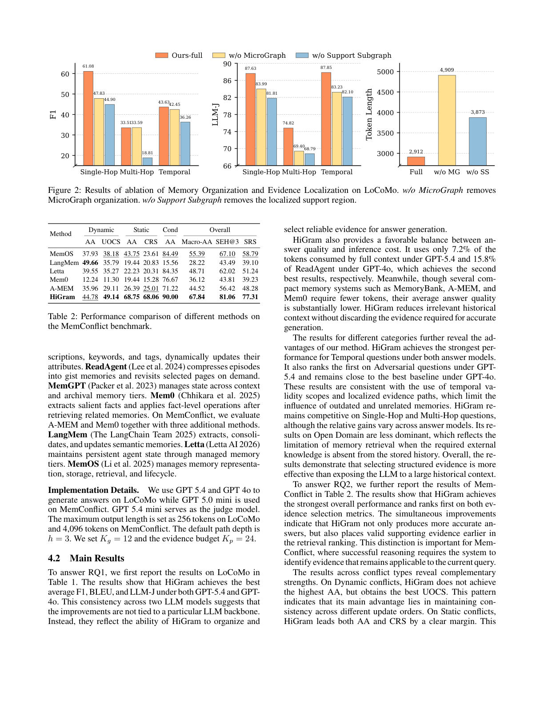
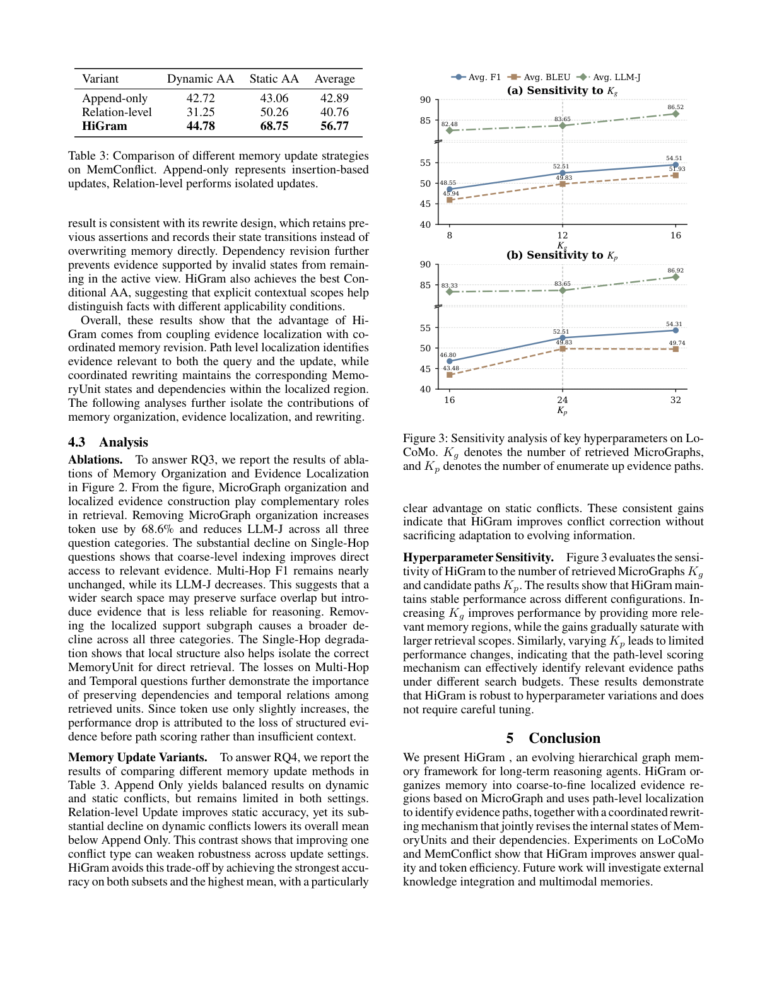

[[../index|Wiki]] | [[../summary|Summary]]

# Experiments and Results

**In one sentence:** HiGram achieves the best average F1, BLEU, and LLM-Judge scores on LoCoMo across two backbones (GPT-5.4 and GPT-4o) while using only 7.2% of the tokens of full-context, and it ranks first on all overall and evidence-selection metrics on MemConflict, with both its MicroGraph organization and localized support subgraph contributing complementary, load-bearing roles.

## Key points

- **Benchmarks.** LoCoMo (five question categories: Single-Hop, Multi-Hop, Open Domain, Temporal, Adversarial) and MemConflict (Dynamic, Static, Conditional conflict subsets).
- **Baselines.** LoCoMo: LoCoMo (full context), MemoryBank, A-MEM, ReadAgent, MemGPT, Mem0. MemConflict: A-MEM, Mem0, LangMem, Letta, MemOS.
- **Headline (LoCoMo).** HiGram wins on average F1, BLEU, and LLM-J under both GPT-5.4 and GPT-4o; its token length of ~2,912 is 7.2% of full-context (4,909) tokens and 15.8% of ReadAgent's (3,873) under GPT-4o.
- **Headline (MemConflict).** HiGram leads on Macro-AA (67.84), SEH@3 (81.06), and SRS (77.31), with best Static AA (68.75) and Cond AA (90.00); it is best on UOCS for Dynamic conflicts.
- **Ablation.** Removing MicroGraph raises token use by 68.6% and drops LLM-J on all categories; removing the support subgraph causes the broadest quality decline, especially on Multi-Hop F1 (~33 to ~19).
- **Update strategy (Table 3).** HiGram's coordinated rewrite outperforms both Append-Only (avg 42.89) and Relation-level (avg 40.76) update strategies, achieving 56.77 average with the strongest Static AA (68.75).
- **Hyperparameters.** Performance is stable across K_g (8–16) and K_p (16–32); gains are gentle and saturating, so careful tuning is unnecessary.

## Full detail

### Experimental setup

HiGram is evaluated against four research questions: RQ1 (can it improve long-term QA quality and token efficiency), RQ2 (can it maintain consistent memory under conflicting updates), RQ3 (how do memory organization and evidence localization affect performance), and RQ4 (how does it compare with different memory update strategies).

**Datasets and metrics.** Two benchmarks are used. **LoCoMo** (Maharana et al. 2024) provides long multi-turn conversations with five question categories—Single-Hop, Multi-Hop, Open Domain, Temporal, and Adversarial—and their reference answers. For each category the authors report token-level F1, BLEU-1, and an LLM-as-Judge score (LLM-J); F1 and BLEU measure lexical overlap against the reference while LLM-J evaluates semantic correctness. A Token Length metric reports the total input + output tokens consumed by the final answer-generation call, explicitly excluding offline memory construction and update cost. **MemConflict** (Tao et al. 2026) provides long interaction histories containing memory conflicts, split into three subsets: Dynamic (tests temporal validity of updated facts), Static (resistance to incorrect replacement of still-valid facts), and Conditional (tests whether a value applies under the current condition). Following the benchmark, different metrics are used per category: Answer Accuracy (AA), Update Order Consistency Score (UOCS) for Dynamic, Conflict Recognition Score (CRS) for Static, Macro Answer Accuracy (Macro-AA) as the unweighted average across the three types, SEH@3 (whether the gold evidence appears in the top-3 retrieved items), and Support Rank Score (SRS) which applies a logarithmic discount to the evidence rank. Higher is better on every metric.

**Baselines.** On LoCoMo, six baselines are compared: **LoCoMo** (full dialogue history in the generation prompt), **MemoryBank** (Zhong et al. 2024, textual memories with a forgetting-curve retention mechanism), **A-MEM** (Xu et al. 2026, atomic notes with contextual descriptions, keywords, and tags, updated dynamically), **ReadAgent** (Lee et al. 2024, compresses episodes into gist memories and revisits selected pages on demand), **MemGPT** (Packer et al. 2023, manages state across context and archival memory tiers), and **Mem0** (Chhikara et al. 2025, extracts salient facts and applies fact-level operations after retrieving related memories). On MemConflict, five baselines are evaluated: **A-MEM**, **Mem0**, **LangMem** (The LangChain Team 2025, extracts and consolidates semantic memories), **Letta** (Letta AI 2026, maintains persistent agent state through managed memory tiers), and **MemOS** (Li et al. 2025, manages memory representation, storage, retrieval, and lifecycle).

**Implementation.** GPT-5.4 and GPT-4o are used as the answer-generation models on LoCoMo (evaluated under both backbones); GPT-5.0-mini is used on MemConflict. GPT-5.4-mini serves as the LLM judge. Maximum output length is 256 tokens on LoCoMo and 4,096 tokens on MemConflict. The default path depth is h = 3, the number of retrieved MicroGraphs is K_g = 12, and the evidence budget is K_p = 24.

### Main results — LoCoMo (RQ1)

Table 1 reports per-category and overall results. HiGram achieves the best average F1, BLEU, and LLM-J under both GPT-5.4 and GPT-4o. The fact that the advantage holds across two different backbones indicates that the gain is not tied to a particular LLM but reflects HiGram's ability to organize and select reliable evidence for answer generation.

Token efficiency is a distinct strength. HiGram's Token Length of ~2,912 is only 7.2% of the 4,909 tokens used by full-context under GPT-5.4, and only 15.8% of ReadAgent's 3,873 tokens under GPT-4o (where ReadAgent is the second-best method). Compact baselines such as MemoryBank, A-MEM, and Mem0 use even fewer tokens, but their average answer quality is substantially lower.

By category, HiGram is strongest on Temporal questions under both answer models, consistent with its use of temporal validity scopes and localized evidence paths that limit the influence of outdated or unrelated memories. It also ranks first on Adversarial under GPT-5.4 and remains close to the best baseline under GPT-4o. On Single-Hop and Multi-Hop it is competitive, though the relative gain varies by backbone. On Open Domain it is less dominant, a limitation the authors attribute to the fact that memory retrieval cannot supply external knowledge that is absent from the stored history. The overall message is that selecting structured, localized evidence is more effective than exposing the LLM to a large historical context.

### Main results — MemConflict (RQ2)

Table 2 reports per-conflict-type and overall results. HiGram achieves the strongest overall performance and ranks first on both evidence-selection metrics (SEH@3 and SRS). The simultaneous improvement on answer quality and evidence ranking indicates that HiGram not only answers more accurately but also places the valid supporting evidence earlier in the retrieval ranking, which is the capability MemConflict is designed to test.

| Method | Dyn AA | UOCS | Stat AA | CRS | Cond AA | Macro-AA | SEH@3 | SRS |
|--------|--------|------|---------|-----|---------|----------|-------|-----|
| MemOS  | 37.93  | 38.18| 43.75   | 23.61| 84.49   | 55.39    | 67.10 | 58.79|
| LangMem| 49.66  | 35.79| 19.44   | 20.83| 15.56   | 28.22    | 43.49 | 39.10|
| Letta  | 39.55  | 35.27| 22.23   | 20.31| 84.35   | 48.71    | 62.02 | 51.24|
| Mem0   | 12.24  | 11.30| 19.44   | 15.28| 76.67   | 36.12    | 43.81 | 39.23|
| A-MEM  | 35.96  | 29.11| 26.39   | 25.01| 71.22   | 44.52    | 56.42 | 48.28|
| **HiGram**| **44.78**| **49.14**| **68.75**| **68.06**| **90.00**| **67.84**| **81.06**| **77.31**|

The per-conflict breakdown reveals complementary strengths. On Dynamic conflicts HiGram does not achieve the highest raw AA (LangMem's 49.66 is marginally higher), but it obtains the best UOCS (49.14), indicating that its primary advantage is maintaining consistency across different update orders. On Static conflicts HiGram leads both AA (68.75) and CRS (68.06) by a clear margin; this is consistent with its rewrite design, which retains previous assertions and records their state transitions instead of overwriting memory directly, while dependency revision prevents evidence supported by invalid states from persisting in the active view. On Conditional conflicts HiGram achieves the best AA (90.00), suggesting that explicit contextual scopes help distinguish facts with different applicability conditions.

The authors attribute HiGram's MemConflict advantage to the coupling of evidence localization with coordinated memory revision: path-level localization identifies evidence relevant to both the query and the update, while coordinated rewriting maintains the corresponding MemoryUnit states and dependencies within the localized region.

### Ablation study — memory organization and evidence localization (RQ3, Figure 2)

Figure 2 presents a three-panel ablation on LoCoMo comparing the full system (Ours-full) against two variants: one with MicroGraph organization removed (w/o MicroGraph) and one with the localized support subgraph removed (w/o Support Subgraph). The first two panels measure answer quality (F1 and LLM-J) across the Single-Hop, Multi-Hop, and Temporal categories; the third panel measures inference cost in token length.

Removing MicroGraph organization increases token use by 68.6% (from ~2,912 to ~4,909 tokens) and reduces LLM-J across all three question categories. The degradation is most pronounced on Single-Hop (F1 drops from ~61 to ~48, LLM-J from ~88 to ~84), showing that coarse-level indexing improves direct access to relevant evidence. Multi-Hop F1 is nearly unchanged while its LLM-J decreases, suggesting that without MicroGraph the wider search space preserves surface lexical overlap but introduces evidence that is less reliable for reasoning.

Removing the localized support subgraph causes the broadest decline across all three categories. Single-Hop degradation shows that local structure also helps isolate the correct MemoryUnit for direct retrieval. The losses on Multi-Hop (F1 drops from ~33 to ~19, the single largest quality drop in the figure) and Temporal questions demonstrate the importance of preserving dependencies and temporal relations among retrieved units. Since token use increases only modestly in this variant (to ~3,873), the performance drop is attributed to the loss of structured evidence before path scoring, not to insufficient context.

The ablation makes clear that both components are load-bearing and play complementary roles: MicroGraph organization primarily drives token efficiency and single-hop accuracy, while the localized support subgraph is critical for multi-hop reasoning. The full architecture delivers the highest quality at the lowest inference cost (~2,912 tokens), and neither ablation—which trades quality for higher token usage—is preferable.

### Memory update strategy comparison (RQ4, Table 3)

Table 3 compares three memory update strategies on the MemConflict benchmark: Append-Only (insertion-based updates that never modify existing records), Relation-level (performs isolated updates to individual relations), and HiGram's coordinated rewrite approach.

| Strategy | Dynamic AA | Static AA | Average |
|----------|-----------|-----------|---------|
| Append-only | 42.72 | 43.06 | 42.89 |
| Relation-level | 31.25 | 50.26 | 40.76 |
| **HiGram** | **44.78** | **68.75** | **56.77** |

Append-Only yields balanced but modest results on both conflict types. Relation-level Update improves Static AA (50.26) but suffers a substantial decline on Dynamic AA (31.25), pulling its overall average (40.76) below Append-Only. This contrast shows that improving one conflict type can weaken robustness across update settings. HiGram avoids this trade-off by achieving the strongest accuracy on both subsets and the highest mean (56.77), with a particularly clear advantage on Static conflicts. These consistent gains indicate that HiGram's coordinated rewriting improves conflict correction without sacrificing adaptation to evolving information.

### Hyperparameter sensitivity (Figure 3)

Figure 3 evaluates HiGram's sensitivity to its two primary retrieval hyperparameters on LoCoMo. Panel (a) varies K_g, the number of retrieved MicroGraphs (tested at 8, 12, and 16), and panel (b) varies K_p, the number of enumerated evidence paths (tested at 16, 24, and 32). Three metrics are tracked in each panel: Avg. F1, Avg. BLEU, and Avg. LLM-J.

In both subplots, all three metrics rise monotonically but only gradually as the corresponding hyperparameter increases, then begin to flatten. LLM-J is consistently the highest curve, hovering in the low-to-mid 80s, while F1 and BLEU sit lower (roughly the mid-40s to mid-50s) and track each other closely; BLEU in panel (b) is nearly flat between the last two K_p settings. The curves are gently increasing and saturating rather than sharply peaked.

This stability indicates that larger K_g helps modestly by providing more relevant memory regions, with gains saturating as the retrieval scope grows, and that varying K_p produces only limited change because the path-level scoring mechanism can effectively identify relevant evidence paths under different search budgets. The practical implication is that HiGram is robust to hyperparameter variation and does not require careful tuning of K_g or K_p for good performance.

### Conclusion

The paper concludes that HiGram—an evolving hierarchical graph memory framework—organizes memory into coarse-to-fine localized evidence regions built on MicroGraph, uses path-level localization to identify evidence paths, and applies a coordinated rewriting mechanism that jointly revises the internal states of MemoryUnits and their dependencies. Experiments on LoCoMo and MemConflict demonstrate improvements in both answer quality and token efficiency. The authors note that future work will investigate external knowledge integration and multimodal memories.
