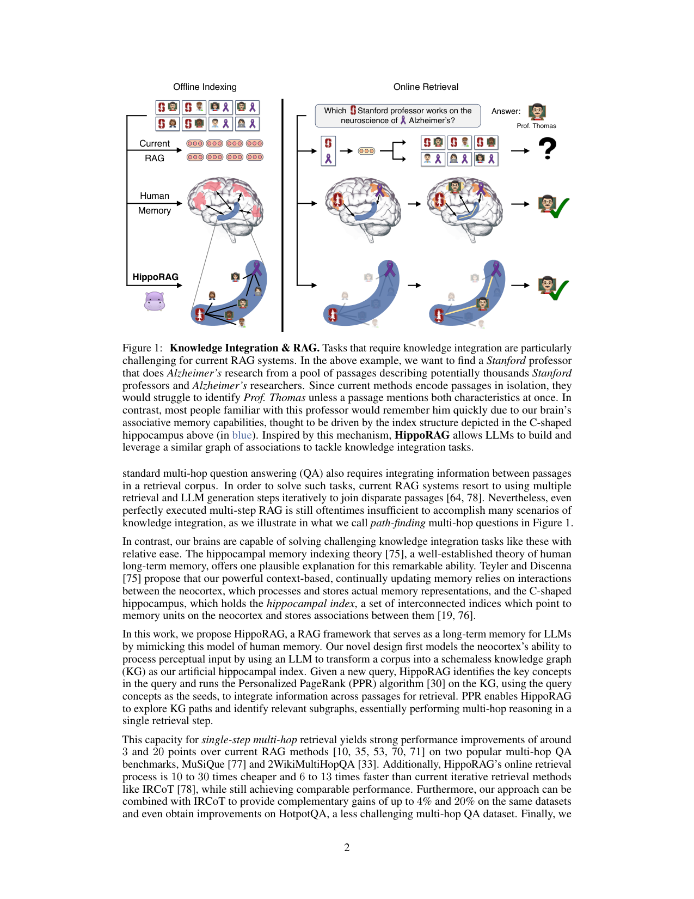

> [[../index|Wiki]] | [[../summary|Summary]] | [[../digest|Digest]]

# Abstract & Introduction

**In one sentence:** HippoRAG mimics the hippocampal index in human memory by combining an LLM-built schemaless knowledge graph with Personalized PageRank, enabling single-step multi-hop retrieval that is 10–20× cheaper and 6–13× faster than iterative RAG like IRCoT while improving accuracy by up to 20%.

## Key points

- Mammalian brains evolved long-term memory that integrates new experiences without catastrophic forgetting; LLMs lack an equivalent, continually updating memory, and RAG is the _de facto_ substitute because static models can be presented new knowledge without retraining (model editing [46] has limitations).
- Current RAG fails at knowledge integration across passage boundaries because each new passage is encoded in isolation; tasks such as scientific literature review, legal case briefing, and medical diagnosis require exactly this cross-passage integration, and even multi-hop QA requires joining information between passages.
- The paper defines _path-finding_ multi-hop questions (Figure 1) as the scenario where even perfectly executed multi-step RAG is insufficient: find a _Stanford_ professor who does _Alzheimer's_ research from a pool of passages describing potentially thousands of Stanford professors and Alzheimer's researchers — no passage co-mentions both, so isolated encoding cannot identify Prof. Thomas unless one passage mentions both traits.
- Inspiration is the hippocampal memory indexing theory of Teyler and Discenna [75]: the neocortex processes and stores memory representations, while the C-shaped hippocampus holds a _hippocampal index_ — interconnected indices pointing to neocortical memory units and storing the associations between them; retrieval then completes partial cues via this index (CA3 sub-region [76]).
- HippoRAG's design: (1) an LLM transforms the corpus into a schemaless knowledge graph (KG) acting as the artificial hippocampal index (offline indexing, analogous to neocortical memory encoding), (2) given a query, key concepts are identified, (3) Personalized PageRank (PPR) [30] runs on the KG seeded by the query concepts, exploring KG paths and surfacing relevant subgraphs — multi-hop reasoning in a single retrieval step.
- Headline results: ~3 and 20 points over current RAG methods [10, 35, 53, 70, 71] on MuSiQue [77] and 2WikiMultiHopQA [33]; single-step retrieval matches or beats iterative IRCoT [78] while being 10–30× cheaper and 6–13× faster (abstract states 10–20× cheaper); combining HippoRAG with IRCoT adds complementary gains of up to 4% and 20% on the same datasets and even improves on the easier HotpotQA.
- Code and data are available at https://github.com/OSU-NLP-Group/HippoRAG; the authors also provide a case study on _path-finding_ multi-hop QA showing the potential of their method and the limitations of current ones.

---

## Motivation: long-term memory for LLMs

The paper frames the problem in biological terms: millions of years of evolution led mammalian brains to store large amounts of world knowledge and continuously integrate new experiences without losing previous ones — the foundation of reasoning and decision making [19]. Despite progress in LLMs, "such a continuously updating long-term memory is still conspicuously absent from current AI systems." Because of its ease of use and the limitations of alternatives such as model editing [46], retrieval-augmented generation has become the _de facto_ solution for long-term memory in LLMs, "allowing users to present new knowledge to a static model" [36, 42, 66, 87].

## Limitations of RAG on knowledge integration

Current RAG methods cannot help LLMs "perform tasks that require integrating new knowledge across passage boundaries since each new passage is encoded in isolation." The authors give real-world examples (scientific literature review, legal case briefing, medical diagnosis) and note that even "less complex" standard multi-hop QA requires integrating information between passages in a retrieval corpus. To solve such tasks, "current RAG systems resort to using multiple retrieval and LLM generation steps iteratively to join disparate passages [64, 78]." Yet even perfectly executed multi-step RAG is oftentimes insufficient, as illustrated by _path-finding_ multi-hop questions.

In Figure 1, the authors dramatize the failure mode with the query "Which Stanford professor works on the neuroscience of Alzheimer's?" — answer Prof. Thomas. The figure contrasts three systems over the same Offline Indexing / Online Retrieval pipeline: **Current RAG** encodes passages in isolation (embedded vectors), and since no passage co-mentions both *Stanford* and *Alzheimer's*, top-k retrieval cannot bridge the two concepts and fails to name the professor; **Human Memory** is shown as a brain with neocortical storage (red) and a C-shaped hippocampus (blue) whose associative activation links the two concepts to recall; **HippoRAG** first transforms the corpus into a schemaless graph of associations — a blue C-shaped structure whose nodes are concepts/people and whose edges are stored associations — then traces a highlighted path (yellow edges) from the query seed concepts to the target node, retrieving the correct answer in one step. The figure's point is that the brain solves such queries via hippocampus-mediated associative memory, and HippoRAG mimics this by building a graph of associations (an artificial hippocampal index) and traversing it to perform single-step multi-hop retrieval — answering integration queries that current RAG misses.

## Neurobiological inspiration: hippocampal indexing theory

The hippocampal memory indexing theory of Teyler and Discenna [75], a well-established theory of human long-term memory, offers a plausible explanation for the brain's ability to solve knowledge-integration tasks with relative ease: context-based, continually updating memory "relies on interactions between the neocortex, which processes and stores actual memory representations, and the C-shaped hippocampus, which holds the _hippocampal index_, a set of interconnected indices which point to memory units on the neocortex and stores associations between them [19, 76]."

## HippoRAG at a high level

HippoRAG "mimics" this memory model in three parts. (1) **Neocortex analogue (offline indexing):** an LLM transforms a corpus into a schemaless knowledge graph (KG) that serves as the artificial hippocampal index — mirroring the neocortex's ability to process perceptual input. (2) **Hippocampal-index search (online retrieval):** given a new query, HippoRAG identifies the key concepts in the query and runs the Personalized PageRank (PPR) algorithm [30] on the KG, using these query concepts as seeds. (3) **Multi-hop in one step:** PPR "enables HippoRAG to explore KG paths and identify relevant subgraphs, essentially performing multi-hop reasoning in a single retrieval step" — hence _single-step multi-hop_ retrieval.

## Headline results

- **Accuracy:** strong improvements of around **3 and 20 points** over current RAG methods [10, 35, 53, 70, 71] on two popular multi-hop QA benchmarks, **MuSiQue** [77] and **2WikiMultiHopQA** [33] (the abstract rounds this to "up to 20%").
- **Cost/speed:** HippoRAG's online retrieval process is **10 to 30 times cheaper** and **6 to 13 times faster** than iterative retrieval methods like **IRCoT** [78] (abstract: 10–20× cheaper), "while still achieving comparable performance."
- **Combination:** HippoRAG can be **combined with IRCoT** for complementary gains of up to **4% and 20%** on the same datasets, and even obtains improvements on **HotpotQA**, a less challenging multi-hop QA dataset.
- **Novelty:** the method tackles "new types of scenarios that are out of reach of existing methods" — the _path-finding_ multi-hop QA setting, with a supporting case study (Section 1, continued in the case study).

**Covers:** Abstract, Section 1 (Introduction), pages 1-2
