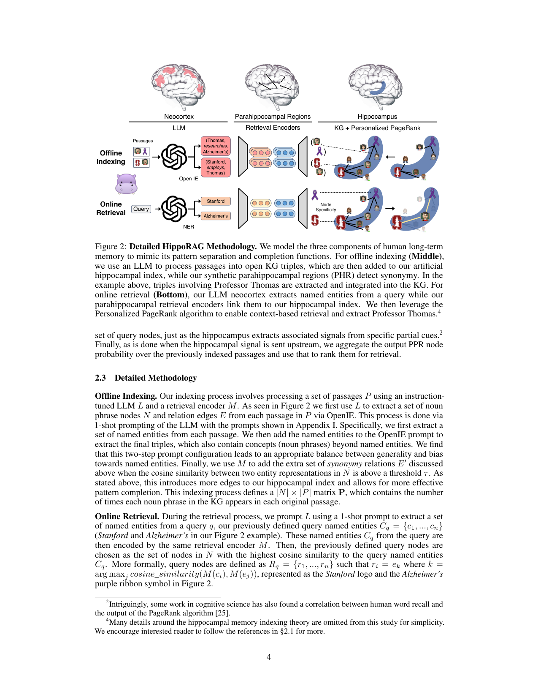

> [[../index|Wiki]] | [[../summary|Summary]] | [[../digest|Digest]]

# Detailed Methodology

**In one sentence:** HippoRAG builds an open knowledge graph offline (LLM-driven OpenIE triples plus retrieval-encoder synonymy edges) and performs online retrieval by seeding Personalized PageRank from query named entities linked to graph nodes, with node specificity providing a locally computable IDF-like bias over the whole memory-inspired pipeline.

## Key points

- Offline indexing is a two-step, 1-shot LLM process over each passage: first extract named entities, then feed them into the OpenIE prompt to extract final triples (noun-phrase nodes N and relation edges E) that include concepts beyond named entities — a balance between generality and bias toward named entities.
- Synonymy edges E' are added between two nodes whose retrieval-encoder (M) representations have cosine similarity above a threshold τ, mimicking parahippocampal regions and aiding downstream pattern completion.
- Indexing defines a |N| × |P| matrix P counting how many times each noun phrase appears in each original passage.
- Online retrieval: the LLM (1-shot prompt) extracts query named entities C_q = {c_1, ..., c_n} (e.g. "Stanford", "Alzheimer's") from the query q; these are encoded by the same retrieval encoder M.
- Query nodes R_q = {r_1, ..., r_n} are the nodes r_i = e_k where k = argmax_j cosine_similarity(M(c_i), M(e_j)) — the highest-similarity KG nodes to each query entity.
- PPR is run over the KG (|N| nodes, |E| + |E'| edges) with a personalized start distribution n over N giving each query node equal probability and all other nodes zero; the resulting distribution n' over N is multiplied by the P matrix to obtain p, the per-passage ranking score used for retrieval.
- Node specificity is a neurobiologically plausible, local alternative to IDF: s_i = |P_i|^(−1), where P_i is the set of passages node i was extracted from; it is applied by multiplying each query node probability n by s_i before PPR, modulating the node's own and its neighborhood's probability (illustrated in Figure 2 by the Stanford logo being drawn larger than the Alzheimer's symbol).

---

## Offline Indexing

Indexing processes a set of passages P using an instruction-tuned LLM L and a retrieval encoder M. First, L is 1-shot prompted (prompts in Appendix I) to extract a set of noun-phrase nodes N and relation edges E from each passage via OpenIE. Concretely, this is done in two steps: first extract a set of named entities from each passage, then add the named entities to the OpenIE prompt to extract the final triples, which also contain concepts (noun phrases) beyond named entities. The authors find this two-step configuration leads to an appropriate balance between generality and bias toward named entities. Next, M adds an extra set of synonymy relations E' between two entity representations in N whenever their cosine similarity is above a threshold τ. This introduces more edges to the hippocampal index and allows for more effective pattern completion. The whole process — extracting salient signals from passages as discrete noun phrases rather than dense vector representations — yields more fine-grained pattern separation, and the resulting open KG (schemaless) is the artificial hippocampal index built passage-by-passage over the whole retrieval corpus. Finally, indexing defines a |N| × |P| matrix **P** containing the number of times each noun phrase in the KG appears in each original passage.

The three-module, two-stage workflow in the schematic maps each functional component to a brain region: the LLM plays the neocortex (OpenIE offline, named-entity recognition online), the retrieval encoders play the parahippocampal regions (building and querying synonymy relations), and the KG + Personalized PageRank plays the hippocampus (pattern-completion retrieval). In the offline row, passages feed the LLM (OpenIE) which emits KG triples such as (Stanford, employs, Thomas) and (Thomas, researches, Alzheimer's); in parallel the retrieval encoders attach synonymy edges between near-duplicate entity nodes, and the combined structure is integrated into the hippocampal KG index. For the online row, the query feeds the LLM (NER) to extract named entities, the encoders map those entities to the closest index nodes shown as highlighted seed nodes (the Stanford logo and the Alzheimer's purple ribbon), and Personalized PageRank is then run from those seeds to propagate activation through the graph and surface the target entity, Professor Thomas, highlighted along the retrieval path.

## Online Retrieval

The same three components are reused to mirror human brain memory retrieval. The LLM-based neocortex L is prompted with a 1-shot prompt to extract the query named entities C_q = {c_1, ..., c_n} from the query q (Stanford and Alzheimer's in the Figure 2 example). These are encoded by the same retrieval encoder M used at index time. The query nodes R_q = {r_1, ..., r_n} are then defined as the nodes r_i = e_k where k = argmax_j cosine_similarity(M(c_i), M(e_j)) — i.e., the set of nodes in N with the highest cosine similarity to the query named entities C_q.

Because the hippocampus receives input processed through the neocortex and PHR, these query nodes become the partial cues from which the synthetic hippocampus performs pattern completion. To imitate the brain's efficient graph search, HippoRAG runs Personalized PageRank (PPR) [30] over the hippocampal index — a KG with |N| nodes and |E| + |E'| edges (triple-based and synonymy-based) — using a personalized probability distribution n over N in which each query node has equal probability and all other nodes have probability zero. This constraint biases the PPR output only toward the neighborhood of the query nodes, so probability mass lands on nodes in the joint neighborhood such as Professor Thomas. After PPR, we obtain an updated distribution n' over N. To obtain passage scores we multiply n' by the previously defined |N| × |P| matrix **P** to obtain p, a ranking score for each passage used for retrieval. Notably, some cognitive-science work has also found a correlation between human word recall and the output of the PageRank algorithm [25].

## Node Specificity

Node specificity is introduced as a neurobiologically plausible way to further improve retrieval. Global word-importance signals like inverse document frequency (IDF) are known to improve information retrieval, but leveraging IDF in the brain would require the total number of encoded "passages" to be aggregated with all node activations before retrieval completes — i.e., activating connections between an aggregator neuron and all nodes in the hippocampal index on every retrieval. This is trivial for a normal computer but imposes prohibitive computational overhead biologically. HippoRAG therefore proposes node specificity as an alternative IDF signal requiring only local signals already available at each node. The node specificity of node i is defined as s_i = |P_i|^(−1), where P_i is the set of passages in P from which node i was extracted. It is used at retrieval time by multiplying each query node probability n by s_i before PPR, which modulates both the query node's own probability and that of its neighborhood. Figure 2 illustrates this through relative symbol size — the Stanford logo is drawn larger than the Alzheimer's symbol because "Stanford" appears in fewer documents and hence carries higher node specificity.

**Covers:** Section 2 (Methodology), pages 3-6
