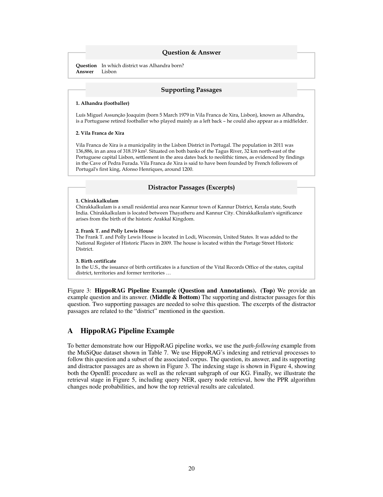
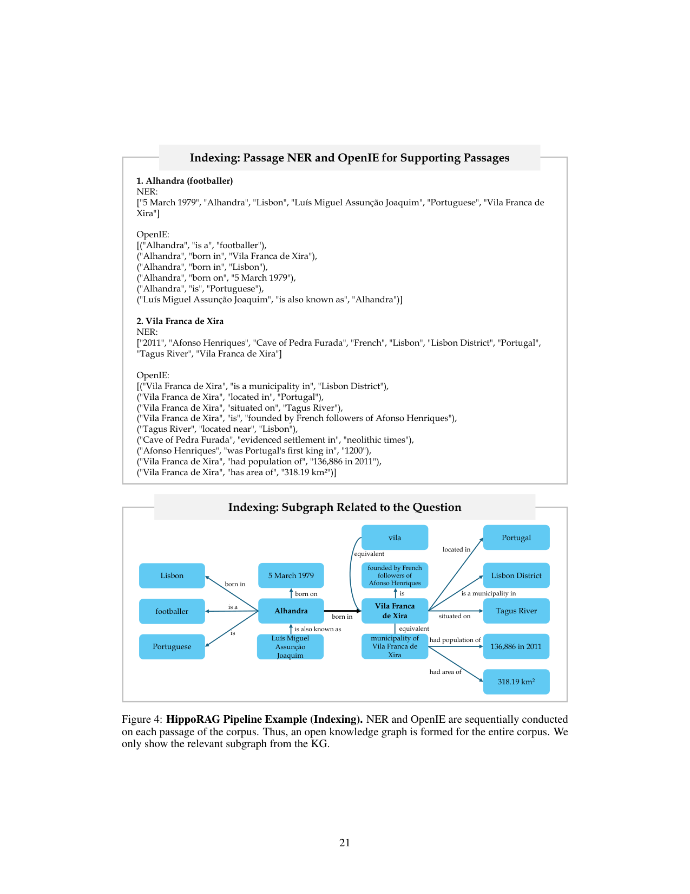
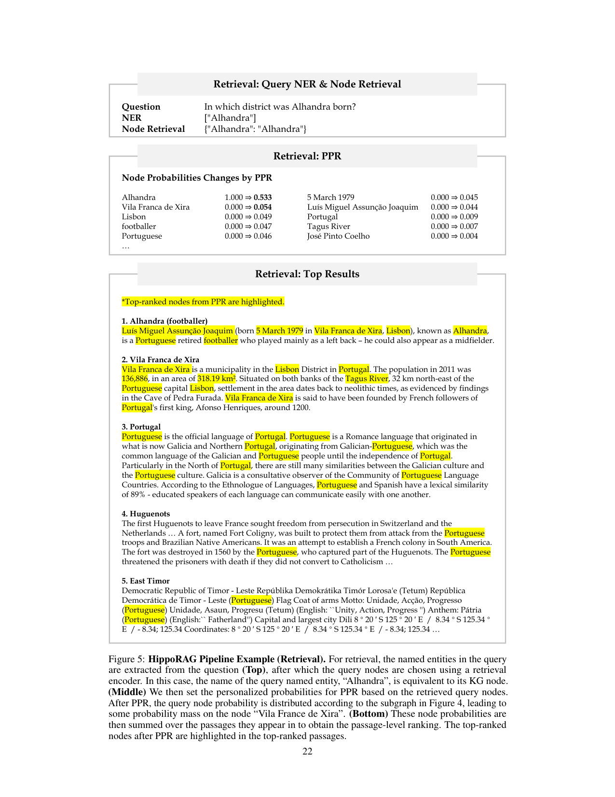
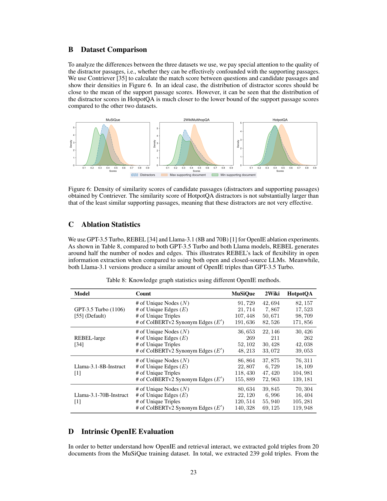
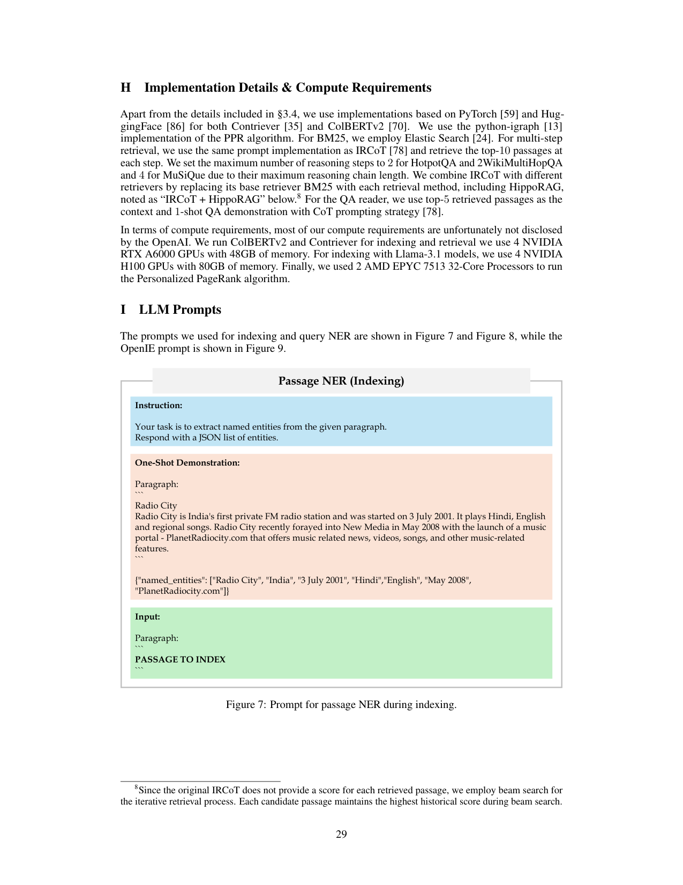
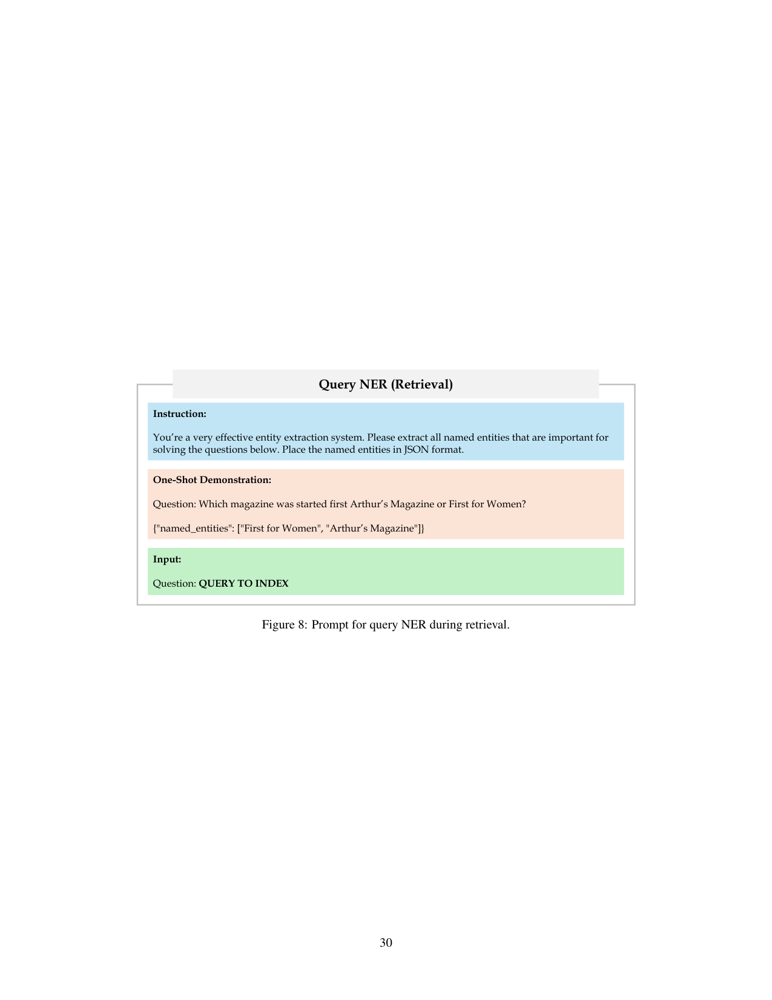
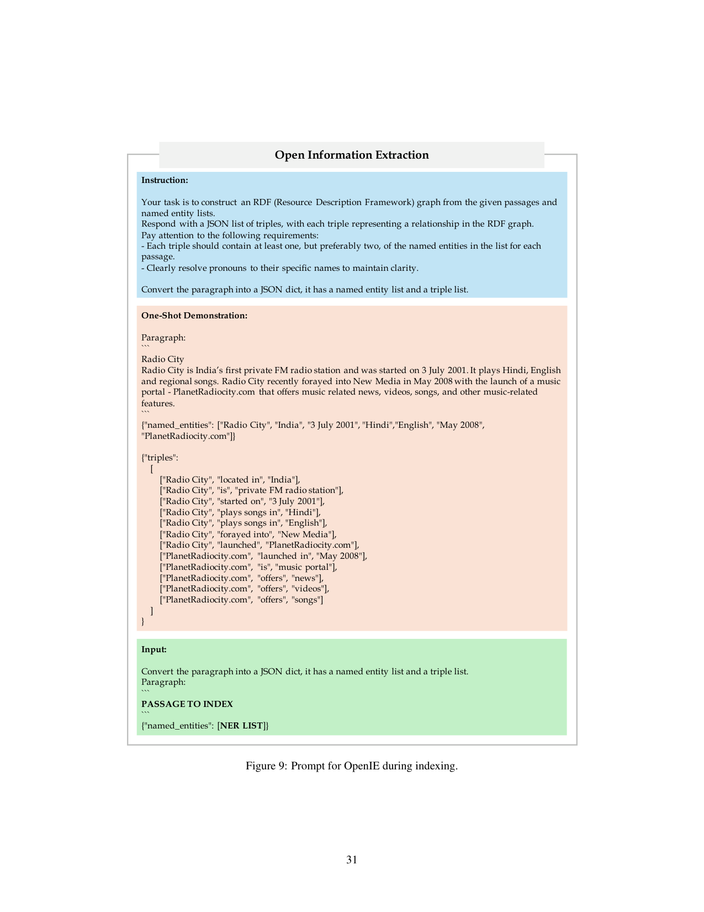

> [[../index|Wiki]] | [[../summary|Summary]] | [[../digest|Digest]]

# Appendix: Pipeline Walkthrough, Error Analysis & Prompts

**In one sentence:** This appendix traces one MuSiQue question end-to-end through HippoRAG's indexing (NER + OpenIE into a knowledge graph) and retrieval (query NER, node retrieval, PPR, passage ranking) stages, quantifies the error modes (NER 48%, OpenIE 28%, PPR 24%), and exposes the exact one-shot JSON prompts used for passage NER, query NER, and OpenIE.

## Key points

- The worked example uses the MuSiQue path-following question "In which district was Alhandra born?" (answer: Lisbon), resolvable only by two jointly required supporting passages — Alhandra (footballer) and Vila Franca de Xira.
- Indexing runs NER then OpenIE sequentially on every passage, emitting (subject, relation, object) triples that are merged into a single open knowledge graph over the whole corpus; entities recurring across passages become shared nodes.
- Retrieval extracts named entities from the query, maps them to KG nodes with a retrieval encoder, runs personalized PageRank to spread seed probability through the subgraph, then sums node probabilities over their passages to rank passages.
- Contriever-scored similarity densities show HotpotQA's distractors are weak negatives (scoring near its least-similar supporting passages), while MuSiQue and 2WikiMultiHopQA distractors better confound the answer.
- Of 100 tracked HippoRAG errors on MuSiQue, 48% stem from NER limitations (too little query information extracted), 28% from incorrect/missing OpenIE triples, and 24% from PPR failing to find the right subgraph despite good NER and OpenIE.
- The entity-centric design has a concepts-vs-context tradeoff: it excels when one salient entity anchors the answer (e.g., "Sergio Villanueva") but loses on general-concepts questions where context matters (the "protons" example).
- A qualitative case study on path-finding multi-hop questions (book, film, drug lookups) shows HippoRAG chaining disjointed clues through the graph to find answers like Mark Haddon, Black Hawk Down, and Chlorambucil, where ColBERTv2 and IRCoT fail or guess via parametric knowledge instead.
- GPT-3.5 Turbo OpenIE quality degrades substantially on longer passages (F1 71.8 on the 10 shortest vs 53.9 on the 10 longest), hinting at extraction limits tied to passage complexity.
- HippoRAG retrieves 10–30× cheaper and 6–13× faster in online retrieval than IRCoT (query NER only, no per-document LLM processing), at the cost of higher offline indexing ($15 and ~60 min per 10,000 passages with GPT-3.5, reducible with locally deployed Llama-3.1).
- The LLM prompts are minimal one-shot, JSON-only templates for passage NER, query NER, and OpenIE, the latter requiring pronoun resolution and triple linkage to named entities.

---

## Full Pipeline Example

To demonstrate how the HippoRAG pipeline works, the authors follow a _path-following_ question from the MuSiQue dataset through indexing and retrieval over a subset of its corpus. The question is **"In which district was Alhandra born?"**, with the answer **Lisbon**. Two supporting passages are required and jointly answer it:

- **Alhandra (footballer):** a biography entry noting he was born in **Vila Franca de Xira, Lisbon**.
- **Vila Franca de Xira:** a place entry describing it as a municipality in the **Lisbon District** (population ≈ 1.4×10⁵, area ≈ 3.2×10² km²).

Three distractor passages share the surface keyword "district" from the question but are unrelated: *Chirakkalkulam* in Kannur District, Kerala, India; the *Frank T. and Polly Lewis House* in the Portage Street Historic District, Wisconsin, USA; and a *Birth certificate* entry that mentions "capital district". The design point is that correct retrieval requires linking the two relevant passages through shared entities (Alhandra → born in → Vila Franca de Xira → municipality of → Lisbon District) while suppressing lexically similar distractors — disambiguation by entity relationship, not by query-term overlap alone.

Figure 3 lays out this example as a three-part schematic: the question & answer pair, the two supporting passages, and the three distractor excerpts. It is a qualitative illustration — no axes, scales, or trends — chosen to encode a two-hop reasoning chain (Alhandra → birthplace → district) that single-hop keyword matching cannot resolve.

### Indexing stage

The indexing stage (Figure 4) shows NER and OpenIE being conducted sequentially on each passage of the corpus, forming a single open knowledge graph (KG). The figure displays the relevant subgraph around the example passages.

For the *Alhandra (footballer)* passage, NER extracts entities such as a ~1979 date, the name, *Lisbon*, a full-name alias, *Portuguese*, and *Vila Franca de Xira*; OpenIE then derives triples like *Alhandra → is a → footballer*, *Alhandra → born in → Vila Franca de Xira / Lisbon*, *Alhandra → born on → 5 March 1979*, and *Luís Miguel Assunção Joaquim → is also known as → Alhandra*. For the *Vila Franca de Xira* passage, NER surfaces a ~2011 year, *Lisbon District*, *Portugal*, and *Tagus River*, while OpenIE yields triples such as *is a municipality in → Lisbon District*, *situated on → Tagus River*, *had population of → ~136,886 (in 2011)*, and *has area of → ~318 km²*.

The bottom panel of the figure draws these facts as a node–edge graph: two hub nodes, **Alhandra** and **Vila Franca de Xira**, are linked to each other (*born in*) and to surrounding entities via labeled edges (*is a, is, born on, is also known as, located in, is a municipality in, situated on, had population of, had area of, equivalent*).

Figure 4 thus captures the unification property of the indexing stage: entities that recur across separate passages re-appear as the same shared graph nodes, so attributes from one passage attach to the node referenced from another. The multi-hop chain — identity, location, population, area, dates — is bundled into one subgraph that downstream retrieval can reason over, rather than a set of isolated sentences. Only the question-relevant slice of the full KG is shown.

### Retrieval stage

For retrieval (Figure 5), three sequential stages are illustrated.

**(Top) Query NER & node retrieval.** Named entities are extracted from the question — here the entity *Alhandra* — and the query nodes are selected with a retrieval encoder. In this case the query entity's name is equivalent to its KG node, so *Alhandra* maps directly.

**(Middle) Personalized PageRank propagation.** Personalized PPR probabilities are initialized on the retrieved query node (≈1.0 on *Alhandra*, ≈0 elsewhere), then PPR redistributes that mass across the subgraph from Figure 4. The seed's probability drops slightly above 0.5, while *Vila Franca de Xira* acquires the largest neighboring mass (a few hundredths, ≈0.05), followed by *Lisbon*, *footballer*, *Portuguese*, *5 March 1979*, and *Luís Miguel Assunção Joaquim* (low hundredths), with more distant nodes (*Portugal*, *Tagus River*, *José Pinto Coelho*) receiving only negligible mass. The trend is a clear distance/semantic decay: mass concentrates on the tightly connected, context-relevant nodes.

**(Bottom) Passage-level ranking.** These node probabilities are summed over the passages in which each node appears to obtain the passage-level ranking. The top-ranked PPR nodes are highlighted inside the top-ranked passages; the ranking places the *Alhandra (footballer)* passage first and the *Vila Franca de Xira* passage second — the true answer to "which district" — ahead of generic pages.

Figure 5 demonstrates the full retrieval mechanism end-to-end: NER + node retrieval seeds the graph, PPR spreads that seed's probability through the subgraph so the answer entity (*Vila Franca de Xira*) acquires non-zero score, and aggregating node scores over their passages produces a passage ranking that surfaces the answer near the top — evidence that PPR-based neighborhood expansion improves retrieval over the raw query node alone.

## Similarity Score Analysis

To compare the three evaluation datasets, the authors examine distractor quality — how effectively distractors can be confounded with supporting passages. Using **Contriever** to compute question→candidate-passage match scores, they plot score densities (Figure 6) for each dataset.

In an ideal case, the distribution of distractor scores should sit close to the mean of support-passage scores. The three density panels show supporting passages scoring higher than distractors on all datasets, but the separation is what varies. In **MuSiQue** and **2WikiMultiHopQA** the distractor peak lies well below the supporting-document peaks, giving clear distractor–support discrimination. In **HotpotQA**, the distractor curve shifts upward and overlaps strongly with the least-similar supporting-passage curve.

Figure 6, therefore, shows that HotpotQA's distractors are not substantially more similar than its least-similar supporting passages — they are weak, poorly discriminative distractors — whereas MuSiQue and 2WikiMultiHopQA provide more genuinely confounding negatives. This motivates treating the three datasets as having different difficulty in terms of distractor confusion.

## Case Study on Path-Finding Multi-Hop QA

Path-finding multi-hop questions — those that must integrate information across passages to identify an entity among many candidates (e.g., "find all Stanford professors who work on the neuroscience of Alzheimer's") — are exceedingly hard for single-step and multi-step RAG baselines like ColBERTv2 and IRCoT. The appendix explains how these questions were constructed: for book/movie questions, the authors picked a book or movie, found its author/director, then pulled one trait from each (book/movie and author/director) to source Wikipedia distractors; for professor/drug questions, they picked a professor or drug at random, found the associated university or disease plus a second trait (research topic or mechanism of action), and again used those traits to mine distractors.

Three qualitative examples (Table 10) illustrate the pattern:

- **Book question** ("published in 2012 by an English author who won a Whitbread Award"): HippoRAG correctly identifies **Mark Haddon**, while ColBERTv2 fixates on award-related passages and IRCoT wrongly picks Kate Atkinson (a past winner of the same award for an unrelated 1995 book).
- **Film question** ("war film based on a non-fiction book, directed by someone known for sci-fi and crime"): HippoRAG finds **Black Hawk Down** (dir. **Ridley Scott**) within its top four passages; ColBERTv2 misses the answer entirely, and IRCoT retrieves Ridley Scott via parametric knowledge but never resolves the specific film, partly due to its three-step iteration limit and the need to explore two candidate directors.
- **Drug question** ("treats chronic lymphocytic leukemia by interacting with cytosolic p53"): HippoRAG uses cross-passage associations to surface **Chlorambucil** as the top passage; ColBERTv2 and IRCoT only retrieve passages generically associated with leukemia, and IRCoT's parametric knowledge leads it to guess Venetoclax instead, despite no supporting passage stating that mechanism.

The common thread: HippoRAG's graph-based association lets it chain disjointed clues (author → award → year; director → genre → film; drug → mechanism → disease) into the correct entity, where similarity-only or short-horizon iterative retrieval either overweights lexical/topical overlap or exhausts its reasoning budget before resolving the chain.

## Error Analysis

The authors provide a detailed error analysis of **100 errors** made by HippoRAG on MuSiQue, categorizing them into three types (Table 11): **NER**, **OpenIE**, and **PPR**.

| Error Type              | Error Percentage (%) |
|-------------------------|----------------------|
| NER Limitation          | 48                   |
| Incorrect/Missing OpenIE| 28                   |
| PPR                    | 24                   |

- **NER limitation (~half of errors):** The NER-based design does not extract enough information from the query for retrieval. Example: in "When was one internet browser's version of Windows 8 made accessible?", only "Windows 8" is extracted, leaving any signal about "browsers" or "accessibility" behind for the subsequent graph search.
- **OpenIE errors (second most common):** Missed or incorrect triples from the OpenIE step. GPT-3.5 Turbo overlooks the crucial song title *"Don't Let Me Wait Too Long"* during OpenIE — a very large entity — and routinely fails to capture temporal properties such as the start/end years of the Mexican-American War (1846–1848). These gaps leave the most important elements of a passage unrepresented in the KG.
- **PPR errors (third type):** Cases where both NER and OpenIE work properly but PPR still cannot identify the relevant subgraph, often due to confounding signals. Example: for "How many refugees emigrated to the European country where Huguenots felt a kinship for emigration?", "Huguenots" is correctly extracted from both the question and the supporting passages, and PPR starts from "European" and "Huguenots" — yet it cannot find the appropriate subgraph among multiple passages on very similar topics, since PPR does not leverage query context directly.

The entity-centric design also creates a **concepts-vs-context tradeoff**: it has a strong bias toward salient concepts, leaving contextual signals unused. On the one hand, this lets HippoRAG hone in on "Sergio Villanueva" in a question about a navigator, where ColBERTv2 retrieves pages about famous Spanish navigators but misses the boxer. On the other hand, on a more general-concepts question ("…the person who discovered that the number of **protons** in each element's atoms is unique?"), extracting only "protons" pulls in *Uranium* and *History of nuclear weapons* pages, whereas ColBERTv2's context-aware retriever finds *Atomic number*, *Atomic theory*, and *Atomic nucleus*.

To rebalance the tradeoff, the authors introduce an **uncertainty ensemble**: HippoRAG scores are blended with a dense retriever's passage scores when the query-to-KG-entity cosine similarity for any query-KG entity falls below a threshold θ (e.g., no *Stanford* node exists and the closest is *Stanford Medical Center*). The final passage score is the average of the two, after normalizing each to 0–1 across passages. This ensemble further improves on MuSiQue (ColBERTv2 ensemble: R@2 42.5, R@5 54.8, 71.9 / 89.0, 62.5 / 80.0) and outperforms baselines in R@5 on HotpotQA, and with IRCoT the ColBERTv2 variant tops both R@2 and R@5 on HotpotQA (67.0 / 83.0). However, ensembling slightly lowers 2Wiki performance, showing the tradeoff is not yet fully solved.

## Implementation Details & Prompts

**Implementation stack.** PyTorch and HuggingFace are used for both Contriever and ColBERTv2. PPR uses the **python-igraph** implementation. BM25 is backed by **Elastic Search**. For multi-step retrieval, the same prompt implementation as IRCoT is used, retrieving the top-10 passages per step; the maximum number of reasoning steps is set to 2 for HotpotQA and 2WikiMultiHopQA and 4 for MuSiQue (matching their maximum reasoning chain lengths). IRCoT is combined with different retrievers by replacing its base BM25 with each method (including HippoRAG). Because the original IRCoT does not provide per-passage scores, beam search is used for its iterative retrieval, keeping each candidate's highest historical score. The QA reader takes the top-5 passages as context with a 1-shot CoT demonstration.

**Compute.** ColBERTv2 and Contriever indexing/retrieval run on 4 NVIDIA RTX A6000 GPUs (48 GB each). Llama-3.1-based indexing uses 4 NVIDIA H100 GPUs (80 GB each). PPR is run on 2 AMD EPYC 7513 32-core processors.

**Cost & efficiency (online, 1,000 queries, GPT-3.5 Turbo):** ColBERTv2 ≈ $0 API / 1 min; IRCoT ≈ $1–3 / 20–40 min; HippoRAG ≈ $0.10 / 3 min — i.e., HPpoRAG is 10–30× cheaper and 6–13× faster than IRCoT because it only requires extracting named entities from the query, not LLM-processing every retrieved document.

**Offline indexing (10,000 passages):**

| Model                     | API Cost | Time (min) |
|---------------------------|----------|------------|
| ColBERTv2                 | $0       | 7          |
| IRCoT                     | $0       | 7          |
| HippoRAG (GPT-3.5 1106)  | $15      | 60         |
| HippoRAG (GPT-3.5 0125)  | $8       | 60         |
| HippoRAG (Llama-3.1-8B local) | $0  | 120        |
| HippoRAG (Llama-3.1-70B local) | $0   | 250        |

Llama-3.1-70B-Instruct deployed locally via vLLM on 4 H100s matches GPT-3.5 Turbo's OpenIE quality while indexing 10,000 documents in roughly 4 hours, keeping HippoRAG within reach of many organizations' compute budgets.

**Prompts.** The three prompts follow a consistent one-shot, JSON-only pattern — instruction → one demonstration example → input placeholder.

Figure 7 is the **passage NER (indexing)** prompt. The instruction directs the model to "extract named entities from the given paragraph" and respond with a JSON list of entities. A one-shot demonstration uses a paragraph about India's first private FM radio station ("Radio City") and expects a JSON output like `{"named_entities": ["Radio City", "India", "3 July 2001", "Hindi", "English", "May 2008", "PlanetRadiocity.com"]}` — defining the expected entity granularity (names, locations, dates, languages, domains). The input slot is a placeholder `PASSAGE TO INDEX` where the live passage is substituted at runtime. The prompt thus documents the strict JSON interface contract that the indexing pipeline relies on for every passage in the corpus.

Figure 8 is the **query NER (retrieval)** prompt. It instructs the model to act as an "effective entity extraction system" and pull out all named entities important for answering the question, again requiring JSON output. Its one-shot demonstration pairs the question "Which magazine was started first Arthur's Magazine or First for Women?" with the expected output `{"named_entities": ["First for Women", "Arthur's Magazine"]}`, and the input slot receives the live retrieval query. The same instruction → demonstration → input ordering as the passing-NER prompt guarantees a consistent, machine-readable list of salient entities that can be matched against the KG before PPR.

Figure 9 is the **OpenIE (indexing)** prompt. It instructs the model to build an RDF graph from a passage plus a named-entity list and return a JSON list of subject–predicate–object triples, imposing two explicit constraints: each triple should reference at least one (ideally two) named entities, and pronouns must be resolved to concrete entity names. Its few-shot demonstration reuses the "Radio City FM station" passage and maps it to a `named_entities` array and a `triples` array of `[subject, relation, object]` lists (e.g., `["Radio City","located in","India"]`, `["PlanetRadiocity.com","offers","videos"]`). The input template is `PASSAGE TO INDEX` plus `{"named_entities": [NER LIST]}` — the entity list being the output of the passage NER step. This documents the normalized, entity-linked, pronoun-resolved triple schema that HippoRAG's KG ingestion depends on.

**Covers:** Appendix (pipeline example, case study on path-finding multi-hop QA, error analysis, implementation details, prompts), pages 20-31
