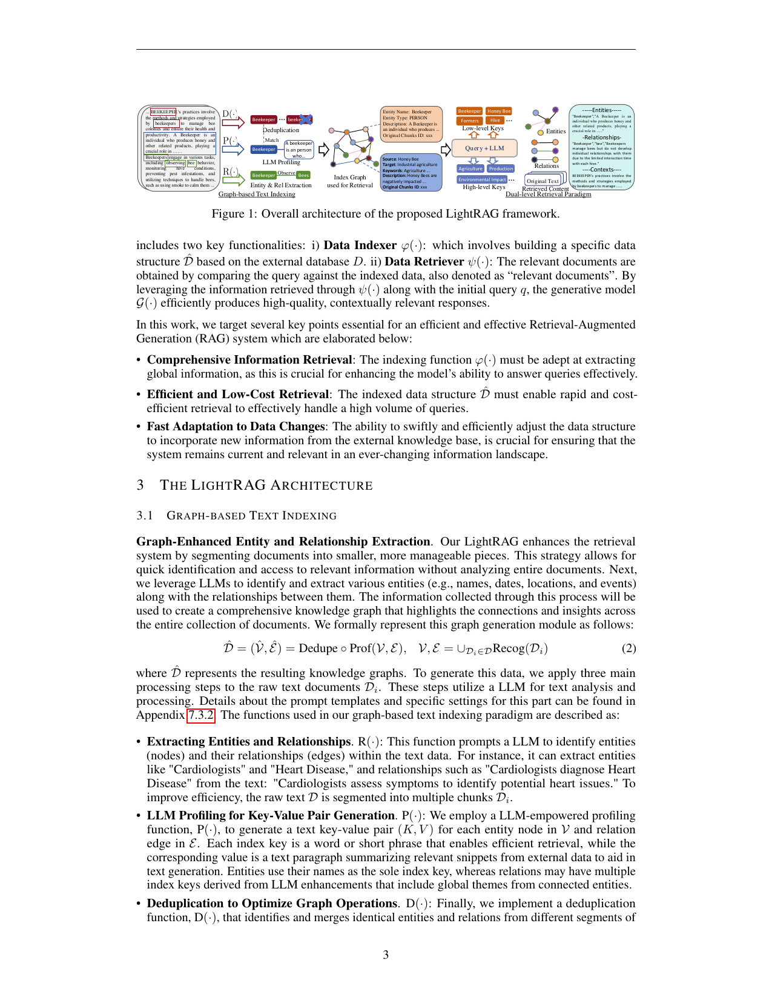

> [[../index|Wiki]] | [[../summary|Summary]] | [[../digest|Digest]]

# The LightRAG Architecture

**In one sentence:** LightRAG replaces chunk-level vector retrieval with an LLM-built knowledge graph — extracting entities, relations, and key-value profiles, then retrieving at two levels (specific entities via local keys and broad themes via global keys) — so queries get compact, multi-hop, contextually rich context instead of raw document chunks.

## Key points

- RAG is formalized as a model M = G, R = (φ, ψ) with M(q; D) = G(q, ψ(q; D̂)), D̂ = φ(D): a retrieval component R with a Data Indexer φ(·) and Data Retriever ψ(·), and a generation component G(·) that turns the query plus retrieved data into a response.
- Three design goals drive the architecture: comprehensive information retrieval (global information extraction), efficient and low-cost retrieval, and fast adaptation to data changes in the knowledge base.
- Graph-based text indexing runs three LLM-powered steps on each chunk: entity/relation extraction R(·), LLM profiling P(·) (key-value pairs per node and edge), and deduplication D(·), yielding a knowledge graph D̂ = (V̂, Ê) = Dedupe ⊗ Prof(V, E) built from V, E = ∪ Recog(Dᵢ).
- Entities use their names as the sole index key; relations may carry multiple index keys derived from LLM enhancements that include global themes from connected entities.
- Dual-level retrieval distinguishes specific queries (e.g., "Who wrote 'Pride and Prejudice'?") from abstract queries (e.g., "How does artificial intelligence influence modern education?"), handled by low-level retrieval (entities + their attributes/relationships) and high-level retrieval (aggregated themes across multiple entities).
- Retrieval is a three-step procedure: (i) extract both local and global query keywords k⁽ˡ⁾ and k⁽ᵍ⁾ via an LLM, (ii) match them with a vector database (local→candidate entities, global→relations linked to global keys), (iii) gather one-hop neighboring nodes {vᵢ | vᵢ ∈ V ∧ (vᵢ ∈ Nᵥ ∨ vᵢ ∈ Nₑ)} to incorporate high-order relatedness.
- Incremental updates avoid full re-indexing: a new document D′ is processed through the same indexing pipeline and merged by set union of nodes (V̂ ∪ V̂′) and edges (Ē ∪ Ē′).
- Complexity: indexing costs LLM calls of total_tokens/chunk_size with no additional overhead; retrieval generates keywords per query and uses vector search over entities and relationships rather than chunks, markedly reducing overhead versus GraphRAG's community-based traversal.

---

## RAG Background

Retrieval-Augmented Generation (RAG) integrates user queries with a collection of pertinent documents from an external knowledge database, and has two essential elements:

1. **Retrieval Component** — fetches relevant documents or information from the external knowledge database, identifying and retrieving the most pertinent data based on the input query.
2. **Generation Component** — takes the retrieved information and generates coherent, contextually relevant responses, leveraging the language model to produce meaningful outputs.

Formally, the RAG framework is denoted as model M:

> M = G, R = (φ, ψ),  M(q; D) = G(q, ψ(q; D̂)),  D̂ = φ(D)  (Eq. 1)

where G and R represent the generation module and the retrieval module, q denotes the input query, and D refers to the external database. The retrieval module R includes two key functionalities:

- **i) Data Indexer φ(·)** — builds a specific data structure D̂ based on the external database D.
- **ii) Data Retriever ψ(·)** — obtains the relevant documents by comparing the query against the indexed data (the "relevant documents"). By leveraging the information retrieved through ψ(·) along with the initial query q, the generative model G(·) efficiently produces high-quality, contextually relevant responses.

The work targets several key points essential for an efficient and effective RAG system:

- **Comprehensive Information Retrieval** — the indexing function φ(·) must be adept at extracting global information, crucial for enhancing the model's ability to answer queries effectively.
- **Efficient and Low-Cost Retrieval** — the indexed data structure D̂ must enable rapid and cost-efficient retrieval to effectively handle a high volume of queries.
- **Fast Adaptation to Data Changes** — the ability to swiftly and efficiently adjust the data structure to incorporate new information from the external knowledge base is crucial for keeping the system current and relevant in an ever-changing information landscape.

## LightRAG Architecture — Graph-Based Text Indexing (3.1)

**Graph-Enhanced Entity and Relationship Extraction.** LightRAG enhances the retrieval system by segmenting documents into smaller, more manageable pieces — allowing quick identification and access to relevant information without analyzing entire documents. It then leverages LLMs to identify and extract various entities (e.g., names, dates, locations, and events) along with the relationships between them. The collected information creates a comprehensive knowledge graph that highlights the connections and insights across the entire collection of documents. The graph generation module is formalized as:

> D̂ = (V̂, Ê) = Dedupe ⊗ Prof(V, E),  V, E = ∪_{Dᵢ∈D} Recog(Dᵢ)  (Eq. 2)

where D̂ represents the resulting knowledge graphs. Three main processing steps are applied to the raw text documents Dᵢ, all utilizing an LLM for text analysis and processing (prompt templates and specific settings are given in Appendix 7.3.2):

- **Extracting Entities and Relationships — R(·):** This function prompts an LLM to identify entities (nodes) and their relationships (edges) within the text data. For instance, it can extract entities like "Cardiologists" and "Heart Disease," and relationships such as "Cardiologists diagnose Heart Disease," from the text: "Cardiologists assess symptoms to identify potential heart issues." To improve efficiency, the raw text D is segmented into multiple chunks Dᵢ.
- **LLM Profiling for Key-Value Pair Generation — P(·):** An LLM-empowered profiling function generates a text key-value pair (K, V) for each entity node in V and relation edge in E. Each index key is a word or short phrase that enables efficient retrieval, while the corresponding value is a text paragraph summarizing relevant snippets from external data to aid in text generation. **Entities use their names as the sole index key, whereas relations may have multiple index keys derived from LLM enhancements that include global themes from connected entities.**
- **Deduplication to Optimize Graph Operations — D(·):** A deduplication function identifies and merges identical entities and relations from different segments of the raw text Dᵢ. This process effectively reduces the overhead associated with graph operations on D̂ by minimizing the graph's size, leading to more efficient data processing.

**Two advantages of the graph-based text indexing paradigm:**

1. **Comprehensive Information Understanding** — the constructed graph structures enable the extraction of global information from multi-hop subgraphs, greatly enhancing LightRAG's ability to handle complex queries that span multiple document chunks.
2. **Enhanced Retrieval Performance** — the key-value data structures derived from the graph are optimized for rapid and precise retrieval, providing a superior alternative to less accurate embedding matching methods (Gao et al., 2023) and inefficient chunk traversal techniques (Edge et al., 2024) commonly used in existing approaches.

**Fast Adaptation to Incremental Knowledge Base.** To efficiently adapt to evolving data changes while ensuring accurate and relevant responses, LightRAG incrementally updates the knowledge base without the need for complete reprocessing of the entire external database. For a new document D′, the incremental update algorithm processes it using the same graph-based indexing steps φ as before, resulting in D̂′ = (V̂′, Ê′). Subsequently, LightRAG combines the new graph data with the original by taking the union of the node sets V̂ and V̂′, as well as the edge sets Ē and Ē′.

Two key objectives guide this approach:

- **Seamless Integration of New Data** — by applying a consistent methodology to new information, the incremental update module integrates new external databases without disrupting the existing graph structure, preserving the integrity of established connections so that historical data remains accessible while the graph is enriched without conflicts or redundancies.
- **Reducing Computational Overhead** — by eliminating the need to rebuild the entire index graph, the method reduces computational overhead and facilitates rapid assimilation of new data; LightRAG maintains system accuracy, provides current information, and conserves resources, ensuring users receive timely updates and enhancing overall RAG effectiveness.

## Dual-Level Retrieval Paradigm (3.2)

To retrieve relevant information from both specific document chunks and their complex interdependencies, LightRAG generates query keys at both detailed and abstract levels:

- **Specific Queries** — detail-oriented and typically reference specific entities within the graph, requiring precise retrieval of information associated with particular nodes or edges. Example: "Who wrote 'Pride and Prejudice'?"
- **Abstract Queries** — more conceptual, encompassing broader topics, summaries, or overarching themes not directly tied to specific entities. Example: "How does artificial intelligence influence modern education?"

To accommodate diverse query types, LightRAG employs two distinct retrieval strategies within the dual-level retrieval paradigm:

- **Low-Level Retrieval** — primarily focused on retrieving specific entities along with their associated attributes or relationships; detail-oriented queries that aim to extract precise information about particular nodes or edges within the graph.
- **High-Level Retrieval** — addresses broader topics and overarching themes; queries at this level aggregate information across multiple related entities and relationships, providing insights into higher-level concepts and summaries rather than specific details.

**Integrating Graph and Vectors for Efficient Retrieval.** By combining graph structures with vector representations, the model gains a deeper insight into the interrelationships among entities. This synergy enables the retrieval algorithm to effectively utilize both local and global keywords, streamlining the search process and improving the relevance of results. The procedure:

- **(i) Query Keyword Extraction** — for a given query q, the retrieval algorithm begins by extracting both local query keywords k⁽ˡ⁾ and global query keywords k⁽ᵍ⁾.
- **(ii) Keyword Matching** — the algorithm uses an efficient vector database to match local query keywords with candidate entities and global query keywords with relations linked to global keys.
- **(iii) Incorporating High-Order Relatedness** — to enhance the query with higher-order relatedness, LightRAG further gathers neighboring nodes within the local subgraphs of the retrieved graph elements. This process involves the set {vᵢ | vᵢ ∈ V ∧ (vᵢ ∈ Nᵥ ∨ vᵢ ∈ Nₑ)}, where Nᵥ and Nₑ represent the one-hop neighboring nodes of the retrieved nodes v and edges e, respectively.

This dual-level retrieval paradigm not only facilitates efficient retrieval of related entities and relations through keyword matching, but also enhances the comprehensiveness of results by integrating relevant structural information from the constructed knowledge graph.

## Retrieval-Augmented Answer Generation (3.3)

- **Utilization of Retrieved Information** — utilizing the retrieved information ψ(q; D̂), LightRAG employs a general-purpose LLM to generate answers based on the collected data. This data comprises concatenated values V from relevant entities and relations, produced by the profiling function P(·). It includes names, descriptions of entities and relations, and excerpts from the original text.
- **Context Integration and Answer Generation** — by unifying the query with this multi-source text, the LLM generates informative answers tailored to the user's needs, ensuring alignment with the query's intent. This approach streamlines the answer generation process by integrating both context and query into the LLM model, as illustrated in detailed examples (Appendix 7.2).

## Complexity Analysis of the LightRAG Framework (3.4)

The complexity of the LightRAG framework divides into two main parts:

1. **Graph-based Index phase** — the LLM extracts entities and relationships from each chunk of text. As a result, the LLM needs to be called total_tokens/chunk_size times. Importantly, there is no additional overhead involved in this process, making the approach highly efficient in managing updates to new text.
2. **Graph-based retrieval phase** — for each query, the LLM is first used to generate relevant keywords. Similar to current RAG systems (Gao et al., 2023; 2022; Chan et al., 2024), the retrieval mechanism relies on vector-based search. However, instead of retrieving chunks as in conventional RAG, LightRAG concentrates on retrieving entities and relationships. This approach markedly reduces retrieval overhead compared to the community-based traversal method used in GraphRAG.

**Covers:** Section 2 (RAG background), Section 3 (LightRAG architecture, including Figure 1)
