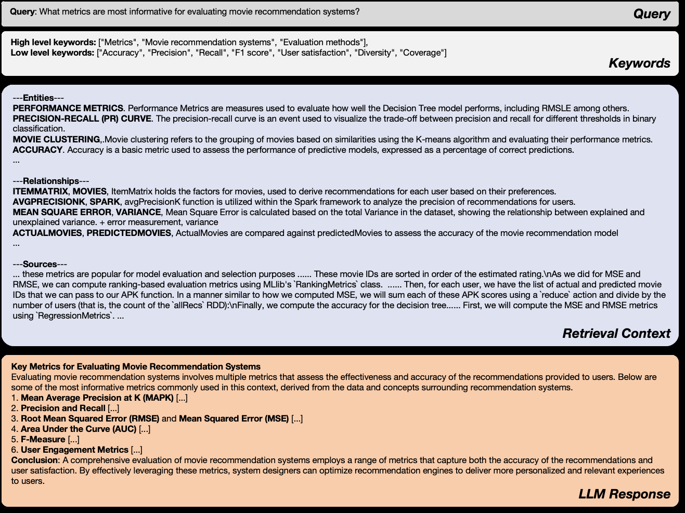
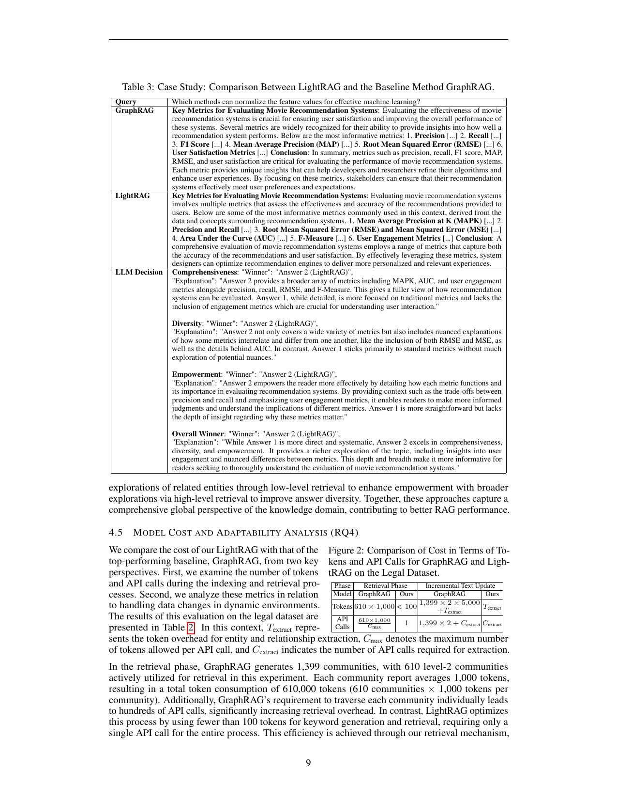

> [[../index|Wiki]] | [[../summary|Summary]] | [[../digest|Digest]]

# Ablation Studies, Case Study, and Cost/Adaptability Analysis (RQ2-RQ4)

**In one sentence:** Removing either retrieval level degrades LightRAG while dropping the original text does not, a worked example shows it beating GraphRAG on every LLM-judged dimension, and its token/API-call cost is orders of magnitude lower than GraphRAG's in both retrieval and incremental updates.

## Key points

- Ablating high-level retrieval (-High, low-level only) causes a significant performance decline across nearly all datasets, because its focus on specific entities and immediate neighbors is insufficient for queries demanding comprehensive insights.
- Ablating low-level retrieval (-Low, high-level only) gains comprehensiveness via entity-wise relationships but loses depth on specific entities, struggling with tasks that need precise, detailed answers.
- The full hybrid LightRAG consistently dominates its ablated variants across Agriculture, CS, Legal, and Mix (e.g., Overall: 67.6% vs 64.8%/-High and 65.2%/-Low on Agriculture; 84.8% vs 78.0%/-High and 81.2%/-Low on Legal).
- Surprisingly, removing original text from retrieval (-Origin) causes no significant decline on any dataset and even improves some (Agriculture, Mix), because graph-based indexing extracts sufficient key information and original text often adds noise.
- In the case study (movie-recommendation-metrics query), the LLM judge names LightRAG the winner over GraphRAG on all four dimensions: comprehensiveness, diversity, empowerment, and overall, citing broader metric coverage (MAPK, AUC, user engagement) and richer nuance.
- In the retrieval phase on the Legal dataset, GraphRAG consumes 610 × 1,000 = 610,000 tokens and about 610 × 1,000 / C_max API calls, while LightRAG uses fewer than 100 tokens and exactly 1 API call.
- In the incremental update phase (adding a dataset of the same size), GraphRAG must dismantle and fully regenerate its communities at ~1,399 × 2 × 5,000 tokens plus extraction overhead, whereas LightRAG's cost is only the extraction term (T_extract / C_extract).
- The cost advantage comes from LightRAG's retrieval mechanism integrating graph structures with vectorized representations and from its ability to merge new entities/relationships into the existing graph without full reconstruction.

---

## Ablation Studies (RQ2, Section 4.3)

LightRAG's ablation studies evaluate two design choices: the dual-level retrieval paradigm (low-level + high-level retrieval) and the use of graph-based text indexing versus original text. Results appear in Table 2, with the two single-module-omitted variants (-High, -Low) and the original-text variant (-Origin) compared against LightRAG across four datasets (Agriculture, CS, Legal, Mix), using NaiveRAG as the reference model.

### Effectiveness of the Dual-level Retrieval Paradigm

Three variant behaviors are examined:

- **Low-level-only retrieval (-High variant).** Removing high-order retrieval leads to a significant performance decline across nearly all datasets and metrics. The drop is attributed to an over-emphasis on specific information: this variant focuses excessively on entities and their immediate neighbors — enabling deeper exploration of directly related entities, but unable to gather the information complex queries demand for comprehensive insights.
- **High-level-only retrieval (-Low variant).** This variant prioritizes capturing a broader range of content by leveraging entity-wise relationships rather than specific entities. It offers a significant advantage in comprehensiveness (more extensive and varied information) but trades off reduced depth in examining specific entities, limiting highly detailed insight and making it struggle with tasks requiring precise, detailed answers.
- **Hybrid mode (full LightRAG).** Combines both: it retrieves a broader set of relationships while simultaneously conducting in-depth exploration of specific entities. The dual-level approach ensures breadth in retrieval and depth in analysis, producing a comprehensive view of the data and balanced performance across multiple dimensions.

Table 2: Performance of ablated versions of LightRAG, using NaiveRAG as reference.

**Agriculture**

| Variant | Metric | NaiveRAG | LightRAG |
|---|---|---|---|
| (full) | Comprehensiveness | 32.4% | 67.6% |
| (full) | Diversity | 23.6% | 76.4% |
| (full) | Empowerment | 32.4% | 67.6% |
| (full) | Overall | 32.4% | 67.6% |
| -High | Comprehensiveness | 34.8% | 65.2% |
| -High | Diversity | 27.2% | 72.8% |
| -High | Empowerment | 36.0% | 64.0% |
| -High | Overall | 35.2% | 64.8% |
| -Low | Comprehensiveness | 36.0% | 64.0% |
| -Low | Diversity | 28.0% | 72.0% |
| -Low | Empowerment | 34.8% | 65.2% |
| -Low | Overall | 34.8% | 65.2% |
| -Origin | Comprehensiveness | 24.8% | 75.2% |
| -Origin | Diversity | 26.4% | 73.6% |
| -Origin | Empowerment | 32.0% | 68.0% |
| -Origin | Overall | 25.6% | 74.4% |

**CS**

| Variant | Metric | NaiveRAG | LightRAG |
|---|---|---|---|
| (full) | Comprehensiveness | 38.4% | 61.6% |
| (full) | Diversity | 38.0% | 62.0% |
| (full) | Empowerment | 38.8% | 61.2% |
| (full) | Overall | 38.8% | 61.2% |
| -High | Comprehensiveness | 42.8% | 57.2% |
| -High | Diversity | 36.8% | 63.2% |
| -High | Empowerment | 42.4% | 57.6% |
| -High | Overall | 44.0% | 56.0% |
| -Low | Comprehensiveness | 43.2% | 56.8% |
| -Low | Diversity | 39.6% | 60.4% |
| -Low | Empowerment | 42.8% | 57.2% |
| -Low | Overall | 43.6% | 56.4% |
| -Origin | Comprehensiveness | 39.2% | 60.8% |
| -Origin | Diversity | 44.8% | 55.2% |
| -Origin | Empowerment | 43.2% | 56.8% |
| -Origin | Overall | 39.2% | 60.8% |

**Legal**

| Variant | Metric | NaiveRAG | LightRAG |
|---|---|---|---|
| (full) | Comprehensiveness | 16.4% | 83.6% |
| (full) | Diversity | 13.6% | 86.4% |
| (full) | Empowerment | 16.4% | 83.6% |
| (full) | Overall | 15.2% | 84.8% |
| -High | Comprehensiveness | 23.6% | 76.4% |
| -High | Diversity | 16.8% | 83.2% |
| -High | Empowerment | 22.8% | 77.2% |
| -High | Overall | 22.0% | 78.0% |
| -Low | Comprehensiveness | 19.2% | 80.8% |
| -Low | Diversity | 13.6% | 86.4% |
| -Low | Empowerment | 16.4% | 83.6% |
| -Low | Overall | 18.8% | 81.2% |
| -Origin | Comprehensiveness | 16.4% | 83.6% |
| -Origin | Diversity | 14.4% | 85.6% |
| -Origin | Empowerment | 17.2% | 82.8% |
| -Origin | Overall | 15.6% | 84.4% |

**Mix**

| Variant | Metric | NaiveRAG | LightRAG |
|---|---|---|---|
| (full) | Comprehensiveness | 38.8% | 61.2% |
| (full) | Diversity | 32.4% | 67.6% |
| (full) | Empowerment | 42.8% | 57.2% |
| (full) | Overall | 40.0% | 60.0% |
| -High | Comprehensiveness | 40.4% | 59.6% |
| -High | Diversity | 36.0% | 64.0% |
| -High | Empowerment | 47.6% | 52.4% |
| -High | Overall | 42.4% | 57.6% |
| -Low | Comprehensiveness | 36.0% | 64.0% |
| -Low | Diversity | 33.2% | 66.8% |
| -Low | Empowerment | 35.2% | 64.8% |
| -Low | Overall | 35.2% | 64.8% |
| -Origin | Comprehensiveness | 44.4% | 55.6% |
| -Origin | Diversity | 25.6% | 74.4% |
| -Origin | Empowerment | 45.2% | 54.8% |
| -Origin | Overall | 44.4% | 55.6% |

### Semantic Graph Excels in RAG (the -Origin Variant)

LightRAG's use of original text in retrieval was eliminated entirely. Surprisingly, the resulting -Origin variant does not exhibit significant performance declines across all four datasets, and in some cases even shows improvements (e.g., on Agriculture and Mix). The authors attribute this to the effective extraction of key information during graph-based indexing, which provides sufficient context for answering queries; additionally, the original text often contains irrelevant information that introduces noise in the response.

## Case Study (RQ3, Section 4.4)

To provide a clear comparison between baseline methods and LightRAG, Table 3 presents specific case examples: responses to a machine learning question from the competitive baseline GraphRAG and from LightRAG, followed by the LLM judge's decisions. In this instance, LightRAG outperforms in all evaluation dimensions assessed by the LLM judge: comprehensiveness, diversity, empowerment, and overall quality.

Key observations:

- **Comprehensiveness.** LightRAG covers a broader range of machine learning metrics, showcasing its ability to effectively discover relevant information — highlighting the strength of the graph-based indexing paradigm in precise entity and relation extraction and LLM profiling.
- **Both Diversity and Empowerment.** LightRAG offers a more diverse array of information and delivers more empowering content. This success is due to the hierarchical retrieval paradigm, which combines in-depth explorations of related entities through low-level retrieval to enhance empowerment with broader explorations via high-level retrieval to improve answer diversity. Together, these approaches capture a comprehensive global perspective of the knowledge domain, contributing to better RAG performance.

Table 3: Case Study — Comparison Between LightRAG and the Baseline Method GraphRAG.

| | |
|---|---|
| **Query** | Which methods can normalize the feature values for effective machine learning? |
| **GraphRAG** | Key Metrics for Evaluating Movie Recommendation Systems: Precision; Recall; F1 Score; Mean Average Precision (MAP); Root Mean Squared Error (RMSE); User Satisfaction Metrics — concluding that precision, recall, F1, MAP, RMSE, and user satisfaction are critical for evaluating recommendation system performance. |
| **LightRAG** | Key Metrics for Evaluating Movie Recommendation Systems: Mean Average Precision at K (MAPK); Precision and Recall; RMSE and MSE; Area Under the Curve (AUC); F-Measure; User Engagement Metrics — concluding that a comprehensive evaluation employs a range of metrics capturing both recommendation accuracy and user satisfaction. |
| **LLM Decision — Comprehensiveness** | Winner: Answer 2 (LightRAG). Provides a broader array of metrics including MAPK, AUC, and user engagement metrics alongside precision, recall, RMSE, and F-Measure, giving a fuller view; Answer 1 is more focused on traditional metrics and lacks engagement metrics. |
| **LLM Decision — Diversity** | Winner: Answer 2 (LightRAG). Covers a wide variety of metrics with nuanced explanations of how they interrelate (e.g., both RMSE and MSE, details behind AUC); Answer 1 sticks to standard metrics without exploring nuances. |
| **LLM Decision — Empowerment** | Winner: Answer 2 (LightRAG). Details how each metric functions and its importance, provides context such as precision–recall trade-offs, and emphasizes user engagement metrics, enabling more informed judgments; Answer 1 is more straightforward but lacks depth. |
| **LLM Decision — Overall** | Winner: Answer 2 (LightRAG). While Answer 1 is more direct and systematic, Answer 2 excels in comprehensiveness, diversity, and empowerment, offering a richer exploration including insights into user engagement and nuanced differences between metrics. |

## Model Cost and Adaptability Analysis (RQ4, Section 4.5)

LightRAG's cost is compared with the top-performing baseline GraphRAG from two perspectives: (1) the number of tokens and API calls during indexing and retrieval, and (2) these metrics in relation to handling data changes in dynamic environments. The evaluation is done on the legal dataset, with:

- `T_extract` — token overhead for entity and relationship extraction,
- `C_max` — maximum number of tokens allowed per API call,
- `C_extract` — number of API calls required for extraction.

### Retrieval Phase

GraphRAG generates 1,399 communities, of which 610 level-2 communities are actively utilized for retrieval in this experiment. Each community report averages 1,000 tokens, giving a total token consumption of 610,000 tokens (610 × 1,000). GraphRAG's requirement to traverse each community individually leads to hundreds of API calls (approximately 610 × 1,000 / C_max), significantly increasing retrieval overhead. In contrast, LightRAG optimizes the process by using fewer than 100 tokens for keyword generation and retrieval, requiring only a single API call for the entire process. This efficiency comes from a retrieval mechanism that seamlessly integrates graph structures and vectorized representations for information retrieval, eliminating the need to process large volumes of information upfront.

### Incremental Text Update

In the incremental data update phase — designed for changing, dynamic real-world scenarios — both models exhibit similar overhead for entity and relationship extraction. However, GraphRAG shows significant inefficiency in managing newly added data: when a new dataset of the same size as the legal dataset is introduced, GraphRAG must dismantle its existing community structure to incorporate new entities and relationships, followed by complete regeneration. This incurs a substantial token cost of approximately 5,000 tokens per community report; given 1,399 communities, GraphRAG would require around 1,399 × 2 × 5,000 tokens to reconstruct both the original and new community reports — an exorbitant expense. LightRAG, in contrast, seamlessly integrates newly extracted entities and relationships into the existing graph without full reconstruction, resulting in significantly lower overhead during incremental updates and demonstrating superior efficiency and cost-effectiveness.

| Phase | Metric | GraphRAG | LightRAG (Ours) |
|---|---|---|---|
| Retrieval | Tokens | 610 × 1,000 (= 610,000) | < 100 |
| Retrieval | API Calls | 610 × 1,000 / C_max | 1 |
| Incremental Text Update | Tokens | 1,399 × 2 × 5,000 + T_extract | T_extract |
| Incremental Text Update | API Calls | 1,399 × 2 + C_extract | C_extract |

**Covers:** 4.3 ablation studies (RQ2), 4.4 case study (RQ3), 4.5 model cost and adaptability analysis (RQ4), Figures 2-3
