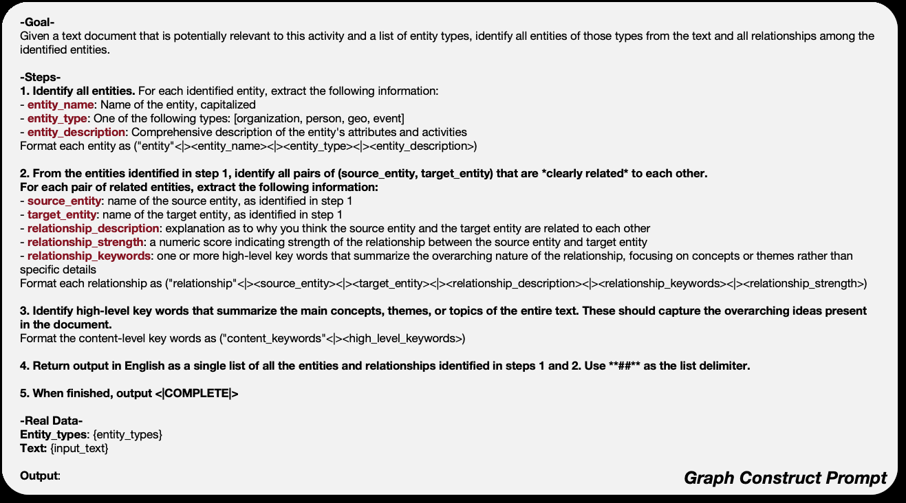
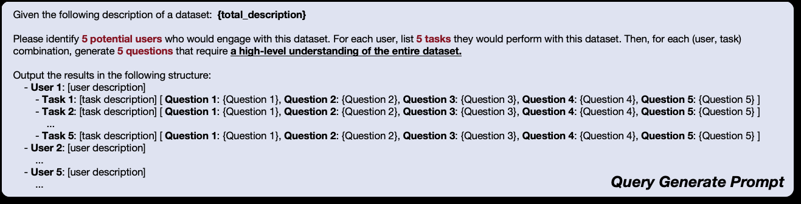
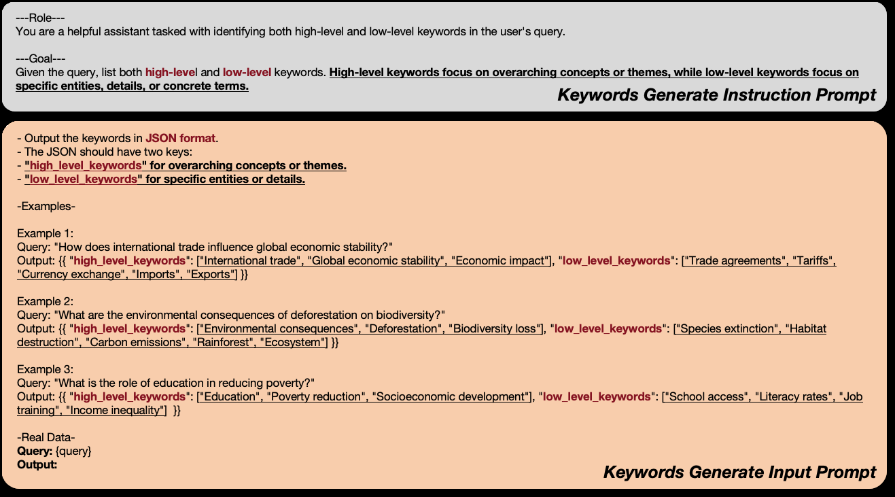
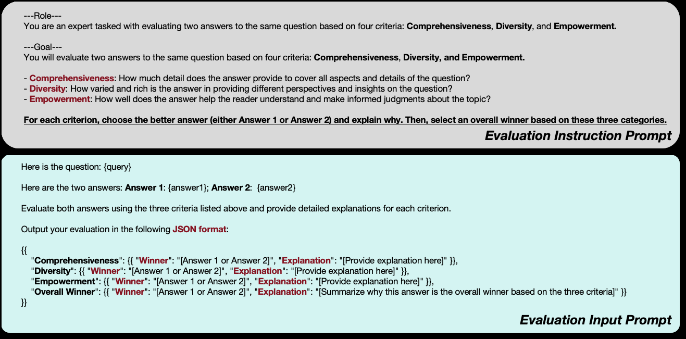

> [[../index|Wiki]] | [[../summary|Summary]] | [[../digest|Digest]]

# Related Work, Conclusion, and Appendix

**In one sentence:** The paper positions LightRAG against both vector-based RAG (which fragments context and does brute-force community searches) and graph-LLM hybrids, then concludes that a dynamically updatable knowledge graph with dual-level retrieval delivers faster, cheaper, better-grounded answers, and the appendix documents the datasets, all four core prompts, and a worked case study in which LightRAG beats the NaiveRAG baseline on every judged criterion.

## Key points

- Existing RAG approaches (Gao et al. 2022; 2023; Chan et al. 2024; Yu et al. 2024) embed queries in a vector space and retrieve top-k contexts from fragmented text chunks, limiting their ability to capture comprehensive global information needed for effective responses.
- Graph-RAG prior work, notably Edge et al. (2024) ("From local to global"), suffers from two limitations LightRAG targets: (1) lack of dynamic updates/expansion of the knowledge graph, and (2) inefficient brute-force searches over generated communities on large-scale queries — LightRAG addresses both via incremental updates and its dual-level retrieval paradigm.
- LLM-for-graphs research splits into three categories: GNNs as Prefix (GraphGPT, LLaGA), LLMs as Prefix (GALM, OFA), and LLMs-Graphs Integration (GRENADe, OFA-style fusion/alignment and graph-interactive LLM agents).
- The conclusion claims LightRAG excels in both efficiency and effectiveness: dual-level retrieval extracts both specific and abstract information, incremental updates keep the system current, and inference costs are reduced.
- Four evaluation datasets are specified verbatim: Agriculture (12 documents, 2,017,886 tokens), CS (10 documents, 2,306,535 tokens), Legal (94 documents, 5,081,069 tokens), Mix (61 documents, 619,009 tokens).
- Four prompt templates are specified in the appendix: Graph Construction (entity/relationship extraction with a strict tuple schema and `<COMPLETE>` sentinel), Query Generation (5 users × 5 tasks × 5 questions = 125 high-level questions), Keyword Extraction (two-field JSON separating high-level themes from low-level entities), and RAG Evaluation (LLM-as-judge over Comprehensiveness, Diversity, Empowerment with JSON verdicts).
- In the case study (Table 5), the LLM judge selected LightRAG as the winner on all three criteria and overall against NaiveRAG on the query about indigenous perspectives in corporate mergers, citing depth, breadth, and actionable insight.

---

## Related Work: RAG with LLMs

RAG (Ram et al. 2023; Fan et al. 2024) enhances LLM inputs by retrieving relevant information from external sources, grounding responses in factual, domain-specific knowledge. Current RAG approaches (precise zero-shot dense retrieval via Gao et al. 2022; the survey Gao et al. 2023; query-refinement RQ-RAG of Chan et al. 2024; RankRAG of Yu et al. 2024) typically embed queries in a vector space to find the nearest context vectors. However, many of these methods rely on **fragmented text chunks** and only retrieve the **top-k contexts**, limiting their ability to capture comprehensive global information needed for effective responses.

Although recent studies, notably Edge et al. (2024) — "From local to global: A graph RAG approach to query-focused summarization" — have explored using graph structures for knowledge representation, two key limitations persist:

1. **No dynamic updates.** These approaches often lack the capability for dynamic updates and expansions of the knowledge graph, making it difficult to incorporate new information effectively. LightRAG addresses this by enabling the RAG system to quickly adapt to new information, ensuring timeliness and accuracy via incremental updates.
2. **Brute-force community search.** Existing methods often rely on brute-force searches for each generated community, which are inefficient for large-scale queries. LightRAG overcomes this by facilitating rapid retrieval of relevant information from the graph through the proposed **dual-level retrieval paradigm**, significantly enhancing both retrieval efficiency and response speed.

## Related Work: LLMs for Graphs

Graphs are a powerful framework for representing complex relationships, and as LLMs evolve, research has increasingly focused on enhancing their capability to interpret graph-structured data. The paper divides this body of work into **three primary categories**:

1. **GNNs as Prefix** — Graph Neural Networks are utilized as the initial processing layer for graph data, generating structure-aware tokens that LLMs can use during inference. Notable examples: **GraphGPT** (Tang et al. 2024, SIGIR) and **LLaGA** (Chen et al. 2024, ICML).
2. **LLMs as Prefix** — LLMs process graph data enriched with textual information to produce node embeddings or labels, ultimately refining the training process for GNNs. Examples: **GALM** (Xie et al. 2023, KDD) and **OFA** (Liu et al. 2024, ICLR, "One for All: Towards training one graph model for all classification tasks").
3. **LLMs-Graphs Integration** — Focuses on achieving seamless interaction between LLMs and graph data, employing techniques such as fusion training and GNN alignment, and developing LLM-based agents capable of engaging with graph information directly. Cited work includes Li et al. (2023, GRENADe at EMNLP) and Brannon et al. (2023, CONGrat: self-supervised contrastive pretraining for joint graph and text embeddings).

## Conclusion

This work introduces an advancement in RAG through the integration of a **graph-based indexing approach** that enhances both efficiency and comprehension in information retrieval. Specifically:

- LightRAG utilizes a comprehensive knowledge graph to facilitate rapid and relevant document retrieval, enabling a deeper understanding of complex queries.
- Its **dual-level retrieval paradigm** allows for the extraction of both specific and abstract information, catering to diverse user needs.
- **Seamless incremental update capability** ensures the system remains current and responsive to new information, maintaining effectiveness over time.
- Overall, LightRAG excels in both efficiency and effectiveness, significantly improving the speed and quality of information retrieval and generation **while reducing costs for LLM inference**.

## Appendix: Experimental Data Details

Table 4 gives the statistical information for the four evaluation datasets, verbatim:

| Statistics | Agriculture | CS | Legal | Mix |
|---|---|---|---|---|
| Total Documents | 12 | 10 | 94 | 61 |
| Total Tokens | 2,017,886 | 2,306,535 | 5,081,069 | 619,009 |

The **Agriculture** dataset consists of 12 documents totaling 2,017,886 tokens; the **CS** dataset contains 10 documents with 2,306,535 tokens; the **Legal** dataset is the largest, comprising 94 documents and 5,081,069 tokens; and the **Mix** dataset includes 61 documents with a total of 619,009 tokens. (Notably, the token-per-document ratio varies widely across datasets — Legal averages far fewer tokens per document than CS.)

## Appendix: Case Example of Retrieval-Augmented Generation

Using the query **"What metrics are most informative for evaluating movie recommendation systems?"**, the retrieve-and-generate process (Figure 3) works as follows:

1. The LLM first extracts both **low-level and high-level keywords** from the query.
2. These keywords guide the **dual-level retrieval** process on the generated knowledge graph, targeting relevant entities and relationships.
3. The retrieved information is organized into three components: **entities, relationships, and corresponding text chunks**.
4. This structured data is fed into the LLM, enabling it to generate a comprehensive answer to the query.

This illustrates the query-side counterpart of the graph construction: keyword extraction drives entity/relationship retrieval rather than vector similarity over chunks.

## Appendix: Prompts Used in LightRAG

Four prompt templates constitute the operational core of LightRAG and are fully specified in the appendix figures.

### 7.3.1 Prompts for Graph Generation

The graph construction prompt (labeled "Graph Construct Prompt") is a deterministic, format-strict instruction set for knowledge-graph/entity-relationship extraction. Given a potentially relevant text document and a list of entity types, the LLM must:

1. **Identify entities**, each tagged with `entity_name` (capitalized), `entity_type` ∈ {organization, person, geo, event}, and `entity_description`; emitted as a tuple `("entity" <> <name> <> <type> <> <description>)`.
2. **Identify clearly related entity pairs**, with `source_entity`, `target_entity`, `relationship_description`, `relationship_strength` (numeric score), and `relationship_keywords`; emitted as a `("relationship" <> …)` tuple.
3. **Extract high-level `content_keywords`** summarizing the main concepts, formatted as `("content_keywords" <> <keywords>)`.
4. **Return everything in English** as a single list using `*####*` as the delimiter.
5. **End with the sentinel token `<COMPLETE>`**.

The template injects actual data at the `{entity_types}` and `{input_text}` placeholders, with a reserved blank field for the model's response. The design intent is a standardized, machine-parseable output schema so downstream systems can ingest entity and edge extractions consistently.

### 7.3.2 Prompts for Query Generation

The query generation prompt (labeled "Query Generate Prompt") is a meta-prompt for expanding a single dataset description into a structured combinatorial set of questions. Its structure:

- **Context line:** `Given the following description of a dataset: {total_description}` — a placeholder substituted with the actual dataset description.
- **Task:** produce **5 potential users** (e.g., data scientist, finance analyst, product manager), each with **5 tasks**, and for every (user, task) pair generate **5 questions** that require **a high-level understanding of the entire dataset** (the three "5" counts and the high-level-understanding requirement are emphasized in the figure).
- **Output schema:** a nested skeleton `User 1…User 5` → `Task 1…Task 5` → `[Question 1…Question 5]`.

In total this yields a fixed **5 × 5 × 5 = 125 high-level questions** organized by user persona and task — a template suited to dataset probing, QA-set construction, or benchmarking.

### 7.3.3 Prompts for Keyword Extraction

The keyword extraction prompt ("Keywords Generate") is a few-shot, schema-constrained extraction template rendered as two stacked panels:

- **Top panel (Instruction Prompt):** defines the role (an assistant that extracts both high- and low-level keywords) — high-level keywords represent broad concepts or themes, low-level keywords focus on specific entities, details, and concrete terms. It fixes the output schema: a JSON object with exactly two keys, `high_level_keywords` and `low_level_keywords`, each an array of strings.
- **Bottom panel (Input Prompt):** repeats the format rules plus **three worked examples**, then closes with a Real Data block — `Query: {query}` and an empty `Output:` — so `{query}` is the sole runtime variable.

The three examples uniformly demonstrate the abstract-vs-concrete split; for instance, an international-trade question maps to high-level `["International trade", "Global economic stability", "Economic impact"]` and low-level `["Trade agreements", "Tariffs", "Currency exchange", "Imports", "Exports"]`, with analogous pairs given for deforestation/biodiversity and education/poverty. The design intent is a stable, machine-parseable format that teaches the model the high/low distinction via examples.

### 7.3.4 Prompts for RAG Evaluation

The evaluation prompt (Figure 7) is an **LLM-as-judge** specification split into two cards: an Evaluation Instruction Prompt defining the evaluator's role and rubric, and an Evaluation Input Prompt instantiated with the template variables `{query}`, `{answer1}`, `{answer2}`. The judge compares two candidate answers to the same question on three criteria — **Comprehensiveness, Diversity, and Empowerment** — selects a winner for each with a rationale, then renders an **overall verdict**, all in a strict JSON contract. The schema the judge must emit is:

- `Comprehensiveness`: `{"Winner": "Answer 1 | Answer 2", "Explanation": "..."}`
- `Diversity`: same form
- `Empowerment`: same form
- `Overall Winner`: same form, synthesized across the three

This makes the evaluation reproducible and programmatically aggregatable — a fixed rubric applied to query/answer pairs with a strict JSON schema ensuring consistency and auditability of pairwise comparison in the RAG evaluation pipeline.

## Appendix: Case Study vs. Naive RAG

Table 5 compares LightRAG against the NaiveRAG baseline on the query: **"How do indigenous perspectives on ownership and collaboration influence corporate mergers in countries like Canada and Australia?"**

**NaiveRAG's answer** emphasizes community engagement, respect for traditional land use, and collaborative resource management, concluding that prioritizing Indigenous perspectives leads to more sustainable and equitable outcomes and that integrating them is a pathway to better business practices.

**LightRAG's answer** is structured with explicit sections — "Cultural Significance of Land Ownership", "The Role of Collaboration", "Legal and Regulatory Frameworks" — and a Conclusion, emphasizing communal rights to land and resources, spiritual connections to the environment, and collaboration over competition.

**The LLM judge's decision** selected **Answer 2 (LightRAG)** on every dimension:

- **Comprehensiveness:** LightRAG provides a thorough exploration by discussing cultural significance, collaboration, and legal frameworks with specific examples and detailed insights; NaiveRAG, while informative, lacks the same depth in analyzing the various dimensions.
- **Diversity:** LightRAG presents a wider array of perspectives — the communal aspect of land ownership, spiritual connections, and practical examples of collaboration — contrasting Indigenous views with Western notions; NaiveRAG primarily focuses on corporate strategies with limited perspective.
- **Empowerment:** LightRAG equips the reader with nuanced understanding and actionable insights by highlighting collaboration and legal frameworks, empowering corporations via an inclusive approach; NaiveRAG does not emphasize the moral or ethical implications as strongly.
- **Overall Winner:** LightRAG — "Answer 2 excels overall due to its comprehensive exploration, diversity of perspectives, and empowerment of the reader with actionable insights... Although Answer 1 is more direct, the depth and breadth of Answer 2 make it the stronger response."

The paper attributes this superiority to LightRAG's **dual-level retrieval process**, which enables a more comprehensive investigation of specific entities and their interrelationships, facilitating extensive searches that capture both overarching themes and the specific complexities within the topic — whereas NaiveRAG, relying on top-k context chunks, provides informative but shallower responses.

**Covers:** Section 5 (related work), Section 6 (conclusion), Appendix 7.1-7.4, Figures 4-7
