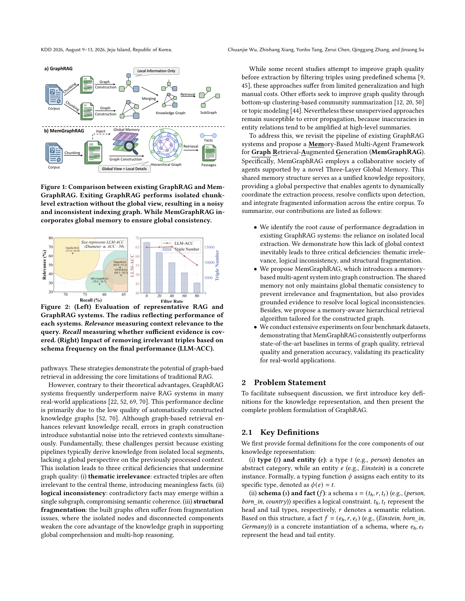
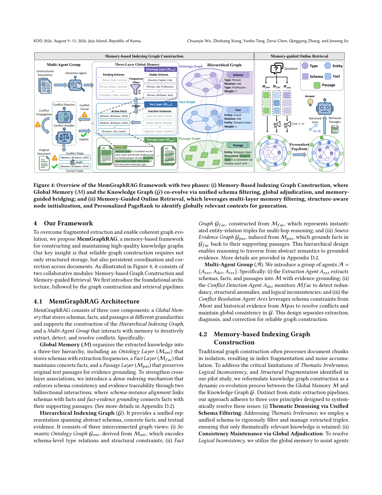

> [[../index|Wiki]] | [[../summary|Summary]] | [[../digest|Digest]]

# Motivation, Problem Statement, and Preliminary Study

**In one sentence:** Naive GraphRAG builds its knowledge graph from isolated, fragment-level extractions with no global view of the corpus, so the resulting graphs are thematically inconsistent, logically conflicting, and structurally fragmented — which degrades retrieval and generation performance below that of vanilla RAG.

## Key points

- Existing GraphRAG pipelines derive knowledge from isolated local segments, producing graphs with three core defects: **thematic irrelevance** (off-topic triples), **logical inconsistency** (contradictory facts within a subgraph), and **structural fragmentation** (isolated nodes, disconnected components, no multi-hop coherence).
- On the G-Medical benchmark, GraphRAG systems raise retrieval Recall (GFM-RAG: **84.3%** vs. vanilla RAG: **71.8%**) but crash Relevance (**38.5%** vs. **62.9%**), yielding noisier contexts and lower generation accuracy.
- Filtering out **40%** of low-frequency triples based on schema frequency slightly improves accuracy (**65.28%** vs. **64.85%**), showing that a large fraction of extracted triples is thematically irrelevant noise that simple frequency filtering cannot fix.
- Without persistent global memory, extraction LLMs process chunks independently, producing three conflict types: **mutually exclusive conflicts** (logically incompatible facts), **temporal conflicts** (missing temporal grounding for time-varying states), and **granularity conflicts** (inconsistent abstraction levels for the same entity).
- Bottom-up community summarization and topic modeling (used by prior work) are unsupervised and amplify errors: inaccuracies in entity relations get worse at higher-level summaries, error propagation.
- MemGraphRAG is proposed as a fix: a collaborative agent society backed by a **Three-Layer Global Memory** (Ontology, Fact, Passage layers) that acts as a unified knowledge repository for global context, dynamic conflict resolution, and cross-corpus integration.
- The paper claims that MemGraphRAG outperforms state-of-the-art baselines on four benchmarks in graph quality, retrieval quality, and generation accuracy with comparable efficiency.
- GraphRAG is formally decomposed into two phases: **offline GraphStructure Construction** (unstructured corpus → structured graph) and **online Graph-Enhanced Retrieval and Reasoning** (query → answer via graph search).

---

## Introduction

Large-scale real-world corpora are unstructured, heterogeneous, and information is sparsely distributed. Traditional RAG systems retrieve noisy, structurally incoherent contexts, and chunking strategies that segment documents into smaller pieces disrupt long-range dependencies and lose contextual details, making the retrieved context incoherent or insufficient for complex reasoning.

GraphRAG addresses this by leveraging external structured graphs to model hierarchical knowledge. Key prior work spans RAPTOR and Microsoft GraphRAG (recursively summarized communities for coarse-to-fine retrieval), GFMRAG, G-Retriever, and LightRAG (specialized retrieval for multi-hop generalization and efficiency), and HippoRAG / HippoRAG2 (cognitive associative-memory-inspired, using Personalized PageRank for multi-hop reasoning).

Despite these theoretical advantages, GraphRAG systems frequently underperform naive RAG in many real-world applications because automatically constructed knowledge graphs are of low quality. The root cause is the reliance on isolated local extraction without a global perspective, which produces three systematic deficiencies:

1. **Thematic irrelevance** — extracted triples are often irrelevant to the central theme, injecting meaningless facts.
2. **Logical inconsistency** — contradictory facts co-occur within a single subgraph, breaking semantic coherence.
3. **Structural fragmentation** — isolated nodes and disconnected components weaken the graph's ability to support global comprehension and multi-hop reasoning.

Prior remediation attempts are unsatisfying: schema-based triple filtering suffers from limited generalization and high manual cost, while unsupervised community summarization and topic modeling remain vulnerable to error propagation (inaccuracies in entity relations are amplified at higher-level summaries).

MemGraphRAG introduces a memory-based multi-agent system for graph construction, using a Three-Layer Global Memory as a shared knowledge repository to let agents dynamically coordinate extraction, resolve conflicts upon detection, and integrate fragmented information across the entire corpus. A memory-aware hierarchical retrieval algorithm is also proposed. Contributions:

- Identifying the root cause of GraphRAG performance degradation (isolated local extraction) and the three resulting deficiencies.
- Proposing MemGraphRAG: a memory-based multi-agent graph construction framework plus a memory-aware hierarchical retrieval algorithm.
- Demonstrating consistent outperformance of state-of-the-art baselines on four benchmark datasets across graph quality, retrieval quality, and generation accuracy.

## Problem Statement

### Key Definitions

Four core concepts anchor the knowledge representation:

| Symbol | Name | Definition | Example |
|---|---|---|---|
| _t_ | Type | Abstract category | `person` |
| _e_ | Entity | Concrete instance; typing function _φ(e) = t_ | `Einstein` |
| _s_ | Schema | Logical constraint (_t_h_, _r_, _t_t_); head/tail types and a semantic relation | `(person, born_in, country)` |
| _f_ | Fact | Concrete instantiation of a schema (_e_h_, _r_, _e_t_) | `(Einstein, born_in, Germany)` |
| _O_ | Ontology | Collection of all valid schemas _O = {s_1, …, s_|O|_}; encodes theme and logical rules | — |
| _p_ | Passage | Source text segment; tracing function _ψ(f) = p_ links facts back to origin | — |

### Problem Formulation

GraphRAG is formally decomposed into two phases:

1. **Offline Graph Structure Construction.** Given an unstructured corpus _D = {d_1, …, d_|D|_}, a GraphConstructor maps it to a structured graph _G = (V, E)_. The vertex set is heterogeneous: _V = V_e ∪ V_t ∪ V_p_ (entities, types, passages), and the edge set encodes semantic dependencies. The process is written as:

   _G = GraphConstructor(D)_

2. **Online Graph-Enhanced Retrieval and Reasoning.** Given a query _q_ and the graph _G_, a Retriever identifies the most relevant subgraph elements to curate grounded context, and an LLM generates the answer:

   _a = LLM(Retriever(q, G))_

## Preliminary Study

### Performance Degradation

On the G-Medical dataset, GraphRAG systems (MSGraphRAG, HippoRAG, GFM-RAG) vs. vanilla RAG:

| Method | Recall (%) | Relevance (%) |
|---|---|---|
| Vanilla RAG | 71.8 | 62.9 |
| GFM-RAG | 84.3 | 38.5 |

GraphRAG methods retrieve more of the needed evidence (higher Recall) but introduce substantially more irrelevant content (lower Relevance), producing noisier contexts and lower generation accuracy. Existing GraphRAG pipelines expand retrieval coverage at the cost of excessive irrelevant information, ultimately harming QA performance.

The figure's two panels diagnose why graph-augmented RAG underperforms: graph-based systems sit at a low-recall, low-relevance corner relative to vanilla RAG, and the intuitive remedy of pruning low-frequency triples actually correlates with *lower* LLM-ACC — graph-quality filtering is counterproductive, motivating global-consistency enforcement instead.

### Error Analysis (Thematic Irrelevance, Logical Inconsistency, Structural Fragmentation)

The root cause is the isolated local extraction paradigm: without persistent global memory, extraction LLMs process chunks independently, producing systematic graph-quality failures.

**Thematic Irrelevance.** Without a global view of the corpus theme, local extraction introduces off-topic triples. A filtering experiment (Figure 2b) removes triples based on schema frequency: filtering out 40% of low-frequency triples slightly *improves* accuracy (65.28% vs. 64.85%), confirming that a large share of extracted triples is thematically irrelevant noise.

**Logical Inconsistency.** Independent extraction also produces semantic contradictions in the merged graph. Three conflict types are observed:

1. **Mutually Exclusive Conflict** — logically incompatible facts co-occur.
2. **Temporal Conflict** — time-varying states lack temporal grounding, producing contradictory temporal assertions.
3. **Granularity Conflict** — inconsistent abstraction levels for the same entity or concept.

These create inconsistent reasoning paths and confuse downstream retrieval.

The figure illustrates the three conflict types with concrete examples: mutually exclusive conflicts from logically incompatible facts, temporal conflicts from missing temporal grounding, and granularity conflicts from inconsistent abstraction levels — details in Table 8 of Appendix C.

**Structural Fragmentation.** Missing global coreference resolution and schema alignment mean that key entities are duplicated or scattered across disconnected subgraphs. This prevents effective multi-hop traversal and reduces the graph's usefulness for global reasoning.

### Discussion

Two fundamental limitations of current GraphRAG are identified:

- **Recall–relevance trade-off.** Graph expansion improves coverage but retrieves irrelevant evidence that overwhelms the LLM and degrades generation accuracy.
- **No global memory mechanism during graph construction.** Most systems rely on isolated local extraction without a persistent global state, so the constructed graph fails to preserve thematic coherence and resolve cross-document conflicts — producing thematic irrelevance, logical inconsistency, and structural fragmentation in downstream retrieval and reasoning.

**Covers:** Abstract, Section 1, Section 2 (2.1, 2.2), Section 3 (3.1-3.3) of arXiv 2606.00610
