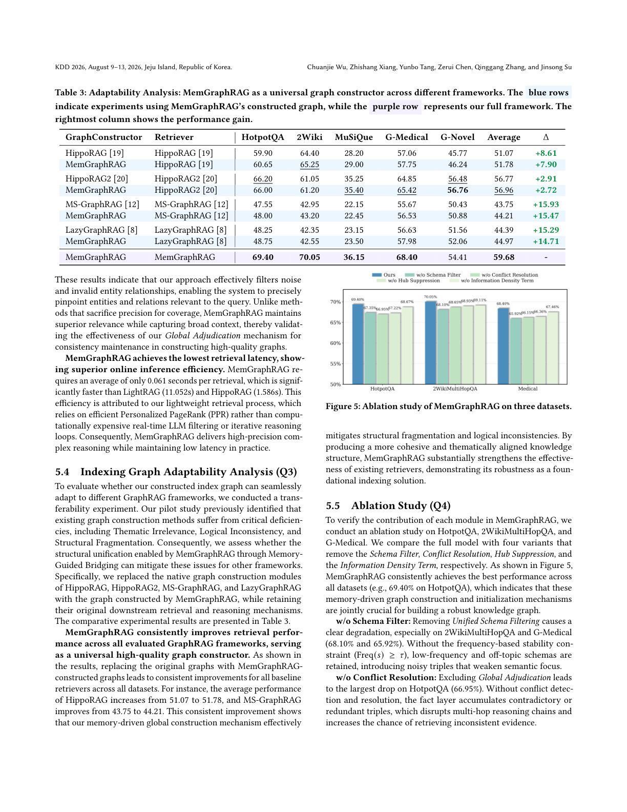

> [[../index|Wiki]] | [[../summary|Summary]] | [[../digest|Digest]]

# The MemGraphRAG Framework and Experimental Results

**In one sentence:** MemGraphRAG replaces isolated chunk-level graph construction with a persistent three-tier Global Memory (Ontology / Fact / Passage) that co-evolves with a Hierarchical Indexing Graph under a three-agent Extract–Detect–Resolve loop, and at query time seeds query-specific Personalized PageRank, yielding the best generation accuracy (59.25% avg) and the lowest retrieval latency (0.061 s) among the compared GraphRAG baselines.

## Key points

- **Architecture:** three core components — a Global Memory **M** with an Ontology Layer (M_ont, schemas + frequencies), a Fact Layer (M_fac, instantiated triples), and a Passage Layer (M_pas, source evidence), plus bidirectional dense indexing (schema–instance alignment, fact–evidence grounding); a Hierarchical Indexing Graph **G** with three views (G_ont, G_fac, G_pas); and a Multi-Agent Group A = {A_ext, A_det, A_res} separating extraction, diagnosis, and correction.
- **Three construction principles** address the pilot-study failure modes: (i) Thematic Denoising via Unified Schema Filtering — schemas are promoted to stable only when Freq(s) ≥ τ, and only facts aligned with stable schemas activate; (ii) Consistency Maintenance via Global Adjudication — A_det flags conflict sets F_conf = {t′ | Sim(t_new, t′) > δ ∨ Match(t_new, t′)}, then A_res adjudicates using the provenance passages in M_pas (filter invalid facts, merge redundant triples, resolve temporal/granularity conflicts); (iii) Structural Unification via Memory-Guided Bridging — G_fac is augmented with type-based edges from shared stable schema types and similarity-based edges between high-embedding-similarity entities.
- **Retrieval pipeline (3 stages):** parallel top-K retrieval from all three memory layers with similarity thresholding Sim(q, x) > τ (fall back to standard RAG over M_pas if S_ret ∪ F_ret = ∅); Structure-Aware Node Initialization of entity/type/passage nodes; then Personalized PageRank with damping λ = 0.5, selecting top-K passages and top-M entities.
- **Initialization details:** entity weight = mean Sim(q, f) over retrieved facts containing the entity; type nodes get a Hub Suppression factor 1/log(deg(t)+1) to prevent generic high-degree types from dominating propagation; passage nodes combine Sim(q, d_p) × α (α = 0.05) × an Information Density term (log-normalized aggregated IDF of entities in the passage).
- **Q1 Generation (Table 1):** RAG nearly doubles zero-shot (GPT-4o-mini on MuSiQue: 14.65% → 30.15% with Vanilla RAG top-5); HippoRAG2 is the strongest baseline context (38.30% MuSiQue, 56.48% G-Novel LLM-Acc); MemGraphRAG wins on all datasets at **59.25% average accuracy**, a 2.10-point absolute gain over the strongest baseline.
- **Q2 Retrieval (Table 2, G-Bench Medical):** MemGraphRAG tops Complex Reasoning (Recall 90.42, Relevance 82.64) and Fact Retrieval Relevance (88.53, best), beats HippoRAG2 on Fact Retrieval Relevance (88.53 vs 87.96), and has the **lowest retrieval time: 0.061 s** vs LightRAG 11.052 s / HippoRAG 1.586 s.
- **Q3 Adaptability (Table 3):** MemGraphRAG's graph used as a drop-in constructor improves every tested retriever — e.g. HippoRAG 51.07 → 51.78 avg (+8.61 on one dataset cluster... see table), MS-GraphRAG 43.75 → 44.21, with the largest gains of +14.7 to +15.9 on G-Medical / G-Novel, showing the constructed graph is a universal high-quality index.
- **Q4 Ablation (Figure 5, HotpotQA):** full model 69.40%; removing Schema Filter → 68.10%, Conflict Resolution → 66.95% (largest drop), Hub Suppression → 67.22%, Information Density Term → 68.67% — every component contributes, with schema filtering and conflict adjudication as the primary drivers.

---

## Framework Architecture

MemGraphRAG is proposed to overcome fragmented (chunk-isolated) extraction and enable coherent graph evolution. Its key insight: reliable graph construction requires not only structured storage but **persistent coordination and correction across documents**. The framework consists of two collaborative modules — Memory-based Indexing Graph Construction and Memory-guided Online Retrieval.

Figure 4 lays out the two phases side by side: the left panel shows documents feeding a multi-agent group (Extraction Agent → Conflict Detector/Handler with audit and conflict/correct-triple loops) alongside the three-layer Global Memory (Ontology with pending vs. stable schemas, Fact layer with active vs. inactive instances, Passage layer) and the hierarchical graph (Ontology → Fact → Passage), while the right panel shows query-time retrieval where three memory layers are filtered by a similarity threshold and scored with Personalized PageRank to select the answer context.

### Global Memory (M) and the Hierarchical Indexing Graph (G)

**Global Memory (M)** organizes extracted knowledge into a three-tier hierarchy:

| Layer | Stores | Role |
|---|---|---|
| Ontology Layer (M_ont) | schemas with extraction frequencies | stable type taxonomy, structural constraints |
| Fact Layer (M_fac) | concrete instantiated facts (triples) | multi-hop reasoning substrate |
| Passage Layer (M_pas) | original text passages | evidence grounding / provenance |

A dense indexing mechanism enforces cross-layer association via two bidirectional interactions: **schema-instance alignment** (schemas ↔ facts) and **fact-evidence grounding** (facts ↔ supporting passages).

**Hierarchical Indexing Graph (G)** spans abstract schemas, concrete facts, and textual evidence through three interconnected graph views:

| View | Derived from | Encodes |
|---|---|---|
| Semantic Ontology Graph G_ont | M_ont | schema-level type relations and structural constraints (logical backbone) |
| Fact Graph G_fac | M_fac | instantiated entity-relation triples for multi-hop reasoning |
| Source Evidence Graph G_pas | M_pas | links facts/entities back to supporting passages |

The hierarchy lets reasoning traverse from abstract semantics down to grounded evidence.

**Multi-Agent Group (A = {A_ext, A_det, A_res}):**

- **Extraction Agent (A_ext):** extracts schemas, facts, passages into M with evidence grounding.
- **Conflict Detection Agent (A_det):** monitors M_fac for redundancy, structural anomalies, logical inconsistencies.
- **Conflict Resolution Agent (A_res):** uses schema constraints from M_ont and historical evidence from M_pas to resolve conflicts and keep G globally consistent.

The division separates extraction, diagnosis, and correction — the core mechanism for reliable graph construction.

## Memory-based Indexing Graph Construction

Traditional graph construction processes chunks in isolation, causing index fragmentation and noise accumulation. MemGraphRAG reformulates construction as a **dynamic co-evolution process between M and G**, targeting the three pilot-study failures: *Thematic Irrelevance*, *Logical Inconsistency*, *Structural Fragmentation* — each addressed by one principle:

1. **Thematic Denoising via Unified Schema Filtering** → resolves Thematic Irrelevance.
2. **Consistency Maintenance via Global Adjudication** → resolves Logical Inconsistency.
3. **Structural Unification via Memory-Guided Bridging** → resolves Structural Fragmentation.

### Schema Filtering

Construction begins with A_ext, which transforms each document chunk c_i into structured entries for **all three** memory layers jointly — candidate schemas, instantiated facts, and supporting passages:

> A_ext(c_i) → {S_cand ∈ M_ont, T_cand ∈ M_fac, P_src ∈ M_pas}   (Eq. 3)

so every triple is strictly schema-aligned and evidence-grounded. To suppress hallucination accumulation, new schemas start as **candidates** and are promoted to *stable* only when their empirical frequency crosses a threshold:

> M_ont[stable] = { s ∈ M_ont | Freq(s) ≥ τ }   (Eq. 4)

Only facts aligned with **stable** schemas are activated for downstream graph construction and reasoning — this frequency-based stability constraint is what later ablations (w/o Schema Filter) show to be load-bearing.

### Consistency Maintenance via Global Adjudication

When a new triple t_new becomes active in M_fac, A_det **asynchronously** scans existing facts and builds a conflict set from semantic similarity plus ontology-level structural constraints:

> F_conf = { t′ ∈ M_fac | Sim(t_new, t′) > δ ∨ Match(t_new, t′) }   (Eq. 5)

If F_conf is non-empty, A_res is triggered. Rather than correcting heuristically, A_res uses **fact-evidence grounding** to pull the provenance passages from M_pas and adjudicates by comparing the actual textual evidence. Resulting corrective actions: filtering invalid facts, merging redundant triples, and resolving temporal or granularity inconsistencies. The decoupled detection–resolution loop keeps M_fac globally coherent throughout construction.

### Structural Unification via Memory-Guided Bridging (4.2.3)

In the final phase, the refined M is projected into G as three interconnected views:

- **G_ont** built directly from M_ont — nodes/edges encode schema-level types and valid relations (logical backbone).
- **G_fac** built from M_fac — entities as nodes, instantiated triples as edges, enabling multi-hop reasoning. To cut fragmentation, G_fac is **augmented with bridging edges**: (a) type-based connections from shared stable schema types in G_ont, and (b) similarity-based connections between high-embedding-similarity entities.
- **G_pas** induced from M_pas — links facts and entities in G_fac back to their originating passages, so every reasoning path stays traceable to grounded evidence.

## Memory-guided Online Retrieval

Retrieval runs in three stages: (i) Multi-Layer Memory Retrieval, (ii) Structure-Aware Node Initialization, (iii) Graph Propagation (PPR).

**Multi-Layer Memory Filtering (4.3.1).** Given a query q, top-K candidates are retrieved in parallel from M_ont, M_fac, and M_pas; schemas/facts with Sim(q, x) > τ are retained. If no valid structural candidates remain (S_ret ∪ F_ret = ∅), the system falls back to standard RAG retrieval by selecting passages from M_pas directly by query similarity.

**Structure-Aware Node Initialization (4.3.2).** Retrieved evidence is projected onto the heterogeneous graph by defining a reset probability distribution P_init(v) for every node v ∈ G, initialized along three complementary dimensions:

### Entity Node Initialization via Facts

Each entity node e is seeded from the relevance of its associated retrieved facts — the **mean similarity** over all query-relevant facts containing e (F_e ⊆ F_ret):

> P_init(e) = (1/|F_e|) Σ_{f ∈ F_e} Sim(q, f)   (Eq. 6); if F_e = ∅ then P_init(e) = 0.

This ensures propagation originates from grounded evidence rather than generic nodes.

### Type Node Initialization via Schemas

Type nodes t are initialized from retrieved schemas in M_ont. Because generic types (e.g., "Person" connected to thousands of entities) have **exceptionally large degrees** that would spread importance across too many nodes, a structural regularization term (**Hub Suppression**) multiplies schema relevance by a log-degree penalty:

> P_init(t) = (1/|S_t|) Σ_{s ∈ S_t} Sim(q, s) × 1 / log(deg(t) + 1)   (Eq. 7)

This preserves schema-level relevance while preventing overly generic types from dominating propagation.

### Passage Node Initialization via Information Density

Passage nodes p ∈ G_pas are initialized by combining semantic relevance with an information-density prior:

> P_init(p) = Sim(q, d_p) × α × σ_{e ∈ E_p}[IDF(e)] / log(|E_p| + 1)   (Eq. 8)

where α = **0.05** dampens passage nodes so they do not dominate propagation, and the Information Density term aggregates log-normalized IDF scores of the passage's entities, favoring passages that contain **rare, informative** entities.

**Personalized PageRank (4.3.3).** PPR then propagates query-specific importance via v^(k+1) = (1 − λ) W v^(k) + λ v^(0). Damping λ = **0.5** is chosen to keep propagation within a local neighborhood and limit semantic drift. On convergence, the top-K passages and top-M entities ranked by v^(∞) are selected for LLM inference.

## Experimental Setting

**Datasets.** Three multi-hop QA benchmarks (1,000 validation questions each, following HippoRAG / HippoRAG2 settings): **HotpotQA**, **2WikiMultiHopQA**, **MuSiQue**; plus **G-Bench (Medical)** and **G-Bench (Novel)** for complex reasoning over domain knowledge.

**Baselines (three groups).** (i) Zero-shot LLM inference: LLaMA3-8B, LLaMA3-13B, GPT-3.5-turbo, GPT-4o-mini. (ii) Vanilla RAG retrieving 1, 3, or 5 top passages. (iii) State-of-the-art GraphRAG: KGP, G-retriever, LightRAG, RAPTOR, MS-GraphRAG, HippoRAG / HippoRAG2, GFM-RAG, LazyGraphRAG, E²-GraphRAG, LogicRAG, LinearRAG.

**Metrics.** QA: **Str-Acc.** (string-based, gold answer substring after lowercase normalization) and **LLM-Acc.** (LLM judges match). G-Bench: LLM-ACC only (long descriptive gold answers). Retrieval (from GraphRAG-Bench): **Context Relevance** (semantic alignment of question ↔ retrieved passages) and **Evidence RecalL** (retrieved content covers all necessary answer information).

**Implementation.** All methods share NV-Embed-v2 embeddings; top-k = 5 retrieval; GPT-4o-mini is the default LLM for offline indexing, online generation, and LLM-Acc evaluation; temperature set to 0 for reproducibility.

## Generation Accuracy (Q1)

Results are in Table 1 (best bold, second underlined, Δ = MemGraphRAG's 59.25 minus each baseline; darker green = larger gap). Three observations:

| Observation | Evidence |
|---|---|
| Retrieval augmentation is essential | Zero-shot GPT-4o-mini averages just **14.65%** on MuSiQue; Vanilla RAG (top-5) **doubles** it to **30.15%** |
| Graph retrieval helps multi-hop reasoning | Increasing k in Vanilla RAG plateaus quickly (surface keyword matching misses logical bridges); GraphRAG methods capture structural dependencies — strongest baseline HippoRAG2: **38.30%** (MuSiQue) and **56.48%** (G-Novel) LLM-Acc |
| **MemGraphRAG wins all datasets** | Mitigates noise from isolated chunk-level extraction → best results everywhere, **59.25% average accuracy**, a **2.10-point absolute gain** over the strongest baseline |

## Retrieval Analysis (Q2)

Measured on **G-Bench (Medical)** across four task levels (Fact Retrieval, Complex Reasoning, Contextual, Creative Generation), with Recall, Relevance, and average retrieval time (Table 2):

| Method | Fact Ret. (Recall/Rel.) | Complex (Recall/Rel.) | Retrieval Time (s) |
|---|---|---|---|
| RAPTOR | 85.40 / 69.38 | 89.70 / 53.20 | 0.171 |
| Lazy-GraphRAG | 74.29 / 19.90 | 78.65 / 17.50 | 9.835 |
| LightRAG | 80.32 / 41.27 | 82.91 / 42.79 | 11.052 |
| HippoRAG | 87.25 / 52.44 | 83.80 / 42.19 | 1.586 |
| HippoRAG2 | 78.70 / 87.96 | 77.00 / 80.94 | 2.157 |
| GFM-RAG | **90.08** / 57.90 | 85.03 / 33.06 | 1.375 |
| LinearRAG | 88.86 / 86.09 | 87.03 / 81.58 | 0.123 |
| **MemGraphRAG** | 89.56 / **88.53** | **90.42** / **82.64** | **0.061** |

(MemGraphRAG also scores 89.57 / 86.91 on Contextual and 89.86 / **79.12** on Creative Generation.)

Two findings:

- **Balanced high-recall, high-relevance retrieval.** MemGraphRAG tops Complex Reasoning (90.42 / 82.64) and Fact Retrieval relevance (88.53) while outperforming HippoRAG2 and LightRAG — it filters noise and invalid entity relationships instead of sacrificing precision for coverage, validating the Global Adjudication mechanism.
- **Lowest latency of all methods.** **0.061 s** per retrieval, ~180× faster than LightRAG (11.052 s) and ~26× faster than HippoRAG (1.586 s), because online inference relies on lightweight PPR rather than real-time LLM filtering or iterative reasoning loops.

## Indexing Graph Adaptability Analysis (Q3)

Transferability test (Table 3): the native graph-construction modules of **HippoRAG, HippoRAG2, MS-GraphRAG, and LazyGraphRAG** were replaced with the MemGraphRAG-constructed graph, while each framework's original downstream retrieval and reasoning mechanisms were retained. In Table 3, the blue rows are each baseline's own graph, the purple rows the same frameworks running on MemGraphRAG's graph, and the rightmost column shows the gained accuracy per dataset.

**Conclusion:** swapping in MemGraphRAG's graph **improves every baseline retriever on every dataset**. The paper quotes HippoRAG's average rising **51.07 → 51.78** and MS-GraphRAG's **43.75 → 44.21**, and the per-dataset gain columns in Table 3 reach their largest values on the G-Bench sets (up to **+15.93**, with +14.71, +7.90, and +2.91 alongside). The memory-driven global construction (Memory-Guided Bridging) demonstrably mitigates the structural fragmentation and logical inconsistency the pilot study identified, and the improvements hold regardless of which retriever consumes the graph — establishing MemGraphRAG as a **universal high-quality graph constructor** and a robust foundational indexing solution, not merely a self-contained RAG system.

## Ablation Study (Q4)

Figure 5 compares the full MemGraphRAG against four single-component-removed variants on HotpotQA, 2WikiMultiHopQA, and Medical: the "Ours" bar is the tallest in every cluster (~69% HotpotQA, ~70% 2Wiki, ~68% Medical, ablations generally in the low–mid 60s), with the largest gaps on 2Wiki and Medical and the relative ordering of ablations varying by dataset.

Setup: ablations on HotpotQA, 2WikiMultiHopQA, and G-Medical, removing **Schema Filter**, **Conflict Resolution**, **Hub Suppression**, or the **Information Density Term**, one at a time. Results (full model best on all datasets, 69.40% on HotpotQA):

| Variant removed | HotpotQA effect | Mechanistic interpretation |
|---|---|---|
| **Schema Filter** (w/o Unified Schema Filtering) | drops to **68.10%**; also worst on 2Wiki (68.10%) and G-Medical (**65.92%**); clear degradation especially on 2WikiMultiHopQA and G-Medical | without the Freq(s) ≥ τ stability constraint, low-frequency/off-topic schemas are retained → noisy triples weaken semantic focus |
| **Conflict Resolution** (w/o Global Adjudication) | **largest drop → 66.95%** | the fact layer accumulates contradictory/redundant triples, breaking multi-hop chains and raising the risk of inconsistent evidence |
| **Hub Suppression** | **67.22%** | generic high-degree nodes dominate propagation → semantic drift toward irrelevant subgraphs |
| **Information Density Term** | **68.67%** (smallest but consistent drop) | without IDF-style weighting, passage initialization can't prioritize discriminative evidence → weaker anchoring on informative documents |

**Takeaway:** every module contributes; the memory-driven graph-construction and retrieval-initialization mechanisms are **jointly crucial**. Schema filtering and conflict adjudication are the primary drivers of accuracy, matching the framework's two core design goals (thematic denoising + consistency maintenance).

**Covers:** Section 4 (4.1–4.3), Section 5 (5.1–5.5) of arXiv 2606.00610
