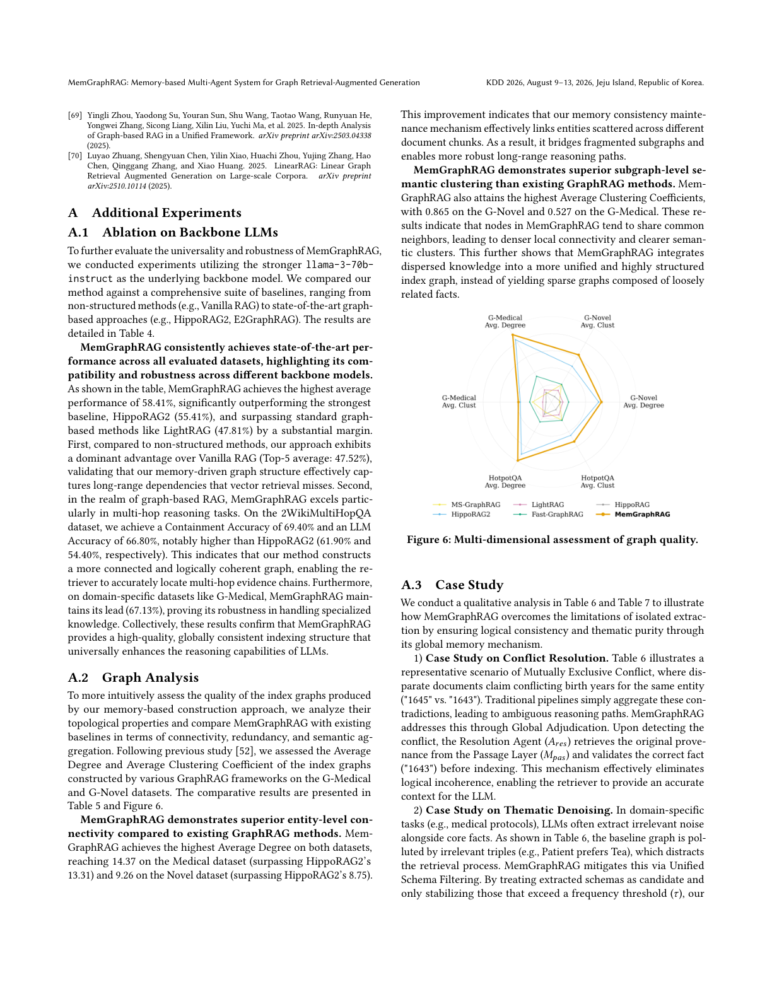

> [[../index|Wiki]] | [[../summary|Summary]] | [[../digest|Digest]]

# Conclusion and Additional Experiments

**In one sentence:** MemGraphRAG concludes the paper by claiming that a shared hierarchical global memory, maintained collaboratively by multi-agents during extraction and retrieval, eliminates the thematic irrelevance, logical inconsistency, and structural fragmentation of isolated-extraction GraphRAG; the Appendix A experiments reinforce this by showing backbone-model independence (best average 58.41% with llama-3-70b-instruct), the densest and most locally clustered index graphs among six frameworks, and concrete conflict-resolution/denoising case studies.

## Key points

- **Overall conclusion:** integrating a global hierarchical memory into knowledge-graph construction yields a globally consistent index graph that systematically mitigates the three failure modes of local-only extraction — thematic irrelevance, logical inconsistency, structural fragmentation — and MemGraphRAG consistently outperforms state-of-the-art baselines on graph quality, retrieval precision, and generation accuracy.
- **Stated limitation:** the framework is unimodal (text-only); non-text elements (charts, diagrams, layouts, embedded images) must be transcribed to text first, losing visual and spatial semantics; future work proposes adding multimodal nodes to the Fact Layer M_fac / Passage Layer M_pas for cross-modal claim verification.
- **Backbone-robustness ablation (Appendix A.1):** swapping the backbone to the stronger llama-3-70b-instruct still yields SOTA results — highest average of 58.41%, beating the strongest baseline HippoRAG2 (55.41%) and LightRAG (47.81%), and far ahead of Vanilla RAG (Top-5 average 47.52%).
- **Multi-hop strength:** on 2WikiMultiHopQA, MemGraphRAG reaches Containment Accuracy 69.40% and LLM Accuracy 66.80%, versus HippoRAG2's 61.90% and 54.40% — evidence of a more connected, logically coherent graph that supports multi-hop evidence-chain retrieval.
- **Domain robustness:** on G-Medical, MemGraphRAG keeps its lead with 67.13% LLM Accuracy, showing robustness on specialized-knowledge corpora.
- **Entity-level connectivity (Appendix A.2, Table 5):** MemGraphRAG achieves the highest Average Degree on both analyzed datasets — 14.37 on G-Medical (vs HippoRAG2 13.31) and 9.26 on G-Novel (vs HippoRAG2 8.75); it also leads on HotpotQA (8.92 / clustering 0.725).
- **Subgraph-level semantic clustering:** MemGraphRAG attains the highest Average Clustering Coefficients — 0.865 on G-Novel and 0.527 on G-Medical — implying denser local connectivity and clearer semantic clusters rather than a sparse graph of loosely related facts.
- **Qualitative case studies (Appendix A.3):** Global Adjudication resolves a Mutually Exclusive birth-year conflict ("1645" vs "1643") by having the Resolution Agent A_res retrieve provenance from the Passage Layer and validate "1643" before indexing; Unified Schema Filtering (stabilizing only schemas above frequency threshold τ) removes noise triples like "Patient prefers Tea" while retaining stable clinical patterns (Drug → Disease), producing a cleaner Fact Graph G_fac aligned with the domain ontology.

---

## Conclusion

The paper positions MemGraphRAG as a GraphRAG framework whose core contribution is a **global memory mechanism inside knowledge-graph construction**. A shared hierarchical memory structure lets the multi-agent system collaboratively maintain a global perspective across both extraction and retrieval phases. Against traditional GraphRAG pipelines that extract in isolation per chunk, this paradigm targets three concrete failure modes — thematic irrelevance, logical inconsistency, structural fragmentation — and resolves them into a globally consistent indexing graph. The authors report consistent gains over state-of-the-art baselines on three axes (graph quality, retrieval precision, generation accuracy) and frame the system as a robust deployment path for reliable RAG in complex real-world scenarios.

**Limitation.** The design is limited to unimodal textual input. Real-world knowledge repositories are inherently multimodal (statistical charts, technical diagrams, document layouts, embedded images in academic and financial documents), and the current pipeline requires such elements to be transcribed into text before processing — a step the authors concede can drop critical visual semantics and spatial relationships, e.g., quantitative trends in line charts or complex structures in scientific diagrams. The proposed direction is to extend the Global Hierarchical Graph with multimodal nodes, for example embedding visual patches into the Fact Layer (M_fac) or Passage Layer (M_pas), which would enable cross-modal reasoning in which the multi-agent system verifies textual claims against visual evidence.

**Acknowledgments.** Funded by the Natural Science Foundation of Fujian Province of China (No. 2024J011001) and the Public Technology Service Platform Project of Xiamen (No. 3502Z20231043).

## Additional Experiments

Appendix A extends the main evaluation along three axes: backbone-model generality (A.1), intrinsic graph topology (A.2), and qualitative behavior of the memory mechanism (A.3).

### Backbone LLM Ablation (A.1)

To test universality, the authors swap the backbone to the stronger **llama-3-70b-instruct** and re-run the comparison suite spanning non-structured methods (Vanilla RAG) and graph-based ones (HippoRAG2, E2GraphRAG, LightRAG, ...; Table 4). Key reported figures:

| Metric | MemGraphRAG | Best baseline | Notes |
|---|---|---|---|
| Overall average | **58.41%** | HippoRAG2 55.41% | LightRAG 47.81%; Vanilla RAG Top-5 avg 47.52% |
| 2WikiMultiHopQA Contain-Acc / LLM-Acc | **69.40% / 66.80%** | HippoRAG2 61.90% / 54.40% | multi-hop reasoning advantage |
| G-Medical LLM-Acc | **67.13%** | — | domain-specific robustness |

Interpretation given by the authors: (1) the memory-driven graph captures long-range dependencies that pure vector retrieval misses; (2) the multi-hop gains indicate a more connected, logically coherent graph that lets the retriever locate multi-hop evidence chains; (3) the G-Medical lead proves robustness on specialized knowledge.

### Graph Quality Assessment

To assess the topology of the constructed index graphs directly, the authors follow [52] and measure **Average Degree** (entity-level connectivity) and **Average Clustering Coefficient** (local semantic cohesion) on the G-Medical and G-Novel datasets, comparing five baselines (Table 5, Figure 6):

| Method | G-Novel Degree | G-Novel Clust. | G-Medical Degree | G-Medical Clust. | HotpotQA Degree | HotpotQA Clust. |
|---|---|---|---|---|---|---|
| MS-GraphRAG [12] | 1.48 | 0.315 | 1.82 | 0.300 | 1.56 | 0.334 |
| HippoRAG2 [20] | 8.75 | 0.657 | 13.31 | 0.497 | 7.96 | 0.613 |
| LightRAG [17] | 2.10 | 0.212 | 2.58 | 0.139 | 2.18 | 0.236 |
| Fast-GraphRAG [7] | 3.19 | 0.324 | 5.50 | 0.347 | 3.04 | 0.336 |
| HippoRAG [19] | 1.73 | 0.100 | 2.06 | 0.087 | 1.86 | 0.140 |
| **MemGraphRAG (ours)** | **9.26** | **0.865** | **14.37** | **0.527** | **8.92** | **0.725** |

Two findings stand out:

1. **Superior entity-level connectivity.** MemGraphRAG has the highest Average Degree on both datasets (14.37 Medical, 9.26 Novel). Attribution: the memory-consistency maintenance mechanism links entities scattered across different document chunks, bridging fragmented subgraphs and enabling robust long-range reasoning paths.
2. **Superior subgraph-level semantic clustering.** MemGraphRAG also leads on Average Clustering Coefficient (0.865 G-Novel, 0.527 G-Medical), meaning its nodes tend to share common neighbors — denser local connectivity and clearer semantic clusters — i.e., dispersed knowledge is integrated into a unified, highly structured index graph instead of a sparse one of loosely related facts.

Figure 6 renders these six topological dimensions (Degree and Clustering Coefficient on G-Medical, G-Novel, and HotpotQA) as a radar chart, in which the MemGraphRAG polygon forms the outermost shape, extending farthest on the average-degree and clustering axes, while the five baselines form smaller inner polygons — HippoRAG2 being the next largest but still well inside. Visually, it confirms that MemGraphRAG's index graph is simultaneously more connected and more locally clustered than any baseline.

### Case Studies (A.3)

Qualitative analysis (Tables 6–7) of how the global memory mechanism fixes isolated-extraction failures:

1. **Conflict resolution (Mutually Exclusive Conflict).** Documents give conflicting birth years for one entity ("1645" vs "1643"); traditional pipelines aggregate the contradiction into ambiguous reasoning paths. MemGraphRAG applies **Global Adjudication**: the Resolution Agent (A_res) detects the conflict, retrieves original provenance from the Passage Layer (M_pas), and validates the correct fact ("1643") before indexing — eliminating the logical incoherence and giving the LLM an accurate context.
2. **Thematic denoising.** In domain-specific (e.g., medical-protocol) extraction, baselines pull in irrelevant noise triples such as "Patient prefers Tea", distracting retrieval. MemGraphRAG applies **Unified Schema Filtering**: extracted schemas are treated as candidates and only stabilized when their frequency exceeds threshold τ. This filters noise while retaining stable clinical patterns (e.g., Drug → Disease), yielding a cleaner Fact Graph (G_fac) that strictly follows the domain ontology and improving retrieval precision.

**Covers:** Section 6, Appendix A of arXiv 2606.00610
