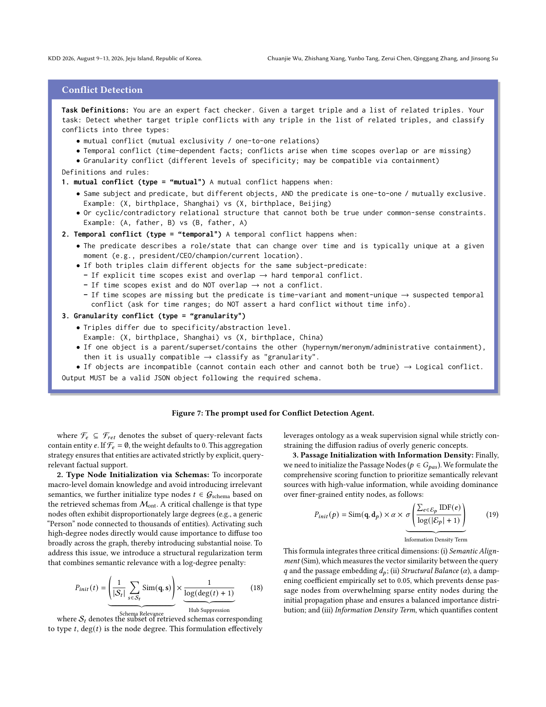
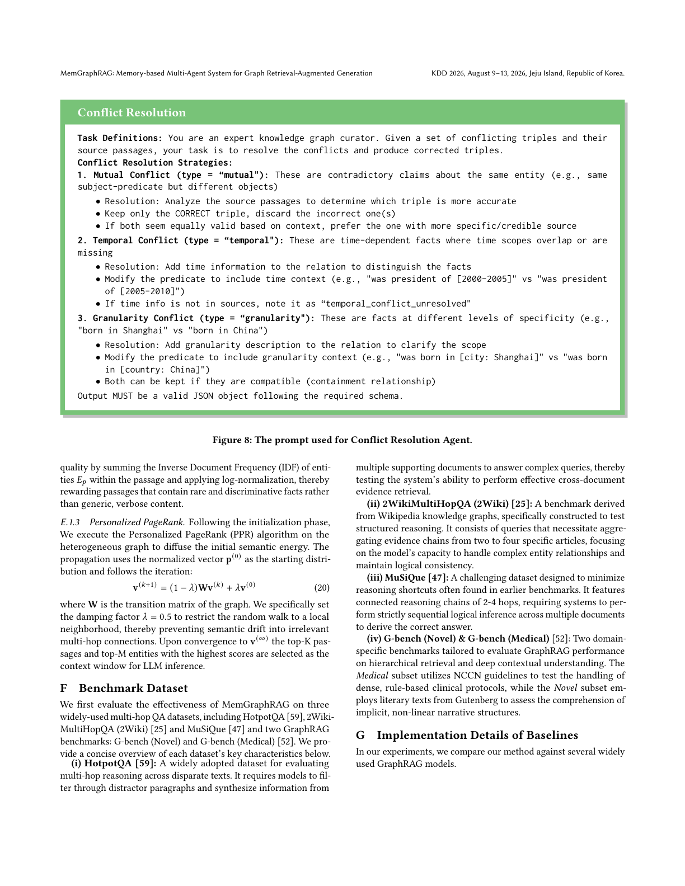

> [[../index|Wiki]] | [[../summary|Summary]] | [[../digest|Digest]]

# Related Work and Appendix Details

**In one sentence:** The paper positions MemGraphRAG as a response to the two dominant GraphRAG paradigms (relation-extraction triple graphs and clustering hierarchies) by adding explicit, evidence-grounded conflict management, and the appendix exposes the concrete mechanics — three typed conflict classes, a schema-frequency filtering protocol (threshold τ), a judge-style resolution agent with prompts (Figures 7–8), structure-aware node initialization (including an α = 0.05 damping coefficient for passages), Personalized PageRank with λ = 0.5, and evaluation on five datasets against twelve GraphRAG baselines.

## Key points

- MemGraphRAG is positioned against two GraphRAG construction paradigms: **relation-extraction-based KGs** (triple extraction + alignment, e.g. Think-on-Graph, RRP; noise-prone, with LinearRAG as the relation-free alternative) and **clustering-based hierarchies** (Louvain/Leiden community detection, e.g. RAPTOR), which propagate low-level errors upward and are slow to iterate.
- The preliminary study (Appendix C, Table 8) identifies exactly **three conflict types** introduced by independent per-chunk extraction: **mutually exclusive** (e.g. `(Newton, born_in, 1643)` vs `(Newton, born_in, 1645)`), **temporal** (`(Trump, President, USA)` at T2020 vs `(Biden, President, USA)` at T2021, both stored without timestamps), and **granularity** (`(Xiao Ming, born_in, Shanghai)` vs `(Xiao Ming, born_in, China)`; `(AI, subclass, NLP)` vs `(AI, subclass, Machine Learning)`).
- Schemas enter a **probationary state**: new schemas are "Pending" and invisible to the graph; only when their extraction frequency `Freq(o) ≥ τ` does the schema become "Stable", cascading activation to its triples, which then enter conflict detection (Algorithm 1, Stage II).
- Conflict detection is a **hybrid scan**: on every newly "Active" triple, candidates are those with `Sim(t_new, t') > δ ∨ Match(t_new, t')` (Eq. 15, Algorithm 1 line 19); resolution then retrieves provenance passages for both sides via `C_ctx = Ψ(t_new) ∪ Ψ(t')` (Eq. 16) and acts as an evidence-based judge.
- Resolution strategies are **taxonomy-driven**: mutually exclusive conflicts → discard the less reliable fact; temporal conflicts → append temporal attributes (e.g. "46th" vs "47th"); granularity conflicts → refine predicates (`born_city` vs `born_country`) so facts coexist.
- Node initialization for retrieval uses three distinct scoring functions: entity nodes = mean `Sim(q, f)` over retrieved facts containing the entity (Eq. 17); type nodes = mean schema similarity divided by `log(deg(t)+1)` hub suppression (Eq. 18); passage nodes = `Sim(q, d_p) · α·σ · Π IDF(e)/log(|E_p|+1)` information density with **α empirically set to 0.05** (Eq. 19).
- Propagation is **Personalized PageRank** with damping factor **λ = 0.5** to keep the random walk local and avoid semantic drift; top-K passages and top-M entities are selected as LLM context (Eq. 20, Algorithm 2).
- Experiments use **5 datasets** — HotpotQA, 2WikiMultiHopQA, MuSiQue, G-bench (Novel, Gutenberg literary texts), G-bench (Medical, NCCN guidelines) — against **12 baselines**: KGP, G-Retriever, RAPTOR, MS-GraphRAG, LazyGraphRAG, LightRAG, HippoRAG, HippoRAG2, E²GraphRAG, GFM-RAG, LogicRAG, LinearRAG.

---

## Related Work

Appendix B (B.1–B.2) frames MemGraphRAG against prior work in two families:

**Retrieval-Augmented Generation (B.1).** LLMs remain prone to hallucination; RAG mitigates this by grounding generation in external evidence, but organizing fragmented knowledge for complex reasoning remains hard. Recent work has moved from simple retrieval to **Reasoning-enhanced RAG**, interleaving retrieval with the LLM's logical flow — IRCoT (Chain-of-Thought retrieval), IM-RAG (recursive inner monologues), LAG (logical decomposition). LogicRAG goes further, eliminating pre-built graphs and building a reasoning DAG dynamically at inference time. The paper's caveat: these methods operate under fixed resources or rely on the LLM's own reasoning rather than structured knowledge representation.

**GraphRAG (B.2).** Two construction paradigms dominate:

| Paradigm | Mechanism | Examples | Stated limitations |
|---|---|---|---|
| Relation-extraction-based | Triple extraction into KGs + entity alignment + graph reasoning; static KGs as navigation aids | Think-on-Graph, RRP | Independent OpenIE extraction is inconsistency-prone; schema-guided variants are high manual-cost |
| Clustering-based hierarchy | Community detection (Louvain/Leiden) recursively aggregates entities into hierarchical summaries | (RAPTOR-family methods) | Unsupervised; low-level entity errors propagate upward; iterative clustering of large graphs bottlenecks real-time deployment |

MemGraphRAG's own contribution is orthogonal: rather than a new construction trick, it adds **active memory management** — global memory + dedicated conflict detection/resolution agents — to address the cross-document contradictions that both paradigms implicitly tolerate. Two case studies (Tables 6–7) illustrate the contrast: traditional GraphRAG keeps both `(Newton, born_in, 1645)` and `(Newton, born_in, 1643)` and answers ambiguously, while MemGraphRAG's `A_det` flags the conflict, `A_res` adjudicates on passage evidence, and the final answer is precise ("1643"); similarly, schema filtering (frequency `≥ τ` vs `< τ`) drops the noise triple `(Patient, prefer, Tea)` so a clinical query stays on the `NSCLC → Osimertinib` path instead of drifting to `Patient → Tea`.

## Appendix: Conflict Detection and Resolution Agents

Appendix C motivates the agents with a taxonomy of exactly three conflicts (Table 8): **mutually exclusive** (divergent values on single-value attributes — binary logical contradictions), **temporal** (facts valid in disjoint intervals flattened into a static KB — present outdated truths as current), and **granularity** (an entity mapped to hierarchically distinct nodes — redundant paths that dilute precision).

Appendix D gives the formal substrate the agents operate on. Key definitions (D.1): **type** `t` (abstract category, e.g. *Person*), **entity** `e` (text-grounded instance, mapped to a type via `φ(e) = t`), **schema** `s = (t_h, r, t_t)` (structural constraint, e.g. `(Person, born_in, Country)`), **fact** `f = (e_h, r, e_t)` (instantiation, e.g. `(Einstein, born_in, Germany)`), **ontology** `O = {s_1, …, s_n}`, and **passage** `p` as the evidence unit with `ψ(f) → p_i` linking every fact to supporting text. The architecture (D.2) pairs a **Global Memory** — three tiers: Ontology Layer `M_ont` (schemas + frequencies), Fact Layer `M_fac` (triples), Passage Layer `M_pas` (raw passages) — with a **Hierarchical Indexing Graph** of three views: `G_ont` (semantic backbone), `G_fac` (multi-hop reasoning substrate), `G_pas` (evidence grounding). Bidirectional indexing connects layers: `Φ: M_fac → M_ont` (strict typing) with instantiation sets `T(s)`, and the provenance relation `Ψ ⊆ M_fac × M_pas` with evidence sets `E(t)` (Eqs. 9–12).

Construction (D.3, Algorithm 1) runs in four stages: (I) **composite extraction into memory** — each chunk `c_i` yields a record `{O_cand, T_cand, P_src}` storing all three layers ("probationary sandbox" hypothesis); (II) **unified schema filtering** — `State(o) = Stable` iff `Freq(o) ≥ τ`, cascading "Active" status only to triples governed by stable schemas; (III) **conflict detection + evidence-based adjudication** as described below; (IV) **multi-view projection and memory-guided bridging** — build `G_ont`, `G_fac`, `G_pas`, then add (1) **type-based bridging** (link disjoint entities that share a schema type, e.g. all *Researchers*) and (2) **similarity-based bridging** (embedding edges when `Sim(e_i, e_j) > δ_b`), merging into the global graph `G`.

### Detection Agent

`A_det` is triggered **strictly when a triple `t_new` transitions to "Active"** and performs purely diagnostic checks: a hybrid scan over `M_fac` combining vector similarity and symbolic matching, collecting conflict candidates `T_conf = {t' ∈ M_fac | Sim(t_new, t') > δ ∨ Match(t_new, t')}` (Eq. 15). It never modifies the graph; when `T_conf ≠ ∅` it hands off to the resolution protocol. Figure 7 gives the exact prompt used: the agent is cast as an expert fact-checker receiving a target triple plus related triples, and must (a) decide whether a conflict exists and (b) classify it. The prompt defines three typed classes — `mutual` (one-to-one predicate clash, e.g. `(X, birthplace, Shanghai)` vs `(X, birthplace, Beijing)`, or cyclic relations), `temporal` (time-scoped roles like president/CEO, with guardrails: disjoint time scopes ⇒ no conflict; missing time metadata ⇒ *suspected* conflict requiring time ranges, never an asserted hard conflict), and `granularity` (containment-compatible specificity differences like `Shanghai` vs `China`, treated as compatible unless objects are mutually exclusive). Output must be a schema-valid JSON object.

The prompt encodes a deliberate rule-based classification policy — disagreements are *typed* along a semantic hierarchy (exclusion vs. time vs. granularity) with explicit guardrails against over-asserting temporal conflicts, and a hard JSON output contract — rather than a single free-form "conflict?" decision.

### Resolution Agent

`A_res` resolves flagged conflicts **evidence-driven**: it uses the `Ψ` mapping to retrieve original provenance for the new assertion and all conflicting facts, building the context `C_ctx = Ψ(t_new) ∪ Ψ(t')` (Eq. 16), and reasons like "a judge reviewing case files". Its strategies are taxonomy-based (D.3.2): for **mutually exclusive** conflicts it compares evidence reliability and discards the erroneous fact; for **temporal** conflicts it disambiguates by appending temporal attributes (e.g. "46th" vs "47th" president); for **granularity** conflicts it refines predicates so facts coexist logically (`born_city` vs `born_country`). Figure 8 shows this agent's prompt: the model acts as an expert knowledge-graph curator receiving conflicting triples plus their source passages, and must output corrected triples as schema-valid JSON. Its per-type rules: `mutual` — keep only the correct triple, discarding the wrong one (prefer the more specific/credible source if both look valid); `temporal` — add a time span to the predicate (e.g. "was president of [2000–2005]" vs "[2005–2010]"), or flag `temporal_conflict_unresolved` if no time evidence exists; `granularity` — annotate the predicate with granularity context (e.g. `[City: Shanghai]` vs `[Country: China]`), retaining both when they form a compatible containment relationship.

This documents a rule-based, category-driven design: each of the three conflict types maps to a deterministic correction strategy with a fixed JSON output schema, making the agent's behavior auditable and machine-parseable downstream.

## Appendix: Graph Propagation and Node Initialization

Appendix E details memory-guided online retrieval (Algorithm 2) in three progressive stages. **Stage I — Multi-layer memory filtering (E.1.1):** for query `q`, retrieve top-K candidates in parallel from `M_ont`, `M_fac`, `M_pas`; keep only schema/fact candidates with `Sim(q, x) > τ`; if the filter yields nothing, **fall back to standard RAG** over `M_pas`. **Stage II — structure-aware node initialization (E.1.2):** three node-specific reset-weight strategies (below). **Stage III — PPR propagation (E.1.3).**

### Entity Node Initialization via Facts

Entity node weight = the mean semantic similarity of all query-relevant filtered facts containing the entity: `P_init(e) = (1/|F_e|) · Σ_{f∈F_e} Sim(q, f)` (Eq. 17), with `F_e ⊆ F_ret` and the weight defaulting to 0 when `F_e = ∅`. Entities are thus activated strictly by explicit, query-relevant factual support.

### Type Node Initialization via Schemas

Type nodes average the similarity of their retrieved schemas but divide by a **log-degree penalty for hub suppression**: `P_init(t) = (1/|S_t|) · Σ_{s∈S_t} Sim(q, s) / log(deg(t) + 1)` (Eq. 18), where `S_t ⊆ S_ret` is the retrieved schemas for type `t`. This matters because generic types (e.g. a *Person* node connected to thousands of entities) would otherwise diffuse importance too broadly; the penalty uses the ontology as a weak supervision signal while constraining the diffusion radius of overly generic concepts.

### Passage Initialization with Information Density

Passage nodes combine three dimensions (Eq. 19): `P_init(p) = Sim(q, d_p) · α·σ · Π_{e∈E_p} IDF(e) / log(|E_p| + 1)`. (i) **Semantic alignment** — vector similarity between query `q` and passage embedding `d_p`; (ii) **structural balance** — damping coefficient `α` **empirically set to 0.05**, preventing dense passage nodes from overwhelming sparse entity nodes in early propagation; (iii) **information density** — IDF product over entities in the passage with log-normalization, rewarding passages with rare, discriminative facts over generic verbose content. After initializing all nodes, `P_init` is normalized into the reset distribution `p_(0)`.

**Propagation.** Personalized PageRank then runs on the heterogeneous graph (Eq. 20 / Algorithm 2 lines 13–18): `p_(k+1) = (1 − λ)·M·p_(k) + λ·p_(0)`, with damping factor **λ = 0.5** to restrict the random walk to a local neighborhood and prevent semantic drift into irrelevant multi-hop connections. On convergence, the top-K passages and top-M entities by `p_(∞)` are selected as the context window `C` for downstream LLM generation.

## Appendix: Datasets and Implementation Details

**Datasets (Appendix F).** Evaluation uses three multi-hop QA datasets plus two GraphRAG benchmarks:

| Dataset | Characteristics |
|---|---|
| HotpotQA | Multi-hop reasoning across disparate texts; must filter distractor paragraphs and synthesize across supporting documents |
| 2WikiMultiHopQA | Wikipedia-KG-derived; evidence chains aggregated from 2–4 articles; tests entity relationships and logical consistency |
| MuSiQue | 2–4 hop connected chains designed to minimize reasoning shortcuts; requires strictly sequential multi-document inference |
| G-bench (Novel) | Gutenberg literary texts; implicit, non-linear narrative structures |
| G-bench (Medical) | NCCN clinical guidelines; dense, rule-based protocols |

**Baselines (Appendix G).** Twelve widely used GraphRAG models: **KGP** (passage/structure-node graph with an LLM traversal agent); **G-Retriever** (subgraph retrieval as Prize-Collecting Steiner Tree within the LLM context window); **RAPTOR** (recursive bottom-up clustering + summarization into a hierarchical tree); **MS-GraphRAG** (entity-relation graph + pre-computed community summaries); **LazyGraphRAG** (no up-front summarization; indexing cost at vector-RAG level); **LightRAG** (two-tier retrieval + incremental update algorithm); **HippoRAG** (LLM + KG + PPR dual-system memory model); **HippoRAG2** (optimized passage contextualization and online LLM interaction); **E²GraphRAG** (bidirectional chunk–entity indexes, summary tree + lightweight entity graph); **GFM-RAG** (pre-trained GNN graph foundation model for zero-shot generalization); **LogicRAG** (query logic as an inference-time DAG, linearized by topological sort to cut token usage); **LinearRAG** (relation-free "Tri-Graph" from lightweight entity extraction, linear scalability).

**Implementation constants appearing in the chunk:** schema stability threshold `τ` (Eq. 14, Algorithm 1); conflict similarity threshold `δ` (Eq. 15); bridging threshold `δ_b` (Algorithm 1 line 30); retrieval relevance threshold `τ` (Algorithm 2 line 3); passage damping `α = 0.05` (Eq. 19); PPR damping `λ = 0.5` (Eq. 20); top-K retrieval and top-K/top-M final evidence selection (Algorithm 2).

**Covers:** Appendix B, C, D, E, F of arXiv 2606.00610
