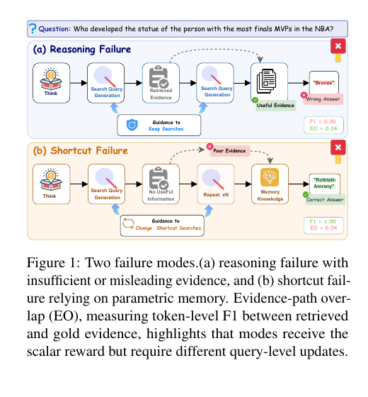

> [[../index|Wiki]] | [[../summary|Summary]] | [[../digest|Digest]]

# Introduction and Related Work

**In one sentence:** Outcome-only reinforcement learning for agentic GraphRAG suffers from *answer-path reward aliasing* (correct answers can come from parametric-memory shortcuts rather than useful evidence paths, and wrong answers can occur even when key evidence is retrieved) and *search-update ambiguity* (scalar trajectory-level feedback gives no hint about which retrieval actions to adjust), and prior chunk-based RAG, entity-relation GraphRAG, and GRPO-trained retrieval agents all fail to make evidence-path quality a first-class, actionable training signal.

## Key points

- RAG grounds LLM output in external evidence to reduce hallucination (Lewis et al., 2020; Gao et al., 2024; Wang et al., 2024), but standard chunk-based pipelines treat passages independently and fail to capture relational structure among entities.
- Graph-structured RAG organizes knowledge as entity-relation graphs, enabling multi-step retrieval over structured evidence paths (Edge et al., 2025; Guo et al., 2025; Chen et al., 2025; Luo et al., 2025b; Gutiérrez et al., 2025), while agentic approaches model retrieval as iterative agent–environment interactions optimized via reinforcement learning (Jin et al., 2025; Song et al., 2025; Luo et al., 2025a).
- Existing agentic GraphRAG methods rely **solely on answer correctness** for trajectory rewards, ignoring whether retrieved evidence truly supports the answer.
- This produces **two failure modes** (Figure 1): (a) *reasoning failure* — an incorrect answer despite retrieved/key evidence (F1 ≈ 0.00, EO ≈ 0.24 in the figure's NBA finals-MVP-statue example), and (b) *shortcut failure* — a correct answer produced from parametric memory after failed or unhelpful retrieval (F1 ≈ 1.00, EO ≈ 0.04). Both receive the same scalar reward, producing **answer-path reward aliasing**.
- Scalar trajectory-level feedback yields **search-update ambiguity**: it tells the agent nothing about which retrieval actions (queries, entities, relations) to adjust, leaving no actionable guidance.
- **PATHROUTER** resolves aliasing by evaluating each trajectory along two axes — answer correctness and **evidence-path overlap (EO)**, a token-level F1 between retrieved and gold evidence — building a 2×2 trajectory taxonomy (faithful success C↑P↑, shortcut success C↑P↓, evidence-retrieved-but-wrong C↓P↑, joint failure C↓P↓) and applying **differentiated route-conditioned GRPO advantage scaling** that suppresses shortcut reinforcement while preserving evidence-seeking behavior.
- For evidence-poor trajectories (C↑P↓ and C↓P↓), a **frozen gold-evidence teacher** — prompted with gold supporting passages — provides **token-level KL supervision on reasoning and search-query tokens**, with **answer tokens explicitly excluded** to avoid direct response imitation (mitigating answer-token leakage, cf. RLSD, Yang et al., 2026).
- Experiments on **six QA benchmarks across three model sizes** (3B and 7B results reported here) show consistent improvements over a strong baseline, with average **F1 gains of 3.1 on 3B and 4.9 on 7B models**, enhanced cross-dataset OOD transfer, and robust single-hop and multi-hop performance — evidence that path-aware training yields generalizable retrieval behavior rather than dataset-specific shortcuts.

---

## Problem: answer-path reward aliasing and search-update ambiguity

Retrieval-augmented generation (RAG) reduces hallucinations in large language models by grounding output in external knowledge (Lewis et al., 2020; Gao et al., 2024; Wang et al., 2024). Standard chunk-based pipelines, however, treat passages independently and fail to capture relational structure among entities. Recent methods therefore organize knowledge as **entity-relation graphs**, enabling multi-step retrieval over structured evidence paths (Edge et al., 2025; Guo et al., 2025; Chen et al., 2025; Luo et al., 2025b; Gutiérrez et al., 2025), while agentic approaches model retrieval as iterative agent–environment interactions optimized via reinforcement learning (Jin et al., 2025; Song et al., 2025; Luo et al., 2025a).

Despite these advances, existing agentic GraphRAG methods rely **solely on answer correctness** for trajectory rewards, ignoring whether the retrieved evidence truly supports the answer. This single-scalar design has two structural problems, illustrated in Figure 1 with the multi-hop question *"Who developed the statue of the person with the most finals MVPs in the NBA?"*:

1. **Answer-path reward aliasing.** A correct answer may arise from **parametric memory despite failed evidence retrieval**, while an incorrect answer may occur even when **key evidence is retrieved**. Two trajectories with genuinely different retrieval quality thus share the same scalar outcome reward, conflating "lucky success" with "faithful success."
2. **Search-update ambiguity.** Even when the reward signal is available, scalar trajectory-level feedback does not indicate **which retrieval actions to adjust** — the agent has no actionable token- or query-level guidance about which entities, relations, or search queries need refinement to uncover missing evidence paths.

Figure 1 depicts the two failure modes as a pair of horizontal workflow diagrams with node icons (Think, Search Query Generation, Retrieved Evidence, Memory Knowledge) and per-panel **F1** (token-level overlap with gold evidence) and **EO** (evidence-path overlap) metric boxes:

- **Panel (a) "Reasoning Failure":** the agent thinks, attempts search-query generation (marked failed), retrieves evidence, retries search, and — despite landing on a *Useful Evidence* node — still emits the **wrong answer** ("Bronze"). F1 ≈ 0, EO is low (≈ 0.24 in the figure), and the annotation reads "Guidance to Stop Searches." Takeaway: insufficient or misleading evidence breaks the reasoning chain even when some evidence is retrieved.
- **Panel (b) "Shortcut Failure":** the agent thinks, generates a query, gets *No Useful Information*, *Repeats ×N*, then falls back on *Memory Knowledge* (parametric knowledge) to produce a **correct-looking answer**. F1 ≈ 1.0 (answer matches gold) but EO ≈ 0.04 — still near-zero evidence-path overlap. A "Poor Evidence" node and "Guidance to Change Shortcut Searches" annotation appear. Takeaway: the model "cheats" via internal memory instead of grounding in retrieved evidence.

The two modes sit at opposite ends of the F1 axis (≈ 0 vs ≈ 1) yet share a similarly low EO profile, so a scalar outcome reward (correct/incorrect) is fundamentally ambiguous: one failure is genuinely wrong, the other is right but ungrounded. The same reward signal therefore corresponds to **different** underlying failure mechanisms that require **different** mode-level corrective updates (stop searching vs. change shortcut searches) — which is exactly the guidance a scalar answer reward cannot supply.

Motivated by these failure modes, the paper proposes **PATHROUTER**, a path-aware training framework that jointly addresses both problems:

- **To resolve answer-path reward aliasing**, PATHROUTER evaluates each trajectory along two axes: answer correctness and evidence-path overlap (EO). By categorizing trajectories into **four types** based on these axes — *faithful success* (C↑ P↑), *shortcut success* (C↑ P↓), *evidence retrieved but wrong answer* (C↓ P↑), and *joint failure* (C↓ P↓) — the framework applies **differentiated GRPO advantage scaling** (route-conditioned) that suppresses reinforcement of shortcut trajectories while preserving evidence-seeking behavior, ensuring policy updates reflect retrieval quality rather than only final answer correctness.
- **To mitigate search-update ambiguity**, PATHROUTER selectively invokes a **frozen gold-evidence teacher** for evidence-poor trajectories. The teacher, prompted with gold supporting passages, provides **token-level KL supervision on reasoning and search-query tokens**, while **excluding answer tokens** to avoid direct response imitation. This guidance supplies actionable information at the token level, letting the agent identify which entities, relations, or queries need adjustment to uncover missing evidence paths.

Through this design, PATHROUTER enables agentic GraphRAG models to learn retrieval policies that are both **answer-accurate and evidence-faithful**. Experiments on six QA benchmarks across three model sizes demonstrate consistent improvements, with enhanced cross-dataset generalization and robust performance for both single-hop and multi-hop reasoning tasks.

**Contributions.**

1. The paper identifies **answer-path reward aliasing** as a failure mode for agentic GraphRAG and proposes **route-conditioned GRPO advantage scaling** based on jointly evaluating answer correctness and evidence-path overlap.
2. It introduces a **selective gold-evidence teacher** that applies token-level KL to reasoning and search-query tokens for evidence-poor trajectories, resolving search-update ambiguity without directly imitating final answers.
3. It demonstrates consistent improvements over existing state-of-the-art methods across six QA benchmarks and three model sizes, with strong cross-dataset OOD transfer suggesting that path-aware training yields generalizable retrieval behavior rather than dataset-specific shortcuts.

## Related work

### RAG and GraphRAG

Retrieval-augmented generation (RAG; Lewis et al., 2020) grounds LLMs in external evidence, but chunk-based retrieval **lacks explicit relational modeling** (Gao et al., 2024). GraphRAG methods address this by organizing knowledge as **entity-relation graphs** (Edge et al., 2025; Guo et al., 2025; Wang et al., 2023), with path-based strategies exposing multi-hop reasoning chains via **relational pruning** (Chen et al., 2025) or **iterative traversal** (Liu et al., 2025).

**Gap & PathRouter's difference.** These methods primarily optimize graph construction, path selection, or traversal heuristics; they do **not** directly train the generator to align its reasoning with annotated evidence paths. PATHROUTER treats evidence-path overlap as a **first-class training signal**, routing updates based on whether the agent's retrieval covers the gold reasoning chain.

### Reinforcement Learning for Retrieval Agents

RL has become central to LLM reasoning, with **GRPO** (Shao et al., 2024) providing scalable group-relative optimization popularized by **DeepSeek-R1** (DeepSeek-AI et al., 2025). Prior retrieval agents include **Search-R1** (Jin et al., 2025) and **R1-Searcher** (Song et al., 2025), which apply GRPO to chunk-based retrieval-augmented reasoning, and **Graph-R1** (Luo et al., 2025a), which extends this to graph-structured knowledge.

**Gap & PathRouter's difference.** These systems primarily rely on **outcome-level answer rewards**, which can conflate retrieval quality with parametric knowledge and reinforce spurious shortcuts. PATHROUTER introduces evidence-path overlap as a **second diagnostic axis**, enabling a **2×2 trajectory taxonomy** that distinguishes faithful success from lucky success and applies route-conditioned advantage scaling accordingly.

### Knowledge Distillation and Sample Routing

On-policy distillation (Ross et al., 2011) complements RL by providing token-level supervision on the student's own rollouts. Privileged-context teachers condition on gold evidence (Ye et al., 2026; Zhao et al., 2026) or unify distillation with GRPO (Xu et al., 2025; Zhang et al., 2026). Sample-routing methods direct trajectories to different signals: **SRPO** (Li et al., 2026) routes by correctness; **GiGPO** (Feng et al., 2025) decomposes advantages hierarchically; and **RLSD** (Yang et al., 2026) highlights the answer-token leakage risk of distillation onto final answers.

**Gap & PathRouter's difference.** These methods generally apply teacher signals uniformly or route by answer correctness alone. PATHROUTER **conditions distillation on evidence-path overlap**: a frozen teacher provides token-level KL **only for evidence-poor trajectories**, and **only on reasoning and query tokens** (answer tokens excluded), reducing answer leakage while specifically targeting search-update ambiguity.

---

**Covers:** Abstract, Section 1 (Introduction), Section 2 (Related Work)
