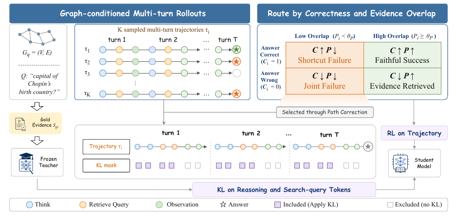

> [[../index|Wiki]] | [[../summary|Summary]] | [[../digest|Digest]]

# PathRouter Method: Path-Aware Routing

**In one sentence:** PathRouter extends GRPO by scoring every trajectory on both answer correctness (C_i) and evidence-path overlap with the gold supporting passages (P_i), then classifying trajectories into four routes that scale the GRPO advantage so shortcut-style successes are damped and useful-but-wrong evidence-seeking is protected.

## Key points

- **Multi-turn agent–environment formulation (Section 3.1):** agentic GraphRAG is formalized as a multi-turn interaction in which an LLM agent π_θ answers a query q over a knowledge graph G; at each turn it either emits a reasoning segment r_t in ` think` tags plus a search query q_t in `<query>` tags, or terminates with a final answer a in `<answer>` tags; the environment returns retrieved passages as observation o_t in `<knowledge>` tags.
- **Trajectory:** τ = ((r_1, q_1, o_1), …, (r_T, q_T, o_T), a), where T is the number of retrieval turns (Section 3.1, following Luo et al. 2025a).
- **Two diagnostic scores per trajectory:** C_i = 1[EM(a_i, a*) > 0 ∨ F1(a_i, a*) ≥ θ_C] (Eq. 1) is binary answer correctness via exact match or F1 above threshold θ_C.
- **Evidence-path overlap (EO):** P_i = (1/|S_g|) · Σ_{s∈S_g} F1(concatenated retrieved passages of τ_i, s) (Eq. 2) — the average token-level F1 overlap between the trajectory's retrieved passages and each gold supporting passage s; it is a proxy for evidence-path quality.
- **Four-way route classification (Eq. 3) on C_i and a threshold θ_P:** C↑P↑ (C_i=1, P_i ≥ θ_P) — *Faithful Success*; C↑P↓ (C_i=1, P_i < θ_P) — *Shortcut Failure*; C↓P↑ (C_i=0, P_i ≥ θ_P) — *Evidence Retrieved*; C↓P↓ (C_i=0, P_i < θ_P) — *Joint Failure*.
- **Route-conditioned advantage (Eq. 4):** Ẽ̂A(τ_i) = w_route(C_i, P_i) · Â(τ_i) — the weight only modulates the magnitude of the GRPO advantage; the sign stays as determined by the group-normalized reward.
- **Route weights:** w_full for both C↑P↑ (correct answer, high overlap) and C↓P↓ (both low); w_down for C↑P↓ (suppresses over-reinforcement of shortcut answers); w_preserve for C↓P↑ (avoids over-penalizing good retrieval when only the final reasoning failed).
- **Selective teacher-KL distillation (Section 3.3):** for evidence-poor trajectories (P_i < θ_P), a frozen reference model acts as a privileged teacher — conditioned on the same response prefix plus the gold supporting passages S_gt — and supplies token-level KL guidance restricted to the student's own reasoning (r_t) and search-query (q_t) tokens, never the retrieved observations or the final answer.
- **Training objective (Section 3.4):** the reward combines answer F1, evidence-path overlap, and exploration-shaping terms (Eq. 8–9); the routed GRPO loss (Eq. 10) scales each trajectory's advantage by its route weight; the overall objective adds the warmed-up teacher-KL term to routed GRPO (Eq. 11): L = L_GRPO + λ_T(s) · L_TKL.

---

## Task formulation

Section 3.1 formalizes agentic GraphRAG as a multi-turn agent–environment interaction, following Luo et al. (2025a). Given a knowledge graph **G** constructed from a document collection, an LLM-based agent **π_θ** interacts with a graph retrieval environment to answer a query **q**.

At each turn **t**, the agent does one of two things:

1. emits a **reasoning segment** r_t within `` tags followed by a **search query** q_t within `<query>` tags, or
2. emits a **final answer** a within `<answer>` tags, terminating the trajectory.

The environment processes q_t and returns retrieved passages within `<knowledge>` tags as the **environment observation** o_t.

A reasoning trajectory is:

> **τ = ((r_1, q_1, o_1), …, (r_T, q_T, o_T), a)**, where T is the number of retrieval turns.

Building on this formulation, PathRouter extends GRPO with a path-aware design. Trajectories are evaluated along **answer correctness** and **evidence-path overlap (EO)**, which in turn modulates GRPO advantage scaling — distinguishing shortcut answers (correct without proper evidence) from evidence-seeking ones. Additionally, for evidence-poor trajectories, a selective gold-evidence teacher provides token-level KL guidance on reasoning and search-query steps without imitating final answers, encouraging retrieval that is both answer-accurate and evidence-faithful (this second mechanism is detailed in Section 3.3 below).

## Path-aware routing

Section 3.2 conditions the training signal on both answer correctness and evidence-path overlap.

### Trajectory evaluation

For each trajectory τ_i, PathRouter computes two diagnostic scores:

**Answer correctness (Eq. 1):**

> C_i = 1[ EM(a_i, a*) > 0 ∨ F1(a_i, a*) ≥ θ_C ]

C_i is **binary** answer correctness: 1 if the trajectory's answer a_i exactly matches the gold a*, or if the token-level F1 between a_i and a* exceeds threshold **θ_C**.

**Evidence-path overlap (Eq. 2):**

> P_i = (1 / |S_g|) · Σ_{s ∈ S_g} F1( ⋃ retrieved passages of τ_i , s )

where S_g is the set of gold supporting passages. P_i measures the **average token-level F1 overlap** between the concatenation of all passages retrieved along the trajectory and each gold supporting passage. P_i serves as a proxy for **evidence-path quality**: higher overlap indicates that the agent retrieved evidence relevant to the gold reasoning chain.

### Route classification

Each trajectory is classified into one of four categories based on C_i and an **evidence-overlap threshold θ_P (Eq. 3)**:

| Route | Condition | Name | Interpretation |
|---|---|---|---|
| C↑P↑ | C_i = 1, P_i ≥ θ_P | **Faithful Success** | correct answer with high evidence overlap |
| C↑P↓ | C_i = 1, P_i < θ_P | **Shortcut Failure** | correct answer but low evidence overlap — likely a shortcut |
| C↓P↑ | C_i = 0, P_i ≥ θ_P | **Evidence Retrieved** | good evidence was retrieved, but the answer is wrong (likely a final-reasoning failure) |
| C↓P↓ | C_i = 0, P_i < θ_P | **Joint Failure** | both answer correctness and evidence overlap are low |

(Quadrant names as labeled in Figure 2.)

> Route(τ_i) = { C↑P↑ : C_i = 1, P_i ≥ θ_P;  C↑P↓ : C_i = 1, P_i < θ_P;  C↓P↑ : C_i = 0, P_i ≥ θ_P;  C↓P↓ : C_i = 0, P_i < θ_P }  (Eq. 3)

### Route-conditioned advantage scaling

Rather than assigning separate loss functions to each category, PathRouter modulates the GRPO advantage by a **non-negative, route-dependent weight (Eq. 4)**:

> Ẽ̂A(τ_i) = w_route(C_i, P_i) · Â(τ_i)

The route weight modulates **update magnitude**, while the **sign of the advantage** remains determined by the group-normalized reward. The four routes use distinct weights:

- **C↑P↑ — full weight (w_full).** The answer is correct and evidence overlap is high.
- **C↑P↓ — reduced weight (w_down).** The answer is correct but evidence overlap is low, indicating a potential shortcut. The reduced weight mitigates over-reinforcement of trajectories that achieve the correct answer without proper evidence retrieval.
- **C↓P↑ — attenuated weight (w_preserve).** Evidence overlap is high but the answer is wrong, which is likely due to a final-reasoning failure. The attenuated weight mitigates over-penalizing useful retrieval behavior.
- **C↓P↓ — full weight (w_full).** Both answer correctness and evidence overlap are low.

## Distillation for retrieval-token (§3.3)

Route-conditioned scaling adjusts the *magnitude* of a policy update but leaves each trajectory with a single scalar advantage that does not say **which** search actions should change. For evidence-poor trajectories (P_i < θ_P) flagged by the routing diagnostics above, PathRouter resolves this **search-update ambiguity** with a gold-evidence teacher that gives token-level distributional supervision on reasoning and search-query tokens — turning a trajectory-level evidence failure into localized guidance for retrieval improvement. The teacher is used only during training; at inference the student acts without any privileged information.

**Teacher construction.** Following Ye et al. (2026), the frozen reference model π_ref is used as the teacher. Critically, the teacher does **not** generate its own trajectory — instead it scores the student's own on-policy rollout under a privileged context. For a training sample (q, G, S_gt, a*), the student first samples a trajectory τ_i. At each token position t, student and teacher condition on the **same response prefix** r_{<t} but differ in prompt context:

> Student: π_θ(· | q, G, r_{<t}) — Teacher: π_ref(· | q, G, S_gt, r_{<t})  (Eq. 5–6)

where S_gt is the set of gold supporting passages appended only to the teacher's prompt. This gives evidence-informed next-token guidance on the student's own rollout, rather than sequence-level imitation of a separately generated teacher trajectory; using the frozen reference model keeps the distributional target stable throughout training. To bound compute, the teacher's top-K_vocab tokens (renormalized to pK_ref) are compared against the student's logits gathered at the same indices (renormalized to pK_θ).

**Retrieval-token masking.** KL supervision applies only to tokens inside the agent's own reasoning (r_t) and search-query (q_t) segments — never to retrieved observation blocks (o_t) or the final answer (a). This positional set is denoted T^{rq}_i, ensuring the teacher shapes *how the agent searches and reasons*, not what it ultimately answers.

**Selective teacher-KL loss (Eq. 7).** Only trajectories with low evidence overlap (P_i < θ_P, the set I_low) receive KL supervision; trajectories with sufficient overlap are excluded so distillation does not interfere with already-effective evidence-seeking behavior:

> L_TKL = (1/|I_low|) Σ_{i∈I_low} (1/|T^{rq}_i|) Σ_{t∈T^{rq}_i} D_KL(p^K_ref ‖ p^K_θ)_t

Forward KL is used because the teacher distribution is a gold-evidence-conditioned target, and minimizing D_KL(p_ref‖p_θ) pulls the student toward the teacher's high-probability reasoning and search-query tokens. Early in training, most trajectories have low evidence overlap and would all qualify for teacher KL, risking suppression of the on-policy exploration the student needs to discover good retrieval strategies. To mitigate this, the KL coefficient is linearly warmed up over the first W steps: λ_T(s) = λ̄_T · min(1, s/W), letting the student first learn from GRPO reward before the teacher constraint takes full effect.

## Training objective (§3.4)

**Reward design (Eq. 8–9).** The reward combines task completion with evidence-path quality and exploration shaping:

> R(τ_i) = r_a + α·r_p + r_s, where r_a = F1(a_i, a*) is answer quality, r_p = P_i is evidence-path overlap, and r_s = r_e + r_l + r_o + r_d aggregates exploration-shaping terms.

- **r_e (exploration bonus):** rewards multi-turn retrieval for correctly-answered questions.
- **r_l (lazy penalty):** penalizes single-turn stops with insufficient evidence coverage.
- **r_o (timeout penalty):** penalizes reaching the maximum turn limit.
- **r_d (redundancy penalty):** discourages re-retrieving already-covered evidence.

**Routed GRPO loss (Eq. 10).** For each training question, GRPO samples K trajectories from the behavior policy π_θold. Each trajectory receives reward R(τ_i), and its group-relative advantage Â(τ_i) is scaled by its route weight from §3.2: Ã(τ_i) = w_route(C_i, P_i) · Â(τ_i). The clipped policy-gradient loss is:

> L_GRPO = −(1/K) Σ_{i=1}^K min(clip(ρ_i, 1−ε, 1+ε) · Ã(τ_i))

**Combined objective (Eq. 11).** The overall training objective adds the warmed-up teacher-KL term to routed GRPO:

> L = L_GRPO + λ_T(s) · L_TKL

**Covers:** Section 3.1 (Task Formulation), Section 3.2 (Path-Aware Routing), Section 3.3 (Distillation for Retrieval-Token), Section 3.4 (Training Objective)
