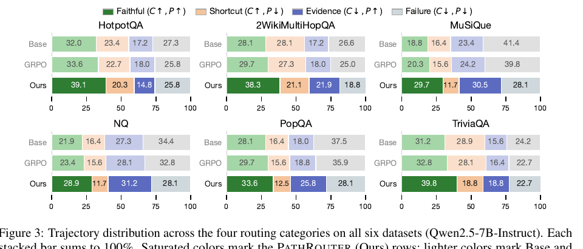
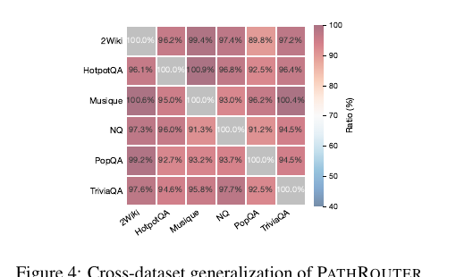

> [[../index|Wiki]] | [[../summary|Summary]] | [[../digest|Digest]]

# Experiments and Main Results

**In one sentence:** PathRouter (PATHROUTER) outperforms the strongest baseline (Graph-R1) across all six QA benchmarks at every model size tested (1.5B, 3B, 7B), with ablations showing the exploration bonus and lazy penalty are critical for multi-step evidence seeking and that 2D routing plus selective teacher KL drive path faithfulness, while the teacher-scale analysis shows student capacity — not teacher quality — is the bottleneck at small scale, and cross-dataset transfer reaches a 95.7% average OOD ratio.

## Key points

- **Six benchmarks, three model sizes:** six QA datasets (multi-hop: HotpotQA, 2WikiMultiHopQA, MuSiQue; single-hop: NQ, PopQA, TriviaQA) evaluated with Qwen2.5 Instruct model sizes 1.5B, 3B, and 7B, plus GPT-4o-mini-based references.
- **Headline gains vs. Graph-R1:** at 7B, PATHROUTER lifts average F1 from 57.82 to **62.74** (a 5.0-point gain, largest on multi-hop: +7.4 F1 on HotpotQA, +8.2 on MuSiQue), EM from 48.57 to **53.26**, and G-E from 76.23 to **78.72**; average F1 improves by 3.1 points at 3B (51.26 → 54.32) and 3.2 points at 1.5B (40.09 → 43.31), with route conditioning staying scale-robust while teacher KL is more capacity-sensitive.
- **Ablation (reward group):** removing the exploration bonus or lazy penalty is catastrophic — retrieval collapses to ~1 turn and all metrics degrade sharply (e.g., HotpotQA F1 drops from 70.13 to 43.51/48.23); removing the path reward mainly lowers SF-F1 while retaining answer F1; timeout and redundancy penalties give modest but consistent regularization.
- **Ablation (KL & routing groups):** selective KL beats uniform KL; KL warmup (vs. constant λ) improves F1/UF and avoids inflated turn counts; 2D routing beats both 1D answer-only and 1D path-only variants, showing answer correctness and evidence-path overlap are complementary supervision signals.
- **Routing/trajectory quality:** Figure 3 shows PATHROUTER shifts trajectory mass from the P↓ column (shortcut success, joint failure) into the P↑ column (faithful success, evidence-present reasoning failure) on all six datasets, proving improved evidence acquisition **independent of answer correctness**.
- **Teacher scale:** online self-distillation is always inferior (UAR above 51%); same-size **frozen** teachers are best at all scales; supervising the 1.5B student with a 7B frozen teacher degrades F1 to 15.83 and pushes UAR above 63% → the bottleneck is **student capacity**, not teacher quality.
- **Scheduling (Table 4):** warmup λ with a frozen teacher is the best configuration on 7B (F1 54.34, SF-F1 48.20, UAR 39.95 on MuSiQue); constant-λ over-constrains early training and inflates turns.
- **Cross-dataset transfer:** PathRouter achieves a highly uniform OOD profile — all off-diagonal transfer ratios exceed **89%**, averaging **95.7%**, vs. 70.6% for Search-R1 and 85.8% for Graph-R1 — i.e., the learned retrieval strategy is not tied to any single training distribution.

---

## Experimental setup (Section 4.1)

Evaluation follows the protocol of Graph-R1 (Luo et al., 2025a).

**Datasets — six QA benchmarks:**
- **Multi-hop** (provide gold supporting facts for path-faithfulness evaluation): HotpotQA (Yang et al., 2018), 2WikiMultiHopQA (Ho et al., 2020), MuSiQue (Trivedi et al., 2022).
- **Single-hop** (broader coverage): NQ (Kwiatkowski et al., 2019), PopQA (Mallen et al., 2023), TriviaQA (Joshi et al., 2017).

**Baselines compared against:**
1. **GPT-4o-mini-based reference methods:** GraphRAG (Edge et al., 2025), LightRAG (Guo et al., 2025), PathRAG (Chen et al., 2025), HippoRAG2 (Gutiérrez et al., 2025), HyperGraphRAG (Luo et al., 2025b).
2. **Non-retrieval approaches:** NaiveGeneration (direct LLM), SFT (Zheng et al., 2024), R1 (Shao et al., 2024, i.e. GRPO without retrieval).
3. **Chunk-based retrieval:** StandardRAG (Lewis et al., 2020), Search-R1 (Jin et al., 2025), R1-Searcher (Song et al., 2025).
4. **Graph-based agentic retrieval:** Graph-R1 (Luo et al., 2025a) — the primary baseline.

**Model sizes (open-weight students):** Qwen2.5-1.5B-Instruct, Qwen2.5-3B-Instruct, Qwen2.5-7B-Instruct (GPT-4o-mini used for the proprietary-method reference rows).

**Metrics:** Answer quality — token-level **F1**, **Exact Match (EM)**, **GPT-4o-mini evaluation (G-E)**. Path faithfulness — **SF-F1** (Supporting Fact F1) and **UAR** (Unsupported Answer Rate, ↓, lower is better). Average number of retrieval **turns** is reported in the ablation and teacher-scale tables. Formal metric definitions are given in Appendix A of the paper.

The paper evaluates three research questions: **RQ1** — does PathRouter improve answer accuracy and evidence quality over existing baselines? (§4.2); **RQ2** — which components drive path faithfulness, and how does routing change trajectory-level behavior? (§4.3–4.4); **RQ3** — how does teacher KL interact with model capacity, and do the learned retrieval strategies transfer across datasets? (§4.5–4.6).

## Main results (Section 4.2, Table 1)

Table 1 reports results across the six datasets and three model-size groups. Key comparison — strongest baseline (Graph-R1) vs. PATHROUTER, per model size (F1 / G-E per dataset, then average EM / F1 / G-E):

| Model size | Method | 2Wiki F1 | 2Wiki G-E | HotpotQA F1 | HotpotQA G-E | MuSiQue F1 | MuSiQue G-E | NQ F1 | NQ G-E | PopQA F1 | PopQA G-E | TriviaQA F1 | TriviaQA G-E | Avg EM | Avg F1 | Avg G-E |
|---|---|---|---|---|---|---|---|---|---|---|---|---|---|---|---|---|
| Qwen2.5-1.5B | **Graph-R1** | 35.13 | 65.73 | 40.62 | 65.30 | 28.28 | 58.82 | 35.62 | 59.13 | 43.55 | 66.46 | 57.36 | 70.83 | 31.90 | 40.09 | 64.38 |
| Qwen2.5-1.5B | **PATHROUTER** | 37.95 | 68.42 | 46.38 | 68.53 | 32.74 | 62.18 | 38.02 | 63.70 | 46.25 | 69.84 | 58.50 | 73.65 | 35.55 | 43.31 | 67.72 |
| Qwen2.5-3B | **Graph-R1** | 57.56 | 76.45 | 56.75 | 77.46 | 40.51 | 67.84 | 44.75 | 69.92 | 45.65 | 71.27 | 62.31 | 75.01 | 42.45 | 51.26 | 72.99 |
| Qwen2.5-3B | **PATHROUTER** | 60.34 | 78.92 | 62.20 | 79.58 | 45.02 | 70.43 | 47.80 | 73.16 | 48.04 | 74.30 | 62.50 | 77.82 | 44.48 | 54.32 | 75.70 |
| Qwen2.5-7B | **Graph-R1** | 65.04 | 82.42 | 62.69 | 80.03 | 46.17 | 71.42 | 49.87 | 70.97 | 51.22 | 73.43 | 71.93 | 79.11 | 48.57 | 57.82 | 76.23 |
| Qwen2.5-7B | **PATHROUTER** | 71.04 | 84.20 | 70.13 | 82.56 | 54.34 | 74.18 | 53.84 | 74.62 | 54.80 | 78.30 | 72.29 | 81.48 | 53.26 | 62.74 | 78.72 |

Reference rows in the same table (avg EM / F1 / G-E): GPT-4o-mini StandardRAG 18.10 / 32.05 / 78.07, 2Wiki 22.31 (highest single-dataset F1 among references); HyperGraphRAG 13.15 / 29.40 / 78.92; at 1.5B the best retrieval baseline is Graph-R1 vs. Search-R1 23.18 / 29.53 / 57.54; at 3B Search-R1 28.65 / 35.69 / 57.86; at 7B Search-R1 38.54 / 46.19 / 68.60 and R1-Searcher 34.51 / 42.29 / 69.08 — all far below PATHROUTER at the same size.

Two consistent patterns emerge:

1. **PATHROUTER consistently outperforms Graph-R1 at every model scale**, improving 7B average F1 from 57.82 to 62.74, EM from 48.57 to 53.26, and G-E from 76.23 to 78.72. The agreement across lexical (F1), exact-match (EM), and LLM-based (G-E) metrics suggests the gains reflect more reliable answer production rather than surface-form effects.
2. **Gains are largest on multi-hop benchmarks**, where faithful evidence composition is essential: 7B F1 rises by **7.4 points on HotpotQA** (62.69 → 70.13) and **8.2 on MuSiQue** (46.17 → 54.34). The same pattern holds at smaller scales — average F1 improves by **3.1 points at 3B** (51.26 → 54.32) and **3.2 at 1.5B** (40.09 → 43.31) — confirming that route-conditioned training mitigates answer-path reward aliasing regardless of model capacity.

A "PATHROUTER w/o TKL" row runs in parallel: at 7B it averages 49.74/60.36/78.47 versus the full model's 53.26/62.74/78.72, so the F1 difference is largest there — route conditioning remains **scale-robust, while teacher KL (TKL) is more capacity-sensitive** (analyzed in §4.5).

## Ablation study (Section 4.3, Table 2)

Table 2 assesses how the **reward design**, **teacher KL objective**, and **routing mechanism** each contribute to path faithfulness, on the multi-hop datasets plus NQ with Qwen2.5-7B-Instruct. Full model reference: HotpotQA 70.13/53.09/16.54/2.8 · 2Wiki 71.04/47.48/29.89/3.5 · MuSiQue 54.34/48.20/39.95/3.7 · NQ 53.84/53.35/26.72/3.2 (F1 / SF-F1 / UAR↓ / Turns).

Key ablations (HotpotQA and MuSiQue F1, with turns; UAR↓):

| Variant group | Variant | HotpotQA F1 | HotpotQA SF-F1 | HotpotQA UAR↓ | HotpotQA turns | MuSiQue F1 | MuSiQue SF-F1 | MuSiQue UAR↓ | MuSiQue turns |
|---|---|---|---|---|---|---|---|---|---|
| Reward | PATHROUTER (full) | 70.13 | 53.09 | 16.54 | 2.8 | 54.34 | 48.20 | 39.95 | 3.7 |
| Reward | w/o path reward (r_p = 0) | 69.47 | 47.23 | 20.51 | 2.7 | 53.58 | 42.53 | 44.06 | 3.6 |
| Reward | w/o exploration bonus (r_e = 0) | 43.51 | 22.46 | 42.03 | 1.0 | 26.82 | 16.24 | 61.95 | 1.0 |
| Reward | w/o lazy penalty (r_l = 0) | 48.23 | 30.51 | 33.96 | 1.3 | 31.47 | 22.83 | 53.94 | 1.5 |
| Reward | w/o timeout penalty (r_o = 0) | 69.83 | 52.47 | 17.02 | 3.2 | 53.91 | 47.53 | 40.47 | 4.0 |
| Reward | w/o redundancy penalty (r_d = 0) | 69.72 | 52.18 | 17.23 | 2.9 | 53.78 | 47.16 | 40.82 | 3.8 |
| Teacher KL | w/o teacher KL | 65.93 | 52.72 | 16.80 | 3.0 | 51.61 | 48.66 | 40.90 | 3.0 |
| Teacher KL | w/o selective KL (uniform) | 63.18 | 44.97 | 24.53 | 2.9 | 48.27 | 40.53 | 48.47 | 3.6 |
| Teacher KL | w/o KL warmup (constant λ) | 66.83 | 50.47 | 20.53 | 4.5 | 50.22 | 44.53 | 45.82 | 5.0 |
| Routing | w/o route scaling (w = 1) | 66.82 | 49.17 | 19.53 | 2.8 | 51.23 | 43.96 | 44.02 | 3.6 |
| Routing | 1D routing: answer-only (C_i) | 67.53 | 48.52 | 19.48 | 2.7 | 52.17 | 43.98 | 43.52 | 3.6 |
| Routing | 1D routing: path-only (P_i) | 66.87 | 50.16 | 18.52 | 2.8 | 51.53 | 45.82 | 42.47 | 3.7 |

What each ablated component does and its effect:

- **Reward group — path reward (r_p):** removing it primarily **lowers SF-F1** (e.g., HotpotQA 53.09 → 47.23, MuSiQue 48.20 → 42.53) while retaining much of the answer F1 — the path signal improves the **quality of evidence** rather than merely supporting answer prediction.
- **Reward group — exploration bonus (r_e) and lazy penalty (r_l):** removing either is the most damaging in the study — retrieval turns collapse to **approximately one** (1.0–1.5), UAR nearly doubles (42.03 / 33.96 on HotpotQA), and all metrics degrade broadly (F1 43.51 / 48.23 on HotpotQA, 26.82 / 31.47 on MuSiQue). Both terms are **essential for sustaining multi-step evidence seeking**.
- **Reward group — timeout (r_o) and redundancy (r_d) penalties:** yield more **modest but consistent regularization benefits**; removing them barely changes F1 but worsens UAR and (for the timeout penalty) slightly inflates turn count (3.2–3.8 vs. 2.8–3.7).
- **Teacher KL group — KL:** removing KL altogether preserves multi-turn behavior but **reduces answer F1** (HotpotQA 70.13 → 65.93); replacing selective KL with **uniform** KL underperforms, showing that teacher guidance is most effective when **focused on evidence-poor trajectories**.
- **Teacher KL group — warmup:** dropping the warmup (constant λ) worsens F1 and UAR and clearly **inflates the turn count** (4.5–5.0 turns vs. 3.7), indicating constant λ over-regularizes early training.
- **Routing group:** removing route scaling, or collapsing the 2D taxonomy to either a single **answer-only** (C_i) or **path-only** (P_i) axis, degrades **both F1 and SF-F1** — answer correctness and evidence-path overlap are **complementary supervision signals** and the full 2D formulation is best on every metric.

## Routing and trajectory quality (Section 4.4)

This analysis asks whether route-conditioned training promotes evidence-path exploration **beyond improvements in answer F1**. Figure 3 compares the converged **2×2 trajectory distributions** (categories defined by binary correctness C and path faithfulness P: Faithful C↑P↑, Shortcut C↑P↓, Evidence C↓P↑, Failure C↓P↓; each bar sums to 100%) across all six datasets for **Base, GRPO, and PATHROUTER** (Qwen2.5-7B-Instruct).

Per-dataset shares read from the figure (Faithful / Shortcut / Evidence / Failure, %):

| Dataset | Base | GRPO | PATHROUTER |
|---|---|---|---|
| HotpotQA | 32.0 / 23.4 / 17.2 / 27.3 | 33.6 / 22.7 / 18.0 / 25.8 | 39.1 / 20.3 / 14.8 / 25.8 |
| 2WikiMultiHopQA | 28.1 / 28.1 / 17.2 / 26.6 | 29.7 / 27.3 / 18.0 / 25.0 | 38.3 / 21.1 / 21.9 / 18.8 |
| MuSiQue | 18.8 / 16.4 / 23.4 / 41.4 | 20.3 / 15.6 / 24.2 / 39.8 | 29.7 / 11.7 / 30.5 / 28.1 |
| NQ | 21.9 / 16.4 / 27.3 / 34.4 | 23.4 / 15.6 / 28.1 / 32.8 | 28.9 / 11.7 / 31.2 / 28.1 |
| PopQA | 28.1 / 16.4 / 18.0 / 37.5 | 29.7 / 15.6 / 18.8 / 35.9 | 33.6 / 12.5 / 25.8 / 28.1 |
| TriviaQA | 31.2 / 28.9 / 15.6 / 24.2 | 32.8 / 28.1 / 16.4 / 22.7 | 39.8 / 18.8 / 18.8 / 22.7 |

Findings:

- PATHROUTER **consistently reduces evidence-deficient trajectories** — both shortcut success (C↑P↓) and joint failure (C↓P↓) — while **increasing faithful success (C↑P↑) on all six datasets**, with the **largest gain on MuSiQue** (Faithful 18.8 → 29.7).
- **Evidence-present reasoning failure (C↓P↑) increases on five of six datasets** (e.g., 2Wiki 17.2 → 21.9, MuSiQue 23.4 → 30.5, NQ 27.3 → 31.2; the only exception is HotpotQA, 17.2 → 14.8), indicating trajectories that previously failed at both retrieval and answering are converted into cases where **relevant evidence is successfully retrieved, even when answer synthesis remains unresolved**.
- The overall shift **from the P↓ column to the P↑ column** shows PATHROUTER improves evidence acquisition **independently of answer correctness**, supporting the conclusion that route-conditioned training encourages **genuine evidence-path exploration** rather than exploiting parametric answer priors.

## Teacher scale analysis (Section 4.5, Tables 3–4)

As shown in Table 1, the gains from route conditioning are broadly stable across model sizes, but **teacher KL shows a stronger dependence on scale**. Comparing PATHROUTER with its no-TKL variant reveals that teacher KL is **not a generic regularizer but a capacity-dependent mechanism for resolving search-update ambiguity**: at 7B the teacher-KL gains concentrate on multi-hop tasks where scalar rewards leave the most ambiguity about which search actions to reinforce; at 3B the effect is modest but consistent; at 1.5B it becomes mixed, with slight degradation on NQ — suggesting smaller students may be **over-constrained by teacher distributions**. The division of labor: route-conditioned rewards address **answer-path aliasing**, while teacher KL reduces **search-update ambiguity** when the student has sufficient capacity to exploit it.

**Table 3 — Teachers across model sizes on MuSiQue** (disentangling teacher quality from student capacity; "Online" uses the evolving student as its own teacher, "Frozen" a fixed reference checkpoint):

| Student | Teacher | Type | F1 | SF-F1 | UAR↓ | Turns |
|---|---|---|---|---|---|---|
| 1.5B | 1.5B | Online | 27.83 | 40.52 | 56.31 | 1.2 |
| 1.5B | 1.5B | **Frozen (ours)** | 32.74 | 43.82 | 43.15 | 2.9 |
| 1.5B | 7B | Frozen | 15.83 | 26.41 | 63.27 | 4.8 |
| 3B | 3B | Online | 39.47 | 42.83 | 53.18 | 1.3 |
| 3B | 3B | **Frozen (ours)** | 45.02 | 46.53 | 40.82 | 3.3 |
| 3B | 7B | Frozen | 33.61 | 36.82 | 54.17 | 4.5 |
| 7B | 7B | Online | 48.31 | 43.47 | 52.83 | 2.9 |
| 7B | 7B | **Frozen (ours)** | 54.34 | 48.20 | 39.95 | 3.7 |

Findings:

- **Online self-distillation is consistently inferior** (UAR above 51%, reduced multi-turn exploration — turns ~1.2–1.3), confirming an evolving teacher cannot provide a stable correction signal.
- **Same-size frozen teachers perform best at all three scales** — they resolve search-update ambiguity while giving guidance the student can effectively absorb.
- **Supervising the 1.5B student with a stronger 7B frozen teacher sharply degrades F1 (32.74 → 15.83) and raises UAR above 63% (63.27)** — the bottleneck is **student capacity, not teacher quality**.

**Table 4 — KL schedule settings on MuSiQue** (7B model):

| Teacher | Schedule | F1 | SF-F1 | UAR↓ | Turns |
|---|---|---|---|---|---|
| Frozen π_ref | Constant λ | 50.22 | 44.53 | 45.82 | 5.0 |
| Frozen π_ref | Full KL (no selective) | 48.27 | 40.53 | 48.47 | 3.6 |
| Frozen π_ref (ours) | **Warmup λ** | **54.34** | **48.20** | **39.95** | 3.7 |
| Online π_θ | Constant λ | 44.83 | 38.47 | 55.23 | 2.8 |
| Online π_θ | Full KL (no selective) | 42.14 | 35.82 | 58.47 | 2.5 |
| Online π_θ | Warmup λ | 48.31 | 43.47 | 52.83 | 2.9 |

Findings: **warmup scheduling achieves the highest F1** while avoiding the over-exploration seen under constant λ, where the KL constraint **dominates early training and inflates average turns** (5.0 turns, UAR 45.82); **online variants remain worse than their frozen counterparts across all schedules**.

## Cross-dataset transfer (Section 4.6, Figure 4)

To test whether path-faithful retrieval behavior generalizes beyond individual training distributions, PATHROUTER is **trained on each dataset separately and evaluated on all others**. Figure 4 reports the **OOD generalization ratio** for each train–eval pair: `F1(train_i, eval_j) / F1(train_j, eval_j) × 100%` (Qwen2.5-7B-Instruct). The 6×6 matrix (rows = training dataset, columns = evaluation dataset; order 2Wiki, HotpotQA, MuSiQue, NQ, PopQA, TriviaQA):

| train \ eval | 2Wiki | HotpotQA | MuSiQue | NQ | PopQA | TriviaQA |
|---|---|---|---|---|---|---|
| **2Wiki** | 100.0% | 96.2% | 99.4% | 97.4% | 89.8% | 97.2% |
| **HotpotQA** | 96.1% | 100.0% | 100.9% | 96.8% | 92.5% | 96.4% |
| **MuSiQue** | 100.6% | 95.0% | 100.0% | 93.0% | 96.2% | 100.4% |
| **NQ** | 97.3% | 96.0% | 91.3% | 100.0% | 91.2% | 94.5% |
| **PopQA** | 99.2% | 92.7% | 93.2% | 93.7% | 100.0% | 94.5% |
| **TriviaQA** | 97.6% | 94.6% | 95.8% | 97.7% | 92.5% | 100.0% |

PATHROUTER achieves a **highly uniform transfer profile**: **all off-diagonal ratios exceed 89%** and the **average ratio is 95.7%**, suggesting path-aware routing and selective query guidance encourage retrieval strategies **not tied to the distributional characteristics of any single training set**. In comparison, **Search-R1** and **Graph-R1** achieve average OOD ratios of only **70.6%** and **85.8%** respectively (Appendix D.3). The surface is flat and high — the matrix shows essentially dataset-agnostic behavior, with only modest, localized dips (e.g., 89.8% for 2Wiki-train → PopQA-eval and 91.3% for NQ-train → MuSiQue-eval).

**Covers:** Section 4.1-4.6 (Experimental Setup through Cross-Dataset Transfer)
