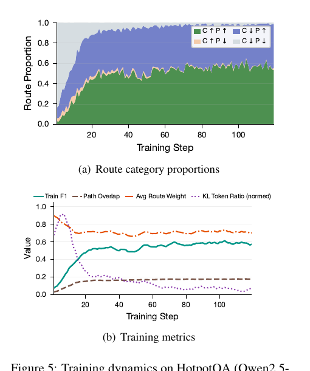
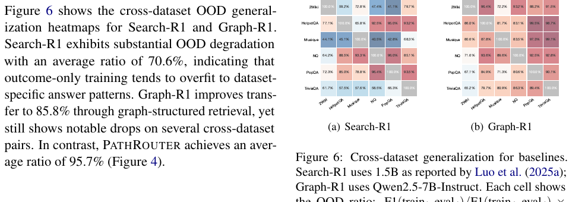

> [[../index|Wiki]] | [[../summary|Summary]] | [[../digest|Digest]]

# Limitations, Implementation Details, and Appendix

**In one sentence:** PathRouter trades training efficiency (extra routing/teacher hyperparameters, more exploration turns, per-step teacher forward passes) for faithfulness — a trade the appendices back up with exact metric definitions (F1, EM, SF-F1, UAR, G-E), a complete hyperparameter configuration, a KL-selection/threshold-sensitivity analysis, and case studies showing outcome-only training reaching correct answers from parametric memory or hallucinated bridge entities with near-zero path overlap.

## Key points

- **Acknowledged limitations:** PathRouter adds routing and teacher-scheduling hyperparameters that may need re-tuning on smaller models or new domains; the path-aware reward encourages more exploration turns during training; and the frozen teacher's forward passes for selective KL add per-step cost.
- **Key hyperparameters:** learning rate 1×10⁻⁶ (batch 128, 3 epochs); group size K=32; max retrieval turns T=5 in training (T_inf=10 at inference); clip range ε=0.2; top-K vocab K_vocab=128; teacher KL coefficient λ̄_T=0.1 with 20 warmup steps; reference KL β=0.01; thresholds θ_C=0.5 (F1) and θ_P=0.1; route weights w_full/w_down/w_preserve = 1.0/0.5/0.3.
- **Metric definitions:** Token-level F1 (SQuAD-style set intersection), Exact Match on normalized strings, SF-F1 = mean token F1 between retrieved passages and gold supporting facts S_gt (equivalent to the evidence-overlap score P_i), UAR = fraction of answer tokens absent from retrieved evidence (lower is better), and G-E = GPT-4o-mini judge score on a 0–100 scale.
- **KL selection:** low-P_i trajectory filtering beats content-based and uniform sampling (MuSiQue F1 54.34 vs 51.83/50.62); restricting KL to query tokens slightly degrades SF-F1, while extending KL to answer tokens raises UAR from 39.95 to 46.23 — answer-token imitation creates shortcuts.
- **Threshold sensitivity:** performance on MuSiQue is stable for θ_P ∈ [0.05, 0.2] but degrades at θ_P=0.3 (F1 54.34→51.93), where 88% of trajectories receive teacher KL — approaching the uniform setting.
- **Training dynamics:** on HotpotQA (Qwen2.5-3B, 119 steps), faithful (C↑P↑) trajectories grow steadily, joint failures (C↓P↓) vanish within the first 20 steps, and the KL token ratio decays as fewer trajectories remain evidence-poor — an implicit curriculum from teacher-guided query correction to on-policy reinforcement.
- **Cross-dataset transfer:** Search-R1 average OOD ratio 70.6% (overfit to dataset-specific patterns), Graph-R1 85.8% via graph-structured retrieval, versus PathRouter 95.7%.
- **Case-study takeaway:** GRPO repeatedly produces the exact right answer (F1 up to 1.000) with near-zero path overlap (PO as low as 0.028) — from parametric memory or a hallucinated bridge entity — while PathRouter's trajectories in the same cases (PO 0.346 / 0.111 / 0.139) are shorter, evidence-grounded reasoning chains.

---

## Conclusion and limitations

PathRouter is a path-aware training framework for agentic GraphRAG that addresses the credit-assignment limitations of outcome-only RL. It evaluates trajectories by answer correctness and evidence-path overlap, then modulates GRPO advantage weights to suppress shortcut reinforcement while preserving faithful-but-wrong explorations. For evidence-poor trajectories, a frozen gold-evidence teacher provides selective top-K token-level KL guidance on reasoning and search-query tokens, with masking and warmup to prevent answer imitation and stabilize training. This path-conditioned design enables more targeted policy optimization than uniform distillation or outcome-only reinforcement.

**Limitations.** Three concrete costs are acknowledged:

1. **Extra hyperparameters:** routing and teacher scheduling introduce additional hyperparameters that may require tuning when applied to smaller models or new domains.
2. **More exploration:** the path-aware reward encourages more exploration turns during training.
3. **Per-step cost:** the teacher forward passes for selective KL add per-step cost.

Overall, PathRouter trades training efficiency for improved faithfulness and robustness.

**Ethical considerations (brief).** All datasets and corpora are open-access; no private or sensitive information is involved. Models and APIs come from publicly accessible platforms and are used per their terms and policies. The work targets retrieval and reasoning over public knowledge corpora, and the authors do not anticipate direct ethical concerns.

## Evaluation metrics (Appendix A)

Five metrics are used throughout the paper:

- **Token-level F1.** Given a predicted answer `a` and gold answer `a*`, both tokenized into word sets, precision `P = |a ∩ a*| / |a|` and recall `R = |a ∩ a*| / |a*|`, then `F1 = 2PR / (P + R)`. This is the standard SQuAD-style token-level F1 (Rajpurkar et al., 2016).
- **Exact Match (EM).** `EM = 1` if the normalized predicted answer string exactly matches the normalized gold answer, and `0` otherwise. Normalization includes lowercasing, removing articles, punctuation, and extra whitespace.
- **Supporting Fact F1 (SF-F1).** Measures the average token-level F1 between the trajectory's retrieved passages and the gold supporting facts S_gt. Formally:

  `SF-F1 = (1 / |S_gt|) · Σ_{s ∈ S_gt} F1(retrieved(τ_i), s)`

  This metric is equivalent to the evidence-overlap score P_i defined in §3.2.
- **Unsupported Answer Rate (UAR, ↓).** Measures the fraction of answer tokens that are not grounded in the retrieved evidence. For each answer token `w ∈ a_i`, check whether `w` appears in any retrieved passage:

  `UAR = |{ w ∈ a_i : w ∉ retrieved(τ_i) }| / |a_i|`

  Lower UAR indicates better evidence grounding.
- **GPT-4o-mini Evaluation (G-E).** Following Luo et al. (2025a), GPT-4o-mini is used as an LLM judge to score answer quality on a 0–100 scale. The judge receives the question, gold answer, and predicted answer, and evaluates correctness, completeness, and relevance. The average score across all test questions is reported.

## Implementation and dataset details (Appendix B, C)

**Training framework:** veRL, with group size K=32 and maximum T=5 retrieval turns during training. At inference the maximum turn limit is increased to T_inf=10 to allow more thorough retrieval when needed; the timeout penalty r_o is only applied during training.

**Hyperparameters (Table 5):**

| Category | Hyperparameter | Value |
|----------|---------------|-------|
| Training | Learning rate | 1×10⁻⁶ |
| Training | Batch size | 128 |
| Training | Group size K | 32 |
| Training | Max retrieval turns T | 5 |
| Training | Clip range ε | 0.2 |
| Training | Training epochs | 3 |
| Teacher | Top-K vocab K_vocab | 128 |
| Teacher | KL coefficient λ̄_T | 0.1 |
| Teacher | KL warmup steps W | 20 |
| Teacher | Ref. KL coefficient β | 0.01 |
| Routing | Answer threshold θ_C | 0.5 (F1) |
| Routing | Evidence threshold θ_P | 0.1 |
| Routing | w_full / w_down / w_preserve | 1.0 / 0.5 / 0.3 |
| Reward | Path weight α | 0.5 |
| Reward | Exploration bonus r_e | 0.2 |
| Reward | Lazy penalty r_l | −0.25 |
| Reward | Timeout penalty r_o | −0.5 |
| Reward | Redundancy penalty r_d | −0.1 |
| Reward | Base reward R_0 | −1 |

**Datasets (Appendix C, Table 6):**

| Dataset | Train | Dev | Test |
|---------|-------|-----|------|
| HotpotQA | 90,564 | 7,405 | 500 |
| 2WikiMultiHopQA | 167,454 | 12,576 | 500 |
| MuSiQue | 19,938 | 2,417 | 500 |

- **HotpotQA** (Yang et al., 2018): provides sentence-level supporting facts for each question; these passages are used as gold evidence S_gt for teacher conditioning and evidence-overlap computation. Each question is associated with 10 Wikipedia paragraphs (2 gold + 8 distractors) and requires 2-hop reasoning.
- **2WikiMultiHopQA** (Ho et al., 2020): provides evidence information containing reasoning paths; supporting passages are extracted from the evidence annotations as S_gt.
- **MuSiQue** (Trivedi et al., 2022): provides decomposed sub-questions and their answers; the paragraphs answering each sub-question are identified as S_gt.

## Additional experimental results (Appendix D)

**KL selection strategy and threshold sensitivity (§D.1).** Table 7 validates the KL selection design along two dimensions — trajectory selection and token masking — on MuSiQue (Qwen2.5-7B-Instruct), all with a frozen teacher and warmup λ:

| Selection strategy | F1 | SF-F1 | UAR↓ | Turns |
|--------------------|------|-------|-------|-----|
| **Low P_i only (ours)** | **54.34** | **48.20** | **39.95** | 3.7 |
| Content-based sampling | 51.83 | 44.96 | 43.52 | 3.5 |
| Uniform sampling in P_i space | 50.62 | 43.81 | 44.97 | 3.4 |
| Low P_i, query tokens only | 53.17 | 46.53 | 41.82 | 3.6 |
| Low P_i, query + answer tokens | 52.48 | 43.96 | 46.23 | 3.5 |

Findings: (i) for trajectory selection, low-P_i filtering outperforms both content-based and uniform sampling, confirming that evidence overlap is the right criterion for identifying trajectories that benefit from teacher guidance; (ii) for token masking, restricting KL to query tokens alone slightly degrades SF-F1 (48.20→46.53), while extending KL to answer tokens increases UAR from 39.95 to 46.23 — answer-token imitation creates shortcuts.

Threshold sensitivity (Table 8, MuSiQue, θ_C=0.5 fixed):

| θ_P | F1 | SF-F1 | UAR↓ | KL-elig. % |
|-----|------|-------|-------|------------|
| 0.05 | 53.48 | 47.53 | 40.82 | 42% |
| **0.1 (ours)** | **54.34** | **48.20** | **39.95** | 58% |
| 0.2 | 53.81 | 47.76 | 40.47 | 75% |
| 0.3 | 51.93 | 45.52 | 42.98 | 88% |

Performance is stable for θ_P ∈ [0.05, 0.2] but degrades at θ_P=0.3, where 88% of trajectories receive teacher KL — approaching the uniform-sampling setting.

**Training dynamics (§D.2).** Figure 5 tracks route proportions and training metrics over 119 steps on HotpotQA (Qwen2.5-3B). Faithful trajectories (C↑P↑) grow steadily while joint failures (C↓P↓) vanish within the first 20 steps. The KL token ratio decays naturally as fewer trajectories remain evidence-poor, creating an implicit curriculum from teacher-guided query correction to on-policy reinforcement. In the figure, Train F1 climbs to a plateau within the first ~30 steps, Path Overlap rises to a low plateau, Avg Route Weight stabilizes as the route distribution converges, and the route mass concentrates quickly on the P↑ categories.

**Baseline cross-dataset transfer (§D.3).** Figure 6 shows the cross-dataset OOD generalization heatmaps for Search-R1 (1.5B, as reported by Luo et al. 2025a) and Graph-R1 (Qwen2.5-7B-Instruct). Each cell reports the OOD ratio `F1(train_i, eval_j) / F1(train_j, eval_j) × 100%`, with the diagonal (gray) being in-domain. Search-R1 exhibits substantial OOD degradation with an average ratio of 70.6%, indicating that outcome-only training tends to overfit to dataset-specific answer patterns. Graph-R1 improves transfer to 85.8% through graph-structured retrieval, yet still shows notable drops on several cross-dataset pairs (e.g., HotpotQA→TriviaQA 65.2%, NQ→TriviaQA 67.1%). In contrast, PathRouter achieves an average OOD ratio of 95.7% (Figure 4), making cross-dataset generalization a key differentiator.

## Case studies (Appendix E)

Tables 9–11 present three representative multi-hop QA case studies comparing Base, GRPO, and PathRouter. Each isolates a distinct failure mode of outcome-only training; in all three, PathRouter reaches the (same) answer through an evidence-grounded reasoning chain with higher path overlap and fewer turns.

**Case 1 (Table 9) — correct answer from parametric memory with no supporting evidence.** MuSiQue: "Who developed the statue of the person with the most finals MVPs in the NBA?" Ground truth: Julie Rotblatt-Amrany.
- **Base** (F1=0.000, PO=0.265, turns=4): misidentifies the bridge entity (LeBron instead of Jordan), then answers "Bronze" — the material rather than the sculptor.
- **GRPO** (F1=0.571, PO=0.109, turns=8): gets stuck in a retrieval loop — five repeated "LeBron James statue" queries with no relevant results — then forces the correct name (Omri Amrany and Julie Rotblatt-Amrany) out of parametric memory on turn 8 with essentially no retrieved evidence (PO=0.109).
- **PathRouter** (F1=0.571, PO=0.346, turns=3): retrieves the Jordan Finals-MVP record, then the "Spirit" statue passage naming the Amrany sculptors, and answers from that evidence in 3 turns with 3× the path overlap.

**Case 2 (Table 10) — correct answer via a hallucinated bridge entity.** HotpotQA: "Who directed a romantic comedy starring a '7th Heaven' star and Ludacris?" Ground truth: Garry Marshall.
- **Base** (F1=0.000, PO=0.037, turns=8): latchs onto the wrong bridge (Mackenzie Rosman), loops 6 more turns on "Mackenzie Rosman and Ludacris" queries, then gives up ("No information available").
- **GRPO** (F1=1.000, PO=0.072, turns=3): finds the "New Year's Eve" cast list, then claims "Halle Berry was a star of 7th Heaven" (false) and names director Garry Marshall — the right answer built on a hallucinated bridge, with minimal path overlap.
- **PathRouter** (F1=1.000, PO=0.111, turns=3): grounds the bridge in evidence (Barret Swatek, a 7th Heaven actress), connects her to the Ludacris film, and answers Garry Marshall with a valid, evidence-backed reasoning chain.

**Case 3 (Table 11) — unsupported exact-match answer.** MuSiQue: "What is the salary of the governor of the state Kevin Sessums was born in?" Ground truth: $122,160.
- **Base** (F1=0.000, PO=0.030, turns=7): repeated "governor of Mississippi salary" queries return no salary figure; the model gives up ("Not available").
- **GRPO** (F1=1.000, PO=0.028, turns=8): after the same failed retrieval loop, emits the exact figure `$122,160` — the salary never appears in any retrieved passage (PO=0.028), a clear parametric hallucination that outcome metrics fully reward.
- **PathRouter** (F1=1.000, PO=0.139, turns=3): retrieves Sessums's birthplace (Forest, Mississippi), then the passage stating Phil Bryant's annual 2013 salary of $122,160, and answers from that evidence.

**Summary:** outcome-only GRPO optimizes F1/EM as a scalar that cannot distinguish "grounded correct" from "recalled correct" — all three GRPO trajectories score F1 0.5–1.0 yet carry near-zero path overlap (0.109 / 0.072 / 0.028). PathRouter's path-aware reward produces strictly evidence-grounded chains (PO 0.346 / 0.111 / 0.139) while also answering correctly in fewer turns.

**Covers:** Section 5 (Conclusion), Limitations, Ethical Considerations, Appendix A–E
