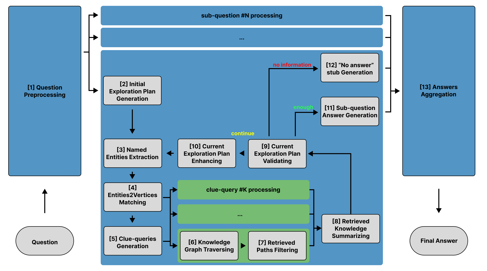

> [[../index|Wiki]] | [[../summary|Summary]] | [[../digest|Digest]]

# Methods: The PAI-2 Pipeline

**In one sentence:** PAI-2 answers questions over a memory (knowledge) graph by decomposing the question into sub-questions and then, for each, iteratively generating, validating, and enhancing natural-language search plans whose steps drive entity-grounded graph traversal, triplet relevance filtering, and progressive summarization until either a sufficient answer is produced or a "No Answer" stub is emitted.

## Key points

- The QA pipeline has thirteen stages, most of which can be executed in parallel across sub-questions and clue-queries; it draws from PAI-1 but introduces a dynamic planning mechanism instead of relying on direct node-level retrievals and static pre-defined ontologies.
- Stage 1, `Preprocess(q) = Decompose(Enhance(Denoise(q)))`, denoises (syntactic/punctuation check, stop-word removal), enhances (grammar, precise terminology, meaning expansion), and decomposes a composite question into independently answerable sub-questions {q_1…q_N} (Tables 7–13 for the prompts).
- For each sub-question, `InitialPlanGen(q)` produces an initial exploration plan P = [s_1…s_M] of natural-language search steps from a single LLM inference (`PROMPT_plan_init`, Table 14); entities E_j are extracted from each step via NER (Table 15) and matched to object vertices V with a per-entity cap V_m using a combination of dense and sparse retrieval models (BM25, DRMs, dual-tower and single-tower).
- A `LinearCombination` over the matched vertices selects the first C_m vertex groups, from which LLM-generated clue-queries CQ_j = {cq_1…cq_C_m} reformulate the search step s_j with respect to each vertex group (Table 16).
- Each clue-query drives independent graph traversal from its vertices, `KGraphTraverse(cq_l, V[l])`, accumulating raw triples T_l_raw, which are then pruned by `FilterByRelevance(s, T_raw)` to keep the F_m triples closest to the query by dense embeddings.
- Evidence is aggregated in two steps: per-clue `ClueAnswerGen(cq, T_l)` (Table 17) followed by `SummarizeClueAnswers(s, CQ, CA)` (Table 18) to yield step knowledge sa_j.
- A decision loop runs `PROMPT_answer_cls(q, P, SA)` on the accumulated knowledge SA = [sa_1…sa_j]: if sufficient, the sub-answer a is generated via `PROMPT_answer_subq(q, P, SA)` (Tables 19–20); if not, `PROMPT_plan_enhance_cls` decides whether the plan needs modification and `SearchPlanEnhance(q, P, SA)` refines it (Tables 21–22), then the pipeline returns to entity extraction for the next step until the search limit is exceeded, in which case `NoAnswerStubGen(q)` (stage 12) returns a "No Answer" stub.
- Stage 13 aggregates all sub-answers into the final response via `AggregateSubAnswers(q, SubQ, SubA)` (Table 23); pseudocode of the full pipeline is given in Appendix C.

---

Figure 1 lays out the PAI-2 QA pipeline as a left-to-right workflow over the memory graph. A single natural-language question enters the Question Preprocessing block, which fans out into parallel sub-question streams; one stream is expanded as a closed control loop inside the central container: an initial exploration plan is generated, named entities are extracted and matched to graph vertices, and the resulting clue-queries each launch a knowledge-graph traversal whose retrieved paths are filtered by relevance and summarized. A plan-validating node is the core decision point, with three labeled exits — an "enough" branch to sub-question answer generation, a "continue" branch that routes through plan enhancement and re-enters the loop to run the next search step, and a "no information" branch to "No Answer" stub generation. Partial results from all sub-question streams finally converge into the Answers Aggregation block, which emits the final answer. The overall design is a plan → retrieve → validate → enhance loop with explicit early-exit and failure handling, enabling iterative multi-hop reasoning rather than a single retrieval pass.

## Question preprocessing

Given a question q, PAI-2 applies `Preprocess(q) = Decompose(Enhance(Denoise(q)))`, implemented as chains of LLM prompts (Tables 7–13):

- **Denoising** — `q_d = Denoise(q) = PROMPT_syntax(PROMPT_stopwords(q))`: the LLM is first asked (1) to check q for syntactical/punctuational mistakes, then (2) to remove stop words and unnecessary information (Tables 7, 8).
- **Enhancement** — `q_e = Enhance(q) = PROMPT_grammar(PROMPT_terms(PROMPT_expand(q)))`: the LLM is asked (1) to edit q according to grammatical rules, (2) to rephrase it using common and precise terminology, and (3) to expand it so its meaning becomes clearer (Tables 9–11).
- **Decomposition** — the LLM first classifies whether q is composite: `PROMPT_decompose_cls(q)` returns True if q is composite, False otherwise. If True, it is asked to split q into questions q_i that can each be answered independently, giving {q_1…q_N} = Decompose(q) = PROMPT_decompose(PROMPT_decompose_cls(q)) (Tables 12, 13).

## Memory graph exploration

For each sub-question q_i, the operation `a = GraphExploration(q)` searches the constructed knowledge graph and generates an accurate, factually correct answer; it consists of eleven steps (described on a single sub-question q):

**Firstly — planning, grounding, and clue-queries.**

1. An initial exploration plan P = InitialPlanGen(q), a collection of natural-language queries (search steps) P = [s_1…s_M], is produced by one LLM inference step: P = PROMPT_plan_init(q) (Table 14).
2. For a search step s_j, key named entities are extracted: E_j = {e_1…e_U} = NER(s_j) (Table 15).
3. The entities are linked to object vertices V_u[j]_{V_m} = [[v_11…v_1V_m], …, [v_U1…v_UV_m]] from the memory graph, where V_m is a hyperparameter giving the maximum number of object vertices that can be linked to one entity: V_u[j]_{V_m} = Entities2VerticesMatching(E_j, V_m). This can be done by dense and/or sparse retrieval models (BM25, DRMs, including dual-tower and single-tower models); PAI-2 uses a combination of dense and sparse retrieval models.
4. A linear combination is performed over V_u[j]_{V_m} and the first C_m vertices groups are selected, where C_m is a hyperparameter: V = LinearCombination(V, C_m).
5. The LLM then generates detailed clue-queries CQ_j = {cq_1…cq_C_m} based on s_j and the vertex groups: CQ = ClueQueriesGen(s, V). A clue-query is a reformulation of s_j with respect to a given group (row) of object vertices from V (Table 16).

**Secondly — per-clue-query traversal, filtering, and summarization.**

- Each clue-query cq_l of CQ_j acts as a control mechanism for an independent graph traversal: vertices from V are the starting points and relevant triples are accumulated, T_l_raw = {t_1…t_Y} = KGraphTraverse(cq_l, V[l]).
- The raw triples are filtered to keep only the F_m triples that are closer (by dense embeddings) to cq_l: T = FilterByRelevance(s, T_raw).
- All filtered triples {T_1…T_C_m} are summarized into one answer for s_j by a two-step aggregation: (i) per clue-query, the LLM summarizes each T_l based on cq_l, ca_l = ClueAnswerGen(cq, T_l) (Table 17); (ii) the LLM summarizes CA_j = {ca_1…ca_C_m} based on s_j and CQ_j, sa = SummarizeClueAnswers(s, CQ, CA), where sa is the knowledge retrieved from the memory graph with respect to search step s (Table 18).

**Thirdly — plan validation, enhancement, and answer generation.**

- Given newly discovered knowledge sa_j for s_j together with SA = [sa_1…sa_j] from previous steps, the LLM classifies whether a relevant answer a can be generated for q: `PROMPT_answer_cls(q, P, SA)` returns True if a relevant answer can be generated, False otherwise.
- If True, the sub-answer is generated from the accumulated knowledge: a = PROMPT_answer_subq(q, P, SA) (Tables 19, 20).
- If False, the LLM classifies whether the remaining search plan (next steps s_{j+1}…s_M) needs modification: `PROMPT_plan_enhance_cls(q, P, SA)` returns True if P needs to be enhanced. If True, the plan is refined with respect to the newly discovered knowledge: P = P_new = SearchPlanEnhance(q, P, SA) (Tables 21, 22).
- If the search limit is not exceeded, sa_j is appended to SA and the same procedure repeats for the next step s_{j+1} (returning to entity extraction). If the maximum number of completed search steps is exceeded without sufficient knowledge, a "No Answer" stub is returned: a = NoAnswerStubGen(q).

## Answers aggregation

After receiving all sub-answers SubA = [a_1…a_N] for sub-questions SubQ = [q_1…q_N], the LLM generates the final answer a to the original question q: a = AggregateSubAnswers(q, SubQ, SubA) (Table 23); this string-formatted output is the result of the PAI-2 QA pipeline.

**Covers:** Section III (Methods) of the paper, including Figure 1.
