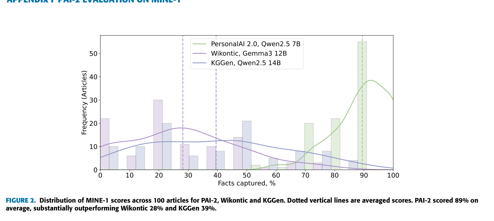

> [[../index|Wiki]] | [[../summary|Summary]] | [[../digest|Digest]]

# Appendix: Memory Graph Stats, Clue-Query Ablations, MINE-1, and Human Evaluation

**In one sentence:** This appendix documents the structural and cost characteristics of PAI-2's constructed memory graphs, the non-aggregated clue-queries-number ablation results, PAI-2's MINE-1 information-retention evaluation (89% vs 86% best baseline), and human-evaluation agreement metrics for PAI-2 and HippoRAG 2.

## Key points

- Six memory graphs were constructed with Qwen2.5 7B over QA datasets (3,483–4,921 documents each); on average one graph holds 4,181 episodic, 36,151 thesis, 72,618 object and 147,523 hyper vertices plus 124,815 simple object-object edges (Table 26).
- Constructing a ~4,182-document memory graph requires ≈7.5 M LLM tokens, ≈46.25 hours and ≈2.01 GB of disk space (Tables 27–28).
- LLM parsing errors during construction are minimal (0.02%–0.08% lost documents; 0% for NaturalQuestions, HotpotQA, 2WikiMultihopQA), causing only minor graph incompleteness.
- In the clue-queries-number ablation (Tables 29–32), allowing up to 6–8 clue queries per search-plan step yields the best LLM-as-a-Judge scores (mean ≈0.50–0.54 across retriever/vertex-type configurations).
- On MINE-1, PAI-2 with Qwen2.5 7B retains 89% of factual information from source articles, beating Wikontic's best 86% (gpt4.1-mini), GraphRAG's 44% (gpt4o) and all KGGen configurations (14–73%).
- The MINE-1 vertex-type ablation (Table 34) shows the best retention (95% mean) when triples incident to object, thesis and episodic vertices are all accepted; restricting to object+thesis triples degrades it by ~10%.
- Human evaluation agrees strongly with LLM-as-a-Judge: Krippendorff's alpha 0.93 (PAI-2) and 0.94 (HippoRAG 2), Pearson correlation 0.88 vs 0.84 (Tables 35–37).

---

## Appendix G: Memory Graph Characteristics

To evaluate PAI-2's QA pipeline, 6 memory graphs were constructed from the selected datasets using Qwen2.5 7B. Structural characteristics (Table 26):

**Table 26.** Characteristics of constructed (with Qwen2.5 7B) memory graphs on given datasets for PAI-2 evaluation

| Dataset | Documents to store | Episodic vertices | Thesis vertices | Object vertices | Hyper edges (to episodic) | Hyper edges (to thesis) | Simple edges (between objects) | Object neighbours (to episodic), mean/std | Object neighbours (to thesis), mean/std | Object neighbours (to object), mean/std | Thesis neighbours (to episodic), mean/std |
|---|---|---|---|---|---|---|---|---|---|---|---|
| Natural Questions | 3970 | 3970 | 32652 | 67104 | 131935 | 114083 | 37377 | 24.97 / 10.48 | 3.49 / 1.30 | 1.26 / 1.80 | 8.31 / 3.34 |
| TriviaQA | 4925 | 4921 | 53079 | 106727 | 221133 | 187901 | 61848 | 34.15 / 11.35 | 3.54 / 1.37 | 1.30 / 1.92 | 10.9 / 4.47 |
| HotpotQA | 3933 | 3933 | 31653 | 56178 | 119913 | 105978 | 38644 | 22.44 / 10.19 | 3.35 / 1.17 | 1.37 / 4.46 | 8.12 / 3.54 |
| 2WikiMultihopQA | 4596 | 4596 | 34868 | 54961 | 135657 | 120111 | 45715 | 21.86 / 11.27 | 3.44 / 1.18 | 1.51 / 6.47 | 7.70 / 3.59 |
| MuSiQue | 4185 | 4184 | 32062 | 61024 | 125308 | 108710 | 37663 | 22.24 / 10.49 | 3.39 / 1.16 | 1.32 / 2.10 | 7.79 / 3.63 |
| DiaASQ | 3483 | 3481 | 32590 | 89716 | 151193 | 112105 | 31209 | 34.08 / 13.59 | 3.43 / 1.21 | 2.02 / 7.37 | 9.45 / 3.74 |
| **Mean** | **4182** | **4181** | **36151** | **72618** | **147523** | **124815** | **42076** | **26.62 / 11.22** | **3.44 / 1.23** | **1.46 / 4.02** | **8.71 / 3.72** |

Observations:
- LLM parsing errors occurred during construction of several memory graphs, resulting in loss of some documents and minor graph incompleteness. Average parsing error rates: TriviaQA — 0.08%; MuSiQue — 0.02%; DiaASQ — 0.05%; NaturalQuestions/HotpotQA/2WikiMultihopQA — 0.0%.
- The TriviaQA-based graph contains the most vertices and edges, due to the largest average document length and quantity; it also has ~20k more thesis vertices (~53k) than the other graphs (~30k each).
- Despite different document counts and lengths, all graphs have approximately the same average number of object vertices adjacent to thesis vertices: 3.44.
- The DiaASQ-based graph has higher connectivity (2.02 / 7.37 object neighbours to object vertices) because the dataset comprises user conversations about mobile phone characteristics, so documents overlap much more frequently in their entity sets.
- In general, longer documents yield more extracted information (both thesis memories and named entities) to store in the memory graph.

Memorize pipeline cost — time, speed and token consumption (Tables 27–28):

**Table 27.** Time (hours), speed (documents per minute) of PAI's memory graph construction algorithm (with Qwen2.5 7B) on given datasets and required disk space (GB)

| Memory graph characteristic | Natural Questions | TriviaQA | HotpotQA | 2WikiMultihopQA | MuSiQue | DiaASQ | Mean |
|---|---|---|---|---|---|---|---|
| Construction time (hours) | 36.5 | 86 | 35 | 39.5 | 39 | 41.5 | 46.25 |
| Construction speed (doc. per min) | 1.81 | 0.96 | 1.87 | 1.94 | 1.79 | 1.4 | 1.63 |
| Required disk space (GB) | 2 | 2.7 | 1.7 | 2 | 1.7 | 2 | 2.01 |

**Table 28.** LLM tokens amount (in millions) spent during memory graph construction (with Qwen2.5 7B) on given datasets

| LLM Task | Tokens category | Natural Questions | TriviaQA | HotpotQA | 2WikiMultihopQA | MuSiQue | DiaASQ | Mean |
|---|---|---|---|---|---|---|---|---|
| Thesis triples generation | prompt | 2.6 | 3.6 | 2.6 | 3.0 | 2.8 | 2.5 | 2.8 |
| Thesis triples generation | completion | 1.1 | 1.8 | 1.0 | 1.2 | 1.1 | 0.9 | 1.2 |
| Simple triples generation | prompt | 2.7 | 3.7 | 2.6 | 3.0 | 2.8 | 2.5 | 2.9 |
| Simple triples generation | completion | 0.5 | 0.9 | 0.5 | 0.6 | 0.5 | 0.4 | 0.6 |
| **Sum** | **Sum** | **6.9** | **10** | **6.7** | **7.8** | **7.2** | **6.3** | **7.5** |

Bottom line: storing 4,182 documents (average length 519 characters) in the memory graph requires ≈7.5 M tokens, ≈46.5 hours and ≈2 GB of disk space.

## Appendix H: Clue-Queries-Number Ablation (Non-Aggregated)

Non-aggregated results for the clue-queries-number ablation study. Cells contain Context Relevance / Faithfulness / LLM-as-a-Judge scores.

**Table 29.** BeamSearch + WaterCircles mixture; no traversal restrictions (all vertex types).

| Max Clue Queries | LLM | Natural Questions | TriviaQA | HotpotQA | 2WikiMultihopQA | MuSiQue | DiaASQ | Mean |
|---|---|---|---|---|---|---|---|---|
| 1 | Qwen2.5 7B | 0.82 / 0.94 / 0.53 | 0.87 / 0.87 / 0.74 | 0.81 / 0.82 / 0.62 | 0.63 / 0.81 / 0.45 | 0.63 / 0.82 / 0.21 | 0.76 / 0.63 / 0.27 | 0.75 / 0.82 / 0.47 |
| 2 | | 0.86 / 0.95 / 0.65 | 0.89 / 0.89 / 0.73 | 0.84 / 0.81 / 0.58 | 0.66 / 0.79 / 0.50 | 0.66 / 0.87 / 0.33 | 0.81 / 0.63 / 0.30 | 0.79 / 0.82 / 0.52 |
| 4 | | 0.87 / 0.91 / 0.58 | 0.89 / 0.89 / 0.74 | 0.87 / 0.84 / 0.63 | 0.73 / 0.79 / 0.54 | 0.67 / 0.79 / 0.26 | 0.83 / 0.70 / 0.32 | 0.81 / 0.82 / 0.51 |
| 6 | | 0.87 / 0.93 / 0.58 | 0.9 / 0.89 / 0.77 | 0.89 / 0.87 / 0.67 | 0.74 / 0.80 / 0.54 | 0.68 / 0.80 / 0.26 | 0.83 / 0.65 / 0.29 | 0.82 / 0.82 / 0.52 |
| 8 | | 0.87 / 0.91 / 0.65 | 0.92 / 0.91 / 0.77 | 0.89 / 0.85 / 0.64 | 0.72 / 0.83 / 0.50 | 0.71 / 0.78 / 0.26 | 0.82 / 0.66 / 0.30 | 0.82 / 0.82 / 0.52 |
| **Mean** | | 0.86 / 0.93 / 0.6 | 0.89 / 0.89 / 0.75 | 0.86 / 0.84 / 0.63 | 0.7 / 0.8 / 0.51 | 0.67 / 0.81 / 0.26 | 0.81 / 0.65 / 0.3 | 0.8 / 0.82 / 0.51 |

**Table 30.** BeamSearch + NaiveRetriever mixture; no traversal restrictions (all vertex types).

| Max Clue Queries | LLM | Natural Questions | TriviaQA | HotpotQA | 2WikiMultihopQA | MuSiQue | DiaASQ | Mean |
|---|---|---|---|---|---|---|---|---|
| 1 | Qwen2.5 7B | 0.90 / 0.95 / 0.64 | 0.86 / 0.89 / 0.74 | 0.85 / 0.85 / 0.56 | 0.66 / 0.75 / 0.49 | 0.63 / 0.77 / 0.25 | 0.76 / 0.65 / 0.27 | 0.78 / 0.81 / 0.49 |
| 2 | | 0.91 / 0.94 / 0.67 | 0.87 / 0.85 / 0.74 | 0.86 / 0.83 / 0.60 | 0.71 / 0.72 / 0.55 | 0.69 / 0.79 / 0.30 | 0.80 / 0.62 / 0.23 | 0.81 / 0.79 / 0.52 |
| 4 | | 0.91 / 0.94 / 0.66 | 0.89 / 0.83 / 0.78 | 0.90 / 0.85 / 0.61 | 0.74 / 0.73 / 0.57 | 0.72 / 0.83 / 0.23 | 0.84 / 0.66 / 0.30 | 0.83 / 0.81 / 0.52 |
| 6 | | 0.91 / 0.94 / 0.65 | 0.89 / 0.83 / 0.80 | 0.89 / 0.84 / 0.64 | 0.74 / 0.74 / 0.58 | 0.72 / 0.79 / 0.26 | 0.83 / 0.70 / 0.29 | 0.83 / 0.81 / 0.54 |
| 8 | | 0.90 / 0.94 / 0.62 | 0.90 / 0.83 / 0.79 | 0.90 / 0.83 / 0.63 | 0.74 / 0.74 / 0.53 | 0.71 / 0.80 / 0.24 | 0.85 / 0.66 / 0.27 | 0.83 / 0.8 / 0.51 |
| **Mean** | | 0.91 / 0.94 / 0.65 | 0.88 / 0.85 / 0.77 | 0.88 / 0.84 / 0.61 | 0.72 / 0.74 / 0.54 | 0.69 / 0.8 / 0.26 | 0.82 / 0.66 / 0.27 | 0.82 / 0.8 / 0.52 |

**Table 31.** BeamSearch + WaterCircles mixture; episodic vertices excluded during traversal.

| Max Clue Queries | LLM | Natural Questions | TriviaQA | HotpotQA | 2WikiMultihopQA | MuSiQue | DiaASQ | Mean |
|---|---|---|---|---|---|---|---|---|
| 1 | Qwen2.5 7B | 0.81 / 0.96 / 0.56 | 0.90 / 0.91 / 0.67 | 0.81 / 0.80 / 0.55 | 0.67 / 0.77 / 0.48 | 0.60 / 0.86 / 0.26 | 0.78 / 0.68 / 0.28 | 0.76 / 0.83 / 0.47 |
| 2 | | 0.89 / 0.92 / 0.65 | 0.89 / 0.87 / 0.71 | 0.82 / 0.83 / 0.59 | 0.65 / 0.77 / 0.47 | 0.62 / 0.81 / 0.28 | 0.82 / 0.64 / 0.29 | 0.78 / 0.81 / 0.50 |
| 4 | | 0.91 / 0.93 / 0.67 | 0.89 / 0.90 / 0.74 | 0.84 / 0.86 / 0.58 | 0.70 / 0.77 / 0.49 | 0.70 / 0.81 / 0.26 | 0.82 / 0.59 / 0.25 | 0.81 / 0.81 / 0.50 |
| 6 | | 0.90 / 0.96 / 0.64 | 0.89 / 0.89 / 0.76 | 0.84 / 0.86 / 0.56 | 0.72 / 0.80 / 0.53 | 0.72 / 0.82 / 0.23 | 0.84 / 0.60 / 0.31 | 0.82 / 0.82 / 0.50 |
| 8 | | 0.89 / 0.94 / 0.66 | 0.90 / 0.90 / 0.76 | 0.87 / 0.85 / 0.57 | 0.68 / 0.78 / 0.54 | 0.73 / 0.84 / 0.26 | 0.83 / 0.58 / 0.34 | 0.82 / 0.82 / 0.52 |
| **Mean** | | 0.88 / 0.94 / 0.64 | 0.89 / 0.89 / 0.73 | 0.84 / 0.84 / 0.57 | 0.68 / 0.78 / 0.50 | 0.67 / 0.83 / 0.26 | 0.82 / 0.62 / 0.29 | 0.8 / 0.82 / 0.50 |

**Table 32.** BeamSearch + NaiveRetriever mixture; episodic vertices excluded during traversal.

| Max Clue Queries | LLM | Natural Questions | TriviaQA | HotpotQA | 2WikiMultihopQA | MuSiQue | DiaASQ | Mean |
|---|---|---|---|---|---|---|---|---|
| 1 | Qwen2.5 7B | 0.86 / 0.93 / 0.65 | 0.88 / 0.88 / 0.75 | 0.85 / 0.87 / 0.59 | 0.66 / 0.67 / 0.53 | 0.65 / 0.84 / 0.23 | 0.74 / 0.68 / 0.17 | 0.77 / 0.81 / 0.49 |
| 2 | | 0.91 / 0.91 / 0.67 | 0.89 / 0.85 / 0.76 | 0.84 / 0.87 / 0.57 | 0.68 / 0.71 / 0.52 | 0.71 / 0.84 / 0.26 | 0.78 / 0.66 / 0.24 | 0.8 / 0.81 / 0.50 |
| 4 | | 0.93 / 0.91 / 0.69 | 0.89 / 0.85 / 0.75 | 0.89 / 0.83 / 0.62 | 0.67 / 0.76 / 0.53 | 0.68 / 0.83 / 0.24 | 0.80 / 0.64 / 0.21 | 0.81 / 0.8 / 0.51 |
| 6 | | 0.93 / 0.90 / 0.68 | 0.89 / 0.86 / 0.75 | 0.88 / 0.81 / 0.63 | 0.71 / 0.77 / 0.56 | 0.70 / 0.83 / 0.24 | 0.84 / 0.63 / 0.23 | 0.82 / 0.8 / 0.52 |
| 8 | | 0.93 / 0.91 / 0.66 | 0.89 / 0.86 / 0.76 | 0.89 / 0.80 / 0.63 | 0.71 / 0.69 / 0.55 | 0.69 / 0.84 / 0.25 | 0.85 / 0.64 / 0.23 | 0.83 / 0.79 / 0.51 |
| **Mean** | | 0.91 / 0.91 / 0.67 | 0.89 / 0.86 / 0.75 | 0.87 / 0.84 / 0.61 | 0.69 / 0.72 / 0.54 | 0.69 / 0.84 / 0.24 | 0.8 / 0.65 / 0.22 | 0.81 / 0.8 / 0.51 |

## Appendix I: PAI-2 Evaluation on MINE-1

Figure 2 overlays, for each of the three knowledge-graph generation pipelines, a binned histogram of per-article MINE-1 "facts captured" scores (with a smoothed density curve) and a vertical dotted line marking each model's average across the 100-article set. The three distributions are clearly separated along the fact-capture axis: PAI-2 (Qwen2.5 7B) is strongly right-concentrated with nearly all mass in the high-score region (~60–100%) and a dominant peak near ~90% (the tallest bar, >~50 articles); Wikontic (Gemma3 12B) clusters at low scores (0–~40%) with peaks near ~0% and ~20%; KGGen (Qwen2.5 14B) is broader and flatter, between the two, with modes around ~20% and ~50%. In aggregate, PAI-2 scored 89% on average, substantially outperforming Wikontic (28%) and KGGen (39%) on their respective LLM backbones.

PAI-2 was evaluated on the MINE-1 benchmark, which measures how much factual information from the source text is retained in the constructed KG, using the LLM-as-a-judge protocol from the original study [37]. Table 33 compares PAI-2 with KGGen, Wikontic and GraphRAG across LLM backbones. PAI-2 consistently outperforms the other methods, reaching 89% with Qwen2.5 7B — above Wikontic's best score of 86% (gpt4.1-mini) — demonstrating that PAI effectively preserves factual information during memory-graph construction.

**Table 33.** MINE-1 information-retention scores for KGGen, Wikontic, GraphRAG and PAI-2. For PAI-2 evaluation, during triples retrieving (according to MINE setup) only object and thesis vertices from the constructed memory graph are accepted.

| Method | LLM | MINE-1 Score (%) |
|---|---|---|
| KGGen | Claude Sonnet 3.5 | 73 |
| KGGen | GPT-4o | 66 |
| KGGen | Gemini 2.0 Flash | 44 |
| KGGen | Qwen2.5 14B | 39 |
| KGGen | Gemma3 12B | 14 |
| Wikontic | gpt4.1-mini | 86 |
| Wikontic | gpt4o | 84 |
| Wikontic | Gemma3 12B | 28 |
| Wikontic | Qwen2.5 14B | 19 |
| GraphRAG | gpt4o | 44 |
| PAI-2 | Qwen2.5 7B | **89** |

Ablation on accepted vertex types (Table 34): the highest MINE-1 score (95% mean) is achieved when triples incident to all vertex types (object, thesis and episodic) are accepted. Retrieving only episodic triples degrades quality by only 1%, indicating that object vertices matched to query entities are adjacent to episodic vertices containing the required knowledge — the object set extracted from episodic memories is sufficient to find the relevant (though redundant) source document. Conversely, restricting to object+thesis triples causes a significant ~10% degradation on average, suggesting the number of thesis and simple triplets extracted from episodic memories is insufficient to cover the full knowledge they contain. To improve graph construction, the authors propose adding mechanics that: (1) evaluate the knowledge-coverage degree of the original document (episodic vertex) by its extracted triplets; (2) localize missing units of knowledge; (3) perform an additional extraction/generation round to get the missing triples.

**Table 34.** Dependence of MINE-1 information-retention score on accepted vertex types for PAI 2.0 across six LLMs.

| Accepted vertex types | Qwen2.5 7B | Llama3.1 8B | Granite3.3 8B | Gemma2 9B | Gemma3 12B | Qwen2.5 14B | Mean |
|---|---|---|---|---|---|---|---|
| object | 67 | 38 | 52 | 61 | 77 | 64 | 60 |
| thesis | 81 | 76 | 66 | 81 | 76 | 80 | 77 |
| episodic | 93 | 94 | 95 | 94 | 93 | 93 | 94 |
| object, thesis | 89 | 80 | 78 | 89 | 85 | 88 | 85 |
| object, thesis, episodic | 96 | 94 | 94 | 96 | 97 | 95 | 95 |
| Mean | 85 | 76 | 77 | 84 | 86 | 84 | 82 |

## Appendix J: Human Evaluation

Krippendorff's alpha and Pearson correlation coefficients are calculated for each best PAI-2 and HippoRAG 2 experiment setup (Tables 35 and 36); the comparison of human and Judge (Qwen2.5 7B) evaluation is shown in Figure 37 (Table 37 gives the scores behind it). Annotation was conducted by the three authors of the work (no additional recruitment or payment required); all assessors held bachelor's degrees and had prior experience evaluating LLM responses.

**Table 35.** Krippendorff's alpha coefficients of HumanEval scores, calculated for best HippoRAG 2 and PAI-2 configurations across six datasets.

| Method | Natural Questions | TriviaQA | HotpotQA | 2WikiMultihopQA | MuSiQue | DiaASQ | Mean |
|---|---|---|---|---|---|---|---|
| HippoRAG 2 | 0.92 | 0.92 | 0.92 | 0.92 | 0.97 | 0.97 | 0.94 |
| PAI-2 | 0.86 | 0.95 | 0.95 | 0.95 | 0.91 | 0.97 | 0.93 |

**Table 36.** Pearson correlation coefficients between LLM-as-a-Judge and HumanEval scores, calculated for HippoRAG 2 and PAI-2 best configurations across six datasets.

| Method | Natural Questions | TriviaQA | HotpotQA | 2WikiMultihopQA | MuSiQue | DiaASQ | Mean |
|---|---|---|---|---|---|---|---|
| HippoRAG 2 | 0.76 | 0.94 | 0.85 | 0.85 | 0.82 | 0.84 | 0.84 |
| PAI-2 | 0.84 | 0.92 | 0.85 | 0.96 | 0.80 | 0.95 | 0.88 |

**Table 37.** HumanEval and LLM-as-a-Judge scores for HippoRAG 2 and PAI-2 best configurations across six datasets.

| Method | Metric | Natural Questions | TriviaQA | HotpotQA | 2WikiMultihopQA | MuSiQue | DiaASQ | Mean |
|---|---|---|---|---|---|---|---|---|
| HippoRAG 2 | HumanEval | 0.83 | 0.78 | 0.75 | 0.54 | 0.33 | 0.34 | 0.60 |
| HippoRAG 2 | LLM-as-a-Judge | 0.80 | 0.77 | 0.73 | 0.56 | 0.29 | 0.28 | 0.57 |
| PAI-2 | HumanEval | 0.68 | 0.80 | 0.73 | 0.57 | 0.36 | 0.35 | 0.58 |
| PAI-2 | LLM-as-a-Judge | 0.69 | 0.80 | 0.67 | 0.58 | 0.33 | 0.34 | 0.56 |

**Covers:** Appendices G, H, I, and J of the paper (Tables 26–37, Figure 2).
