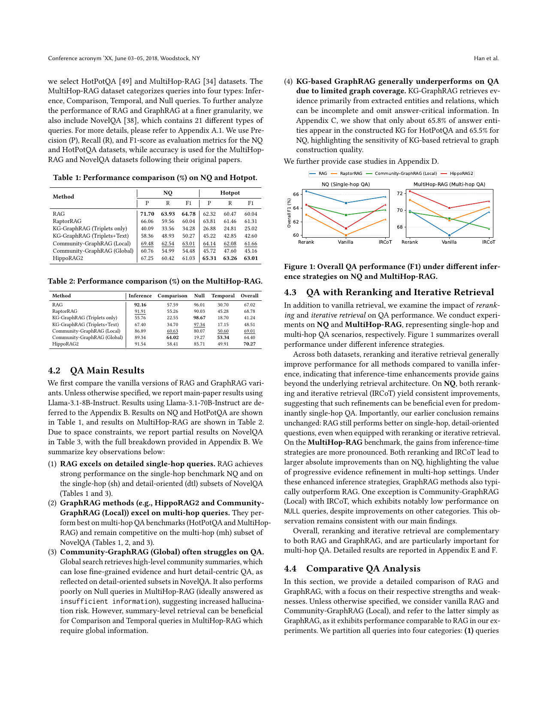
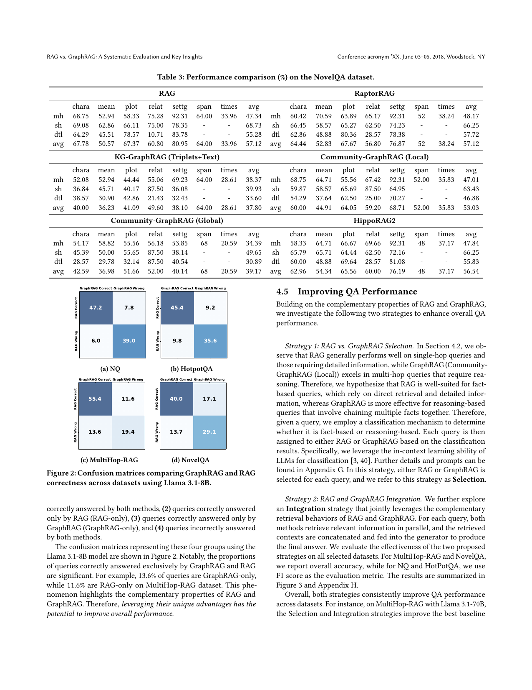
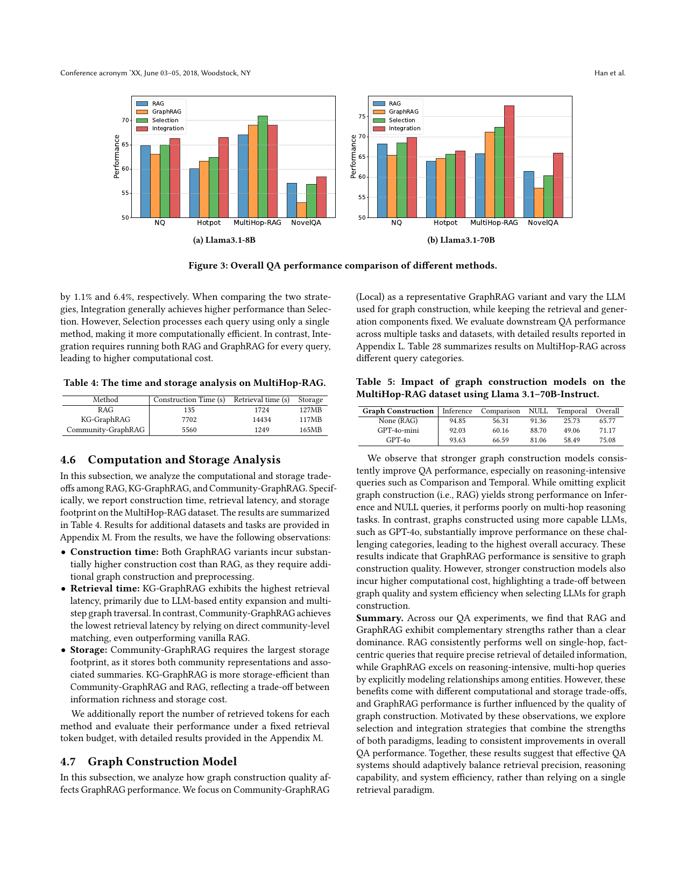

> [[../index|Wiki]] | [[../summary|Summary]] | [[../digest|Digest]]

# Question Answering Results

**In one sentence:** RAG and GraphRAG have complementary QA strengths — RAG wins detailed single-hop questions and GraphRAG wins multi-hop reasoning — so combining them via Selection or Integration consistently outperforms either paradigm alone, at different computational and storage cost.

## Key points

- RAG leads on single-hop NQ (P 71.70 / R 63.93 / F1 64.78); HippoRAG2 is best on multi-hop HotPotQA (F1 63.01) and MultiHop-RAG (70.27 overall); per MultiHop-RAG category, RAG leads Inference (92.16) and GraphRAG (Global) leads Comparison (64.02) and Temporal (53.34).
- KG-based GraphRAG underperforms on QA because of limited graph coverage — only ~65.8% of HotPotQA answer entities and ~65.5% of NQ answer entities appear in the constructed KG.
- Reranking (Rerank) and iterative retrieval (IRCoT) improve every method beyond vanilla inference, most strongly on multi-hop QA; the RAG-vs-GraphRAG ranking still flips with hop complexity.
- Confusion matrices show substantial query partitioning: on MultiHop-RAG 13.6% of queries are GraphRAG-only correct and 11.6% RAG-only correct — evidence of complementarity.
- Selection (LLM-classifies fact-based vs reasoning-based, routes to one system) and Integration (parallel retrieval, concatenated contexts) both improve performance; on MultiHop-RAG with Llama-3.1-70B they lift the best baseline by 1.1% (Selection) and 6.4% (Integration).
- Community-GraphRAG is the only variant that beats RAG on retrieval latency (1,249 s vs 1,724 s on MultiHop-RAG) but has the largest storage footprint (165 MB vs 127 MB); KG-GraphRAG is slowest to retrieve (14,434 s).
- Stronger graph-construction LLMs improve GraphRAG accuracy (RAG 65.77 → GPT-4o-mini 71.17 → GPT-4o 75.08 overall on MultiHop-RAG), with the biggest gains on reasoning-intensive Comparison and Temporal queries.

---

## 4.1 Datasets and Evaluation Metrics

QA is one of the widest-used tasks for evaluating RAG systems; the paper evaluates RAG and GraphRAG variants on widely used datasets with standard metrics from prior work.

Four datasets are selected, covering different perspectives:

| Dataset | Role |
|---|---|
| Natural Questions (NQ) | single-hop QA |
| HotPotQA | multi-hop QA |
| MultiHop-RAG | multi-hop QA; queries categorized as Inference, Comparison, Temporal, and Null |
| NovelQA | fine-grained analysis; 21 query types (Appendix A.1) |

Metrics: Precision (P), Recall (R), and F1 for NQ and HotPotQA; accuracy for MultiHop-RAG and NovelQA, following their original papers.

## 4.2 QA Main Results

Main results use vanilla RAG vs. vanilla GraphRAG variants, with **Llama-3.1-8B-Instruct** as the default backbone (70B results in Appendix B; partial NovelQA results in Table 3 below, full breakdown in Appendix B). Case studies are in Appendix D.

Table 1: Performance comparison (%) on NQ and HotPot

| Method | NQ P | NQ R | NQ F1 | HotPot P | HotPot R | HotPot F1 |
|---|---|---|---|---|---|---|
| RAG | **71.70** | **63.93** | **64.78** | 62.32 | 60.47 | 60.04 |
| RaptorRAG | 66.06 | 59.56 | 60.04 | 63.81 | 61.46 | 61.31 |
| KG-GraphRAG (Triplets only) | 40.09 | 33.56 | 34.28 | 26.88 | 24.81 | 25.02 |
| KG-GraphRAG (Triplets+Text) | 58.36 | 48.93 | 50.27 | 45.22 | 42.85 | 42.60 |
| Community-GraphRAG (Local) | 69.48 | 62.54 | 63.01 | 64.14 | 62.08 | 61.66 |
| Community-GraphRAG (Global) | 60.76 | 54.99 | 54.48 | 45.72 | 47.60 | 45.16 |
| HippoRAG2 | 67.25 | 60.42 | 61.03 | **65.31** | **63.26** | **63.01** |

Table 2: Performance comparison (%) on the MultiHop-RAG

| Method | Inference | Comparison | Null | Temporal | Overall |
|---|---|---|---|---|---|
| RAG | **92.16** | 57.59 | 96.01 | 30.70 | 67.02 |
| RaptorRAG | 91.91 | 55.26 | 90.03 | 45.28 | 68.78 |
| KG-GraphRAG (Triplets only) | 55.76 | 22.55 | **98.67** | 18.70 | 41.24 |
| KG-GraphRAG (Triplets+Text) | 67.40 | 34.70 | 97.34 | 17.15 | 48.51 |
| Community-GraphRAG (Local) | 86.89 | 60.63 | 80.07 | 50.60 | 69.01 |
| Community-GraphRAG (Global) | 89.34 | **64.02** | 19.27 | **53.34** | 64.40 |
| HippoRAG2 | 91.54 | 58.41 | 85.71 | 49.91 | **70.27** |

Table 3: Performance comparison (%) on the NovelQA dataset (% accuracy, subsets mh/sh/dtl and query-type rows shown)

| Method | chara | mean | plot | relat | settg | span | times | avg(mh) |
|---|---|---|---|---|---|---|---|---|
| RAG | 68.75 | 52.94 | 58.33 | 75.28 | 92.31 | 64.00 | 33.96 | 47.34 |
| RaptorRAG | 60.42 | 70.59 | 63.89 | 65.17 | 92.31 | 52 | 38.24 | 48.17 |
| KG-GraphRAG (Triplets+Text) | 52.08 | 52.94 | 44.44 | 55.06 | 69.23 | 64.00 | 28.61 | 38.37 |
| Community-GraphRAG (Local) | 68.75 | 64.71 | 55.56 | 67.42 | 92.31 | 52.00 | 35.83 | 47.01 |
| Community-GraphRAG (Global) | 54.17 | 58.82 | 55.56 | 56.18 | 53.85 | 68 | 20.59 | 34.39 |
| HippoRAG2 | 58.33 | 64.71 | 66.67 | 69.66 | 92.31 | 48 | 37.17 | 47.84 |

(Also reported: single-hop subset avg — RAG 68.73, RaptorRAG 66.25, Community-GraphRAG (Local) 63.43, HippoRAG2 66.25; detail-oriented subset avg — RAG 55.28, HippoRAG2 55.83; dataset average — RAG 57.12, RaptorRAG 57.12, HippoRAG2 56.54.)

Key observations:

1. **RAG excels on detailed single-hop queries.** Strong on NQ and on the single-hop (sh) and detail-oriented (dtl) subsets of NovelQA.
2. **GraphRAG methods (e.g., HippoRAG2, Community-GraphRAG (Local)) excel on multi-hop queries.** Best on HotPotQA and MultiHop-RAG, and remain competitive on the multi-hop (mh) subset of NovelQA.
3. **Community-GraphRAG (Global) often struggles on QA.** Global search retrieves high-level community summaries, losing fine-grained evidence (weak on detail-oriented NovelQA subsets) and performing poorly on Null queries in MultiHop-RAG (which ideally should be answered "insufficient information"), suggesting increased hallucination risk. But summary-level retrieval helps Comparison and Temporal queries that require global information.
4. **KG-based GraphRAG generally underperforms on QA due to limited graph coverage.** It retrieves from extracted entities/relations that can be incomplete; Appendix C shows only ~65.8% of HotPotQA and ~65.5% of NQ answer entities appear in the constructed KG, highlighting sensitivity to graph construction quality.

## 4.3 QA with Reranking and Iterative Retrieval

Experiments on **NQ** (single-hop) and **MultiHop-RAG** (multi-hop) compare vanilla inference with reranking and iterative retrieval (IRCoT). Figure 1 is a two-panel line chart of Overall F1 (%) across three inference strategies (Rerank, Vanilla, IRCoT) for RAG, RaptorRAG, Community-GraphRAG (Local), and HippoRAG2; the NQ panel spans roughly 60–67% F1 and the MultiHop-RAG panel roughly 68–73%.

Trends from the figure: in both panels the Vanilla point is the trough for nearly every method, with Rerank and IRCoT clearly higher. On single-hop NQ, RAG is the top curve throughout (≈66–67% F1 at Rerank); on multi-hop MultiHop-RAG the GraphRAG methods dominate, with HippoRAG2 best (≈72% at Rerank). One exception: Community-GraphRAG (Local) declines at IRCoT on MultiHop-RAG rather than rising.

Findings:

- Reranking and iterative retrieval generally improve all methods vs. vanilla inference — inference-time enhancements give gains beyond the underlying retrieval architecture.
- On NQ both reranking and IRCoT give consistent improvements; the main conclusion is unchanged — RAG still performs better on single-hop, detail-oriented questions even with these refinements.
- On MultiHop-RAG the gains are more pronounced: reranking and IRCoT yield larger absolute improvements than on NQ, showing the value of progressive evidence refinement in multi-hop settings. Under enhanced inference, GraphRAG methods also typically outperform RAG.
- Exception: Community-GraphRAG (Local) with IRCoT shows notably low performance on NULL queries despite improvements elsewhere — consistent with the main-section findings.

Overall, reranking and iterative retrieval are complementary to both paradigms and are particularly important for multi-hop QA (details in Appendices E and F).

## 4.4 Comparative QA Analysis

Using vanilla RAG and Community-GraphRAG (Local, simply "GraphRAG" — comparable performance in these experiments), queries are partitioned into four groups: (1) both correct, (2) RAG-only correct, (3) GraphRAG-only correct, (4) both wrong. Figure 2 shows the four confusion matrices (Llama 3.1-8B): rows = RAG correctness, columns = GraphRAG correctness, cells = % of queries.

On fact-heavy single-hop sets (NQ, HotpotQA) the diagonal cells dominate (~45–47% both correct, ~36–39% both wrong) and RAG-only correct exceeds GraphRAG-only. On multi-hop/reasoning sets (MultiHop-RAG, NovelQA) the both-wrong cell shrinks (to ~20% on MultiHop-RAG) and the GraphRAG-only cell (~13–14%) becomes comparable to or larger than RAG-only (~11–17%). Concretely, 13.6% of queries are GraphRAG-only and 11.6% RAG-only on MultiHop-RAG. The correct/incorrect sets only partially overlap — a clear complementary property: leveraging both systems' unique advantages has the potential to improve overall performance, motivating the next section.

## 4.5 Improving QA Performance

Two strategies exploit the RAG/GraphRAG complementarity.

**Strategy 1 — Selection.** Hypothesis: RAG suits fact-based queries (direct retrieval, detailed information), GraphRAG suits reasoning-based queries (chaining facts). A classification mechanism (in-context learning with LLMs, Appendix G for prompts) labels each query as fact-based or reasoning-based and assigns it to RAG or Community-GraphRAG (Local); only one system answers each query.

**Strategy 2 — Integration.** Both RAG and GraphRAG retrieve in parallel for each query; the retrieved contexts are concatenated and fed to the generator.

Evaluated on all datasets (accuracy for MultiHop-RAG/NovelQA, F1 for NQ/HotPotQA; details in Appendix H). Figure 3 compares RAG, GraphRAG, Selection, and Integration across the four datasets in two panels: (a) Llama3.1-8B and (b) Llama3.1-70B, y-axis "Performance" spanning roughly 50–75.

Trends from the figure: across both panels Integration is consistently the top or near-top performer on nearly all datasets, with Selection typically second, often ahead of standalone RAG and GraphRAG. Standalone methods are uneven: RAG and GraphRAG land in the mid-60s on NQ/Hotpot, all four rise sharply on MultiHop-RAG (Integration clearly leading — high 60s for 8B, low 70s for 70B), and NovelQA is the weak point for single paradigms (RAG and especially GraphRAG drop to the low 50s while the combined strategies stay markedly higher). Moving from 8B to 70B backbone lifts every bar by a few points while preserving relative ordering.

Results: both strategies consistently improve QA performance across datasets. On MultiHop-RAG with Llama 3.1-70B, Selection improves the best baseline by 1.1% and Integration by 6.4%. Integration generally achieves higher performance than Selection; however, Selection is more computationally efficient (each query processed by one method), while Integration must run both RAG and GraphRAG for every query at higher computational cost. Taking the two together: Integration gives the strongest accuracy, and Selection captures most of that gain with one method per query.

## 4.6 Computation and Storage Analysis

Construction time, retrieval latency, and storage footprint on MultiHop-RAG (additional datasets in Appendix M):

Table 4: Time and storage analysis on MultiHop-RAG

| Method | Construction Time (s) | Retrieval time (s) | Storage |
|---|---|---|---|
| RAG | 135 | 1724 | 127MB |
| KG-GraphRAG | 7702 | 14434 | 117MB |
| Community-GraphRAG | 5560 | 1249 | 165MB |

Observations:

- **Construction time:** both GraphRAG variants incur substantially higher construction cost than RAG, due to additional graph construction and preprocessing.
- **Retrieval time:** KG-GraphRAG has the highest latency, driven by LLM-based entity expansion and multi-step graph traversal. Community-GraphRAG is lowest, relying on direct community-level matching — even outperforming vanilla RAG.
- **Storage:** Community-GraphRAG has the largest footprint (community representations plus summaries); KG-GraphRAG is more storage-efficient than both Community-GraphRAG and RAG, a trade-off between information richness and storage cost.

The paper also reports retrieved-tokens per method and performance under a fixed retrieval-token budget (Appendix M).

## 4.7 Graph Construction Model

How graph-construction quality affects GraphRAG performance: fix retrieval and generation, focus on Community-GraphRAG (Local), and vary the LLM used for graph construction (detailed results in Appendix L; Table 28 = Table 5 below).

Table 5: Impact of graph construction models on the MultiHop-RAG dataset using Llama 3.1-70B-Instruct

| Graph Construction | Inference | Comparison | NULL | Temporal | Overall |
|---|---|---|---|---|---|
| None (RAG) | 94.85 | 56.31 | 91.36 | 25.73 | 65.77 |
| GPT-4o-mini | 92.03 | 60.16 | 88.70 | 49.06 | 71.17 |
| GPT-4o | 93.63 | 66.59 | 81.06 | 58.49 | 75.08 |

Stronger graph-construction models consistently improve QA performance, especially on reasoning-intensive Comparison and Temporal queries. Omitting explicit graph construction (RAG) is strong on Inference and NULL but weak on multi-hop reasoning; graphs built with more capable LLMs (GPT-4o) substantially improve these challenging categories, giving the highest overall accuracy. GraphRAG performance is thus sensitive to graph-construction quality — but stronger construction models cost more, a trade-off between graph quality and system efficiency.

## Summary

Across the QA experiments, RAG and GraphRAG show complementary strengths rather than clear dominance: RAG consistently wins single-hop fact-centric queries needing precise retrieval of detailed information; GraphRAG excels on reasoning-intensive multi-hop queries by explicitly modeling entity relationships. These benefits come with different computational and storage trade-offs, and GraphRAG is further sensitive to graph-construction quality. Selection and Integration strategies combine both paradigms and consistently improve overall QA performance — effective QA systems should adaptively balance retrieval precision, reasoning capability, and system efficiency rather than relying on a single retrieval paradigm.

**Covers:** Section 4 (Question Answering)
