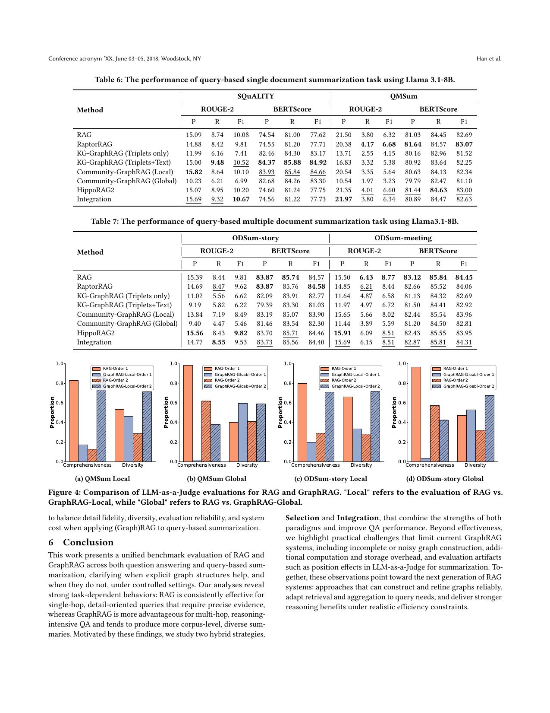

> [[../index|Wiki]] | [[../summary|Summary]] | [[../digest|Digest]]

# Query-Based Summarization and Conclusion

**In one sentence:** On reference-based (ROUGE-2/BERTScore) benchmarks, vanilla RAG — and to a closely related extent RaptorRAG and HippoRAG2 — match detailed, query-specific ground-truth summaries better than GraphRAG, and LLM-as-a-Judge comparisons that had previously favored community-based global GraphRAG turn out to be strongly position-biased; the paper concludes that RAG suits single-hop detail-oriented tasks while GraphRAG suits multi-hop reasoning and corpus-level diversity, with hybrid Selection/Integration strategies improving QA, while noisy graph construction, system overhead, and evaluation artifacts remain blockers for current GraphRAG systems.

## Key points

- Evaluation uses four query-based summarization datasets — SQuALITY and QMSum (single-document) and ODSum-story and ODSum-meeting (multi-document) — with human-written ground-truth summaries, scored by ROUGE-2 (lexical) and BERTScore (semantic); most queries target specific roles or events, unlike the LLM-generated global queries in Edge et al.
- Vanilla RAG generally wins or ties on both reference-based metrics: on SQuALITY RAG ROUGE-2 F1 = 15.09/8.74/10.10 and BERTScore P = 74.54, R = 81.00, F1 = 77.62; RaptorRAG is nearly identical (15.39/8.44/9.81; 74.55/81.20/77.71); HippoRAG2 (15.07/8.95/10.20; 74.60/81.24/77.75) and Integration (15.69/9.32/10.67; 74.56/81.22/77.73) are in the same band.
- KG-based GraphRAG benefits from combining triplets with their corresponding text rather than triplets only: on SQuALITY the triplets-only variant scores ROUGE-2 P/R/F = 11.99/6.16/7.41 (BERTScore P = 82.46, R = 84.30, F1 = 83.17), while adding text raises ROUGE-2 to 15.00/9.48/10.52 and BERTScore to 84.37/85.88/84.92 — the best BERTScore of any method on SQuALITY.
- Community-based GraphRAG favors Local over Global search in these reference-based settings: on SQuALITY Local reaches ROUGE-2 15.82/8.64/10.10 (highest R) and BERTScore 83.93/85.84/84.66, while Global lags at 10.23/6.21/6.99 (BERTScore 82.68/84.26/83.30); the authors attribute this to Global search retrieving only high-level summaries where detailed, query-aligned information is what the datasets reward.
- The Integration strategy performs comparably to RAG alone, indicating that simply concatenating RAG and GraphRAG evidence does not reliably improve alignment with detailed ground-truth summaries.
- LLM-as-a-Judge evaluation of the same summaries on QMSum and ODSum-story, run twice with the two candidates shown in different orders (O1 = RAG first, O2 = GraphRAG first), reveals strong position bias: reversing the order produces substantially different and sometimes opposite judgments, most pronounced for RAG vs. GraphRAG-Local (Figures 4a, 4c); RAG is consistently preferred under Comprehensiveness while GraphRAG-Global is favored for Diversity (Figures 4b, 4d), suggesting GraphRAG-Global emphasizes corpus-level coverage whereas RAG captures fine-grained, query-specific details.
- The paper's overall conclusion: RAG is consistently effective for single-hop, detail-oriented queries requiring precise evidence; GraphRAG is more advantageous for multi-hop, reasoning-intensive QA and tends to produce more corpus-level, diverse summaries; hybrid Selection and Integration strategies combining both paradigms improve QA; and practical GraphRAG limitations — incomplete or noisy graph construction, extra computation/storage overhead, and position artifacts in LLM-as-a-Judge — motivate a next generation of RAG systems that build and refine graphs reliably, adapt retrieval/aggregation to the query, and deliver stronger reasoning under realistic efficiency constraints.

---

## 5. Datasets and evaluation metrics

The paper benchmarks query-based summarization on four widely used datasets: SQuALITY and QMSum (single-document) together with ODSum-story and ODSum-meeting (multi-document). Unlike the LLM-generated global queries in Edge et al., most queries here focus on specific roles or events. Because each query has one or more human-written ground-truth summaries, evaluation uses ROUGE-2 (lexical similarity) and BERTScore (semantic similarity) between predicted and reference summaries.

Models evaluated: Llama-3.1-8B (main) and Llama-3.1-70B (Appendix I), across vanilla RAG, GraphRAG variants, and the Integration strategy from Section 4.5.

## 5. Summarization experimental results

**Table 6 (Llama-3.1-8B, single-document, SQuALITY).** Values verbatim from the chunk.

| Method | ROUGE-2 P | ROUGE-2 R | ROUGE-2 F1 | BERTScore P | BERTScore R | BERTScore F1 |
|---|---|---|---|---|---|---|
| RAG | 15.09 | 8.74 | 10.10 | 74.54 | 81.00 | 77.62 |
| RaptorRAG | 15.39 | 8.44 | 9.81 | 74.55 | 81.20 | 77.71 |
| KG-GraphRAG (Triplets only) | 11.99 | 6.16 | 7.41 | 82.46 | 84.30 | 83.17 |
| KG-GraphRAG (Triplets+Text) | 15.00 | **9.48** | 10.52 | **84.37** | **85.88** | **84.92** |
| Community-GraphRAG (Local) | **15.82** | 8.64 | 10.10 | 83.93 | 85.84 | 84.66 |
| Community-GraphRAG (Global) | 10.23 | 6.21 | 6.99 | 82.68 | 84.26 | 83.30 |
| HippoRAG2 | 15.07 | 8.95 | 10.20 | 74.60 | 81.24 | 77.75 |
| Integration | 15.69 | 9.32 | **10.67** | 74.56 | 81.22 | 77.73 |

**QMSum (Llama-3.1-8B, ROUGE-2 P/R/F).** (The QMSum BERTScore column in the paper's extracted text is interleaved; exact BERTScore values per method should be taken from the primary source.)

| Method | ROUGE-2 P | ROUGE-2 R | ROUGE-2 F1 |
|---|---|---|---|
| RAG | 21.50 | 3.80 | 6.32 |
| RaptorRAG | 20.38 | **4.17** | **6.68** |
| KG-GraphRAG (Triplets only) | 13.71 | 2.55 | 4.15 |
| KG-GraphRAG (Triplets+Text) | 16.83 | 3.32 | 5.38 |
| Community-GraphRAG (Local) | 20.54 | 3.35 | 5.64 |
| Community-GraphRAG (Global) | 10.54 | 1.97 | 3.23 |
| HippoRAG2 | 21.35 | 4.01 | 6.60 |
| Integration | 21.60 | 3.90 | 6.45 |

**Table 7 (Llama-3.1-8B, multi-document).** Values verbatim.

| Method | ODSum-story ROUGE-2 P | R | F1 | ODSum-story BERTScore P | R | F1 | ODSum-meeting ROUGE-2 P | R | F1 | ODSum-meeting BERTScore P | R | F1 |
|---|---|---|---|---|---|---|---|---|---|---|---|---|
| RAG | 15.39 | 8.44 | 9.81 | **83.87** | **85.74** | 84.57 | 15.50 | **6.43** | **8.77** | **83.12** | **85.84** | **84.45** |
| RaptorRAG | 14.69 | 8.47 | 9.62 | **83.87** | 85.76 | **84.58** | 14.85 | 6.21 | 8.44 | 82.66 | 85.52 | 84.06 |
| KG-GraphRAG (Triplets only) | 11.02 | 5.56 | 6.62 | 82.09 | 83.91 | 82.77 | 11.64 | 4.87 | 6.58 | 81.13 | 84.32 | 82.69 |
| KG-GraphRAG (Triplets+Text) | 9.19 | 5.82 | 6.22 | 79.39 | 83.30 | 81.03 | 11.97 | 4.97 | 6.72 | 81.50 | 84.41 | 82.92 |
| Community-GraphRAG (Local) | 13.84 | 7.19 | 8.49 | 83.19 | 85.07 | 83.90 | 15.65 | 5.66 | 8.02 | 82.44 | 85.54 | 83.96 |
| Community-GraphRAG (Global) | 9.40 | 4.47 | 5.46 | 81.46 | 83.54 | 82.30 | 11.44 | 3.89 | 5.59 | 81.20 | 84.50 | 82.81 |
| HippoRAG2 | **15.56** | 8.43 | **9.82** | 83.70 | 85.71 | 84.46 | **15.91** | 6.09 | 8.51 | 82.43 | 85.55 | 83.95 |
| Integration | 14.77 | **8.55** | 9.53 | 83.73 | 85.56 | 84.40 | 15.69 | 6.15 | 8.51 | 82.87 | 85.81 | 84.31 |

Observations reported in the paper:
1. RAG, RaptorRAG, and HippoRAG2 generally perform well on query-based summarization, primarily because they retrieve original text chunks that are more closely aligned with ground truth.
2. KG-based GraphRAG benefits from combining triplets with their corresponding text, incorporating more detail and getting predictions closer to human-written references.
3. Community-based GraphRAG performs better with Local search; Local retrieves entities, relations, and low-level communities, whereas Global retrieves only high-level summaries, underscoring the importance of detailed information in these datasets.
4. The Integration strategy often performs comparably to RAG alone, so simply concatenating RAG and GraphRAG evidence does not reliably improve alignment with detailed ground-truth summaries.

## 5. Position bias in existing evaluation

Community-based GraphRAG with Global search underperforms RAG on the reference-based metrics above, which contrasts with Edge et al., where community-based Global-GraphRAG outperformed both Local and RAG. The authors attribute the discrepancy to two differences: (i) Edge et al. focus on global summarization capturing high-level information from an entire corpus, whereas the datasets here target specific roles or events; (ii) Edge et al. evaluate with LLM-as-a-Judge without ground-truth references, while this paper uses ROUGE/BERTScore against human references, which emphasize factual coverage and fine-grained detail and may favor different retrieval behaviors.

To probe the divergence, the paper follows Edge et al. and evaluates RAG vs. GraphRAG with LLM-as-a-Judge on two criteria — *Comprehensiveness* (how well the summary covers the details required by the query) and *Diversity* (whether it gives a broad, globally inclusive view) — presenting the two candidate summaries in both presentation orders for every query (Order 1: RAG first; Order 2: GraphRAG first) and reporting the proportion of times each method is preferred.

Figure 4 shows grouped bars — Y-axis = win proportion (0.0–1.0), X-axis = Comprehensiveness and Diversity — with four bars per criterion: RAG-Order 1, GraphRAG-(Local/Global)-Order 1, RAG-Order 2, GraphRAG-(Local/Global)-Order 2 (solid vs. hatched fills encoding the two orders), for QMSum (a, b) and ODSum-story (c, d). The judge heavily favors the summary listed first: RAG-Order 1 typically lands around 0.8–1.0 on Comprehensiveness (e.g., ~0.85 in the QMSum-Local panel and ~0.95–1.0 in the Global panels), while after the swap RAG-Order 2 drops to ~0.3–0.6 and GraphRAG-Order 2 rises to ~0.4–0.8, occasionally matching or beating RAG. On Diversity, RAG-Order 1 usually stays ahead (~0.7–0.8) but the gap narrows and GraphRAG reaches ~0.5–0.7, with the two methods roughly comparable in Order 2 on the Global panels. The same pattern — the ranking of RAG vs. GraphRAG depending on which one appears first — repeats across both datasets and both graph scopes.

Two key observations from Section 5.3:
- **Position bias is clearly present in LLM-as-a-Judge evaluations for summarization**: reversing the presentation order produces substantially different, and in some cases opposite, judgments. The effect is especially pronounced for RAG vs. GraphRAG-Local (Figures 4a and 4c).
- In the RAG vs. GraphRAG-Global comparison, RAG is consistently preferred on Comprehensiveness while GraphRAG-Global is favored on Diversity (Figures 4b and 4d). The authors read this as Community-based GraphRAG with Global search emphasizing corpus-level coverage, while RAG is more effective at capturing fine-grained, query-specific details.

Additional material referenced in this section: summarization results with reranking and iterative retrieval (Appendices E and F); detailed analysis of indexing time, retrieval latency, generation cost, and token/storage usage (Appendix M); and graph construction with different LLMs (Appendix L).

Section 5.3 summary: across query-based summarization benchmarks RAG and GraphRAG exhibit different generation characteristics — under reference-based metrics RAG typically better matches detailed, query-specific ground-truth summaries, while GraphRAG (especially community-based global retrieval) tends to produce more corpus-level, diverse summaries that can deviate from fine-grained details. LLM-as-a-Judge evaluation is sensitive to presentation order, raising reliability concerns for judge-based comparisons. Overall, the section highlights the need to balance detail fidelity, diversity, evaluation reliability, and system cost when applying (Graph)RAG to query-based summarization.

## 6. Conclusion

The paper presents a unified benchmark evaluation of RAG and GraphRAG across question answering and query-based summarization, clarifying when explicit graph structures help and when they do not under controlled settings. Its analyses reveal strong task-dependent behavior: RAG is consistently effective for single-hop, detail-oriented queries requiring precise evidence, whereas GraphRAG is more advantageous for multi-hop, reasoning-intensive QA and tends to produce more corpus-level, diverse summaries. Motivated by these findings, the paper studies Selection and Integration hybrid strategies that combine the strengths of both paradigms and improve QA performance. Beyond effectiveness, the authors highlight practical challenges that limit current GraphRAG systems — incomplete or noisy graph construction, additional computation and storage overhead, and evaluation artifacts such as position effects in LLM-as-a-Judge for summarization. Together, these observations point toward the next generation of RAG systems: approaches that can construct and refine graphs reliably, adapt retrieval and aggregation to query needs, and deliver stronger reasoning benefits under realistic efficiency constraints.

**Covers:** Sections 5-6 (Query-Based Summarization, Conclusion)
