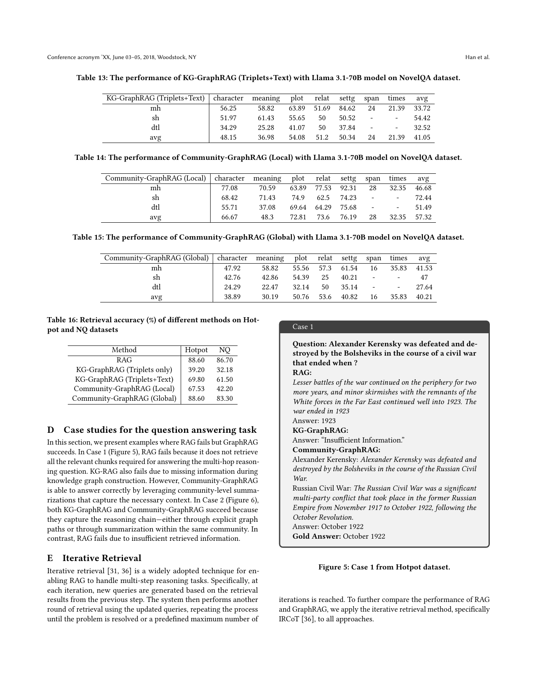
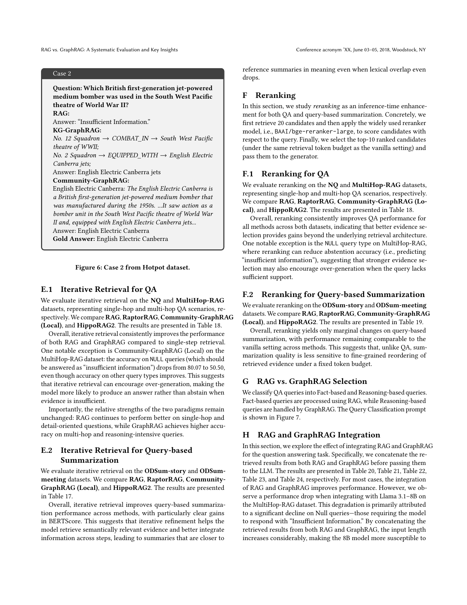

> [[../index|Wiki]] | [[../summary|Summary]] | [[../digest|Digest]]

# Appendix: Datasets and Case Studies

**In one sentence:** The appendix supplies the full evaluative substrate behind the main claims — eight QA/summarization datasets with concrete statistics, 20+ extended result tables (token-matched, reranked, iterative-retrieval, integrated RAG+GraphRAG, stronger extraction LLMs), two Hotpot case studies showing where GraphRAG wins and RAG abstains, the query-classification and LLM-as-a-Judge prompt protocols, and a retrieval-accuracy/token-count analysis that isolates *how* knowledge is organized rather than recall as the differentiator.

## Key points

- **Two worked Hotpot case studies** (Figures 5–6) show GraphRAG answering multi-hop questions that RAG and KG-GraphRAG fail: in Case 1 only Community-GraphRAG succeeds via community-level summaries; in Case 2 (jet-powered bomber question) both KG-GraphRAG (2-hop graph path) and Community-GraphRAG (community summary) recover *English Electric Canberra* while plain RAB abstains with "Insufficient Information".
- **Retrieval accuracy (Table 16)** proves raw recall is not GraphRAG's differentiator: RAG reaches 88.60% (Hotpot) / 88.60% (NQ) and Community-GraphRAG (Global) 83.30%, while KG-GraphRAG (Triplets only) is worst at 39.20% / 32.18% — because only 65.8% of Hotpot answer entities and 65.5% of NQ answer entities exist in the constructed KG.
- **KG-GraphRAG (Triplets only) is the weakest QA method** (Tables 8–9): NQ F1 30.73, Hotpot F1 30.73… precisely 30.63–30.73 on NQ and 30.63 P/R on Hotpot; RAG dominates single-hop (NQ P/R/F1 = 74.55/67.82/68.18 with LLaMA 3.1-70B) while Community-GraphRAG (Global) leads on Hotpot multi-hop (F1 64.93) and MultiHop-RAG Inference (94.85) and Comparison (95.02) query types.
- **Iterative retrieval (IRCoT) and reranking (bge-reranker-large) consistently improve all methods** (Table 18), but both suffer on NULL queries: Community-GraphRAG (Local) NULL accuracy drops 80.07 → 50.50 under IRCoT — over-generation makes the model answer instead of abstaining when evidence is insufficient.
- **Token-matched comparison** (Tables 31–35): Community-GraphRAG retrieves ~2.3× more input tokens than RAG (MultiHop-RAG: 9,770 vs 3,631; ODSum-Story: 10,244 vs 2,279); increasing RAG's chunks to match the token budget yields only slight gains and does not change the conclusion — RAG wins inference/summarization, GraphRAG wins Comparison/Temporal multi-hop types.
- **Integrating RAG + GraphRAG (concatenated retrieval context)** improves most cases (e.g. MultiHop-RAG 70B Overall 65.77 → 77.62) but degrades Llama 3.1-8B on MultiHop-RAG (Overall 67.02 → 68.19 with NULL collapsing 96.01 → 50.17) because doubled input length makes the small model over-generate instead of answering "Insufficient Information".
- **Stronger extraction LLM (GPT-4o over GPT-4o-mini) helps GraphRAG** (Tables 27–30): MultiHop-RAG Overall 8B 69.01 → 68.74 (slight drop) / 70B 71.17 → 75.08 (clear gain), and RAG stays best for Inference; the RAG-vs-GraphRAG relative pattern holds across both extraction backbones.
- **Datasets:** QA — NQ (single-hop, Google Search queries + Wikipedia), HotpotQA (1,000 hard bridging questions sampled, 10 paragraphs each), MultiHop-RAG (2,556 queries, evidence across 2–4 docs, four query types), NovelQA (novels > 50,000 words, 10 query types); Summarization — SQuALITY (4,000–6,000-word Gutenberg stories, 5 questions each, 4 human references), QMSum (1,808 query-summary pairs from 232 meetings), ODSum-story/ODSum-meeting (multi-document subsets built from SQuALITY/QMSum).

---

## A. Datasets

### A.1 Question Answering

| Dataset | Scale / composition | Query types | Task framing in this paper |
|---|---|---|---|
| **Natural Questions (NQ)** | Real Google Search user queries, answers extracted from Wikipedia; single-hop | single-hop | Single-document QA; a separate RAG system built per document |
| **HotpotQA** | 10 paragraphs per question; paper samples **1,000 hard bridging questions** from the dev set (easier ones filtered out as LLM-solvable) | multi-hop bridging | Multi-document QA; one RAG system handles all questions |
| **MultiHop-RAG** | 2,556 queries from English news articles; supporting evidence distributed across **2–4 documents** | Inference (bridge-entity synthesis), Comparison (yes/no), Temporal (before/after), Null (no derivable answer) | Multi-document QA |
| **NovelQA** | Manually curated questions on English novels **exceeding 50,000 words**; minor details and cross-chapter reasoning | Details, multi-hop, single-hop, character, meaning, plot, relation, setting, span, times | Single-document QA |

### A.2 Query-based Summarization

| Dataset | Scale / composition | Framing |
|---|---|---|
| **SQuALITY** | Short stories from Project Gutenberg, **4,000–6,000 words** each; 5 questions per story; 4 human-written reference summaries per question (Upwork writers + NYU undergraduates) | Single-document summarization |
| **QMSum** | **1,808 query-summary pairs from 232 meetings** across multiple domains, human-annotated | Single-document summarization |
| **ODSum-story / ODSum-meeting** | Two subsets of ODSum for multi-document summarization: ODSum-story derived from SQuALITY, ODSum-meeting constructed from QMSum | Multi-document summarization |

## B. Extended QA results (Tables 8–15)

Results omitted from the main paper for space limits, organized by model size and method.

### NQ and Hotpot — LLaMA 3.1-70B (Table 8)

| Method | NQ P / R / F1 | Hotpot P / R / F1 |
|---|---|---|
| RAG | **74.55 / 67.82 / 68.18** | 66.34 / 63.99 / 63.88 |
| RaptorRAG | 66.32 / 60.74 / 60.59 | 66.44 / 63.69 / 63.83 |
| KG-GraphRAG (Triplets only) | 37.84 / 31.22 / 30.73 | 32.59 / 30.63 / 30.73 |
| KG-GraphRAG (Triplets+Text) | 60.91 / 52.75 / 53.88 | 51.44 / 48.99 / 48.75 |
| Community-GraphRAG (Local) | 71.27 / 65.46 / 65.44 | 48.33 / 48.56 / 46.99 |
| Community-GraphRAG (Global) | 69.69 / 64.32 / 64.03 | **67.20 / 64.89 / 64.60** |
| HippoRAG2 | 61.15 / 55.52 / 55.05 | **68.05 / 64.59 / 64.93** |

**Reading:** RAG clearly wins single-hop NQ; Hotpot (multi-hop) is a tighter race in which both GraphRAG-community variants and HippoRAG2 out-fetch plain RAG, and KG-GraphRAG (Triplets only) is last on both.

### MultiHop-RAG — LLaMA 3.1-70B (Table 9)

| Method | Inference | Comparison | Null | Temporal | Overall |
|---|---|---|---|---|---|
| RAG | **94.85** | 56.31 | 91.36 | 25.73 | 65.77 |
| RaptorRAG | 91.36 | 57.24 | **95.02** | 43.22 | 69.72 |
| KG-GraphRAG (Triplets only) | 76.96 | 32.36 | 94.35 | 19.55 | 50.98 |
| KG-GraphRAG (Triplets+Text) | 85.91 | 35.98 | 86.38 | 21.61 | 54.58 |
| Community-GraphRAG (Local) | 92.03 | 60.16 | 88.70 | 49.06 | **71.17** |
| Community-GraphRAG (Global) | 89.09 | **66.00** | 13.95 | **59.18** | 65.69 |
| HippoRAG2 | 93.01 | 58.76 | 90.03 | 43.40 | 69.87 |

**Reading:** the signature finding — RAG dominates the Inference (single-hop-flavored) column; Community-GraphRAG variants dominate Comparison and Temporal (multi-hop reasoning) columns; both lose the abstention-sensitive Null column.

### NovelQA (Tables 10–15)

Per-category QA scores (character, meaning, plot, relation, setting, span, times; rows = mh / sh / dtl / avg):

| Method / model | avg (dtl row context) |
|---|---|
| KG-GraphRAG (Triplets), Llama 3.1-8B (Table 10) | avg **27.37** (dtl 33.70 / overall avg ≈ 32.6–35.8 range) |
| RAG, Llama 3.1-70B (Table 11) | dtl avg **75.27**, overall avg **61.42** |
| KG-GraphRAG (Triplets), Llama 3.1-70B (Table 12) | dtl avg **54.06**, overall avg **41.18** |
| KG-GraphRAG (Triplets+Text), Llama 3.1-70B (Table 13) | dtl avg **54.42**, overall avg **41.05** |
| Community-GraphRAG (Local), Llama 3.1-70B (Table 14) | dtl avg **72.44**, overall avg **57.32** |
| Community-GraphRAG (Global), Llama 3.1-70B (Table 15) | dtl avg **47.00**, overall avg **40.21** |

**Reading:** on long-narrative retrieval RAG baseline remains the strongest single method; Community-GraphRAG (Local) is the best GraphRAG variant and closest to RAG; the triplets-only KG variant trails badly.

## C. Retrieval accuracy of different methods (Table 16)

Retrieval accuracy = the fraction of examples whose ground-truth answer **string appears in the retrieved context** (no chunk-level ground truth exists, so this proxy is used).

| Method | Hotpot | NQ |
|---|---|---|
| RAG | 88.60 | 86.70 |
| KG-GraphRAG (Triplets only) | 39.20 | 32.18 |
| KG-GraphRAG (Triplets+Text) | 69.80 | 61.50 |
| Community-GraphRAG (Local) | 67.53 | 42.20 |
| Community-GraphRAG (Global) | 88.60 | 83.30 |

**Key mechanistic explanation:** KG-GraphRAG (Triplets only) reaches low retrieval accuracy because **the constructed knowledge graph is incomplete — only 65.8% of HotpotQA answer entities and 65.5% of NQ answer entities exist in the KG**. Community-GraphRAG, which leverages community-level summarization, retrieves far better. The authors flag two improvement directions: (1) enhance KG construction to increase entity/relation coverage; (2) combine structured graph information with raw text (the "Triplets+Text" variant, which already recovers to 69.80/61.50).

## D. Case studies — where RAG fails and GraphRAG succeeds (Appendix D)

### Case 1 (Figure 5)

The multi-hop Hotpot question cannot be answered by RAG because it **does not retrieve all relevant chunks** needed for the multi-hop reasoning chain; KG-GraphRAG also fails because information is **missing during knowledge-graph construction**. Community-GraphRAG answers correctly by leveraging **community-level summaries** that capture the necessary context. The companion description of Figure 5 confirms the pattern: on this multi-hop question RAG retrieves insufficient context and KG-GraphRAG returns "insufficient information", whereas Community-GraphRAG answers correctly via community-level summaries.

This case supports the core claim that GraphRAG's edge on multi-hop questions comes from *how* knowledge is organized and synthesized (community summaries bridging missing chunks), not from raw retrieval recall.

### Case 2 (Figure 6)

Question: *"Which British first-generation jet-powered medium bomber was used in the South West Pacific theatre of WWII?"* (gold: **English Electric Canberra**).

- **RAG** — returns *"Insufficient Information"*: it retrieves chunks but cannot connect the hops and abstains.
- **KG-GraphRAG** — traverses a two-hop graph path (No. 12 Squadron — *COMBAT_IN* → SW Pacific theatre of WWII; No. 2 Squadron — *EQUIPPED_WITH* → English Electric Canberra) and answers **English Electric Canberra jets** (correct).
- **Community-GraphRAG** — reads a community-level summary stating the Canberra is a British first-gen jet-powered medium bomber that saw action in the SW Pacific, and answers **English Electric Canberra** (correct).

The contrast is binary (correct vs abstain) rather than a trend: graph-based methods recover the bridge entity by traversing relations or reading a synthesized summary, while standard RAG cannot connect the hops. This is the concrete, qualitative illustration of GraphRAG's advantage on multi-hop, relation-intensive queries.

## E. Iterative retrieval (IRCoT)

Iterative retrieval regenerates queries from previous retrieval results and re-retrieves, repeating until solved or a max iteration count. The paper applies **IRCoT** to all approaches.

**QA (NQ + MultiHop-RAG, Table 18, Llama 3.1-8B):** iterative retrieval improves RAG and GraphRAG over single-step. Exception: Community-GraphRAG (Local) on MultiHop-RAG — **NULL accuracy drops 80.07 → 50.50** while other types improve, i.e. iterative retrieval encourages over-generation and suppresses abstention. Relative paradigm strengths are unchanged (RAG: single-hop/detail; GraphRAG: multi-hop reasoning).

| Method | NQ (Vanilla / +Rerank / +IRCoT) F1 | MultiHop-RAG Overall (Vanilla / +Rerank / +IRCoT) |
|---|---|---|
| RAG | 64.78 / 66.49 / 65.72 | 67.02 / 69.91 / 69.80 |
| RaptorRAG | 60.04 / 63.04 / 62.39 | 68.78 / 71.21 / 70.38 |
| Community-GraphRAG (Local) | 63.01 / 64.45 / 63.77 | 69.01 / 69.76 / 67.80 |
| HippoRAG2 | 61.03 / 64.50 / 64.54 | 70.27 / 72.26 / 71.09 |

**Summarization (ODSum-story/meeting, Table 17, Llama 3.1-8B):** iterative retrieval improves all methods, with particularly clear BERTScore gains (e.g. ODSum-story BERTScore F1: RAG 84.52, RaptorRAG 84.59, CGR-Local 84.10, HippoRAG2 84.51; ODSum-meeting BERTScore F1 all in the 83.98–84.07 band). Interpretation: iterative refinement helps retrieve semantically relevant evidence and integrate information across steps, so summaries get closer to references in meaning even when lexical overlap (ROUGE) drops.

## F. Reranking (BAAI/bge-reranker-large)

Protocol: retrieve **20 candidates**, rerank with bge-reranker-large against the query, keep the **top-10 under the same retrieval token budget** as the vanilla setting.

- **QA (NQ + MultiHop-RAG, Table 18):** reranking consistently improves QA for all methods — better evidence selection yields gains beyond the retrieval architecture. Same NULL exception: stronger evidence selection can reduce abstention accuracy on insufficient-support queries.
- **Summarization (Table 19):** only marginal changes; performance stays comparable to vanilla across methods, meaning summarization quality is less sensitive to fine-grained reordering of evidence under a fixed token budget than QA is.

## G. RAG vs. GraphRAG selection (query routing)

QA queries are classified into **Fact-based** (routed to RAG) and **Reasoning-based** (routed to GraphRAG). The query-classification prompt (Figure 7) performs this split so each query gets the better-suited paradigm — a practical way to combine the two instead of choosing one globally.

## H. RAG + GraphRAG integration

Retrieved results from **both** RAG and GraphRAG are concatenated before generation (Tables 20–25).

**QA:** integration improves most cases — e.g. MultiHop-RAG 70B Overall 65.77 (RAG) / 71.17 (GraphRAG) → **77.62 (Integration)**, Comparison 56.31 → 73.48, Temporal 25.73 → 66.72 (Table 22); NQ 8B F1 64.78 → 66.28 (Table 20). **Exception:** Llama 3.1-8B on MultiHop-RAG (Table 21): Overall 67.02 → 68.19 while **NULL collapses 96.01 → 50.17** — concatenating both retrieval streams lengthens the input, making the 8B model over-generate instead of answering "Insufficient Information". The 70B model is more robust to longer contexts and handles ambiguity more conservatively.

**Summarization (Tables 25–26):** integration performs **comparably to RAG but not significantly better**, because references are human-written and detail-faithful — RAG retrieves raw text segments that match them closely, while GraphRAG retrieves structured (entities/relations) content that omits fine grain. Adding the structured view therefore does not consistently improve alignment with detailed ground-truth summaries.

| Table | Setting |
|---|---|
| 20 | NQ + Hotpot integration, 8B & 70B |
| 21 | MultiHop-RAG 8B: RAG 67.02 / GraphRAG 69.01 / Integration 68.19 (Overall) |
| 22 | MultiHop-RAG 70B: RAG 65.77 / GraphRAG 71.17 / Integration **77.62** (Overall) |
| 23–24 | NovelQA integration, 8B / 70B |
| 25 | SQuALITY + QMSum single-doc summarization, 70B |
| 26 | ODSum-story + ODSum-meeting multi-doc summarization, 70B |

## I. LLM-as-a-Judge (Appendix J, K)

- The LLM-as-a-Judge prompt is given in **Figure 8**.
- Main paper reports judge results on QMSum and ODSum-story; Appendix K (**Figure 9**) adds **SQuALITY and ODSum-meeting**.
- Judge design controls for order bias: "Order 1" = RAG presented before GraphRAG, "Order 2" = reversed, for both Local and Global comparisons across SQuALITY (Local/Global) and ODSum-meeting (Local/Global).
- **Conclusion:** trends are consistent with the main paper — similar observations, so order effects do not overturn the RAG-vs-GraphRAG comparison.

## L. Graph construction with different LLMs (Tables 27–30)

Main paper used **GPT-4o-mini** for entity/relation extraction (cost). To test whether a stronger extractor helps, the same pipeline is re-run with **GPT-4o**, focusing on Community-GraphRAG (Local) as the representative GraphRAG method:

| Dataset (method: RAG / GPT-4o-mini / GPT-4o) | 8B Overall | 70B Overall |
|---|---|---|
| MultiHop-RAG (Table 27 / 28) | 67.02 / 69.01 / 68.74 | 65.77 / 71.17 / **75.08** |
| ODSum-story ROUGE-2 F1 (Table 29) | 9.81 / 8.49 / 8.64 | — |
| ODSum-meeting ROUGE-2 F1 (Table 30) | 11.09 / 9.61 / 9.72 | — |

Stronger extractor (GPT-4o) generally improves GraphRAG, especially at 70B on MultiHop-RAG (+3.91 Overall, and large Null/Temporal gains 49.06 → 58.49). The **relative RAG-vs-GraphRAG conclusion is stable across extraction backbones**.

## M. Computation/storage: token-budget fairness (Tables 31–35)

**Tokens retrieved (Table 31):**

| Dataset | RAG tokens | Community-GraphRAG tokens |
|---|---|---|
| MultiHop-RAG | 3,631 | 9,770 |
| ODSum-Story | 2,279 | 10,244 |

RAG retrieves top-10 text chunks; Community-GraphRAG (Local) retrieves top-10 entities + relations, whose input balloons with entity descriptions, relations, relation descriptions, and community summaries.

**Token-matched control (Tables 32–35):** RAG's chunk count is raised until its input tokens match Community-GraphRAG's budget.

| Setup | Result |
|---|---|
| MultiHop-RAG 8B (Table 32) | RAG Overall 67.02 → RAG_SameToken 69.33 vs GraphRAG 69.01 — near parity, slight RAG gain |
| MultiHop-RAG 70B (Table 33) | RAG 65.77 → RAG_SameToken 71.01 vs GraphRAG 71.17 — near parity |
| ODSum-Story 8B (Table 34) | RAG ROUGE-2 F1 9.81 → RAG_SameToken 10.16 vs GraphRAG 8.49 — **RAG still best** |
| ODSum-Meeting 70B (Table 35) | RAG ROUGE-2 F1 11.09 → RAG_SameToken 11.34 vs GraphRAG 9.61 — **RAG still best** |

**Interpretation:** token-matching RAG does produce slight gains but the main conclusions hold: RAG wins inference-style queries and summarization (where detail is directly retrievable); GraphRAG wins Comparison/Temporal multi-hop types (reasoning and aggregation). GraphRAG's advantage is therefore an *organization/synthesis* effect, not an artifact of retrieving more text.

---

**Covers:** Appendix (datasets, case studies, prompt templates)
